# Cloud SQL for PostgreSQL: Google AI Studio 統合が GA (一般提供)

**リリース日**: 2026-06-18

**サービス**: Cloud SQL for PostgreSQL

**機能**: Google AI Studio との統合 (Vibe Coding によるフルスタックアプリケーション構築)

**ステータス**: GA (一般提供)

[このアップデートのインフォグラフィックを見る](https://takech9203.github.io/google-cloud-news-summary/20260618-cloud-sql-postgresql-ai-studio-integration-ga.html)

## 概要

Cloud SQL for PostgreSQL が Google AI Studio と統合され、自然言語プロンプトだけでフルスタックアプリケーションを構築できるようになった。この機能が GA (一般提供) となり、Cloud SQL for PostgreSQL の「developer edition」インスタンスをデータベースバックエンドとして使用するアプリケーションを、コーディング経験がなくても作成できる。

この統合は「Vibe Coding (バイブコーディング)」と呼ばれる新しい開発パラダイムの一部であり、Google AI Studio の Build モードで自然言語による指示を入力するだけで、認証機能、検索機能、永続データストレージを備えたアプリケーションが自動生成される。生成されたアプリケーションは Cloud Run にデプロイされ、クレジットカード不要の Starter Tier で利用を開始できる。

GA となったことで、本番環境での利用が正式にサポートされ、エンタープライズグレードのデータ保護、セキュリティ、ガバナンス機能が適用される。開発者は AI Studio でプロトタイピングを行い、必要に応じて標準の Google Cloud プロジェクトにアップグレードすることで、本番環境へのスムーズな移行が可能である。

**アップデート前の課題**

- Cloud SQL をバックエンドに持つウェブアプリケーションを構築するには、データベース設計、バックエンド API 開発、フロントエンド実装など複数のスキルが必要だった
- データベース接続の設定、認証フローの実装、スキーマ設計を手動で行う必要があり、プロトタイピングに時間がかかっていた
- 非エンジニアやプログラミング初心者がデータベースを使ったアプリケーションを構築することは現実的ではなかった
- Cloud SQL を利用するにはクレジットカードの登録やBilling アカウントの設定が前提だった

**アップデート後の改善**

- Google AI Studio で自然言語プロンプトを入力するだけで、Cloud SQL for PostgreSQL をバックエンドに持つフルスタックアプリケーションが自動生成される
- 認証 (Authentication)、検索 (Search)、永続データストレージ (Persistent Data Storage) などの機能を自然言語で追加可能
- Starter Tier により、クレジットカード不要でアプリケーションのデプロイと利用が可能
- GA となったことで、本番ワークロードでの利用が正式にサポートされる

## アーキテクチャ図

```mermaid
flowchart TD
    subgraph "Google AI Studio (Build Mode)"
        A[("&#x1F4AC; 自然言語プロンプト")]
        B["&#x1F916; Antigravity Agent<br/>(コード生成エンジン)"]
    end

    subgraph "自動生成されるアプリケーション"
        C["&#x1F310; React フロントエンド"]
        D["&#x2699;&#xFE0F; Node.js バックエンド"]
    end

    subgraph "Google Cloud (Starter Tier / Standard)"
        E[("&#x1F5C4;&#xFE0F; Cloud SQL for PostgreSQL<br/>Developer Edition")]
        F["&#x1F680; Cloud Run<br/>(デプロイ先)"]
        G["&#x1F512; Firebase Authentication"]
    end

    A --> B
    B --> C
    B --> D
    C --> F
    D --> F
    F --> E
    F --> G
```



Google AI Studio の Build モードで自然言語プロンプトを入力すると、Antigravity Agent がフルスタックアプリケーションのコードを自動生成し、Cloud Run にデプロイする。データは Cloud SQL for PostgreSQL developer edition インスタンスに永続化され、Firebase Authentication による認証機能が自動統合される。

## サービスアップデートの詳細

### 主要機能

1. **Vibe Coding によるアプリケーション構築**
   - Google AI Studio の Build モードで自然言語プロンプトを入力するだけでアプリケーションを生成
   - 「Vibe Coding」とは AI 研究者 Andrej Karpathy が 2025 年初頭に提唱した概念で、コードを 1 行ずつ書く代わりに AI に指示を出してアプリケーションを構築する手法
   - コーディング経験不要 (No-Code / Low-Code アプローチ)
   - 反復的な改善が可能 (チャットインターフェースでフォローアッププロンプトを入力して機能追加・UI 変更)

2. **Cloud SQL for PostgreSQL Developer Edition**
   - Google AI Studio から自動プロビジョニングされる軽量な Cloud SQL インスタンス
   - Starter Tier の一部として提供され、クレジットカード不要で利用可能
   - 永続データストレージとして機能し、アプリケーションのデータを保持
   - 標準プロジェクトへのアップグレード時にデータが保持される

3. **Starter Tier によるゼロフリクション開始**
   - Cloud Billing アカウントやクレジットカードの設定が不要
   - Google が管理するプロジェクトで自動的にリソースがプロビジョニングされる
   - Cloud Run、Firebase Authentication、Firestore、Cloud SQL for PostgreSQL (developer edition) がバンドル提供
   - アプリケーションの成長に応じて標準 Google Cloud プロジェクトにアップグレード可能

4. **自動統合される機能**
   - Firebase Authentication によるユーザー認証 (Google Sign-In)
   - Cloud Run へのワンクリックデプロイ
   - 永続データストレージ (Cloud SQL for PostgreSQL)
   - スケーラブルなインフラストラクチャ (Cloud Run のオートスケーリング)

### Antigravity Agent の役割

Google AI Studio の Build モードでは「Antigravity Agent」と呼ばれる AI エージェントがコード生成を担当する。主な特徴:

- **コンテキスト認識**: プロジェクト全体のコンテキストを維持し、以前のプロンプトやファイルの状態を理解
- **マルチファイル管理**: 複数ファイル間の依存関係を適切に処理
- **検証付き実行**: コード更新を検証し、ハルシネーション (誤生成) を低減

## 技術仕様

### 生成されるアプリケーション構成

| 項目 | 詳細 |
|------|------|
| フロントエンド | React (デフォルト) |
| バックエンド | Node.js ランタイム |
| データベース | Cloud SQL for PostgreSQL (developer edition) |
| 認証 | Firebase Authentication (Google Sign-In) |
| デプロイ先 | Cloud Run |
| 課金モデル | Starter Tier (無料) または標準 Google Cloud プロジェクト |

### Starter Tier の仕様

| 項目 | 詳細 |
|------|------|
| クレジットカード | 不要 |
| Cloud Billing アカウント | 不要 |
| プロジェクト管理 | Google が自動管理 |
| 利用可能リソース | Cloud Run, Firebase Auth, Firestore, Cloud SQL PostgreSQL (developer edition) |
| 制限事項 | 特定のクォータ・リージョン制限あり、他の Google Cloud API は利用不可 |
| アップグレード | 標準 Google Cloud プロジェクトへのシームレスな移行が可能 |
| SLA | Starter Tier 独自の規約 (標準 Google Cloud ToS とは異なる) |

## 設定方法

### 前提条件

1. Google アカウント (Google Account)
2. ウェブブラウザ (Google AI Studio にアクセス可能な環境)

### 手順

#### ステップ 1: Google AI Studio の Build モードにアクセス

Google AI Studio (https://aistudio.google.com/apps) の Build モードにアクセスする。

#### ステップ 2: 自然言語プロンプトで指示を入力

入力ボックスに構築したいアプリケーションの説明を入力する。Cloud SQL を使用したい場合は明示的に指定する。

```
例: "ユーザーがタスクを管理できる ToDo アプリを作成してください。
     Cloud SQL をデータベースとして使用し、認証機能も追加してください。"
```

#### ステップ 3: アプリケーションの生成と確認

プロンプトを実行すると、コードが自動生成され、右側のプレビューペインにライブプレビューが表示される。

#### ステップ 4: 反復的な改善

チャットインターフェースでフォローアッププロンプトを入力し、機能追加や UI 変更を行う。

#### ステップ 5: Cloud Run へのデプロイ

「Share > Publish」オプションを使用して Cloud Run にデプロイする。Starter Tier ではクレジットカード不要でデプロイ可能。

## メリット

### ビジネス面

- **開発の民主化**: プログラミング経験がなくても、自然言語でデータベースを使ったアプリケーションを構築可能。ビジネスユーザーやドメインエキスパートが自らプロトタイプを作成できる
- **プロトタイピングの高速化**: データベース設計からフロントエンド実装まで、数分でフルスタックアプリケーションのプロトタイプが完成
- **参入障壁の低減**: クレジットカード不要の Starter Tier により、組織の承認プロセスを経ずに即座にプロトタイピングを開始可能

### 技術面

- **フルスタック自動生成**: フロントエンド、バックエンド、データベース接続、認証がすべて自動構成される
- **スケーラブルなアーキテクチャ**: Cloud Run + Cloud SQL の組み合わせにより、トラフィック増加に応じたスケーリングが可能
- **本番への移行パス**: Starter Tier から標準プロジェクトへのアップグレード時にダウンタイムなし、データ保持

## デメリット・制約事項

### 制限事項

- Starter Tier では特定のクォータ制限があり、大規模な本番ワークロードには標準プロジェクトへのアップグレードが必要
- Starter Tier プロジェクト内で他の Google Cloud API を有効化することはできない
- 利用可能なリージョンが制限される (Starter Tier 環境)
- Starter Tier のリソースは標準の Google Cloud Terms of Service ではなく、独自の追加利用規約に基づく

### 考慮すべき点

- 自動生成されたコードの品質やセキュリティについて、本番利用前にレビューが推奨される
- Cloud SQL developer edition のスペックや制限事項は標準の Cloud SQL エディション (Enterprise / Enterprise Plus) とは異なる可能性がある
- Starter Tier から標準プロジェクトへのアップグレード後は、標準の Google Cloud 料金が適用される

## ユースケース

### ユースケース 1: 社内ツールのプロトタイピング

**シナリオ**: 営業チームのリーダーが顧客管理ツールのアイデアを持っているが、エンジニアリングリソースが限られている。自然言語で指示を出し、Cloud SQL をバックエンドに持つ CRM プロトタイプを数分で構築する。

**効果**: エンジニアへの依頼前にコンセプトを実証でき、要件の具体化と意思決定の迅速化が実現する。

### ユースケース 2: スタートアップの MVP (最小限の実用プロダクト) 開発

**シナリオ**: スタートアップ企業が投資家向けデモ用の MVP を迅速に構築する必要がある。Google AI Studio で自然言語プロンプトを入力し、認証・検索・データストレージを備えたアプリケーションを即座にデプロイする。

**効果**: クレジットカード不要で即座にデプロイでき、投資家へのデモまでのリードタイムを大幅に短縮。成長後は標準 Google Cloud プロジェクトにシームレスに移行可能。

### ユースケース 3: ハッカソンやプロトタイピングイベント

**シナリオ**: 社内ハッカソンで非エンジニアメンバーも含めたチームがアイデアを実装する。Google AI Studio の Vibe Coding 機能により、全メンバーがアプリケーション開発に参加できる。

**効果**: チーム全体のアイデアを素早く形にでき、イベント終了後も Cloud SQL にデータが永続化されているため、継続的な改善が可能。

## 料金

### Starter Tier (クレジットカード不要)

Starter Tier では Cloud SQL for PostgreSQL developer edition を含むリソースが無料で利用可能。ただしクォータ制限あり。

### 標準 Google Cloud プロジェクト (アップグレード後)

アップグレード後は標準の Cloud SQL for PostgreSQL 料金が適用される。

| エディション | vCPU 料金 | メモリ料金 |
|-------------|----------|-----------|
| Cloud SQL Enterprise | $0.0413 / vCPU / 時間 | $0.007 / GB / 時間 |
| Cloud SQL Enterprise Plus | $0.05369 / vCPU / 時間 | $0.0091 / GB / 時間 |

- ストレージ (SSD): $0.17 / GB / 月
- 秒単位の課金
- 新規 Google Cloud ユーザーは $300 の無料クレジットが利用可能

詳細: https://cloud.google.com/sql/pricing

## 関連サービス・機能

- **Google AI Studio**: Vibe Coding のプラットフォーム。自然言語プロンプトでアプリケーションを生成
- **Cloud Run**: 生成されたアプリケーションのデプロイ先。オートスケーリング対応のサーバーレスプラットフォーム
- **Firebase Authentication**: アプリケーションに自動統合されるユーザー認証サービス
- **Cloud Firestore**: AI Studio アプリケーションで利用可能な NoSQL データベース (Cloud SQL と併用可能)
- **Firebase SQL Connect**: Firebase と Cloud SQL for PostgreSQL を橋渡しするサービス
- **Vertex AI**: Cloud SQL と統合して AI/ML 予測やベクトル埋め込みをデータベース上で実行可能
- **Google Antigravity**: AI Studio の Build モードを支える Antigravity Agent の基盤技術

## 参考リンク

- [公式リリースノート](https://docs.cloud.google.com/release-notes#June_18_2026)
- [ドキュメント: AI-assisted coding and Cloud SQL](https://docs.cloud.google.com/sql/docs/postgres/ai-assisted-coding-and-cloud-sql)
- [Google AI Studio Build モード](https://aistudio.google.com/apps)
- [Starter Tier の概要](https://docs.cloud.google.com/docs/starter-tier)
- [Vibe Coding とは](https://cloud.google.com/discover/what-is-vibe-coding)
- [Cloud Run for AI-assisted developers](https://docs.cloud.google.com/run/docs/ai/cloud-run-for-ai-assisted-developers)
- [Cloud SQL 料金ページ](https://cloud.google.com/sql/pricing)

## まとめ

Cloud SQL for PostgreSQL と Google AI Studio の統合が GA となったことで、自然言語プロンプトだけで永続データストレージを備えたフルスタックアプリケーションを構築・デプロイできるようになった。Starter Tier によるクレジットカード不要の利用開始と、標準プロジェクトへのシームレスなアップグレードパスにより、プロトタイピングから本番運用まで一貫した体験が提供される。Solutions Architect としては、ビジネスユーザーのプロトタイピング支援や、社内ツールの迅速な構築において積極的に活用を検討すべきアップデートである。

---

**タグ**: #CloudSQL #PostgreSQL #GoogleAIStudio #VibeCoding #StarterTier #GA #FullStack #NoCode #CloudRun #Firebase
