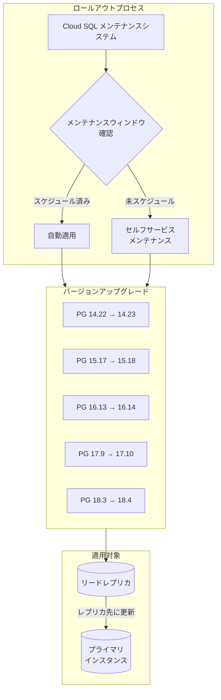

# Cloud SQL for PostgreSQL: マイナーバージョンおよびエクステンションアップグレード完了

**リリース日**: 2026-06-18

**サービス**: Cloud SQL for PostgreSQL

**機能**: PostgreSQL マイナーバージョンアップグレード (14.23, 15.18, 16.14, 17.10, 18.4)

**ステータス**: 完了 (Rollout Complete)

📊 [このアップデートのインフォグラフィックを見る](https://takech9203.github.io/google-cloud-news-summary/20260618-cloud-sql-postgresql-minor-version-upgrades.html)

## 概要

Cloud SQL for PostgreSQL において、全 5 トラックのマイナーバージョンおよびエクステンションのアップグレードロールアウトが完了しました。対象バージョンは PostgreSQL 14.22 から 14.23、15.17 から 15.18、16.13 から 16.14、17.9 から 17.10、18.3 から 18.4 です。新しいメンテナンスバージョンは `[PostgreSQL version].R20260319.07_04` です。

PostgreSQL のマイナーバージョンアップグレードは、セキュリティパッチ、バグ修正、安定性向上を目的としたものであり、後方互換性が維持されます。Cloud SQL はマネージドサービスとして、コミュニティリリースから 30 日以内に新しいマイナーバージョンをサポートし、定期的なメンテナンスサイクルで既存インスタンスを自動的にアップグレードします。

今回のロールアウトは既に完了していますが、まだ新しいバージョンが適用されていないインスタンスについては、セルフサービスメンテナンスを使用して即座に適用することが可能です。次回のスケジュールメンテナンスで自動的に適用されるのを待つこともできます。

**アップデート前の課題**

- 旧マイナーバージョン (14.22, 15.17, 16.13, 17.9, 18.3) にはコミュニティで発見されたセキュリティ脆弱性やバグが含まれている可能性がある
- セキュリティパッチが未適用のままデータベースを運用するリスクがあった
- 最新のパフォーマンス改善や安定性向上が反映されていなかった

**アップデート後の改善**

- 最新のセキュリティパッチが適用され、既知の脆弱性に対するリスクが軽減される
- PostgreSQL コミュニティによるバグ修正が反映され、データベースの安定性が向上する
- パフォーマンスの改善およびエクステンションの最新版が利用可能になる

## アーキテクチャ図



Cloud SQL のメンテナンスシステムがスケジュールされたメンテナンスウィンドウまたはセルフサービスメンテナンスを通じて、各 PostgreSQL バージョントラックのマイナーバージョンアップグレードを適用します。リードレプリカが先に更新され、その後プライマリインスタンスが更新されます。

## サービスアップデートの詳細

### 主要機能

1. **5 トラック同時マイナーバージョンアップグレード**
   - PostgreSQL 14, 15, 16, 17, 18 の全サポートバージョンが対象
   - エクステンションのアップグレードも同時に含まれる
   - ロールアウトは 2026 年 6 月 18 日時点で完了

2. **メンテナンスバージョン識別子**
   - 新しいメンテナンスバージョン: `[PostgreSQL version].R20260319.07_04`
   - 形式: `POSTGRES_[メジャー]_[マイナー].R[ビルド日付].[パッチ番号]`
   - 例: `POSTGRES_17_10.R20260319.07_04`

3. **セルフサービスメンテナンスによる即時適用**
   - 次のスケジュールメンテナンスを待たずに即座に適用可能
   - プライマリインスタンスとリードレプリカの一括更新に対応
   - ロールバック不可 (一度適用すると以前のバージョンに戻せない)

### バージョン対応表

| PostgreSQL メジャーバージョン | 旧マイナーバージョン | 新マイナーバージョン | メンテナンスバージョン |
|------|------|------|------|
| PostgreSQL 14 | 14.22 | 14.23 | POSTGRES_14_23.R20260319.07_04 |
| PostgreSQL 15 | 15.17 | 15.18 | POSTGRES_15_18.R20260319.07_04 |
| PostgreSQL 16 | 16.13 | 16.14 | POSTGRES_16_14.R20260319.07_04 |
| PostgreSQL 17 | 17.9 | 17.10 | POSTGRES_17_10.R20260319.07_04 |
| PostgreSQL 18 | 18.3 | 18.4 | POSTGRES_18_4.R20260319.07_04 |

## 技術仕様

### メンテナンスバージョン命名規則

Cloud SQL のメンテナンスバージョンは以下の形式で構成されます:

| 要素 | 説明 | 例 |
|------|------|------|
| POSTGRES | データベースエンジン識別子 | POSTGRES |
| メジャー_マイナー | PostgreSQL のバージョン番号 | 17_10 |
| R[日付] | ビルドリリース日 (YYYYMMDD) | R20260319 |
| パッチ番号 | ビルド内のパッチ識別子 | 07_04 |

### メンテナンスのダウンタイム

| エディション | ダウンタイム | 備考 |
|------|------|------|
| Cloud SQL Enterprise Plus | 1 秒未満 | Near-zero downtime planned maintenance |
| Cloud SQL Enterprise | 平均 30 秒未満 | 高負荷時はやや延長の可能性あり |

### PostgreSQL マイナーリリースに含まれる典型的な改善内容

- セキュリティ脆弱性の修正 (CVE 対応)
- データ破損リスクのあるバグの修正
- クエリプランナーの改善
- レプリケーション関連の安定性向上
- エクステンション互換性の修正

## 設定方法

### 前提条件

1. Cloud SQL for PostgreSQL インスタンスが稼働中であること (停止中のインスタンスには適用不可)
2. `cloudsql.instances.update` 権限を持つ IAM ロール (Cloud SQL Admin または Editor)
3. ディスク使用率が 97% 以下であること (97% 超過時はメンテナンスがスキップされる)

### 手順

#### ステップ 1: 現在のメンテナンスバージョンを確認

```bash
gcloud sql instances describe INSTANCE_ID \
  --format="value(maintenanceVersion)"
```

現在のメンテナンスバージョンを確認し、更新が必要か判断します。

#### ステップ 2: 利用可能なメンテナンスバージョンを確認

```bash
gcloud sql instances describe INSTANCE_ID \
  --format="value(availableMaintenanceVersions)"
```

適用可能なメンテナンスバージョンの一覧を確認します。

#### ステップ 3: セルフサービスメンテナンスを実行 (単一インスタンス)

```bash
gcloud sql instances patch INSTANCE_ID \
  --maintenance-version=POSTGRES_17_10.R20260319.07_04
```

指定したメンテナンスバージョンがインスタンスに適用されます。

#### ステップ 4: プライマリインスタンスとリードレプリカの一括更新

```bash
gcloud sql instances patch PRIMARY_INSTANCE_ID \
  --maintenance-version=POSTGRES_17_10.R20260319.07_04
```

プライマリインスタンスを指定すると、全リードレプリカが先に更新され、最後にプライマリが更新されます。確認プロンプトで `Y` を入力して続行します。

#### Terraform による設定

```hcl
resource "google_sql_database_instance" "postgres_instance" {
  name                = "my-postgres-instance"
  region              = "asia-northeast1"
  database_version    = "POSTGRES_17"
  maintenance_version = "POSTGRES_17_10.R20260319.07_04"

  settings {
    tier = "db-custom-4-16384"
  }

  deletion_protection = true
}
```

#### REST API による設定

```bash
curl -X PATCH \
  -H "Authorization: Bearer $(gcloud auth print-access-token)" \
  -H "Content-Type: application/json; charset=utf-8" \
  -d '{"maintenanceVersion": "POSTGRES_17_10.R20260319.07_04"}' \
  "https://sqladmin.googleapis.com/sql/v1/projects/PROJECT_ID/instances/INSTANCE_ID"
```

## メリット

### ビジネス面

- **セキュリティリスクの低減**: 最新のセキュリティパッチが適用されることで、データベースの脆弱性に起因するセキュリティインシデントのリスクを低減
- **コンプライアンス対応**: セキュリティパッチの適用状況を証跡として管理可能。監査要件を満たすための定期更新
- **安定稼働**: バグ修正による予期しない障害の減少で、サービスの信頼性を維持

### 技術面

- **セルフサービスによる即時適用**: スケジュールメンテナンスを待たずに任意のタイミングで適用可能
- **累積アップデート**: 過去のメンテナンスをスキップしていても、最新バージョンを適用するだけで全ての修正が反映される
- **Near-zero downtime (Enterprise Plus)**: Enterprise Plus エディションでは 1 秒未満のダウンタイムで適用可能
- **リードレプリカの自動更新**: プライマリインスタンスへの適用時にリードレプリカも自動的に更新される

## デメリット・制約事項

### 制限事項

- メンテナンスバージョンの適用後はロールバック不可 (以前のバージョンに戻すことはできない)
- 停止中のインスタンスにはセルフサービスメンテナンスを適用できない
- ディスク使用率が 97% を超えるインスタンスではメンテナンスがスキップされる
- メジャーバージョンのアップグレードにはセルフサービスメンテナンスは使用できない

### 考慮すべき点

- 適用中は短時間のダウンタイムが発生する (Enterprise: 30 秒未満、Enterprise Plus: 1 秒未満)
- 高負荷時に適用するとダウンタイムが延長される可能性がある
- リードレプリカが多数ある場合は全体の更新時間が長くなる (3 以上のレプリカは並列更新)
- unlogged テーブルは計画メンテナンス後に空になる (Enterprise Plus の near-zero downtime 使用時)
- 適用前にステージング環境でのテストを推奨

## ユースケース

### ユースケース 1: セキュリティ要件の厳しい本番環境での即時適用

**シナリオ**: 金融系のアプリケーションで、セキュリティパッチの適用を次のスケジュールメンテナンスまで待てない場合

**実装例**:
```bash
# ステージング環境で先にテスト
gcloud sql instances patch staging-instance \
  --maintenance-version=POSTGRES_17_10.R20260319.07_04

# テスト完了後、本番環境に適用
gcloud sql instances patch production-instance \
  --maintenance-version=POSTGRES_17_10.R20260319.07_04
```

**効果**: 次のスケジュールメンテナンス (通常数か月後) を待たずに、セキュリティパッチを即座に適用できる

### ユースケース 2: メンテナンスウィンドウを活用した計画的な更新

**シナリオ**: EC サイトのバックエンドデータベースで、トラフィックの少ない深夜帯にメンテナンスを実施したい場合

**実装例**:
```bash
# メンテナンスウィンドウを日曜深夜に設定
gcloud sql instances patch my-instance \
  --maintenance-window-day=SUN \
  --maintenance-window-hour=2

# メンテナンスタイミングを Week 2 に設定 (通知から 15-21 日後)
gcloud sql instances patch my-instance \
  --maintenance-release-channel=week2
```

**効果**: ビジネスへの影響を最小限に抑えながら、計画的にアップグレードを適用

### ユースケース 3: マルチリードレプリカ構成での段階的更新

**シナリオ**: 読み取りスケーリングのために複数のリードレプリカを使用している構成で、段階的にアップグレードを適用したい場合

**実装例**:
```bash
# 個別のリードレプリカを先に更新してテスト
gcloud sql instances patch read-replica-1 \
  --maintenance-version=POSTGRES_16_14.R20260319.07_04

# 問題がなければプライマリ経由で残りを一括更新
gcloud sql instances patch primary-instance \
  --maintenance-version=POSTGRES_16_14.R20260319.07_04
```

**効果**: 1 台のリードレプリカで動作確認後に全体に展開することで、リスクを最小化

## 料金

マイナーバージョンアップグレードおよびメンテナンスの適用に追加料金は発生しません。Cloud SQL の通常のインスタンス料金のみが適用されます。

ただし、PostgreSQL 14 以前のバージョン (コミュニティ EOL を迎えたバージョン) を使用している場合は、延長サポート料金が発生する点に注意が必要です。

| エディション | 延長サポート料金 |
|--------|-----------------|
| Cloud SQL Enterprise Plus | インスタンスの vCPU 料金の 100% 追加 |
| Cloud SQL Enterprise | インスタンスの vCPU 料金の 100% 追加 |

詳細は [Cloud SQL 料金ページ](https://cloud.google.com/sql/pricing) を参照してください。

## 利用可能リージョン

Cloud SQL for PostgreSQL のマイナーバージョンアップグレードは、Cloud SQL が利用可能な全リージョンで適用されます。リージョンによるバージョンの差異はありません。詳細は [Cloud SQL リージョン可用性](https://cloud.google.com/sql/docs/postgres/locations) を参照してください。

## 関連サービス・機能

- **Cloud SQL Enterprise Plus エディション**: Near-zero downtime (1 秒未満) でのメンテナンス適用が可能
- **Cloud Monitoring**: メンテナンス中のインスタンスの状態監視、ダウンタイムのアラート設定
- **Cloud SQL Auth Proxy**: メンテナンス適用時の接続管理。最新バージョンの使用を推奨
- **Cloud SQL Language Connectors**: アプリケーションからの接続の自動再接続。最新バージョンの使用を推奨
- **Terraform (google_sql_database_instance)**: Infrastructure as Code によるメンテナンスバージョンの宣言的管理

## 参考リンク

- 📊 [インフォグラフィック](https://takech9203.github.io/google-cloud-news-summary/20260618-cloud-sql-postgresql-minor-version-upgrades.html)
- [公式リリースノート](https://cloud.google.com/release-notes#June_18_2026)
- [Cloud SQL セルフサービスメンテナンス](https://cloud.google.com/sql/docs/postgres/self-service-maintenance)
- [Cloud SQL メンテナンスの概要](https://cloud.google.com/sql/docs/postgres/maintenance)
- [Cloud SQL データベースバージョンとポリシー](https://cloud.google.com/sql/docs/postgres/db-versions)
- [メンテナンスウィンドウの設定](https://cloud.google.com/sql/docs/postgres/set-maintenance-window)
- [Cloud SQL エディションの概要](https://cloud.google.com/sql/docs/postgres/editions-intro)
- [Cloud SQL 料金](https://cloud.google.com/sql/pricing)
- [PostgreSQL リリースノート (コミュニティ)](https://www.postgresql.org/docs/release/)

## まとめ

Cloud SQL for PostgreSQL の 5 トラック (14, 15, 16, 17, 18) のマイナーバージョンアップグレードロールアウトが完了しました。セキュリティパッチ、バグ修正、安定性向上が含まれるこのアップデートは、セルフサービスメンテナンスを使用して即座に適用するか、次回のスケジュールメンテナンスで自動適用されます。特にセキュリティ要件の厳しい環境では、早期の適用を推奨します。

---

**タグ**: #CloudSQL #PostgreSQL #MinorVersionUpgrade #SelfServiceMaintenance #Security #DatabaseManagement
