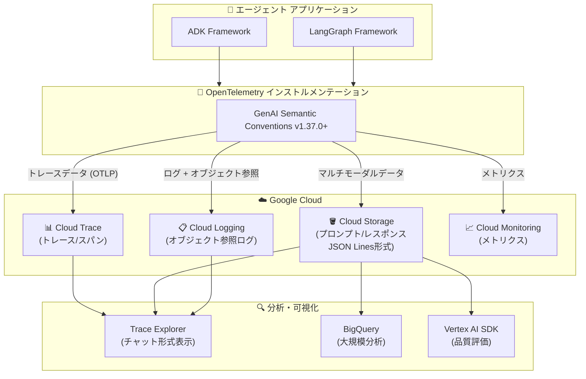

# Cloud Trace: マルチモーダル エージェント オブザーバビリティが GA

**リリース日**: 2026-06-18

**サービス**: Cloud Trace

**機能**: マルチモーダル プロンプト/レスポンスの収集・表示・分析 (エージェント アプリケーション向け)

**ステータス**: GA (一般提供)

📊 [このアップデートのインフォグラフィックを見る](https://takech9203.github.io/google-cloud-news-summary/20260618-cloud-trace-multimodal-agentic-observability-ga.html)

## 概要

Cloud Trace において、LangGraph または Agent Development Kit (ADK) フレームワークを使用したエージェント アプリケーションからのマルチモーダル プロンプトとレスポンスを収集・表示・分析する機能が一般提供 (GA) となった。これにより、AI エージェントが処理するテキスト、画像、動画などのマルチモーダル データを含むやり取りの全体像を、Cloud Trace の Trace Explorer 上でチャット形式のインターフェースで確認できるようになった。

この機能は OpenTelemetry GenAI セマンティック規約 (v1.37.0 以降) に準拠しており、プロンプトとレスポンスのデータは Cloud Storage バケットに JSON Lines 形式で保存される。GA 昇格により、本番環境での利用に対するサービスレベル保証 (SLA) が適用され、エンタープライズ向けのエージェント アプリケーションの品質管理・デバッグ・評価ワークフローに正式に組み込むことができる。

**アップデート前の課題**

- エージェント アプリケーションのマルチモーダル データ (画像、動画を含むプロンプト/レスポンス) を体系的に収集・可視化する手段がなく、テキストベースのログのみに依存していた
- AI エージェントの推論プロセスや意思決定の過程を追跡するには、独自のログ実装が必要だった
- マルチモーダル プロンプト/レスポンスのサイズがログエントリの上限 (256 KiB) を超える場合にデータが切り捨てられる問題があった
- 本番環境のエージェントが扱うマルチモーダル コンテンツの品質評価やデバッグに SLA 保証がなかった

**アップデート後の改善**

- LangGraph と ADK の両フレームワークで、マルチモーダル プロンプト/レスポンスを Cloud Storage バケットに自動保存し、Trace Explorer から直接表示可能になった
- GA 昇格により SLA 保証が適用され、本番環境のエージェント オブザーバビリティに正式に利用可能になった
- OpenTelemetry 標準に基づく統一的なインストルメンテーションで、アプリケーション コードの変更なしに収集が可能になった
- BigQuery との連携により、保存されたプロンプト/レスポンスの大規模分析や Vertex AI SDK を使った評価が可能になった

## アーキテクチャ図



Cloud Trace がエージェント アプリケーションからマルチモーダル データを収集し、Cloud Storage、Logging、Monitoring と連携して包括的なオブザーバビリティを提供するアーキテクチャを示す。

## サービスアップデートの詳細

### 主要機能

1. **マルチモーダル プロンプト/レスポンスの自動収集**
   - SDK が自動的に OpenTelemetry を呼び出し、マルチモーダル データを Cloud Storage バケットに JSON Lines 形式で保存
   - アプリケーション コードの変更は不要 (SDK とプロジェクトの構成のみ)
   - テキスト、画像、動画などのマルチモーダル コンテンツに対応

2. **Trace Explorer でのチャット形式表示**
   - スパンに紐づくプロンプト/レスポンスを「Inputs/Outputs」タブでチャット形式で表示
   - 「Formatted」モードで画像・動画などのメディアをインライン表示
   - 「Raw」モードで JSON 形式の生データを確認可能
   - 会話履歴全体の表示と、特定スパンのプロンプト/レスポンスのみの表示を切り替え可能

3. **LangGraph フレームワーク対応**
   - LangGraph ReAct エージェントの OpenTelemetry インストルメンテーション
   - `opentelemetry-instrumentation-vertexai>=2.2b0` パッケージによる自動計装
   - `invoke agent` スパンでエージェント呼び出し全体をトレース

4. **Agent Development Kit (ADK) フレームワーク対応**
   - ADK v1.16.0 以降で `otel_to_cloud` フラグによる Cloud Trace 連携
   - CLI: `adk web --otel_to_cloud`
   - FastAPI: `get_fast_api_app(..., otel_to_cloud=True)`
   - `call_llm` スパンで LLM 呼び出しをトレース

5. **BigQuery 連携による大規模分析**
   - Cloud Storage に保存されたプロンプト/レスポンスを BigQuery 外部テーブルとして照会可能
   - Vertex AI SDK for Python を使用した品質評価ワークフローとの統合

## 技術仕様

### SDK 依存関係

| フレームワーク | 必要なパッケージ | 最小バージョン |
|------|------|------|
| ADK | google-adk | >= 1.16.0 |
| ADK | opentelemetry-instrumentation-google-genai | >= 0.4b0 |
| ADK | fsspec[gcs] | == 2025.10.0 |
| LangGraph | opentelemetry-instrumentation-vertexai | >= 2.2b0 |
| LangGraph | opentelemetry-instrumentation-google-genai | >= 0.4b0 |
| LangGraph | fsspec[gcs] | == 2025.10.0 |

### 環境変数の設定

| 環境変数 | 値 | 説明 |
|------|------|------|
| OTEL_INSTRUMENTATION_GENAI_UPLOAD_FORMAT | jsonl | Cloud Storage オブジェクトを JSON Lines 形式でフォーマット |
| OTEL_INSTRUMENTATION_GENAI_COMPLETION_HOOK | upload | プロンプト/レスポンスをスパンに埋め込まずアップロード |
| OTEL_SEMCONV_STABILITY_OPT_IN | gen_ai_latest_experimental | 最新の GenAI セマンティック規約を使用 |
| OTEL_INSTRUMENTATION_GENAI_UPLOAD_BASE_PATH | gs://BUCKET/PATH | オブジェクト保存先の Cloud Storage パス |
| OTEL_PYTHON_LOGGING_AUTO_INSTRUMENTATION_ENABLED | true | LangGraph 向け: ログデータの自動キャプチャ |

### 必要な IAM ロール (書き込み側)

| ロール | リソース | 用途 |
|------|------|------|
| Storage Object User (roles/storage.objectUser) | Cloud Storage バケット | プロンプト/レスポンスの保存 |
| Logs Writer (roles/logging.logWriter) | プロジェクト | ログデータの書き込み |
| Monitoring Metric Writer (roles/monitoring.metricWriter) | プロジェクト | メトリクス データの書き込み |
| Cloud Telemetry Traces Writer (roles/telemetry.tracesWriter) | プロジェクト | トレースデータの書き込み |

### 必要な IAM ロール (閲覧側)

| ロール | リソース | 用途 |
|------|------|------|
| Cloud Trace User (roles/cloudtrace.user) | プロジェクト | トレースの閲覧 |
| Logs Viewer (roles/logging.viewer) | プロジェクト | ログの閲覧 |
| Storage Object Viewer (roles/storage.objectViewer) | Cloud Storage バケット | プロンプト/レスポンスの閲覧 |

## 設定方法

### 前提条件

1. Google Cloud プロジェクトで課金が有効であること
2. Vertex AI、Cloud Storage、Telemetry、Cloud Logging、Cloud Trace の各 API が有効であること
3. Cloud Storage バケットが作成済みであること (ログバケットと同じロケーションを推奨)
4. サービスアカウントに必要な IAM ロールが付与されていること

### 手順

#### ステップ 1: API の有効化

```bash
gcloud services enable \
  aiplatform.googleapis.com \
  storage.googleapis.com \
  telemetry.googleapis.com \
  logging.googleapis.com \
  cloudtrace.googleapis.com
```

#### ステップ 2: Cloud Storage バケットの作成

```bash
# ログバケットと同じリージョンにバケットを作成
gcloud storage buckets create gs://MY_BUCKET \
  --location=us-central1 \
  --default-storage-class=STANDARD
```

#### ステップ 3: SDK のインストール (ADK の場合)

```bash
pip install 'google-adk>=1.16.0' \
  'opentelemetry-instrumentation-google-genai>=0.4b0' \
  'fsspec[gcs]==2025.10.0'
```

#### ステップ 4: 環境変数の設定

```bash
export OTEL_INSTRUMENTATION_GENAI_UPLOAD_FORMAT='jsonl'
export OTEL_INSTRUMENTATION_GENAI_COMPLETION_HOOK='upload'
export OTEL_SEMCONV_STABILITY_OPT_IN='gen_ai_latest_experimental'
export OTEL_INSTRUMENTATION_GENAI_UPLOAD_BASE_PATH='gs://MY_BUCKET/traces'
```

#### ステップ 5: アプリケーションの起動 (ADK の場合)

```bash
# CLI の場合
adk web --otel_to_cloud

# FastAPI の場合 (コード内で設定)
# get_fast_api_app(..., otel_to_cloud=True)
```

## メリット

### ビジネス面

- **エージェント品質の可視化**: マルチモーダル プロンプト/レスポンスを直接確認できることで、AI エージェントの出力品質を継続的にモニタリングし、品質低下を早期に発見できる
- **GA による信頼性保証**: SLA が適用されるため、本番環境のミッションクリティカルなエージェント アプリケーションの監視基盤として採用できる
- **評価ワークフローの効率化**: BigQuery 連携と Vertex AI SDK による品質評価が可能になり、エージェントの改善サイクルを高速化できる

### 技術面

- **コード変更不要の計装**: SDK の設定と環境変数のみでマルチモーダル データの収集が可能。既存のエージェント アプリケーションへの影響が最小限
- **OpenTelemetry 標準準拠**: ベンダーロックインなしの業界標準に基づくインストルメンテーション。将来的な移行や拡張が容易
- **スケーラブルなストレージ**: プロンプト/レスポンスを Cloud Storage に保存することで、ログエントリの 256 KiB 制限を回避し、大容量のマルチモーダル データを扱える

## デメリット・制約事項

### 制限事項

- 対応フレームワークは現時点で LangGraph と ADK のみ
- Cloud Storage バケットの追加コストが発生する (プロンプト/レスポンスの保存用)
- fsspec パッケージのバージョンに依存関係がある (バージョン 2025.10.0 が動作確認済み)
- トレースデータの保持期間は 30 日間

### 考慮すべき点

- マルチモーダル データ (画像・動画) の保存により、Cloud Storage の使用量が増加する可能性がある。バケットの保持期間設定を適切に管理する必要がある
- 公開画像やドキュメントへのリンクを含むプロンプト/レスポンスを表示する際、セキュリティ上の理由からメディア表示には確認が必要
- サービスアカウントへのロール付与を適切に行わないと、権限エラーが発生する可能性がある

## ユースケース

### ユースケース 1: エージェントの品質デバッグ

**シナリオ**: マルチモーダル入力 (画像付きの質問) を処理するカスタマーサポート エージェントが、特定の画像タイプに対して不正確な回答を返している問題を調査する。

**効果**: Trace Explorer の Inputs/Outputs タブで、問題のあるスパンのプロンプト/レスポンスを画像付きで確認し、エージェントの推論プロセスを可視化。原因の特定からプロンプト改善まで迅速に対応できる。

### ユースケース 2: エージェント品質の大規模評価

**シナリオ**: 本番環境にデプロイした ADK エージェントの応答品質を定期的に評価し、品質劣化を検知するパイプラインを構築する。

**効果**: Cloud Storage に蓄積されたプロンプト/レスポンスを BigQuery 外部テーブルとしてクエリし、Vertex AI SDK の評価機能で品質スコアを算出。定期的な品質レポートの自動生成が可能になる。

### ユースケース 3: マルチエージェント システムのトレーシング

**シナリオ**: 複数の ADK エージェントが連携して複雑なタスクを処理するシステムにおいて、エージェント間のデータの受け渡しとそれぞれの推論プロセスを追跡する。

**効果**: 各エージェントの呼び出しがスパンとして記録され、トレース全体を通してマルチモーダル データの流れを把握。ボトルネックの特定やエラーの根本原因分析が容易になる。

## 料金

Cloud Trace のスパン取り込み料金が適用される。

| 項目 | 料金 | 無料枠 |
|------|------|------|
| Trace スパン取り込み | $0.20 / 100万スパン | 毎月最初の 250万スパン |
| Cloud Storage (プロンプト/レスポンス保存) | Standard: $0.020 / GB / 月 (リージョンにより異なる) | - |
| Cloud Logging (ログ保存) | $0.50 / GiB | 毎月最初の 50 GiB / プロジェクト |

高トラフィックシステムではサンプリングレートの調整 (1/1,000 〜 1/10,000) により、十分なパフォーマンス分析情報を維持しつつコストを制御可能。

## 関連サービス・機能

- **Cloud Logging**: プロンプト/レスポンスへの Cloud Storage オブジェクト参照を含むログエントリを管理。Logs Explorer からトレース詳細への直接ナビゲーションが可能
- **Cloud Storage**: マルチモーダル プロンプト/レスポンスの永続ストレージ。JSON Lines 形式で保存され、BigQuery 外部テーブルとしてもアクセス可能
- **Cloud Monitoring**: エージェント アプリケーションのメトリクス (レイテンシ、トークン使用量、エラーレート) を監視
- **BigQuery**: Cloud Storage に保存されたプロンプト/レスポンスの大規模分析基盤
- **Vertex AI SDK**: 品質評価 (Gen AI evaluation service) との統合
- **Application Monitoring**: エージェント オブザーバビリティのダッシュボードとトポロジーマップを提供
- **Gemini Enterprise Agent Platform**: Agent Platform にデプロイされたエージェントのテレメトリ連携

## 参考リンク

- 📊 [インフォグラフィック](https://takech9203.github.io/google-cloud-news-summary/20260618-cloud-trace-multimodal-agentic-observability-ga.html)
- [公式リリースノート](https://docs.cloud.google.com/release-notes#June_18_2026)
- [AI エージェント インストルメンテーション概要](https://docs.cloud.google.com/stackdriver/docs/instrumentation/ai-agent-overview)
- [マルチモーダル プロンプト/レスポンスの収集と表示](https://docs.cloud.google.com/trace/docs/collect-view-multimodal-prompts-responses)
- [LangGraph エージェントの計装ガイド](https://docs.cloud.google.com/stackdriver/docs/instrumentation/ai-agent-langgraph)
- [ADK エージェントの計装ガイド](https://docs.cloud.google.com/stackdriver/docs/instrumentation/ai-agent-adk)
- [ADK Cloud Trace 連携](https://adk.dev/integrations/cloud-trace/)
- [エージェント オブザーバビリティ概要](https://docs.cloud.google.com/stackdriver/docs/observability/agent-observability)
- [Cloud Trace 料金](https://cloud.google.com/products/observability#pricing)

## まとめ

Cloud Trace のマルチモーダル エージェント オブザーバビリティの GA により、LangGraph や ADK で構築された AI エージェントの動作をマルチモーダル データ (画像、動画を含む) レベルで本番環境において包括的に監視・デバッグ・評価することが可能になった。エージェント アプリケーションを本番運用している組織は、SDK のバージョンアップと環境変数の設定のみで、コード変更なしにこの機能を導入できるため、早期の適用を推奨する。

---

**タグ**: #CloudTrace #Observability #AI #Agent #ADK #LangGraph #Multimodal #OpenTelemetry #GA
