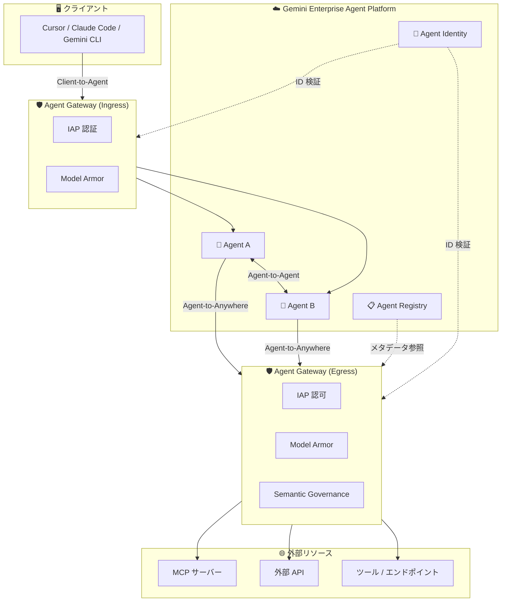

# Gemini Enterprise Agent Platform: Agent Gateway が一般提供 (GA) 開始

**リリース日**: 2026-06-18

**サービス**: Gemini Enterprise Agent Platform

**機能**: Agent Gateway (General Availability)

**ステータス**: GA (一般提供)

📊 [このアップデートのインフォグラフィックを見る](https://takech9203.github.io/google-cloud-news-summary/20260618-gemini-agent-platform-agent-gateway-ga.html)

## 概要

Gemini Enterprise Agent Platform のネットワーキングコンポーネントである Agent Gateway が一般提供 (GA) となった。Agent Gateway は、エージェントエコシステムにおけるすべてのエージェンティックなインタラクション (ユーザーとエージェント間、エージェントとツール間、エージェント同士の通信) を保護・ガバナンスするためのセキュリティゲートウェイである。

Agent Gateway は、AI エージェントの通信を一元的に制御するネットワーク抽象化レイヤーとして機能し、IAP (Identity-Aware Proxy)、Model Armor、Semantic Governance Policies などと連携して多層的なセキュリティを提供する。これにより、エンタープライズのセキュリティ管理者はエージェントのネットワーク通信に対して統一的なポリシーを適用できるようになる。

Agent Gateway は Client-to-Agent (Ingress) モードと Agent-to-Anywhere (Egress) モードの 2 つのデプロイメントモードをサポートし、Agent Runtime および Gemini Enterprise の両ランタイムで動作する。

**アップデート前の課題**

- エージェント間通信、エージェントとツール間通信のセキュリティガバナンスを個別に管理する必要があった
- エージェントのアウトバウンド通信 (MCP サーバー、外部 API) に対する一元的なアクセス制御が困難だった
- プロンプトインジェクション攻撃などの AI 固有のセキュリティリスクに対するネットワークレベルの防御が不足していた
- エージェントのネットワーク通信に関する可視性が限定的だった

**アップデート後の改善**

- すべてのエージェンティックなインタラクションを一元的に保護・ガバナンスする統一ゲートウェイが利用可能になった
- IAP、Model Armor、Semantic Governance Policies との統合により多層防御が実現された
- Agent Registry と連携し、未登録のリソースへのアクセスをデフォルトでブロックする最小権限モデルが適用される
- Cloud Logging、Cloud Trace へのテレメトリエクスポートにより、エージェント通信の包括的な可観測性が確保された
- mTLS と DPoP による暗号化通信が自動的に適用されるようになった

## アーキテクチャ図



Agent Gateway は Ingress (Client-to-Agent) と Egress (Agent-to-Anywhere) の 2 つのモードで動作し、すべてのエージェンティック通信を保護する。Agent Registry からメタデータを参照し、Agent Identity を使用して認証・認可を行う。

## サービスアップデートの詳細

### 主要機能

1. **Client-to-Agent (Ingress) モード**
   - クライアント (Cursor、Claude Code、Gemini CLI など) からエージェントへの通信を保護
   - エージェントのフロントエンドとして機能し、アクセスできるクライアントとセキュリティポリシーを制御
   - Agent Runtime の query および streamQuery メソッドをサポート

2. **Agent-to-Anywhere (Egress) モード**
   - エージェントから外部のサーバー、エージェント、ツール、API への通信を保護
   - MCP サーバー (自社ホスティング・サードパーティ) へのアクセスを制御
   - Agent Runtime および Gemini Enterprise の両方をサポート

3. **多層的アクセス制御ポリシー**
   - IAP による認証・認可 (デフォルトで有効)
   - Model Armor によるプロンプトインジェクション、機密データ漏洩の防止
   - Semantic Governance Policies によるコンテキスト認識型のエージェント制御
   - Service Extensions を使用したカスタム認可エンジンの統合

4. **プロトコルサポート**
   - MCP (Model Context Protocol)
   - A2A (Agent-to-Agent)
   - REST、gRPC
   - フレームワーク非依存で動作

5. **Agent Registry との統合**
   - 登録されていないリソースへのアクセスをデフォルトでブロック
   - エージェント、ツール、MCP サーバー、エンドポイントの一元管理
   - ツール名や読み取り/書き込み権限に基づく細粒度アクセス制御

## 技術仕様

### デプロイメント要件

| 項目 | 詳細 |
|------|------|
| デプロイメントモード | Client-to-Agent (Ingress) / Agent-to-Anywhere (Egress) |
| サポートランタイム | Agent Runtime (Ingress + Egress) / Gemini Enterprise (Egress のみ) |
| スコープ | リージョナル (プロジェクト + リージョン単位) |
| 認証方式 | mTLS + DPoP (Context-Aware Access) |
| 認可レイヤー | IAP (デフォルト)、Model Armor、Semantic Governance、カスタム |

### リージョンマッピング (Gemini Enterprise)

| Gemini Enterprise ロケーション | Agent Gateway リージョン |
|------|------|
| global | us-central1 |
| us | us-central1 |
| eu | europe-west1 |

### 制限事項

| 項目 | 制限内容 |
|------|------|
| ゲートウェイバインディング | 同一プロジェクト・リージョン内のすべてのエージェントは同じ Egress/Ingress ゲートウェイにバインド必須 |
| ランタイム混在 | 1 つの Gateway リソースで Gemini Enterprise と Agent Runtime の同時サポート不可 |
| Ingress メソッド制限 | Client-to-Agent モードでは query と streamQuery のみガバナンス対象 |
| アンバインド | Runtime エージェントを Gateway からアンバインドすることは不可 |
| SCC 連携 | Agent Gateway 有効時は Security Command Center Agent Engine Threat Detection 利用不可 |

## 設定方法

### 前提条件

1. Gemini Enterprise Agent Platform が有効化されたプロジェクト
2. Agent Registry にエージェント、ツール、MCP サーバーが登録済み
3. Agent Identity が構成済み

### 手順

#### ステップ 1: Agent Gateway リソースの作成

```bash
# Agent-to-Anywhere (Egress) モードでゲートウェイを作成
gcloud beta agent-gateways create GATEWAY_NAME \
  --project=PROJECT_ID \
  --location=REGION \
  --mode=agent-to-anywhere
```

#### ステップ 2: エージェントデプロイ時にゲートウェイを指定

```python
remote_agent = client.agent_engines.create(
    agent=local_agent,
    config={
        "agent_gateway_config": {
            "agent_to_anywhere_config": {
                "agent_gateway": "projects/PROJECT_ID/locations/REGION/agentGateways/GATEWAY_ID"
            },
        },
        "identity_type": types.IdentityType.AGENT_IDENTITY,
    },
)
```

#### ステップ 3: IAM ポリシーバインディングの設定

```bash
# エージェントに対して IAP Egressor ロールを付与
gcloud alpha iap web add-iam-policy-binding \
  --resource-type=agent-registry \
  --endpoint=ENDPOINT_ID \
  --region=REGION \
  --project=PROJECT_ID \
  --member=MEMBER \
  --role=roles/iap.egressor
```

## メリット

### ビジネス面

- **一元的なガバナンス**: 複数のエージェントランタイムやデプロイメントモデルにまたがる一貫したアクセスポリシーを一箇所で管理できる
- **コンプライアンス強化**: エージェントの通信ログが自動的に記録され、監査要件に対応可能
- **運用コスト削減**: 個別のセキュリティ設定が不要となり、セキュリティ管理の運用負荷が軽減

### 技術面

- **ゼロトラストアーキテクチャ**: 最小権限の原則に基づき、明示的に許可されたリソースのみアクセス可能
- **自動暗号化**: mTLS ハンドシェイクと終端処理が自動化され、開発者はネットワークセキュリティの複雑さから解放
- **フレームワーク非依存**: 使用する開発フレームワークやクライアントに関係なく一貫したセキュリティを提供
- **包括的な可観測性**: Cloud Logging、Cloud Trace との統合によりエージェント通信のトレーサビリティを確保

## デメリット・制約事項

### 制限事項

- 同一プロジェクト・リージョン内のすべての Agent Runtime エージェントは同じゲートウェイインスタンスにバインドする必要がある
- 一度バインドした Runtime エージェントをゲートウェイからアンバインドすることはできない
- Gemini Enterprise エージェントは Agent-to-Anywhere (Egress) モードのみサポート
- Client-to-Agent (Ingress) モードでは query と streamQuery メソッドのみガバナンス対象

### 考慮すべき点

- Agent Registry への全リソース登録が必須であり、初期セットアップに工数がかかる
- Gateway 有効化後は Security Command Center Agent Engine Threat Detection が利用不可となるトレードオフがある
- テスト時は専用プロジェクトの使用が推奨されている (アンバインド不可のため)

## ユースケース

### ユースケース 1: マルチエージェントシステムのセキュリティ統制

**シナリオ**: 企業内で複数の AI エージェントが異なるチームによって開発・デプロイされており、各エージェントがアクセスできるツールや外部 API を一元的に管理したい。

**実装例**:
```yaml
# 各エージェントに対するアクセス制御
- Agent A: MCP Server X (読み取りのみ), API Y (読み書き)
- Agent B: MCP Server Z (読み取りのみ)
# 未登録リソースへのアクセスはデフォルトでブロック
```

**効果**: エージェントごとの最小権限アクセスが実現され、エージェントの権限昇格や意図しないリソースアクセスを防止できる。

### ユースケース 2: AI セキュリティガードレールの適用

**シナリオ**: 顧客対応用エージェントがプロンプトインジェクション攻撃を受けた場合に、機密データの漏洩を防止したい。

**効果**: Model Armor との統合により、エージェントの入出力に対してリアルタイムのコンテンツスキャンが適用され、プロンプトインジェクションや機密データ漏洩を自動的にブロックできる。

## 料金

Agent Gateway の料金については公式料金ページを参照のこと。Gemini Enterprise Agent Platform の一部として提供されており、詳細な課金体系は公式ドキュメントで確認が必要。

## 利用可能リージョン

Agent Gateway はリージョナルスコープでデプロイされる。Agent Runtime エージェントの場合はエージェントと同じプロジェクト・リージョンにデプロイする必要がある。Gemini Enterprise エージェントの場合は、ロケーションに応じて us-central1 または europe-west1 にデプロイする。

## 関連サービス・機能

- **Agent Registry**: エージェント、ツール、MCP サーバーの一元カタログ。Gateway がアクセスポリシー適用時にメタデータを参照する
- **Agent Identity**: エージェントの一意な ID。mTLS と DPoP による暗号化認証に使用される
- **Identity-Aware Proxy (IAP)**: Gateway のデフォルト認可レイヤー。IAM ポリシーに基づきエージェントの ID を検証
- **Model Armor**: プロンプトインジェクション、有害コンテンツ、機密データ漏洩に対するランタイム保護を提供
- **Agent Observability**: Gateway が生成するテレメトリデータの可視化・分析を担当
- **Agent Runtime / Gemini Enterprise**: Gateway がトラフィックをガバナンスする対象ランタイム

## 参考リンク

- 📊 [インフォグラフィック](https://takech9203.github.io/google-cloud-news-summary/20260618-gemini-agent-platform-agent-gateway-ga.html)
- [公式リリースノート](https://docs.cloud.google.com/release-notes#June_18_2026)
- [Agent Gateway 概要ドキュメント](https://docs.cloud.google.com/gemini-enterprise-agent-platform/govern/gateways/agent-gateway-overview)
- [Agent Gateway セットアップガイド](https://docs.cloud.google.com/gemini-enterprise-agent-platform/govern/gateways/set-up-agent-gateway)
- [Agent Runtime からのルーティング](https://docs.cloud.google.com/gemini-enterprise-agent-platform/scale/runtime/agent-gateway-runtime-deploy)
- [認可委任の設定](https://docs.cloud.google.com/gemini-enterprise-agent-platform/govern/gateways/delegate-authorization)

## まとめ

Agent Gateway の GA により、エンタープライズ環境における AI エージェントのネットワークセキュリティとガバナンスが大幅に強化された。IAP、Model Armor、Semantic Governance Policies との多層的な統合により、ゼロトラストモデルに基づくエージェント通信の保護が可能となる。マルチエージェントシステムを本番運用する組織は、Agent Registry へのリソース登録と Agent Gateway の構成を優先的に検討すべきである。

---

**タグ**: #GeminiEnterpriseAgentPlatform #AgentGateway #GA #Security #Networking #AgentRegistry #IAP #ModelArmor #ZeroTrust #MCP
