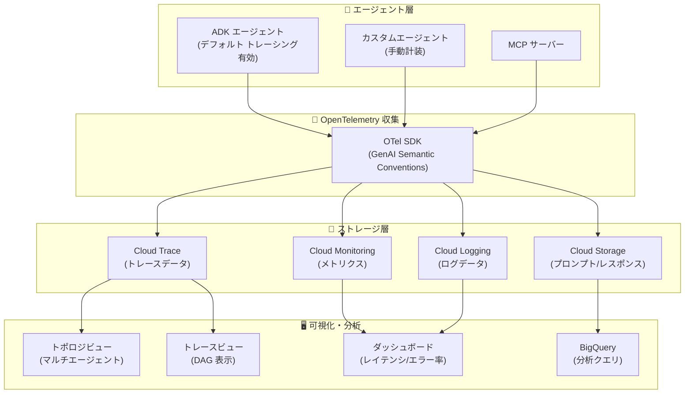

# Gemini Enterprise Agent Platform: Agent Observability が GA (一般提供)

**リリース日**: 2026-06-18

**サービス**: Gemini Enterprise Agent Platform

**機能**: Agent Observability (エージェント可観測性)

**ステータス**: GA (一般提供)

[このアップデートのインフォグラフィックを見る](https://takech9203.github.io/google-cloud-news-summary/20260618-gemini-agent-platform-observability-ga.html)

## 概要

Gemini Enterprise Agent Platform の Agent Observability が一般提供 (GA) となった。この機能は、デプロイされた AI エージェントおよび Model Context Protocol (MCP) サーバーのパフォーマンス、動作、ヘルスに対する包括的な可視性を提供する。エージェント管理ワークフロー内で直接、主要メトリクスの監視、実行パスのトレーシング、マルチエージェントシステム全体の観測が可能になる。

今回の GA リリースでは、Agent Engine (現 Agent Runtime) 上に新規デプロイされる ADK エージェントに対して OpenTelemetry トレーシングがデフォルトで有効化される。また、マルチモーダルペイロードのストレージとして Cloud Logging ではなく Cloud Storage (GCS) がデフォルト選択肢となり、大規模なプロンプト・レスポンスデータの管理が改善された。

本機能は、プロダクション環境でエージェントを運用する Solutions Architect、SRE、MLOps エンジニアにとって重要なアップデートであり、エージェントの品質劣化やパフォーマンス問題の迅速な診断を可能にする。

**アップデート前の課題**

- Agent Observability は Preview 段階であり、本番ワークロードでの利用には SLA が保証されなかった
- ADK エージェントのデプロイ時にトレーシングを有効化するには、手動で環境変数の設定や SDK の構成が必要だった
- マルチモーダルペイロード (画像・音声を含むプロンプト/レスポンス) は Cloud Logging に保存されていたが、サイズ制限やコスト面での課題があった
- エージェントの実行パスを視覚的に把握するためのツールが限定的だった

**アップデート後の改善**

- GA となりSLA が保証され、本番環境での利用が正式にサポートされた
- 新規デプロイされる ADK エージェントではOpenTelemetry トレーシングがデフォルトで有効化され、追加設定不要で可観測性を確保できる
- GCS がマルチモーダルペイロードのデフォルトストレージとなり、大容量データの保存・管理が効率化された
- トレーススパンの DAG (有向非巡回グラフ) 表示により、エージェントのステップバイステップ実行を視覚的に検査可能になった

## アーキテクチャ図



Agent Observability のアーキテクチャは、エージェントから OpenTelemetry SDK を経由してテレメトリデータを Google Cloud の各ストレージサービスに送信し、統合 UI で可視化する構成となっている。

## サービスアップデートの詳細

### 主要機能

1. **デフォルト有効トレーシング (Default-On Tracing)**
   - Agent Runtime 上に新規デプロイされる ADK エージェントで、OpenTelemetry トレーシングが自動的に有効化される
   - 環境変数 `GOOGLE_CLOUD_AGENT_ENGINE_ENABLE_TELEMETRY='true'` が自動設定される
   - 追加のコード変更やインフラ設定なしで、即座にトレースデータの収集が開始される

2. **GCS デフォルトストレージ (Storage Prioritization)**
   - マルチモーダルペイロード (ユーザープロンプト、モデルレスポンス) の保存先として Cloud Storage がデフォルト選択肢に変更
   - Cloud Logging のエントリサイズ制限 (256 KB) を超える大容量データに対応
   - JSON Lines 形式で保存され、BigQuery の外部テーブルとしてクエリ可能
   - トレーススパンとペイロードログの自動相関により、UI 上では統合ビューとして表示

3. **拡張トレーシング (Enhanced Tracing)**
   - トレーススパンの DAG (Directed Acyclic Graph) 表示によるステップバイステップ実行の検査
   - 3 つのビュー: Session ビュー、Trace ビュー、Span ビュー
   - セッション単位でのマルチターン会話分析、個別リクエストのエンドツーエンドトレース、粒度の細かいオペレーション単位の検査が可能

4. **MCP サーバーモニタリング**
   - MCP サーバーのリクエスト数、p95 リクエスト時間を監視可能
   - Cloud Trace を使用した MCP ツール使用状況のモニタリング
   - マルチエージェントトポロジビューで MCP サーバーとエージェント間の依存関係を可視化

5. **マルチエージェントトポロジビュー**
   - Agent Registry に登録されたすべてのエージェントと MCP サーバーのリアルタイムな関係性・トラフィックフローを表示
   - システム全体の依存関係マップによるボトルネックの特定
   - 個別エージェントのインバウンド/アウトバウンド依存関係表示

## 技術仕様

### Observability ダッシュボード構成

| ビュー | 提供メトリクス |
|------|------|
| Overview | 総セッション数、セッション平均ターン数、エージェント呼び出し数、トークン使用量、トラフィックボリューム、レイテンシパーセンタイル (p50/p95/p99)、エラー率 |
| Evaluation | 応答品質平均、安全性メトリクス、ハルシネーション率、ツール使用品質 |
| Models | モデル別 p95 レイテンシ、呼び出し数、エラー率、クォータ失敗、トークン使用量 |
| Tools | ツール別 p95 レイテンシ、呼び出し数、エラー率 |
| Usage | コンテナ CPU/メモリ割り当て、トークン使用量 |
| Logs | フィルタリング可能なログストリーム (重要度、タイムスタンプ、実行サマリ) |

### トレーススパンのスキーマ

| スパン名 | タイプ | 説明 |
|---------|------|------|
| `invoke_agent` | Client / Internal | エージェント呼び出しのライフサイクル全体 |
| `invoke_workflow` | Child Span | マルチステップワークフローの呼び出し |
| `execute_tool` | Child Span | ツールまたは関数呼び出しの実行 |
| `generate_content` | Internal Span | 基盤モデルによるコンテンツ生成 |

### データストレージとアクセス制御

| データタイプ | 保存先 | 制御方法 |
|------------|--------|---------|
| 実行メトリクス・属性 (レイテンシ、ステータスコード) | トレーススパン内 | Cloud Trace IAM |
| プロンプト・レスポンス (機密データ) | Cloud Storage または Cloud Logging | IAM によるきめ細かいアクセス制御 |

### 必要な IAM ロール

| ロール | 用途 |
|-------|------|
| `roles/telemetry.tracesWriter` | トレースデータの書き込み |
| `roles/logging.logWriter` | ログデータの書き込み |
| `roles/monitoring.metricWriter` | メトリクスデータの書き込み |
| `roles/storage.objectUser` | Cloud Storage バケットへのペイロード保存 |

## 設定方法

### 前提条件

1. Google Cloud プロジェクトで課金が有効であること
2. 以下の API が有効化されていること: Vertex AI, Cloud Storage, Telemetry, Cloud Logging, Cloud Trace
3. Cloud Storage バケットが作成されていること (マルチモーダルペイロード保存用)
4. ADK フレームワーク バージョン 1.17.0 以上を使用していること

### 手順

#### ステップ 1: ADK エージェントのデプロイ (新規デプロイ - 設定不要)

新規デプロイの場合、トレーシングはデフォルトで有効化されるため追加設定は不要。既存のエージェントの場合は以下の環境変数を設定してから再デプロイする。

```bash
# 既存エージェント向け: テレメトリ有効化
export GOOGLE_CLOUD_AGENT_ENGINE_ENABLE_TELEMETRY='true'
```

#### ステップ 2: OpenTelemetry 環境変数の設定 (カスタマイズが必要な場合)

```bash
# サービス名の設定
export OTEL_SERVICE_NAME='my-adk-agent'

# GenAI セマンティックコンベンション (最新版) の有効化
export OTEL_SEMCONV_STABILITY_OPT_IN='gen_ai_latest_experimental'

# メッセージコンテンツのキャプチャ設定
export OTEL_INSTRUMENTATION_GENAI_CAPTURE_MESSAGE_CONTENT='EVENT_ONLY'

# スパンへの大容量属性付与を無効化 (PII 保護)
export ADK_CAPTURE_MESSAGE_CONTENT_IN_SPANS='false'
```

#### ステップ 3: コンソールからのテレメトリ設定 (デプロイ済みエージェント)

1. Google Cloud コンソールで Agent Platform > Deployments ページに移動
2. 対象の Agent Platform インスタンスの「Telemetry configuration」列で「Configure」をクリック
3. 「Enable instrumentation of OpenTelemetry traces and logs」を有効化
4. 必要に応じて「Enable logging of prompt inputs and response outputs」を有効化
5. 「Update」をクリック

## メリット

### ビジネス面

- **運用コストの削減**: デフォルト有効トレーシングにより、可観測性のセットアップ工数がゼロになり、エージェント運用の立ち上げが高速化する
- **SLA 保証による本番採用の加速**: GA となったことで、エンタープライズのプロダクション環境で安心して利用可能になった
- **問題解決時間の短縮**: DAG ベースのトレース可視化により、エージェントの品質問題やパフォーマンスボトルネックの根本原因を迅速に特定できる

### 技術面

- **ゼロコンフィグ可観測性**: ADK エージェントの新規デプロイ時に追加コード・設定なしでトレーシングが動作する
- **OpenTelemetry 標準準拠**: GenAI Semantic Conventions に準拠しており、Jaeger、Grafana Tempo、Datadog など OTel 互換バックエンドとの相互運用が可能
- **スケーラブルなペイロード管理**: GCS をデフォルトストレージとすることで、Cloud Logging のサイズ制限を気にすることなく大容量のマルチモーダルデータを保存・分析可能
- **BigQuery 連携**: GCS に保存されたペイロードを BigQuery 外部テーブルとしてクエリでき、AI.GENERATE 関数による高度な分析が可能

## デメリット・制約事項

### 制限事項

- 既存デプロイ済みエージェントの場合、テレメトリ有効化には Vertex AI SDK v1.126.1 以上への更新と再デプロイが必要
- `OTEL_INSTRUMENTATION_GENAI_CAPTURE_MESSAGE_CONTENT` を `true` に設定すると最新セマンティックコンベンションとの互換性が失われ、ログ・トレースデータが収集されなくなる

### 考慮すべき点

- プロンプト・レスポンスデータには PII が含まれる可能性があるため、Cloud Storage バケットの IAM ポリシーを適切に設定する必要がある
- Cloud Storage バケットの保持期間をログバケットと揃えることが推奨される (デフォルト 30 日)
- トレーシングの有効化によりテレメトリデータの送信が発生するため、ネットワーク帯域とストレージコストへの影響を考慮する

## ユースケース

### ユースケース 1: マルチエージェントシステムの障害診断

**シナリオ**: 複数のエージェントと MCP サーバーで構成されるカスタマーサポートシステムにおいて、特定のリクエストでレスポンスタイムが急増した場合

**実装例**:
1. トポロジビューでエージェント間の依存関係を確認し、問題のあるパスを特定
2. Traces タブで該当リクエストの DAG を表示し、レイテンシの大きいスパンを特定
3. 該当スパンの属性を確認し、特定の MCP サーバーのツール呼び出しがボトルネックであることを発見
4. Tools ダッシュボードで該当ツールの p95 レイテンシと エラー率のトレンドを確認

**効果**: 従来はログを手動で追跡する必要があった障害診断が、DAG 表示により数分で完了する

### ユースケース 2: エージェント品質の継続的モニタリング

**シナリオ**: デプロイされたエージェントのハルシネーション率や応答品質を継続的に監視し、品質劣化を早期検出したい場合

**効果**: Evaluation ダッシュボードで品質メトリクスをリアルタイムに監視し、閾値を下回った際にアラートを設定することで、ユーザー影響を最小化できる

## 関連サービス・機能

- **Cloud Trace**: トレースデータの保存・クエリバックエンド。OpenTelemetry OTLP 形式でデータを受信し、エージェントの実行パスを保存する
- **Cloud Storage**: マルチモーダルペイロードのデフォルト保存先。BigQuery 外部テーブルとしてのクエリにも対応
- **Cloud Monitoring**: メトリクスデータの収集・可視化。ダッシュボードとアラートポリシーの基盤
- **Cloud Logging**: ログデータの収集・フィルタリング。エージェントのイベントログとエラーログを管理
- **Agent Registry**: エージェントと MCP サーバーの統合カタログ。Observability 機能へのエントリポイント
- **Model Armor**: セキュリティポリシーのリアルタイムインターセプションを標準テレメトリとして自動出力
- **ADK (Agent Development Kit)**: エージェント開発フレームワーク。v1.17.0 以上で OpenTelemetry 組み込みサポートを提供
- **BigQuery**: GCS に保存されたペイロードデータに対する高度な分析クエリを実行

## 参考リンク

- [インフォグラフィック](https://takech9203.github.io/google-cloud-news-summary/20260618-gemini-agent-platform-observability-ga.html)
- [公式リリースノート](https://docs.cloud.google.com/release-notes#June_18_2026)
- [Agent Observability 概要ドキュメント](https://docs.cloud.google.com/gemini-enterprise-agent-platform/optimize/observability/overview)
- [Agent Traces ドキュメント](https://docs.cloud.google.com/gemini-enterprise-agent-platform/optimize/observability/traces)
- [Agent Runtime トレーシング設定](https://docs.cloud.google.com/gemini-enterprise-agent-platform/scale/runtime/tracing)
- [ADK OpenTelemetry インストルメンテーション](https://docs.cloud.google.com/stackdriver/docs/instrumentation/ai-agent-adk)
- [マルチモーダルプロンプト・レスポンスの収集と表示](https://docs.cloud.google.com/stackdriver/docs/instrumentation/collect-view-multimodal-prompts-responses)
- [MCP ツール使用状況の Cloud Trace モニタリング](https://docs.cloud.google.com/mcp/monitor-mcp-tool-use-with-cloud-trace)

## まとめ

Agent Observability の GA リリースにより、Gemini Enterprise Agent Platform 上のエージェントとMCP サーバーの運用監視が本番品質で利用可能になった。特に、ADK エージェントへのデフォルト有効トレーシングと GCS ペイロードストレージにより、セットアップ工数を大幅に削減しながら包括的な可観測性を実現できる。エージェントを本番デプロイしている組織は、既存エージェントの SDK 更新と再デプロイを行い、本機能を活用した運用監視体制の構築を推奨する。

---

**タグ**: #GeminiEnterpriseAgentPlatform #AgentObservability #OpenTelemetry #Tracing #MCP #GA #CloudTrace #CloudStorage #ADK #AgentRuntime
