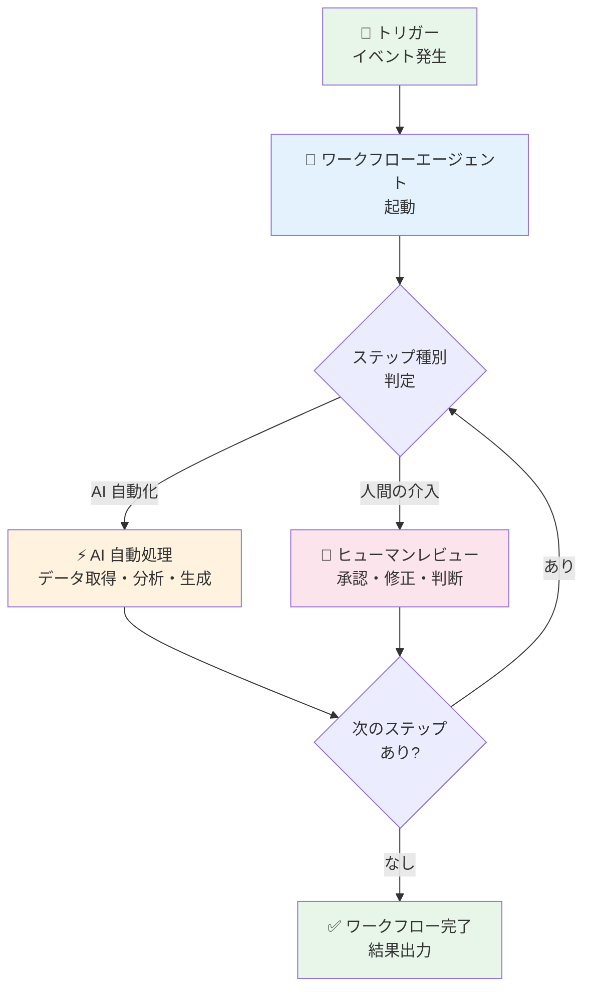

# Gemini Enterprise: Workflow Agents (GA with allowlist)

**リリース日**: 2026-06-18

**サービス**: Gemini Enterprise

**機能**: Workflow Agents (ワークフローエージェント)

**ステータス**: GA with allowlist

📊 [このアップデートのインフォグラフィックを見る](https://takech9203.github.io/google-cloud-news-summary/20260618-gemini-enterprise-workflow-agents-ga.html)

## 概要

Gemini Enterprise に「Workflow Agents (ワークフローエージェント)」機能が GA with allowlist として追加された。この機能により、Gemini Enterprise Web アプリ上でワークフローエージェントの作成、インポート、更新、利用が可能になる。

ワークフローエージェントは、設定されたトリガーに基づいて一連のステップやアクションを実行するよう設計されたエージェントである。AI による自動化と人間の介入を組み合わせた処理フローを構築でき、業務プロセスの自動化に活用できる。

この機能は GA with allowlist のステータスであり、利用するには Google アカウントマネージャーに連絡して Google Cloud プロジェクトを許可リストに追加してもらう必要がある。その後、Gemini Enterprise 管理者が Web アプリの機能管理設定で「Enable agent designer」トグルを有効にする必要がある。

**アップデート前の課題**

- Gemini Enterprise の Agent Designer では、単一ステップエージェントやマルチステップエージェント (サブエージェント構成) のみが利用可能で、トリガーベースのワークフロー実行は対応していなかった
- 業務プロセスの自動化において、AI 自動化と人間による承認・介入を組み合わせたフローを構築するには、外部のワークフロー自動化ツールとの連携が必要だった
- スケジュール実行は可能だったが、特定のイベントや条件に基づくトリガー駆動型のエージェント実行は実現できなかった

**アップデート後の改善**

- 設定されたトリガーに基づいてワークフローエージェントが自動的に起動し、一連のステップを順次実行できるようになった
- AI による自動処理と人間の介入 (承認、レビュー) を同一ワークフロー内で柔軟に組み合わせることが可能になった
- ワークフローエージェントの作成・インポート・更新が Gemini Enterprise Web アプリ内で完結するようになった

## アーキテクチャ図

ワークフローエージェントはトリガーにより起動し、AI 自動化ステップと人間の介入ステップを交互に実行しながらワークフロー全体を完了させる。

## サービスアップデートの詳細

### 主要機能

1. **トリガーベースの実行**
   - 設定されたトリガー条件に基づいてワークフローエージェントが自動起動する
   - 従来のスケジュール実行に加え、イベント駆動型の実行が可能

2. **AI 自動化と人間の介入のミックス**
   - ワークフロー内の各ステップを AI 自動処理または人間の介入として定義可能
   - 人間が必要な判断・承認を挟みながら、全体のプロセスは自動で進行する

3. **ワークフローエージェントの作成・インポート・更新**
   - Gemini Enterprise Web アプリ内でワークフローエージェントを新規作成可能
   - 外部で作成したワークフローエージェントのインポートに対応
   - 既存のワークフローエージェントの設定更新が可能

4. **Agent Designer との統合**
   - ノーコード・ローコードの Agent Designer プラットフォーム上でワークフローエージェントを構築
   - ビジュアルフローキャンバスによるワークフローの視覚的編集
   - チャットペインを使った自然言語によるエージェント構成の調整

## 技術仕様

### 利用要件

| 項目 | 詳細 |
|------|------|
| ステータス | GA with allowlist |
| 利用条件 | Google アカウントマネージャーへの連絡が必要 |
| 管理者設定 | 「Enable agent designer」トグルの有効化が必要 |
| 設定場所 | Web アプリ機能管理設定 (End user features control) |
| 対応エディション | Gemini Enterprise (各エディション) |

### Agent Designer のコンポーネント

| コンポーネント | 説明 |
|------|------|
| Chat ペイン | 自然言語でエージェントを構築・調整する会話型インターフェース |
| Flow タブ | エージェントのワークフローと制御ロジックのビジュアル表現 |
| Schedule タブ | エージェントの実行スケジュール設定 |
| Preview タブ | エージェントのライブテスト環境 |

## 設定方法

### 前提条件

1. Gemini Enterprise のライセンスを保有していること
2. Google Cloud プロジェクトが許可リストに追加されていること (Google アカウントマネージャーに連絡して追加を依頼)
3. Gemini Enterprise Admin ロールを持つ管理者がいること

### 手順

#### ステップ 1: 許可リストへの追加依頼

Google アカウントマネージャーに連絡し、Google Cloud プロジェクトを Workflow Agents の許可リストに追加してもらう。

#### ステップ 2: Agent Designer の有効化

1. Gemini Enterprise Web アプリに管理者としてログイン
2. 機能管理設定ページ (End user features control) に移動
3. 「Enable agent designer」トグルをオンに設定
4. 設定を保存

#### ステップ 3: ワークフローエージェントの作成

1. Gemini Enterprise Web アプリのナビゲーションメニューから「+ Create agent」をクリック
2. Agent Designer でワークフローエージェントのタイプを選択
3. トリガー条件、各ステップ (AI 自動化 / 人間の介入) を設定
4. Preview タブでテストし、「Create」をクリックして公開

## メリット

### ビジネス面

- **業務プロセスの自動化促進**: 定型的な業務フローを AI と人間の協調作業として自動化でき、生産性が向上する
- **コンプライアンス対応**: 人間の承認ステップを必須ポイントとして組み込むことで、ガバナンス要件を満たしながら自動化を実現
- **ノーコードでの構築**: 技術者でない業務担当者でも、自然言語やビジュアルキャンバスでワークフローを構築可能

### 技術面

- **トリガー駆動型アーキテクチャ**: イベントベースのエージェント起動により、リアクティブな自動化パイプラインを構築可能
- **Agent Designer との統合**: 既存の Agent Designer エコシステム (データソース接続、サブエージェント構成) をワークフローエージェントでも活用可能
- **インポート・エクスポート対応**: 外部で開発したワークフローエージェントの取り込みが可能で、既存資産の再利用ができる

## デメリット・制約事項

### 制限事項

- GA with allowlist のため、すべての組織がすぐに利用できるわけではない (アカウントマネージャーへの連絡が必要)
- 管理者による「Enable agent designer」の有効化が必須であり、個別ユーザーが自律的に開始することはできない
- ワークフローエージェントの具体的なトリガー種別や利用可能なアクションの詳細は、許可リスト追加後にドキュメントで確認が必要

### 考慮すべき点

- 人間の介入ステップではレスポンス待ちが発生するため、ワークフロー全体の完了時間は人間の応答速度に依存する
- 機密データを扱うワークフローでは、各ステップでのデータアクセス権限を適切に設計する必要がある
- Agent Designer のスケジュール実行では 14 日ごとに認証の更新が必要という既知の制限があり、ワークフローエージェントでも同様の制約がある可能性を確認すべき

## ユースケース

### ユースケース 1: 経費精算承認ワークフロー

**シナリオ**: 従業員が経費精算を提出した際に、AI が自動でレシート内容を確認・分類し、規定額以上の場合は上長の承認を求めるワークフロー。

**効果**: 手動での経費確認作業を削減しつつ、高額支出には人間による承認を維持することでコンプライアンスを確保。

### ユースケース 2: カスタマーサポートエスカレーション

**シナリオ**: 顧客からの問い合わせに対し、AI が一次回答を生成。回答の信頼度が閾値を下回る場合や顧客が不満を示した場合に人間のサポート担当者にエスカレーションするワークフロー。

**効果**: 定型的な問い合わせは AI が即座に対応し、複雑なケースのみ人間が介入することで、対応速度と品質の両立を実現。

### ユースケース 3: コンテンツ公開レビューフロー

**シナリオ**: マーケティングコンテンツの作成をトリガーに、AI が自動でブランドガイドライン準拠チェック・SEO 最適化を行い、最終承認を担当者に求めるワークフロー。

**効果**: コンテンツ品質チェックの大部分を自動化しつつ、最終判断は人間が行うことで品質とスピードを両立。

## 料金

Gemini Enterprise の料金体系に準拠する。

| エディション | 月額料金 (1 シートあたり) |
|--------|-----------------|
| Business | $21 USD~ |
| Standard | $30 USD~ |
| Plus | $30 USD~ (上位機能含む) |

ワークフローエージェント機能固有の追加料金については、Google アカウントマネージャーに確認が必要。

詳細は [Gemini Enterprise 料金ページ](https://cloud.google.com/gemini-enterprise) を参照。

## 利用可能リージョン

Gemini Enterprise の基本機能は US/EU マルチリージョンおよびインカントリーリージョン (CA, IN) で利用可能。ワークフローエージェント機能の具体的なリージョン対応については、許可リスト追加後に確認が必要。

## 関連サービス・機能

- **Gemini Enterprise Agent Designer**: ワークフローエージェントを構築するためのノーコード・ローコードプラットフォーム。フローキャンバスでの視覚的編集や自然言語による構成が可能
- **Gemini Enterprise Agent Platform**: カスタムエージェントの構築・スケール・ガバナンスを提供するプラットフォーム。Agent Registry によるエージェント管理を含む
- **Agent Development Kit (ADK)**: より高度なカスタムエージェントを開発するためのフルコードツールキット
- **Agent2Agent (A2A) Protocol**: 異なるプラットフォーム間でエージェントが相互通信するためのオープン標準プロトコル

## 参考リンク

- 📊 [インフォグラフィック](https://takech9203.github.io/google-cloud-news-summary/20260618-gemini-enterprise-workflow-agents-ga.html)
- [公式リリースノート](https://docs.cloud.google.com/release-notes#June_18_2026)
- [Workflow agents ドキュメント](https://docs.cloud.google.com/gemini/enterprise/docs/agent-designer-eap/workflow-agents)
- [Manage web app features](https://docs.cloud.google.com/gemini/enterprise/docs/manage-web-app-features)
- [Agent Designer 概要](https://docs.cloud.google.com/gemini/enterprise/docs/agent-designer)
- [Gemini Enterprise エディション比較](https://docs.cloud.google.com/gemini/enterprise/docs/editions)

## まとめ

Gemini Enterprise のワークフローエージェント機能は、トリガーベースで AI 自動化と人間の介入を組み合わせた業務プロセス自動化を実現する重要なアップデートである。GA with allowlist であるため、利用を希望する組織は早期に Google アカウントマネージャーに連絡し、許可リストへの追加を依頼することを推奨する。既に Agent Designer を活用している組織にとっては、エージェントの活用範囲をイベント駆動型のワークフロー自動化に拡大する好機となる。

---

**タグ**: #GeminiEnterprise #WorkflowAgents #AgentDesigner #AIAutomation #NoCode #GA
