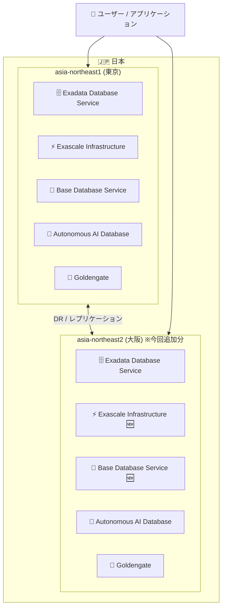

# Oracle Database@Google Cloud: asia-northeast2 (大阪) リージョン追加 - Exascale / Base Database Service

**リリース日**: 2026-06-18

**サービス**: Oracle Database@Google Cloud

**機能**: Exadata Database Service on Exascale Infrastructure および Base Database Service における asia-northeast2 (大阪) リージョンサポート

**ステータス**: GA (一般提供)

📊 [このアップデートのインフォグラフィックを見る](https://takech9203.github.io/google-cloud-news-summary/20260618-oracle-database-google-cloud-asia-northeast2.html)

## 概要

Oracle Database@Google Cloud が、Exadata Database Service on Exascale Infrastructure および Base Database Service において `asia-northeast2` (大阪、日本) リージョンのサポートを追加した。これにより、日本国内で東京 (`asia-northeast1`) と大阪 (`asia-northeast2`) の 2 リージョンで Exascale および Base Database Service を利用できるようになった。

Oracle Database@Google Cloud は、Google Cloud のデータセンター内で Oracle Cloud Infrastructure (OCI) の Exadata ハードウェア上に Oracle データベースサービスをデプロイできるパートナーシップサービスである。今回のリージョン追加により、日本国内での災害復旧 (DR) 構成や、西日本地域のユーザーへの低レイテンシアクセスが可能になる。

なお、大阪リージョンでは既に Exadata Database Service (2026年2月4日) および Autonomous Database Service (2026年2月24日) がサポートされており、今回の追加によって Oracle Database@Google Cloud の主要サービスすべてが大阪リージョンで利用可能になった。

**アップデート前の課題**

- Exascale Infrastructure および Base Database Service は日本国内では東京 (`asia-northeast1`) のみで提供されていた
- 西日本地域のユーザーは東京リージョンへのアクセスが必要であり、レイテンシが課題となる場合があった
- 日本国内での地理的冗長構成 (DR) を Exascale / Base Database Service で構築できなかった

**アップデート後の改善**

- 大阪リージョンで Exascale VM Clusters、Exascale Storage Vaults、DB Systems を作成可能になった
- 東京と大阪の 2 リージョンを活用した地理的冗長構成が可能になった
- 西日本地域のユーザーに低レイテンシでサービスを提供できるようになった

## アーキテクチャ図



Oracle Database@Google Cloud の日本国内リージョン構成を示す。今回の追加により、Exascale Infrastructure と Base Database Service が大阪で利用可能になり、日本国内の全 5 サービスが東京・大阪の両方で利用できるようになった。

## サービスアップデートの詳細

### 主要機能

1. **Exadata Database Service on Exascale Infrastructure (大阪)**
   - Exascale VM Clusters の作成・管理が大阪リージョンで可能
   - Exascale Storage Vaults の作成・管理が大阪リージョンで可能
   - Google Cloud コンソール、gcloud CLI、API から操作可能

2. **Base Database Service (大阪)**
   - DB Systems の作成・管理が大阪リージョンで可能
   - Google Cloud コンソール、gcloud CLI、API から操作可能

3. **日本国内全サービス対応完了**
   - 東京: Exadata / Exascale / Base DB / Autonomous AI DB / Goldengate
   - 大阪: Exadata / Exascale / Base DB / Autonomous AI DB / Goldengate (全サービス対応)

## 技術仕様

### 大阪リージョンの対応状況

| サービス | asia-northeast2 対応 | 対応日 |
|----------|---------------------|--------|
| Exadata Database Service | 対応済み | 2026-02-04 |
| Exadata Database Service on Exascale Infrastructure | 対応済み | 2026-06-18 (今回) |
| Base Database Service | 対応済み | 2026-06-18 (今回) |
| Autonomous AI Database Service | 対応済み | 2026-02-24 |
| Goldengate | 対応済み | 対応済み |

### リソースのスコープ

| リソース種別 | スコープ | 備考 |
|-------------|---------|------|
| Autonomous AI Database | リージョナル | リージョン内の任意のゾーンで利用可能 |
| Exadata Infrastructure | ゾーナル | 同一ゾーン内に配置が必要 |
| Exascale VM Clusters | ゾーナル | ODB Network と同一リージョン・ゾーンに配置 |
| Exascale Storage Vaults | ゾーナル | Exascale VM Clusters と同一ゾーンに配置 |
| DB Systems | ゾーナル | ODB Network と同一リージョン・ゾーンに配置 |
| ODB Networks / Subnets | ゾーナル | 最初に作成する必要がある |

## 設定方法

### 前提条件

1. Oracle Database@Google Cloud のオーダーが完了していること
2. OCI アカウントとのリンクが完了していること
3. プロジェクトのネットワーク設定 (VPC) が完了していること

### 手順

#### ステップ 1: ODB Network の作成

大阪リージョン (`asia-northeast2`) で ODB Network を作成する。

```bash
# gcloud CLI を使用して ODB Network を作成
gcloud oracle-database odb-networks create ODB_NETWORK_NAME \
  --location=asia-northeast2 \
  --zone=asia-northeast2-a-r1 \
  --network=projects/PROJECT_ID/global/networks/VPC_NETWORK_NAME \
  --cidr=CIDR_RANGE
```

#### ステップ 2: Exascale VM Cluster または DB System の作成

ODB Network が作成されたら、同じリージョン・ゾーンで Exascale VM Cluster または DB System を作成する。Google Cloud コンソールまたは gcloud CLI から操作可能。

## メリット

### ビジネス面

- **災害復旧 (DR) の強化**: 東京と大阪の 2 リージョンを活用し、日本国内での地理的冗長構成が実現可能
- **データレジデンシー要件への対応**: 日本国内にデータを保持しながら、複数リージョンでの可用性を確保
- **西日本地域への低レイテンシ提供**: 大阪近郊のユーザーやシステムに対して、より低いレイテンシでサービスを提供

### 技術面

- **Exascale のスケーラビリティ**: Exascale Infrastructure の柔軟なスケーリング機能を大阪で利用可能
- **Base Database Service の柔軟性**: 小規模から中規模のワークロードに適した DB Systems を大阪にデプロイ可能
- **統合管理**: Google Cloud コンソールから東京・大阪の両リージョンのリソースを一元管理

## デメリット・制約事項

### 制限事項

- ゾーナルリソース (Exascale VM Clusters, DB Systems) は ODB Network と同一のリージョン・ゾーンに作成する必要がある
- データベースリソースはプロジェクト内で一意の名前が必要
- Cross-region のレプリケーションには Oracle Data Guard や Goldengate の別途設定が必要

### 考慮すべき点

- 大阪リージョンのゾーンは `asia-northeast2-a-r1` のみ (現時点)
- Exascale Infrastructure は Exadata Database Service とは別のサービスであり、それぞれ個別にプロビジョニングが必要
- 料金は Oracle の従量課金モデルまたはプライベートオファーに基づく

## ユースケース

### ユースケース 1: 日本国内での災害復旧構成

**シナリオ**: 金融機関が日本国内のデータレジデンシー要件を満たしつつ、地理的に分散した災害復旧構成を構築したい。

**効果**: 東京 (本番) と大阪 (DR) の 2 リージョン構成により、関東圏での大規模災害時にも大阪リージョンでサービス継続が可能。日本国内にデータを保持したまま高可用性を実現。

### ユースケース 2: 西日本地域のエンタープライズワークロード

**シナリオ**: 関西圏に本社を置く企業が、Oracle Database をクラウドに移行したいが、東京リージョンではレイテンシが気になる。

**効果**: 大阪リージョンに Base Database Service をデプロイすることで、西日本地域からの低レイテンシアクセスを実現。既存の Oracle ライセンスやスキルセットを活かしながら、Google Cloud のインフラ上で運用可能。

### ユースケース 3: Exascale による柔軟なスケーリング

**シナリオ**: 繁忙期に応じてデータベースリソースを柔軟にスケールさせたい。

**効果**: Exascale Infrastructure は従来の固定的な Exadata Infrastructure と異なり、ストレージとコンピュートを柔軟にスケール可能。大阪リージョンでもこの柔軟性を活用できるようになった。

## 料金

Oracle Database@Google Cloud の料金は、Oracle が設定するリソース消費量に基づく課金モデルとなっている。

| 課金モデル | 概要 |
|-----------|------|
| Public (Pay-As-You-Go) | 標準のオンデマンド料金。OCPU 時間やストレージ GB 単位で課金 |
| Private (プライベートオファー) | Oracle 営業チームとの個別交渉による割引料金。コミット利用割引 (CUD) を含む場合あり |

料金は Google Cloud の請求書に統合されて表示される。詳細な料金情報は [Oracle Database@Google Cloud pricing](https://www.oracle.com/cloud/google/oracle-database-at-google-cloud/pricing/) を参照。

## 利用可能リージョン

Oracle Database@Google Cloud の Exascale Infrastructure および Base Database Service が利用可能なリージョン:

| リージョン | ロケーション |
|-----------|-------------|
| asia-northeast1 | 東京、日本 |
| asia-northeast2 | 大阪、日本 (今回追加) |
| asia-south1 | ムンバイ、インド |
| asia-south2 | デリー、インド |
| australia-southeast2 | メルボルン、オーストラリア |
| northamerica-northeast1 | モントリオール、カナダ |
| us-central1 | アイオワ、米国 |
| us-east4 | 北バージニア、米国 |
| us-west3 | ソルトレイクシティ、米国 |
| europe-west2 | ロンドン、英国 |
| europe-west3 | フランクフルト、ドイツ |
| europe-west8 | ミラノ、イタリア |

## 関連サービス・機能

- **Exadata Database Service**: 高性能な Oracle Database 専用インフラストラクチャ。大阪リージョンでは 2026年2月から利用可能
- **Autonomous AI Database Service**: 自動チューニング・自動パッチ適用を備えた自律型データベース。大阪リージョンでは 2026年2月から利用可能
- **Goldengate**: データレプリケーション・変換サービス。東京-大阪間のデータ同期に活用可能
- **ODB Network**: Oracle Database@Google Cloud のネットワーク接続を管理するサービス
- **VPC Service Controls**: Oracle Database@Google Cloud リソースへのアクセス制御を強化 (2026年3月 GA)
- **Database Center**: Oracle Database@Google Cloud リソースのフリート全体のヘルスモニタリング (2026年4月 GA)

## 参考リンク

- 📊 [インフォグラフィック](https://takech9203.github.io/google-cloud-news-summary/20260618-oracle-database-google-cloud-asia-northeast2.html)
- [公式リリースノート](https://docs.cloud.google.com/release-notes#June_18_2026)
- [Oracle Database@Google Cloud リリースノート](https://docs.cloud.google.com/oracle/database/docs/release-notes)
- [サポートされるリージョンとゾーン](https://docs.cloud.google.com/oracle/database/docs/regions-and-zones)
- [Oracle Database@Google Cloud 概要](https://docs.cloud.google.com/oracle/database/docs/overview)
- [料金ページ](https://www.oracle.com/cloud/google/oracle-database-at-google-cloud/pricing/)
- [購入とオンボーディング](https://docs.cloud.google.com/oracle/database/docs/purchase-and-billing)

## まとめ

Oracle Database@Google Cloud が Exadata Database Service on Exascale Infrastructure および Base Database Service で大阪リージョン (`asia-northeast2`) をサポートしたことにより、日本国内で全 5 サービス (Exadata / Exascale / Base DB / Autonomous AI DB / Goldengate) が東京・大阪の両方で利用可能になった。日本国内でのデータレジデンシー要件を満たしつつ地理的冗長構成を構築できるため、金融・公共・エンタープライズ領域のユーザーにとって重要なアップデートである。

---

**タグ**: #OracleDatabase #GoogleCloud #asia-northeast2 #大阪 #Exascale #BaseDatabase #リージョン拡張 #DR #日本
