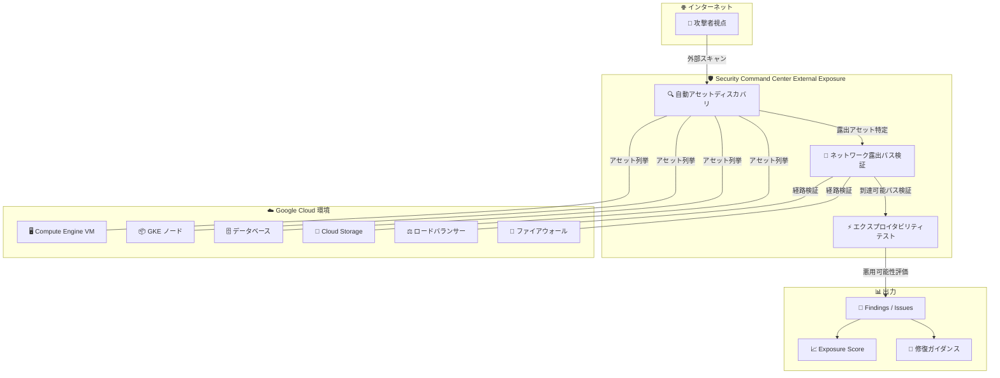

# Security Command Center: External Exposure (Preview)

**リリース日**: 2026-06-18

**サービス**: Security Command Center

**機能**: External Exposure

**ステータス**: Preview (Security Command Center Premium ティア)

📊 [このアップデートのインフォグラフィックを見る](https://takech9203.github.io/google-cloud-news-summary/20260618-security-command-center-external-exposure-preview.html)

## 概要

Security Command Center External Exposure が Security Command Center Premium ティアで Preview として利用可能になった。本サービスは、自動化されたアセットディスカバリ、Google Cloud ネットワーク露出パス検証、アクティブなエクスプロイタビリティテストの 3 つの柱を通じて、組織の外部攻撃対象面 (External Attack Surface) の管理と縮小を支援する。

External Exposure は、従来の Attack Path Simulation や Mandiant Attack Surface Management の知見を統合し、Google Cloud 環境に特化した外部露出リスクの包括的な可視化と評価を提供する新機能である。インターネットから到達可能なリソースを自動的に検出し、ネットワーク経路の検証と実際の悪用可能性テストを組み合わせることで、真に対処すべきリスクの優先順位付けを実現する。

対象ユーザーは、クラウドセキュリティチーム、SOC アナリスト、インフラストラクチャ管理者であり、特にインターネットに露出した Google Cloud リソースのリスク管理を効率化したい組織に適している。

**アップデート前の課題**

- 外部攻撃対象面の把握には、手動でのアセット棚卸しやサードパーティツールの併用が必要だった
- ネットワーク露出パスの検証は静的なファイアウォールルールの確認に留まり、実際の到達可能性の動的検証が困難だった
- 脆弱性の悪用可能性の判断には、CVE 情報と環境固有のネットワーク構成を個別に分析する必要があった
- Attack Path Simulation は高価値リソースへの攻撃経路を可視化するが、外部露出の初期段階に特化した機能ではなかった

**アップデート後の改善**

- Google Cloud 環境内のインターネット露出アセットが自動的に継続的に検出される
- VPC ファイアウォール、ロードバランサー、NAT 設定等を考慮したネットワーク露出パスの自動検証が可能になった
- 検出された露出に対するアクティブなエクスプロイタビリティテストにより、実際に悪用可能なリスクの優先度判定が可能になった
- 攻撃者視点での外部露出リスクの一元管理が Security Command Center 内で完結する

## アーキテクチャ図

External Exposure の検出フローは、アセットディスカバリでインターネットから到達可能なリソースを特定し、ネットワーク露出パス検証で実際の到達経路を確認し、エクスプロイタビリティテストで悪用可能性を評価する 3 段階で構成される。

## サービスアップデートの詳細

### 主要機能

1. **自動アセットディスカバリ (Automated Asset Discovery)**
   - Google Cloud 環境内のインターネットに露出したアセットを自動的かつ継続的に検出
   - Compute Engine VM、GKE ノード、データベース、Cloud Storage バケット、Cloud Run 関数などが検出対象
   - パブリック IP アドレス、オープンポート、外部向けサービスを包括的に列挙

2. **Google Cloud ネットワーク露出パス検証 (Network Exposure Path Validation)**
   - VPC ファイアウォールルール、Cloud NAT、ロードバランサー設定を考慮した実際のネットワーク到達可能性を検証
   - 「Reachable (完全に到達可能)」と「Partially reachable (一部の IP 範囲から到達可能)」の 2 段階で分類
   - プライベートクラスタであってもロードバランサー経由や Authorized Networks 設定による外部露出を検出

3. **アクティブエクスプロイタビリティテスト (Active Exploitability Testing)**
   - Mandiant の脅威インテリジェンスに基づく安全なペイロードやスクリプトを使用して、脆弱性の実際の悪用可能性を検証
   - CVE データ、CVSS スコア、Mandiant による悪用活動の評価を組み合わせた実践的なリスク判定
   - 既知の攻撃手法の適用可否を環境固有の構成に基づいて評価

## 技術仕様

### 露出分類

| 分類 | 説明 |
|------|------|
| Reachable | リソースがパブリックインターネットから完全にアクセス可能 |
| Partially reachable | 一部のパブリック IP 範囲からのみ到達可能 (他の範囲はブロック) |

### 検出対象リソース

| リソースタイプ | 検出内容 |
|---------------|----------|
| Compute Engine VM | パブリック IP、オープンポート、実行中サービス |
| GKE クラスタ/ワークロード | 外部露出されたノード、ロードバランサー経由のアクセス |
| データベース | 外部からアクセス可能なデータベースインスタンス |
| Cloud Storage | パブリックアクセス可能なバケット |
| Cloud Run Functions | 外部から呼び出し可能な関数 |

### 前提条件

- Security Command Center Premium ティアの有効化 (組織レベル)
- 適切な IAM 権限の付与

## メリット

### ビジネス面

- **攻撃対象面の可視化**: 組織のインターネット露出リスクを一元的に把握し、経営層への報告が容易になる
- **リスク対応の優先順位付け**: 実際に悪用可能な露出に集中することで、セキュリティ投資の効率を向上
- **コンプライアンス対応**: 外部露出の継続的モニタリングにより、規制要件への準拠を支援

### 技術面

- **自動化による効率化**: 手動でのアセット棚卸しやネットワーク経路分析が不要になる
- **動的なリスク評価**: 環境変更に追従した継続的な露出評価を実現
- **統合的なセキュリティ管理**: Security Command Center 内で外部露出リスクから脆弱性管理まで一貫したワークフローを提供

## デメリット・制約事項

### 制限事項

- Preview 段階のため、本番環境での利用には注意が必要
- Security Command Center Premium ティアが必須 (Standard ティアでは利用不可)
- 組織レベルでの Security Command Center アクティベーションが必要

### 考慮すべき点

- アクティブなエクスプロイタビリティテストは安全なペイロードを使用するが、テスト実行のタイミングと影響範囲を事前に確認することを推奨
- 内部の悪意あるアクターやゼロデイ脆弱性は評価対象外
- Preview 機能のため、GA までに仕様変更の可能性がある

## ユースケース

### ユースケース 1: クラウド移行後の外部露出監査

**シナリオ**: オンプレミスから Google Cloud への大規模移行後、意図せずインターネットに露出したリソースを特定したい。移行作業中に設定ミスで公開状態になったデータベースや VM を早期に発見する必要がある。

**効果**: 移行直後の設定ミスによる外部露出を自動的に検出し、修復ガイダンスに基づいて迅速に対応できる。手動での全リソースチェックが不要になり、移行プロジェクトのセキュリティ品質を担保する。

### ユースケース 2: 継続的なアタックサーフェス管理

**シナリオ**: 複数のプロジェクトを持つ大規模組織で、開発チームが日常的にリソースを作成・変更する中、外部露出リスクを継続的に監視したい。

**効果**: 新規リソースの作成やネットワーク設定変更時に自動的に外部露出を検出し、実際に悪用可能なリスクのみをアラートすることで、セキュリティチームのアラート疲れを軽減しつつ重要なリスクを見逃さない。

## 料金

External Exposure は Security Command Center Premium ティアの一部として提供される。Premium ティアは以下の料金体系で利用可能:

- **Pay-as-you-go**: 使用量に基づく従量課金
- **サブスクリプション**: 1 年または複数年の固定契約

詳細な料金については [Security Command Center 料金ページ](https://cloud.google.com/security-command-center/pricing) を参照。

## 関連サービス・機能

- **Mandiant Attack Surface Management**: 外部攻撃対象面のスキャンと脆弱性検出を提供する Mandiant のサービス。External Exposure は Google Cloud 環境に特化した同等機能を Premium ティアで提供
- **Security Command Center Risk Engine**: 攻撃パスシミュレーションと攻撃露出スコアの計算エンジン。External Exposure の結果はリスクエンジンと連携
- **Cloud Armor**: DDoS 防御と WAF 機能。External Exposure で検出された露出に対する防御策として活用可能
- **VPC Service Controls**: サービス境界の設定による外部アクセス制御。External Exposure の検出結果に基づくアクセス制御の強化に活用
- **Security Health Analytics**: セキュリティ構成の誤りを検出。External Exposure と連携して、外部露出に関連する設定ミスを特定

## 参考リンク

- 📊 [インフォグラフィック](https://takech9203.github.io/google-cloud-news-summary/20260618-security-command-center-external-exposure-preview.html)
- [公式リリースノート](https://docs.cloud.google.com/release-notes#June_18_2026)
- [Detect exposed resources ドキュメント](https://docs.cloud.google.com/security-command-center/docs/detect-external-exposure)
- [Security Command Center 概要](https://docs.cloud.google.com/security-command-center/docs/concepts-security-command-center-overview)
- [Attack Exposure の学習](https://docs.cloud.google.com/security-command-center/docs/attack-exposure-learn)
- [Security Command Center 料金](https://cloud.google.com/security-command-center/pricing)
- [サービスティア比較](https://docs.cloud.google.com/security-command-center/docs/service-tiers)

## まとめ

Security Command Center External Exposure は、Google Cloud 環境の外部攻撃対象面を自動的に検出・検証・評価する包括的な機能である。Premium ティアユーザーは、Preview 段階でこの機能を有効化し、自組織のインターネット露出状況を把握することを推奨する。特にマルチプロジェクト環境や頻繁なインフラ変更がある組織では、早期導入による外部露出リスクの継続的なモニタリングが有効である。

---

**タグ**: #SecurityCommandCenter #ExternalExposure #AttackSurface #Preview #Premium #セキュリティ #脆弱性管理
