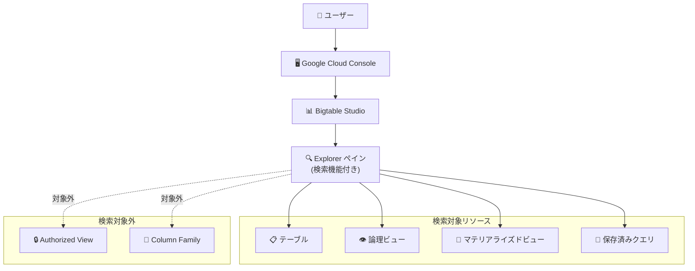

# Bigtable: Studio Explorer にリソース検索機能を追加

**リリース日**: 2026-06-19

**サービス**: Cloud Bigtable

**機能**: Bigtable Studio Explorer 検索機能

**ステータス**: GA (一般提供)

📊 [このアップデートのインフォグラフィックを見る](https://takech9203.github.io/google-cloud-news-summary/20260619-bigtable-studio-explorer-search.html)

## 概要

Bigtable Studio の Explorer ペインに、リソースを横断的に検索できる機能が追加された。これにより、Google Cloud コンソール上で Bigtable のテーブル、ビュー、マテリアライズドビュー、保存済みクエリなどのリソースを名前やキーワードで素早く見つけることが可能になった。

この検索機能は、多数のテーブルやビューを管理するユーザーにとって、目的のリソースへの到達時間を大幅に短縮する。ただし、現時点では Authorized View (認可ビュー) と Column Family (カラムファミリー) は検索対象外となっている。

**アップデート前の課題**

- Explorer ペインではリソースがリスト表示されるだけで、多数のテーブルがある場合に目的のリソースを見つけるのに時間がかかっていた
- 特定のリソースを探すにはリストを手動でスクロールする必要があった
- 大規模な Bigtable インスタンスでは、数十から数百のテーブルが存在する場合にリソースの発見が困難だった

**アップデート後の改善**

- Explorer ペイン内で検索キーワードを入力してリソースを絞り込めるようになった
- テーブル、ビュー (論理ビュー)、マテリアライズドビュー、保存済みクエリなど主要なリソースを横断的に検索可能
- 大量のリソースを持つインスタンスでも、目的のリソースに素早くアクセスできる

## アーキテクチャ図

Bigtable Studio Explorer の検索機能の対象範囲を示す図。テーブル、ビュー、マテリアライズドビュー、保存済みクエリは検索可能だが、Authorized View と Column Family は現時点では検索対象外である。

## サービスアップデートの詳細

### 主要機能

1. **Explorer ペイン内リソース検索**
   - Bigtable Studio の Explorer ペインで検索キーワードを入力してリソースを絞り込む機能
   - インスタンス内の全テーブル、ビュー、クエリを横断的に検索可能

2. **検索対象リソースタイプ**
   - テーブル: Bigtable のメインデータストア
   - 論理ビュー (Logical View): 保存されたクエリをテーブルのように参照可能
   - マテリアライズドビュー (Continuous Materialized View): 事前計算された集約結果
   - 保存済みクエリ (Saved Queries): SQL スクリプトの保存・管理

3. **現在の制限事項**
   - Authorized View (認可ビュー): テーブルのサブセットに対するアクセス制御を定義するビューは検索対象外
   - Column Family (カラムファミリー): テーブル内のカラムグループは検索対象外

## 技術仕様

### 検索対象リソースと操作一覧

| リソースタイプ | 検索対象 | Explorer での主な操作 |
|------|------|------|
| テーブル | 対象 | 作成、バックアップ、削除保護、編集、削除、サンプルクエリ表示、Cloud Storage エクスポート |
| 論理ビュー | 対象 | クエリエディタで定義を表示 |
| マテリアライズドビュー | 対象 | クエリエディタで定義を表示、削除保護の有効化/無効化 |
| 保存済みクエリ | 対象 | SQL スクリプトの管理・実行 |
| Authorized View | 対象外 | クエリビルダで開く、アクセス権付与、削除 |
| Column Family | 対象外 | テーブルへのカラムファミリー追加、GC ポリシー編集 |

### 必要な IAM ロール

Explorer を使用するには、最低限以下のロールが必要:

| ロール | 説明 |
|------|------|
| `roles/bigtable.reader` | テーブルの読み取り、Explorer での参照 |

## 設定方法

### 前提条件

1. Google Cloud プロジェクトに Bigtable インスタンスが作成済みであること
2. ユーザーに `roles/bigtable.reader` 以上の IAM ロールが付与されていること

### 手順

#### ステップ 1: Bigtable Studio にアクセス

1. Google Cloud コンソールを開く
2. Bigtable インスタンスページに移動
3. インスタンスを選択
4. ナビゲーションメニューから「Bigtable Studio」をクリック

#### ステップ 2: Explorer で検索を実行

1. Explorer ペインが表示される
2. 検索バーにリソース名やキーワードを入力
3. 該当するリソースが絞り込まれて表示される

## メリット

### ビジネス面

- **運用効率の向上**: 大規模環境でのリソース発見時間を短縮し、オペレーション効率が向上
- **開発者の生産性改善**: データ探索やデバッグ時に目的のテーブルやビューへ素早くアクセス可能

### 技術面

- **リソースの可視性向上**: テーブル、ビュー、保存済みクエリを一元的に検索できる
- **コンソール完結のワークフロー**: CLI や API を使わずにコンソール上でリソースを発見・操作可能

## デメリット・制約事項

### 制限事項

- Authorized View は検索対象外のため、認可ビューを多用する環境では手動で探す必要がある
- Column Family も検索対象外のため、特定のカラムファミリーを持つテーブルをカラムファミリー名で検索することはできない

### 考慮すべき点

- 検索機能はコンソール UI の機能であり、API やプログラマティックなアクセスには影響しない
- カラムファミリーを検索したい場合は、Knowledge Catalog との連携を検討する (Knowledge Catalog ではカラムファミリー名による検索が可能)

## ユースケース

### ユースケース 1: 大規模環境でのテーブル検索

**シナリオ**: 100 以上のテーブルを持つ Bigtable インスタンスで、特定のテーブルをすぐに見つけたい場合

**効果**: 検索バーにテーブル名の一部を入力するだけで即座にフィルタリングされ、スクロールして探す手間が不要になる

### ユースケース 2: マテリアライズドビューの管理

**シナリオ**: 複数のマテリアライズドビューが定義されており、特定のビューの定義を確認したい場合

**効果**: ビュー名で検索してすぐに該当ビューを発見し、クエリエディタでその定義を確認できる

### ユースケース 3: 保存済みクエリの再利用

**シナリオ**: 過去に保存した SQL クエリを実行したいが、名前を正確に覚えていない場合

**効果**: キーワードで検索して目的のクエリを発見し、すぐに実行できる

## 料金

Bigtable Studio Explorer の検索機能自体には追加料金は発生しない。Bigtable の料金は従来通りコンピュート容量、ストレージ、ネットワーク使用量に基づく。

### 料金例 (参考: Bigtable の基本料金)

| 項目 | 月額料金 (概算) |
|--------|-----------------|
| Enterprise Edition ノード | $0.65/ノード/時間〜 |
| Enterprise Plus Edition ノード | $0.85/ノード/時間〜 |
| SSD ストレージ | $0.17/GB/月〜 |
| HDD ストレージ | $0.026/GB/月〜 |

## 利用可能リージョン

Bigtable Studio は Google Cloud コンソールの機能であり、Bigtable が利用可能なすべてのリージョンのインスタンスに対して使用可能。

## 関連サービス・機能

- **Bigtable Studio Query Builder**: Explorer と統合されたインタラクティブなクエリ構築ツール。検索で見つけたテーブルをそのままクエリ可能
- **Bigtable Studio Query Editor**: SQL によるデータ問い合わせ機能。GoogleSQL for Bigtable をサポート
- **Knowledge Catalog (旧 Data Catalog)**: Bigtable メタデータの検索・管理。Explorer の検索対象外であるカラムファミリー名での検索も可能
- **Cloud Monitoring**: Bigtable のシステムインサイト表示。Explorer から直接モニタリング画面にアクセス可能

## 参考リンク

- 📊 [インフォグラフィック](https://takech9203.github.io/google-cloud-news-summary/20260619-bigtable-studio-explorer-search.html)
- [公式リリースノート](https://docs.cloud.google.com/release-notes#June_19_2026)
- [Manage your data using Bigtable Studio](https://docs.cloud.google.com/bigtable/docs/manage-data-using-console)
- [Build queries in the console](https://docs.cloud.google.com/bigtable/docs/query-builder)
- [料金ページ](https://cloud.google.com/bigtable/pricing)

## まとめ

Bigtable Studio Explorer に検索機能が追加されたことで、大規模なインスタンスでもリソースの発見が容易になった。Authorized View と Column Family を除く全リソースが検索対象であり、日常的な Bigtable 管理・開発ワークフローの効率化に貢献する。大量のテーブルやビューを管理している環境では、すぐに活用することを推奨する。

---

**タグ**: #Bigtable #BigtableStudio #Explorer #検索機能 #コンソール #GA #データ管理
