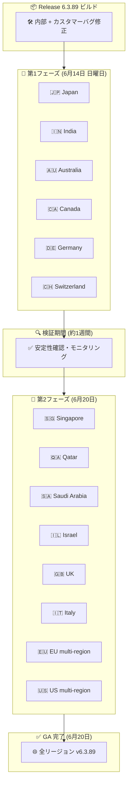

# Google SecOps SOAR: Release 6.3.89 全リージョン展開完了 (GA)

**リリース日**: 2026-06-20

**サービス**: Google Security Operations (SecOps) SOAR

**機能**: プラットフォームリリース 6.3.89 全リージョン展開完了

**ステータス**: GA (全リージョン利用可能)

📊 [このアップデートのインフォグラフィックを見る](https://takech9203.github.io/google-cloud-news-summary/20260620-google-secops-soar-release-6-3-89-ga.html)

## 概要

Google SecOps SOAR プラットフォームの Release 6.3.89 が2026年6月20日に全リージョンで利用可能 (GA) となりました。本リリースは6月14日に第1フェーズのリージョン (Japan, India, Australia, Canada, Germany, Switzerland) へのロールアウトが開始され、約1週間の検証期間を経て第2フェーズのリージョン (Singapore, Qatar, Saudi Arabia, Israel, UK, Italy, EU multi-region, US multi-region) への展開が完了したものです。

Release 6.3.89 は内部バグ修正およびカスタマー報告のバグ修正を含むメンテナンスリリースです。段階的ロールアウトプロセスにより、第1フェーズリージョンでの安定性が確認された後に残りのリージョンへ展開されることで、全リージョンのユーザーに安全かつ確実にアップデートが適用されています。

なお、翌6月21日には次のリリース Release 6.3.90 の第1フェーズリージョンへのロールアウトが開始されており、週次リリースサイクルが継続的に維持されています。

**アップデート前の課題**

- 第1フェーズリージョンのみに Release 6.3.89 が適用されており、第2フェーズリージョン (US, EU 等の主要リージョン) では Release 6.3.88 のままだった
- マルチリージョン運用環境でリージョン間のバージョン差異が存在していた
- 第2フェーズリージョンでは 6.3.89 で修正されたバグが未修正の状態だった

**アップデート後の改善**

- 全14リージョンで Release 6.3.89 が統一的に適用され、バージョンの一貫性が確保された
- 内部バグ修正およびカスタマー報告のバグ修正が全リージョンに反映された
- マルチリージョン運用環境でのバージョン差異が解消された

## アーキテクチャ図

Google SecOps SOAR Release 6.3.89 の段階的ロールアウトプロセスを示す図です。6月14日に第1フェーズの6リージョンへ展開され、約1週間の検証を経て6月20日に第2フェーズの8リージョンへ展開が完了し、全リージョンで GA となりました。

## サービスアップデートの詳細

### リリースタイムライン

1. **2026年6月14日**: 第1フェーズリージョンへのロールアウト開始
   - Japan, India, Australia, Canada, Germany, Switzerland の6リージョンに展開
   - 内部バグ修正およびカスタマー報告のバグ修正を含むリリース

2. **2026年6月14日 - 6月20日**: 検証期間
   - 第1フェーズリージョンでの安定性モニタリング
   - 問題が検出されなかったことを確認

3. **2026年6月20日**: 全リージョン展開完了 (GA)
   - Singapore, Qatar, Saudi Arabia, Israel, UK (London), Italy, EU (multi-region), US (multi-region) の8リージョンに展開完了
   - 全14リージョンで Release 6.3.89 が利用可能

### リリース内容

1. **内部バグ修正**
   - Google 内部で検出されたバグの修正
   - プラットフォームの安定性向上

2. **カスタマー報告バグ修正**
   - ユーザーから報告された問題の修正
   - プラットフォームの信頼性向上

## 技術仕様

### バージョン情報

| 項目 | 詳細 |
|------|------|
| リリースバージョン | 6.3.89 |
| 第1フェーズ開始日 | 2026-06-14 (日曜日) |
| 全リージョン GA | 2026-06-20 |
| リリースタイプ | メンテナンスリリース (バグ修正) |
| 前バージョン | 6.3.88 (2026-06-13 GA) |
| 次バージョン | 6.3.90 (2026-06-21 第1フェーズ開始) |

### 段階的ロールアウトのリージョン構成

| フェーズ | リージョン | 展開日 |
|---------|----------|--------|
| 第1フェーズ | Japan, India, Australia, Canada, Germany, Switzerland | 2026-06-14 |
| 第2フェーズ | Singapore, Qatar, Saudi Arabia, Israel, UK (London), Italy, EU (multi-region), US (multi-region) | 2026-06-20 |

### メンテナンスウィンドウ

| 項目 | 詳細 |
|------|------|
| 定期メンテナンス時間 | 日曜日 11:00 - 15:00 UTC |
| ダウンタイム | 通常なし (メンテナンスが必ずしもサービス停止を伴うわけではない) |
| 適用方式 | 自動適用 (ユーザー操作不要) |

## メリット

### ビジネス面

- **全リージョン統一バージョン**: 14リージョン全体で同一バージョンとなり、マルチリージョン運用の一貫性が確保される
- **カスタマー報告バグの解消**: ユーザーから報告された問題が修正され、業務への影響が解消される
- **継続的な品質改善**: 週次リリースサイクルにより、バグ修正が迅速に全リージョンに反映される

### 技術面

- **段階的ロールアウトによるリスク低減**: 第1フェーズでの検証を経てから全リージョンに展開するため、潜在的な問題の影響範囲を最小化
- **プラットフォーム安定性向上**: 内部バグ修正により、プレイブック実行やケース管理の信頼性が改善
- **自動適用**: ユーザー側での手動アップグレード作業が不要で、運用負荷がゼロ

## デメリット・制約事項

### 制限事項

- リリースノートに記載されている以上の詳細なバグ修正内容は公開されていない
- 段階的ロールアウトのため、第1フェーズから GA まで約1週間のタイムラグが存在する
- ロールアウトスケジュールは延期される場合がある (過去に延期事例あり)

### 考慮すべき点

- マルチリージョンで運用している場合、第1フェーズ開始から GA までの約1週間はリージョン間でバージョンが異なる
- 特定のバグ修正内容を確認したい場合は、Google SecOps サポートへの問い合わせが必要
- GA 後も次リリース (6.3.90) のロールアウトが翌日に開始されるため、バージョン固定はできない

## ユースケース

### ユースケース 1: グローバル SOC チームのバージョン統一確認

**シナリオ**: 複数リージョン (例: US multi-region と Japan) にまたがって Google SecOps SOAR を運用している SOC チームが、全リージョンで同一バージョンが適用されていることを確認する

**効果**: GA アナウンスにより、全リージョンで Release 6.3.89 が利用可能であることが保証され、プレイブックやインテグレーションの動作が全リージョンで統一される

### ユースケース 2: バグ修正の恩恵を受ける第2フェーズリージョンのユーザー

**シナリオ**: US multi-region や EU multi-region を利用している組織が、6.3.89 で修正されたバグの影響を受けていた場合

**効果**: GA により該当バグが修正されたバージョンが自動適用され、手動操作なしで問題が解消される

## 料金

Google SecOps SOAR は Google Security Operations のサブスクリプションに含まれています。プラットフォームアップデートに追加料金は発生しません。

| パッケージ | SOAR 機能 | 料金 |
|-----------|----------|------|
| Standard | 基本 SOAR 機能、300+ インテグレーション、1環境 | 営業担当にお問い合わせ |
| Enterprise | 無制限環境、拡張検出エンジン | 営業担当にお問い合わせ |
| Enterprise Plus | 全機能、高度なデータパイプライン | 営業担当にお問い合わせ |

## 利用可能リージョン

Release 6.3.89 GA により、以下の全14リージョンで利用可能:

- **第1フェーズリージョン** (6月14日から利用可能): Japan, India, Australia, Canada, Germany, Switzerland
- **第2フェーズリージョン** (6月20日から利用可能): Singapore, Qatar, Saudi Arabia, Israel, UK (London), Italy, EU (multi-region), US (multi-region)

## 関連サービス・機能

- **Google SecOps SIEM**: ログ取込み・検出機能を提供する統合プラットフォームの SIEM コンポーネント。SOAR と連携してアラートの自動対応を実現
- **Google SecOps Marketplace**: SOAR プラットフォーム向けのインテグレーションやコネクタを提供。6月20日に Secret Manager v1.0 の新規インテグレーションが公開
- **Chronicle API**: 統合・アップグレードされた API で SOAR リソースへのプログラマティックアクセスを提供
- **Google SecOps ステータスダッシュボード**: サービスの稼働状況をリアルタイムで確認可能

## 参考リンク

- 📊 [インフォグラフィック](https://takech9203.github.io/google-cloud-news-summary/20260620-google-secops-soar-release-6-3-89-ga.html)
- [Google Cloud Release Notes (2026年6月20日)](https://cloud.google.com/release-notes#June_20_2026)
- [Google SecOps SOAR リリースノート](https://docs.cloud.google.com/chronicle/docs/soar/release-notes)
- [段階的リリース計画 (リージョン情報)](https://docs.cloud.google.com/chronicle/docs/soar/overview-and-introduction/soar-gradual-release)
- [Google Security Operations 製品ページ](https://cloud.google.com/security/products/security-operations)
- [Google SecOps ステータスダッシュボード](https://status.cloud.google.com/security/)

## まとめ

Google SecOps SOAR Release 6.3.89 が2026年6月20日に全リージョンで利用可能 (GA) となりました。6月14日の第1フェーズリージョンへのロールアウト開始から約1週間の検証期間を経て、US multi-region や EU multi-region を含む全14リージョンへの展開が完了しています。内部バグ修正およびカスタマー報告のバグ修正を含むメンテナンスリリースであり、アップデートは自動適用されるためユーザー側でのアクションは不要です。

---

**タグ**: #GoogleSecOps #SOAR #Chronicle #SecurityOperations #Release #BugFix #GradualRollout #GA
