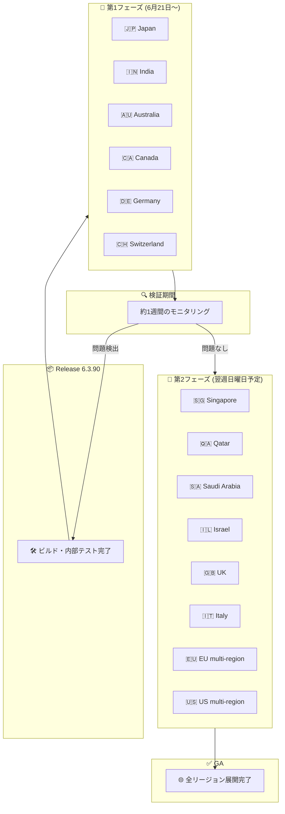

# Google SecOps SOAR: Release 6.3.90 段階的ロールアウト開始

**リリース日**: 2026-06-21

**サービス**: Google Security Operations (SecOps) SOAR

**機能**: プラットフォームリリース 6.3.90

**ステータス**: 第1フェーズリージョンへの段階的ロールアウト開始

📊 [このアップデートのインフォグラフィックを見る](https://takech9203.github.io/google-cloud-news-summary/20260621-google-secops-soar-release-6-3-90.html)

## 概要

Google SecOps SOAR プラットフォームの Release 6.3.90 が、2026年6月21日に第1フェーズのリージョンへの段階的ロールアウトを開始しました。本リリースには内部バグ修正およびカスタマー報告のバグ修正が含まれています。

前日の6月20日に前バージョン Release 6.3.89 が全リージョンで利用可能 (GA) となったばかりであり、Google SecOps SOAR の週次リリースサイクルに従った定期的なメンテナンスリリースです。Release 6.3.90 は段階的ロールアウトプロセスに基づき、まず第1フェーズの6リージョン (日本、インド、オーストラリア、カナダ、ドイツ、スイス) に展開され、約1週間の検証期間を経て第2フェーズのリージョンにロールアウトされる予定です。

なお、同日の発表として CloudSQL のスケジュールメンテナンス (マイナーアップグレード) も案内されています。

**アップデート前の課題**

- プラットフォームに存在する内部バグおよびカスタマーから報告されたバグにより、一部の機能で期待通りの動作が得られない場合があった
- Release 6.3.89 までに対処されていなかった不具合が残存していた

**アップデート後の改善**

- 内部バグ修正により、プラットフォームの安定性と信頼性が向上
- カスタマー報告のバグ修正により、ユーザーが報告していた問題が解消

## アーキテクチャ図

Google SecOps SOAR Release 6.3.90 の段階的ロールアウトプロセスを示す図です。第1フェーズで6リージョンに展開後、約1週間の検証期間を経て第2フェーズの8リージョンへ展開されます。検証中に問題が検出された場合はロールアウトが一時停止される可能性があります。

## サービスアップデートの詳細

### リリース内容

1. **内部バグ修正**
   - Google SecOps SOAR プラットフォームの内部で検出された不具合の修正
   - プラットフォームの安定性向上に寄与

2. **カスタマー報告バグ修正**
   - ユーザーから報告された問題の修正
   - 具体的な修正内容はリリースノートに記載されていない

### 段階的ロールアウトスケジュール

| フェーズ | 展開日 | リージョン |
|---------|--------|----------|
| 第1フェーズ | 2026-06-21 (日曜日) | Japan, India, Australia, Canada, Germany, Switzerland |
| 第2フェーズ | 2026-06-28 (翌週日曜日・予定) | Singapore, Qatar, Saudi Arabia, Israel, UK, Italy, EU multi-region, US multi-region |

## 技術仕様

| 項目 | 詳細 |
|------|------|
| バージョン | 6.3.90 |
| 前バージョン | 6.3.89 (2026-06-20 GA) |
| リリースタイプ | メンテナンス (バグ修正) |
| 第1フェーズ開始日 | 2026-06-21 |
| 全リージョン GA 予定 | 2026-06-27 前後 (第2フェーズ完了後) |
| 適用方法 | 自動 (ユーザー操作不要) |
| ダウンタイム | 通常なし |

## メリット

### 安定性の向上

- **バグ修正の継続的適用**: 週次リリースサイクルにより、既知の不具合が迅速に修正される
- **段階的ロールアウトによるリスク軽減**: 第1フェーズリージョンでの検証を経てから残りのリージョンに展開するため、影響範囲を最小限に抑えられる

### 運用面

- **ゼロタッチアップデート**: ユーザー側での作業は不要で、最新のバグ修正が自動適用される
- **透明性の確保**: リリースノートおよびステータスダッシュボードでロールアウト状況を確認可能

## デメリット・制約事項

### 制限事項

- 具体的なバグ修正内容が公開されていないため、特定の問題が解消されたかどうかを事前に確認することが困難
- 第2フェーズのリージョン (US multi-region, EU multi-region 等) は第1フェーズの約1週間後にアップデートが適用される

### 考慮すべき点

- マルチリージョンで運用している場合、リージョン間でバージョンが一時的に異なる期間 (最大約1週間) が発生する
- 過去にロールアウトが延期された事例 (2025年3月) があり、スケジュール通りに展開されない可能性もある
- 同日に案内された CloudSQL スケジュールメンテナンスとの影響を確認することを推奨

## ユースケース

### ユースケース 1: 第1フェーズリージョンでの早期検証

**シナリオ**: 日本リージョンで Google SecOps SOAR を利用するセキュリティチームが、新バージョンの動作を早期に確認したい場合

**効果**: 第1フェーズリージョンに含まれるため、最新のバグ修正をいち早く受け取り、プレイブックやインテグレーションの動作を検証できる。問題があれば Google SecOps サポートに報告し、第2フェーズ展開前に対処される可能性がある

### ユースケース 2: グローバル SOC チームのリリース管理

**シナリオ**: 複数リージョンにまたがる SOC チームが、バージョン差異を考慮した運用計画を策定する場合

**効果**: 段階的ロールアウトのスケジュールを把握することで、リージョン間のバージョン差異期間を認識し、チーム間の連携やエスカレーションプロセスに反映できる

## 関連サービス・機能

- **Google SecOps SIEM**: 統合プラットフォームの SIEM コンポーネント。SOAR と連携してアラート検出から自動応答までのワークフローを構成
- **Gemini in Security Operations**: AI アシスタント機能。プレイブック作成や脅威調査を支援 (Enterprise パッケージ以上)
- **Google SecOps ステータスダッシュボード**: サービスの稼働状況をリアルタイムで確認可能
- **CloudSQL**: 同日にスケジュールメンテナンス (マイナーアップグレード) が案内されている関連インフラコンポーネント

## 参考リンク

- 📊 [インフォグラフィック](https://takech9203.github.io/google-cloud-news-summary/20260621-google-secops-soar-release-6-3-90.html)
- [Google SecOps SOAR リリースノート](https://docs.cloud.google.com/chronicle/docs/soar/release-notes)
- [段階的リリース計画 (リージョン情報)](https://docs.cloud.google.com/chronicle/docs/soar/overview-and-introduction/soar-gradual-release)
- [Google SecOps SOAR 概要](https://docs.cloud.google.com/chronicle/docs/soar/overview-and-introduction/soar-overview)
- [Google SecOps ステータスダッシュボード](https://status.cloud.google.com/security/)

## まとめ

Google SecOps SOAR Release 6.3.90 が第1フェーズリージョンへの段階的ロールアウトを開始しました。内部バグ修正およびカスタマー報告のバグ修正を含むメンテナンスリリースであり、アップデートは自動適用されるためユーザー側でのアクションは不要です。第1フェーズリージョン (日本、インド、オーストラリア、カナダ、ドイツ、スイス) では本日から利用可能となり、第2フェーズリージョン (US, EU 等) のユーザーは翌週日曜日のロールアウトをお待ちください。

---

**タグ**: #GoogleSecOps #SOAR #Chronicle #SecurityOperations #Release #BugFix #GradualRollout
