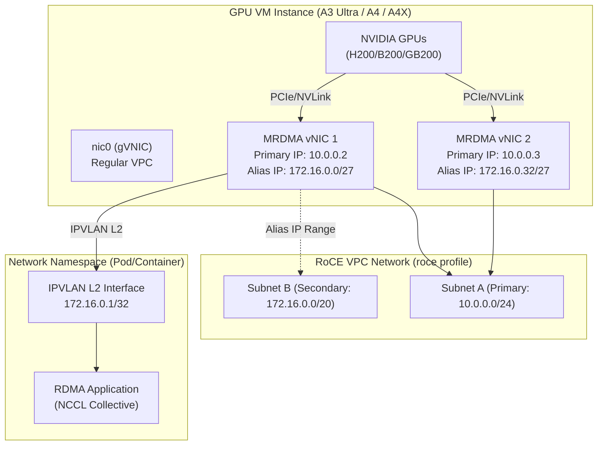

# AI Hypercomputer / Virtual Private Cloud: RoCE VPC ネットワークで MRDMA vNIC へのエイリアス IP レンジ割り当てをサポート

**リリース日**: 2026-06-22

**サービス**: AI Hypercomputer / Virtual Private Cloud (VPC)

**機能**: RoCE VPC ネットワークにおける MRDMA vNIC へのエイリアス IP レンジ割り当て

**ステータス**: Preview

[このアップデートのインフォグラフィックを見る](https://takech9203.github.io/google-cloud-news-summary/20260622-ai-hypercomputer-roce-mrdma-alias-ip.html)

## 概要

Google Cloud の AI Hypercomputer 向け RoCE (RDMA over Converged Ethernet) VPC ネットワークにおいて、VM インスタンスの MRDMA vNIC にエイリアス IP レンジを割り当てる機能が Preview として利用可能になった。これにより、GPU クラスタ内の RDMA 通信において、より柔軟な IP アドレス管理とネットワーク構成が可能になる。

この機能は、A3 Ultra、A4、A4X などの GPU アクセラレータ最適化マシンタイプで使用される RoCE VPC ネットワーク (VM インスタンス用) に適用される。エイリアス IP レンジを MRDMA NIC に割り当てることで、コンテナやポッドへの IP アドレス配布、マルチテナント環境での IP 管理、IPVLAN L2 モードを活用した名前空間ベースのネットワーク分離が実現できる。

**アップデート前の課題**

- RoCE VPC ネットワーク内の MRDMA vNIC にはプライマリ IP アドレスのみ割り当て可能で、追加の IP アドレスが必要な場合は別途 NIC を追加する必要があった
- GPU クラスタ内でコンテナやポッドに個別の IP アドレスを割り当てる柔軟性が制限されていた
- RDMA ネットワーク上でのマルチテナント構成やネットワーク名前空間の分離が困難だった

**アップデート後の改善**

- MRDMA vNIC にエイリアス IP レンジを割り当てることで、1 つの NIC で複数の IP アドレスを使用可能になった
- IPVLAN L2 モードと組み合わせることで、名前空間ベースの RDMA 接続分離が実現可能になった
- コンテナオーケストレータ (GKE など) との連携において、RDMA ネットワーク上のポッド IP 管理が柔軟になった

## アーキテクチャ図



RoCE VPC ネットワーク内で MRDMA vNIC にエイリアス IP レンジを割り当て、IPVLAN L2 モードを使用して名前空間内のコンテナに RDMA 接続を提供する構成を示している。

## サービスアップデートの詳細

### 主要機能

1. **MRDMA vNIC へのエイリアス IP レンジ割り当て**
   - RoCE VPC ネットワーク (VM インスタンス用、`roce` プロファイル) の MRDMA NIC にエイリアス IP アドレスを設定可能
   - プライマリ CIDR レンジまたはセカンダリ CIDR レンジからエイリアス IP を割り当て可能
   - `/32` の単一 IP から `/24` などのレンジまで柔軟に指定可能

2. **IPVLAN L2 モードによる名前空間分離**
   - エイリアス IP を使用して IPVLAN L2 インターフェースを作成し、ネットワーク名前空間 (Pod/コンテナ) に RDMA 接続を提供
   - ルートネームスペースまたは非ルートネームスペースの両方で RDMA デバイスを使用可能

3. **アンチスプーフィングによるセキュリティ**
   - エイリアス IP が設定されると Google Cloud が自動的にアンチスプーフィングチェックを実施
   - VM からのトラフィックが正当な送信元 IP アドレス (プライマリ IP またはエイリアス IP) を使用していることを検証

## 技術仕様

### 対応マシンタイプとネットワーク構成

| 項目 | 詳細 |
|------|------|
| 対応ネットワークプロファイル | `ZONE-vpc-roce` (VM インスタンス用) |
| 非対応ネットワークプロファイル | `ZONE-vpc-roce-metal` (ベアメタル用ではエイリアス IP 非対応) |
| 対応マシンタイプ | A3 Ultra (H200)、A4 (B200)、A4X (GB200) |
| NIC タイプ | MRDMA のみ |
| サブネットタイプ | IPv4 のみ (デュアルスタック/IPv6 非対応) |
| MTU | 8896 バイト (デフォルト) |
| 最大接続数 | 20,000 (2-tuple あたり) |

### RoCE VPC ネットワークの制約事項

| 機能 | サポート状況 |
|------|-------------|
| エイリアス IP レンジ | 対応 |
| 同一ネットワーク内マルチ NIC | 対応 |
| 外部 IP アドレス | 非対応 |
| IP フォワーディング | 非対応 |
| nic0 のアタッチ | 非対応 |
| Dynamic NIC (サブインターフェース) | 非対応 |
| ネットワーク移行 | 非対応 |

### 設定例: IPVLAN L2 モードでの名前空間構成

```bash
# 1. ネットワーク名前空間を作成
sudo ip netns add example_ns

# 2. MRDMA NIC にリンクした IPVLAN L2 インターフェースを作成
sudo ip link add gpu0rdma0_ipvlanl2 link gpu0rdma0 type ipvlan mode l2

# 3. IPVLAN インターフェースを名前空間に移動
sudo ip link set gpu0rdma0_ipvlanl2 netns example_ns

# 4. 名前空間内のループバックインターフェースを起動
sudo ip netns exec example_ns ip link set lo up

# 5. エイリアス IP アドレスを割り当て (/32 はポイントツーポイントとして使用)
sudo ip netns exec example_ns ip addr add 172.16.1.0/32 dev gpu0rdma0_ipvlanl2

# 6. インターフェースを有効化
sudo ip netns exec example_ns ip link set gpu0rdma0_ipvlanl2 up

# 7. 確認
sudo ip netns exec example_ns ip addr show gpu0rdma0_ipvlanl2
```

## 設定方法

### 前提条件

1. RoCE VPC ネットワークの作成 (`roce` ネットワークプロファイルを使用)
2. 対応するゾーンでの GPU マシンタイプの容量予約 (A3 Ultra / A4 / A4X)
3. セカンダリ CIDR レンジを持つサブネットの作成 (エイリアス IP 用)

### 手順

#### ステップ 1: RoCE VPC ネットワークの作成

```bash
gcloud compute networks create my-roce-network \
    --subnet-mode=custom \
    --network-profile=us-central1-b-vpc-roce
```

#### ステップ 2: セカンダリレンジ付きサブネットの作成

```bash
gcloud compute networks subnets create my-roce-subnet \
    --network=my-roce-network \
    --range=10.0.0.0/24 \
    --secondary-range=alias-range=172.16.0.0/20 \
    --region=us-central1
```

#### ステップ 3: エイリアス IP 付きインスタンスの作成

```bash
gcloud compute instances create my-gpu-instance \
    --zone=us-central1-b \
    --machine-type=a3-ultragpu-8g \
    --network-interface="subnet=my-roce-subnet,aliases=alias-range:172.16.0.0/27"
```

## メリット

### ビジネス面

- **運用効率の向上**: 1 つの NIC で複数の IP アドレスを管理できるため、ネットワーク構成がシンプルになり、運用コストが削減される
- **マルチテナント対応の強化**: エイリアス IP を使用した名前空間分離により、複数のワークロードを安全に同一クラスタ上で実行可能

### 技術面

- **柔軟な IP 管理**: コンテナオーケストレータがエイリアス IP を活用して RDMA ネットワーク上のポッドに IP を動的に割り当て可能
- **セキュリティ強化**: IP フォワーディングを有効にせずにエイリアス IP によるトラフィックルーティングが可能。アンチスプーフィングチェックが自動適用される
- **NCCL との統合**: RDMA 通信で使用される NCCL (NVIDIA Collective Communications Library) と組み合わせて、名前空間内から直接 GPU-to-GPU 通信が可能

## デメリット・制約事項

### 制限事項

- Preview ステータスのため、本番ワークロードでの使用は推奨されない (SLA 対象外)
- RoCE VPC ネットワーク (VM インスタンス用) のみ対応。ベアメタルインスタンス用 (`roce-metal`) では非対応
- 1 つの RoCE VPC ネットワークあたり最大 20,000 接続 (2-tuple ベース) の制限あり
- 外部 IP アドレスは割り当て不可 (インターネットアクセスには別途 nic0 経由が必要)
- IPv4 のみ対応 (IPv6/デュアルスタック非対応)

### 考慮すべき点

- 同一 RoCE VPC 内に複数の MRDMA NIC を配置するとレイテンシが増加する可能性がある (クロスレール通信)
- ゾーン制約あり: RoCE VPC ネットワーク内のリソースはネットワークプロファイルと同一ゾーンに限定される
- IPVLAN L2 モードの設定はゲスト OS 内で手動 (またはスクリプト) で行う必要がある

## ユースケース

### ユースケース 1: GKE 上の大規模 AI トレーニングクラスタ

**シナリオ**: 数百 GPU を使用した大規模言語モデル (LLM) のトレーニングにおいて、各トレーニングポッドに RDMA ネットワーク経由で通信可能な個別 IP アドレスを割り当てたい。

**効果**: エイリアス IP レンジにより、GKE のポッドネットワーキングと RDMA を統合し、ポッドごとに RDMA 通信可能なエンドポイントを提供。NCCL AllReduce などの集合通信をポッドレベルで実行可能になる。

### ユースケース 2: マルチテナント GPU クラスタの分離

**シナリオ**: 複数のチームが共有 GPU クラスタ上で異なるトレーニングジョブを実行する環境で、RDMA ネットワーク上のトラフィックをテナントごとに分離したい。

**効果**: エイリアス IP と名前空間分離を組み合わせることで、各テナントのワークロードが独自の RDMA エンドポイントを持ち、他テナントのトラフィックから論理的に分離される。

## 関連サービス・機能

- **AI Hypercomputer**: GPU クラスタのプロビジョニングと管理基盤。Hypercompute Cluster による大規模 GPU 環境のデプロイに対応
- **Compute Engine (アクセラレータ最適化マシン)**: A3 Ultra、A4、A4X マシンタイプが RoCE VPC ネットワークの MRDMA NIC を使用
- **Google Kubernetes Engine (GKE)**: GPU ワークロードのオーケストレーション。エイリアス IP によるポッドネットワーキングとの統合
- **Cloud NGFW for RoCE**: RoCE VPC ネットワーク向けのリージョナルネットワークファイアウォールポリシー
- **NVIDIA NCCL**: GPU 間の集合通信ライブラリ。RDMA トランスポートを使用した高性能通信を実現

## 参考リンク

- [インフォグラフィック](https://takech9203.github.io/google-cloud-news-summary/20260622-ai-hypercomputer-roce-mrdma-alias-ip.html)
- [公式リリースノート](https://docs.google.com/release-notes#June_22_2026)
- [RDMA network profiles](https://docs.cloud.google.com/ai-hypercomputer/docs/create-rdma-network-profiles)
- [Alias IP ranges overview](https://docs.cloud.google.com/vpc/docs/alias-ip)
- [Create a VPC network for RDMA NICs](https://docs.cloud.google.com/vpc/docs/create-vpc-network-rdma)
- [RDMA network profiles - Supported features](https://docs.cloud.google.com/vpc/docs/rdma-network-profiles)
- [Accelerator-optimized machine types](https://docs.cloud.google.com/compute/docs/accelerator-optimized-machines)

## まとめ

RoCE VPC ネットワークでの MRDMA vNIC へのエイリアス IP レンジ割り当てサポートは、AI/ML ワークロード向けの GPU クラスタにおけるネットワーク柔軟性を大幅に向上させる重要なアップデートである。特に GKE 上でのコンテナ化された GPU ワークロードや、マルチテナント環境での RDMA ネットワーク分離において大きな価値を発揮する。Preview 段階であるため、検証環境での評価を開始し、GA 時の本番適用に備えることを推奨する。

---

**タグ**: #AI-Hypercomputer #VPC #RoCE #RDMA #MRDMA #AliasIP #GPU #Networking #Preview #A3Ultra #A4 #A4X #NCCL
