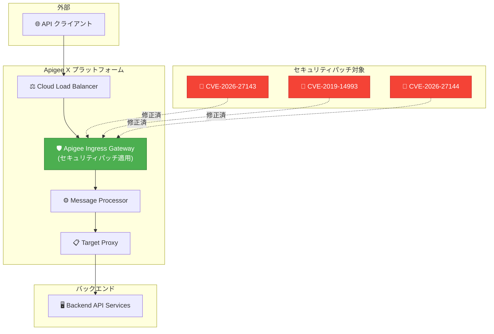

# Apigee X: セキュリティアップデート 1-17-0-apigee-10

**リリース日**: 2026-06-22

**サービス**: Apigee X

**機能**: セキュリティパッチ + Developer Portal バグ修正

**ステータス**: Announcement / Security / Fixed

:bar_chart: [このアップデートのインフォグラフィックを見る](https://takech9203.github.io/google-cloud-news-summary/20260622-apigee-x-security-update-1-17-0-10.html)

## 概要

2026年6月22日、Google Cloud は Apigee X の更新バージョン (1-17-0-apigee-10) をリリースしました。このアップデートは、Apigee ingress gateway における複数のセキュリティ脆弱性の修正と、Developer Portal (Drupal 10) の Smart Docs 機能に関するバグ修正を含みます。

セキュリティ面では、CVE-2026-27143、CVE-2019-14993、CVE-2026-27144 を含む複数の脆弱性に対するパッチが Apigee ingress gateway に適用されています。これらの脆弱性は、API トラフィックの入口となる ingress gateway コンポーネントに影響するため、API 管理基盤のセキュリティ維持において重要な修正です。

なお、このリリースのロールアウトは6月22日に開始されましたが、すべての Google Cloud ゾーンへの展開完了には4営業日以上かかる可能性があります。

**アップデート前の課題**

- Apigee ingress gateway に CVE-2026-27143、CVE-2019-14993、CVE-2026-27144 等の既知の脆弱性が存在していた
- Developer Portal の Smart Docs で API レスポンスセクションが、スキーマが提供されていても常に OpenAPI Specification の description を表示していた

**アップデート後の改善**

- ingress gateway のセキュリティ脆弱性がパッチにより修正された
- Developer Portal のレスポンスセクションがスキーマ提供時に正しくレスポンスボディスキーマをレンダリングするようになった

## アーキテクチャ図

Apigee ingress gateway は外部トラフィックを受け付ける最前段のコンポーネントであり、今回のパッチにより複数の CVE 脆弱性が修正されました。

## サービスアップデートの詳細

### セキュリティ修正 (Bug ID: 519996459)

Apigee ingress gateway に対して以下の脆弱性を修正するアップグレードが実施されました:

| CVE ID | 概要 |
|--------|------|
| **CVE-2026-27143** | Apigee ingress gateway の脆弱性 (2026年報告) |
| **CVE-2019-14993** | Istio/Envoy 関連の既知の脆弱性 |
| **CVE-2026-27144** | Apigee ingress gateway の脆弱性 (2026年報告) |

> **重要**: Apigee ingress gateway は API トラフィックの入口として機能するため、これらの脆弱性は外部からの攻撃ベクトルとなり得ます。ロールアウト完了後、すべてのインスタンスに自動適用されます。

### Developer Portal バグ修正 (Bug ID: 427088268)

**対象**: Apigee Developer Portal for Drupal 10

**問題**: Smart Docs の API レスポンスセクションが、スキーマが提供されていても常に OpenAPI Specification の description テキストを表示していた。

**修正**: レスポンスセクションがスキーマ提供時にレスポンスボディスキーマを正しくレンダリングするように修正。

## 技術仕様

### リリース情報

| 項目 | 詳細 |
|------|------|
| バージョン | 1-17-0-apigee-10 |
| リリース日 | 2026-06-22 |
| ロールアウト期間 | 4営業日以上 |
| 適用方式 | 自動 (マネージドサービス) |
| 対象 | すべての Apigee X インスタンス |

### セキュリティパッチの適用範囲

| コンポーネント | 影響 |
|---------------|------|
| Apigee Ingress Gateway | 脆弱性パッチ適用 |
| Developer Portal (Drupal 10) | Smart Docs バグ修正 |

## メリット

### セキュリティ面

- **脆弱性の自動修正**: Apigee X のマネージドサービス特性により、ユーザー側での手動パッチ適用が不要
- **ingress gateway の強化**: API トラフィックの入口におけるセキュリティレベルが向上
- **CVE 対応の迅速化**: Google のセキュリティチームによる定期的なパッチリリースにより、既知の脆弱性への対応が継続的に実施される

### 開発者体験

- **Smart Docs の正確性向上**: API ドキュメントのレスポンスセクションがスキーマを正しく表示することで、開発者が正確な API レスポンス構造を把握可能に

## デメリット・制約事項

### 制限事項

- ロールアウトには4営業日以上かかる可能性があり、すべてのゾーンに即時適用されるわけではない
- ロールアウト完了前のインスタンスでは修正が反映されない

### 考慮すべき点

- Apigee hybrid を使用している場合は、個別にパッチバージョンの適用が必要になる場合がある (本リリースノートは Apigee X のマネージドサービスが対象)
- ロールアウト中はインスタンス間でバージョンの差異が生じる可能性がある

## 料金

このセキュリティアップデートによる追加料金は発生しません。Apigee X の既存の料金プランの範囲内で提供されます。

Apigee X の料金体系は以下の通りです:

| プラン | 主な特徴 |
|--------|----------|
| Pay-as-you-go | Standard API Proxy: $20/100万コール〜、Extensible API Proxy: $100/100万コール〜 |
| Standard (サブスクリプション) | 最大12.5億 Standard APIコール、3環境、99% SLA |
| Enterprise (サブスクリプション) | 最大75億 Standard APIコール、6環境、99.9% SLA |
| Enterprise Plus (サブスクリプション) | 最大750億 Standard APIコール、12環境、99.99% SLA |

## 関連サービス・機能

- **Cloud Service Mesh (Istio)**: Apigee ingress gateway の基盤技術。Envoy プロキシベースのトラフィック管理を提供
- **Cloud Load Balancing**: Apigee X インスタンスの前段に配置されるロードバランサー
- **Apigee Developer Portal (Drupal 10)**: Smart Docs による API ドキュメント生成・公開機能を提供
- **Apigee Advanced API Security**: API の設定ミスや悪意のあるボット攻撃からの保護を提供するアドオン

## 参考リンク

- :bar_chart: [インフォグラフィック](https://takech9203.github.io/google-cloud-news-summary/20260622-apigee-x-security-update-1-17-0-10.html)
- [公式リリースノート](https://docs.cloud.google.com/release-notes#June_22_2026)
- [Apigee セキュリティパッチに関するドキュメント](https://cloud.google.com/apigee/docs/hybrid/security-patching)
- [Apigee セキュリティ速報](https://cloud.google.com/apigee/docs/security-bulletins)
- [Apigee Developer Portal (Drupal 10)](https://cloud.google.com/apigee/docs/api-platform/publish/drupal/open-source-drupal)
- [Apigee 料金ページ](https://cloud.google.com/apigee/pricing)

## まとめ

Apigee X バージョン 1-17-0-apigee-10 は、ingress gateway の複数のセキュリティ脆弱性修正と Developer Portal の Smart Docs バグ修正を含む重要なアップデートです。Apigee X を利用中の組織は、ロールアウトが完了するまでの間、セキュリティ監視を継続し、脆弱性に関連する異常なトラフィックパターンがないか確認することを推奨します。

---

**タグ**: #ApigeeX #Security #CVE #IngressGateway #DeveloperPortal #SmartDocs #Drupal10 #APIManagement #脆弱性修正
