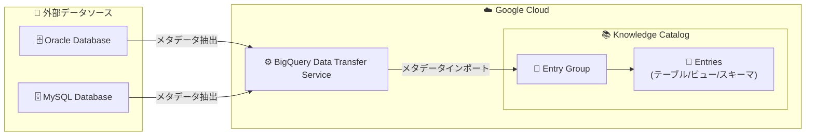

# BigQuery / Knowledge Catalog: Oracle・MySQL メタデータコネクタ

**リリース日**: 2026-06-22

**サービス**: BigQuery Data Transfer Service / Knowledge Catalog

**機能**: Oracle・MySQL データソースからのメタデータインポートコネクタ

**ステータス**: Preview

📊 [このアップデートのインフォグラフィックを見る](https://takech9203.github.io/google-cloud-news-summary/20260622-bigquery-knowledge-catalog-oracle-mysql-connectors.html)

## 概要

Google Cloud は、Knowledge Catalog (旧 Dataplex Universal Catalog) において、Oracle および MySQL データソースからメタデータを自動インポートするためのプリビルトコネクタを Preview として公開した。このコネクタは BigQuery Data Transfer Service を活用して外部データソースに接続し、技術メタデータ (データベース、スキーマ、テーブル、ビュー定義)、運用メタデータ (作成日時、更新日時)、ビジネスメタデータ (オーナー、アノテーション) を自動抽出して Knowledge Catalog のエントリグループにインポートする。

これにより、オンプレミスや他クラウドに存在する Oracle・MySQL データベースのメタデータを Google Cloud のデータカタログに統合的に管理できるようになり、データガバナンスとデータディスカバリの範囲がマルチクラウド・ハイブリッド環境に拡大する。

**アップデート前の課題**

- Oracle や MySQL のメタデータを Knowledge Catalog に取り込むには、カスタムコネクタを自前で開発し、Managed Service for Apache Spark 上で実行する必要があった
- メタデータの同期を自動化するには Workflows パイプラインの構築・運用が必要だった
- 外部データソースのメタデータが Google Cloud のカタログに統合されておらず、データの発見可能性が低かった

**アップデート後の改善**

- Google Cloud コンソールの GUI からコネクタを設定するだけで、Oracle・MySQL のメタデータを自動インポートできるようになった
- スケジュール設定により定期的にメタデータが同期され、カタログが常に最新の状態に保たれる
- カスタムコネクタの開発・運用が不要になり、導入までの時間とコストが大幅に削減された

## アーキテクチャ図

BigQuery Data Transfer Service がコネクタの実行基盤として機能し、Oracle・MySQL からメタデータを抽出して Knowledge Catalog のエントリグループにインポートする。各インポート実行時にはエントリグループ内のエントリが完全に上書きされ、ソースに存在しなくなったオブジェクトは削除される。

## サービスアップデートの詳細

### 主要機能

1. **プリビルトコネクタによる自動メタデータ抽出**
   - Oracle および MySQL データソースに対するプリビルトのコネクタが提供される
   - カスタムコネクタの開発なしに、GUI ベースの設定だけでメタデータインポートを開始できる
   - オンプレミス、Cloud SQL、他クラウド上のインスタンスに対応

2. **3 種類のメタデータの自動収集**
   - 技術メタデータ: データベース、スキーマ、テーブル、ビューの定義
   - 運用メタデータ: テーブルやビューなどのアセットの作成日時・最終更新日時
   - ビジネスメタデータ: アセットのオーナーやアノテーション

3. **スケジュールベースの定期同期**
   - コネクタの設定時にメタデータインポートのスケジュールを指定可能
   - オンデマンド実行にも対応 (手動トリガー)
   - インポート実行時にエントリグループが完全同期される (フルオーバーライト方式)

4. **セキュアなネットワーク接続**
   - Private Service Connect 経由の Network Attachment を使用してプライベート IP アドレスのデータベースに安全に接続可能
   - パブリック IP アドレスの場合は Network Attachment 不要
   - TLS 接続に対応 (PEM 証明書による認証)

## 技術仕様

### 必要な IAM ロール

| ロール | 用途 |
|--------|------|
| `roles/dataplex.catalogAdmin` または `roles/dataplex.catalogEditor` または `roles/dataplex.entryGroupOwner` | エントリグループの作成・管理 |
| `roles/bigquery.admin` | BigQuery Data Transfer Service の転送ジョブ作成・管理 |
| `roles/logging.viewer` | Cloud Logging でのログ閲覧 |
| `roles/dataplex.entryGroupImporter` (サービスエージェントに付与) | メタデータインポートの実行 |

### サービスエージェントの設定

BigQuery Data Transfer Service のサービスエージェント (`service-PROJECT_NUMBER@gcp-sa-bigquerydatatransfer.iam.gserviceaccount.com`) に対して、`dataplex.entryGroups.import` 権限または `roles/dataplex.entryGroupImporter` ロールをプロジェクトレベルまたはエントリグループレベルで付与する必要がある。

### 必要な API

- Knowledge Catalog API (Dataplex API)
- BigQuery Data Transfer Service API

### 対応データソース

| データソース | ホスティング環境 |
|-------------|-----------------|
| Oracle | オンプレミス、Google Cloud、他クラウド |
| MySQL | オンプレミス、Cloud SQL、他クラウド |

## 設定方法

### 前提条件

1. Knowledge Catalog API と BigQuery Data Transfer Service API が有効化されていること
2. 必要な IAM ロールが付与されていること
3. サービスエージェントに `roles/dataplex.entryGroupImporter` ロールが付与されていること
4. プライベート IP を使用する場合、Network Attachment が作成済みであること
5. データソース側で適切なユーザー・権限が設定されていること

### 手順

#### ステップ 1: Google Cloud コンソールで Knowledge Catalog ページに移動

ナビゲーションメニューの「Manage」セクションで「Connectors」をクリックする。

#### ステップ 2: コネクタの追加

1. 「Add connection」をクリック
2. コネクタリストから Oracle または MySQL カードを選択

#### ステップ 3: データソース詳細の設定

- **Network Attachment**: プライベート接続が必要な場合に選択または新規作成
- **Host / Port / Database name**: 接続先データベースの情報を入力
- **Username / Password**: 認証情報を入力
- **TLS Mode**: 必要に応じて TLS モードと PEM 証明書を設定
- **メタデータオブジェクト**: インポート対象のオブジェクトを選択

#### ステップ 4: 宛先設定

1. 既存の Knowledge Catalog エントリグループを選択、または「Create new entry group」で新規作成
2. エントリグループの権限を設定

#### ステップ 5: スケジュール設定

メタデータインポートの頻度を設定する。「On-demand」を選択した場合は手動トリガーのみ。

#### ステップ 6: 保存と実行

「Save」をクリックすると、設定したスケジュールに従って最初の実行がスケジュールされる。

## メリット

### ビジネス面

- **データガバナンスの拡張**: オンプレミスや他クラウドのデータベースも含めた統合的なデータカタログを構築でき、組織全体のデータガバナンスが強化される
- **導入コストの削減**: カスタムコネクタの開発・運用が不要になり、GUI 設定だけでメタデータ統合を実現できる
- **データの発見可能性向上**: 分散したデータソースのメタデータが Knowledge Catalog に集約され、セマンティック検索やデータリネージの対象範囲が拡大する

### 技術面

- **ノーコード設定**: Google Cloud コンソールの GUI から全ての設定が完了し、コード開発が不要
- **自動同期**: スケジュール設定によりメタデータが定期的に最新化され、手動メンテナンスが不要
- **セキュアな接続**: Private Service Connect と TLS により、プライベートネットワーク内のデータベースへも安全に接続可能

## デメリット・制約事項

### 制限事項

- Preview 段階のため、SLA の対象外であり、本番環境での使用には注意が必要
- 対応データソースは現時点で Oracle と MySQL の 2 種類のみ
- インポート方式がフルオーバーライトのため、差分のみの更新には対応していない
- CMEK (顧客管理暗号鍵) はインポート前の一時データの暗号化のみに使用され、Knowledge Catalog 内のメタデータの暗号化には適用されない

### 考慮すべき点

- プライベート IP のデータベースに接続する場合、Network Attachment の事前設定が必要
- Preview 期間中のフィードバックやサポートリクエストは dataplex-discuss@google.com に送信する
- BigQuery Data Transfer Service のサービスエージェントに対する権限付与を忘れないこと

## ユースケース

### ユースケース 1: ハイブリッド環境のデータガバナンス統合

**シナリオ**: オンプレミスの Oracle Database と Cloud SQL for MySQL の両方を運用しており、データアセットの全体像を把握したい企業のデータプラットフォームチーム。

**効果**: 両方のデータソースのメタデータが Knowledge Catalog に自動集約され、データエンジニアやアナリストがセマンティック検索で必要なデータを発見でき、データリネージの追跡やデータ品質の監視対象が拡大する。

### ユースケース 2: データマイグレーション計画の支援

**シナリオ**: オンプレミスの Oracle Database を BigQuery にマイグレーションする計画がある。マイグレーション対象のテーブルやビューの全体像を把握し、依存関係を分析したい。

**効果**: Oracle のメタデータを Knowledge Catalog にインポートすることで、テーブル・ビュー・スキーマの全体構造を可視化し、マイグレーション計画の策定とスコープ定義を効率化できる。

### ユースケース 3: コンプライアンス対応のためのデータインベントリ

**シナリオ**: GDPR やその他のデータ保護規制に対応するため、組織内のすべてのデータベースに存在する個人情報を含むテーブルを特定したい。

**効果**: 分散した Oracle・MySQL データベースのメタデータを Knowledge Catalog に集約し、ビジネスメタデータ (アノテーション) と組み合わせることで、個人情報を含むアセットの特定とデータインベントリの作成が容易になる。

## 料金

Knowledge Catalog の料金体系に基づく。

| 項目 | 料金 |
|------|------|
| Knowledge Catalog Standard 処理 (最初の 100 DCU-hour/月) | 無料 |
| Knowledge Catalog Standard 処理 (100 DCU-hour 超過分) | $0.060/DCU-hour から |
| メタデータストレージ (最初の 1 MiB) | 無料 |
| メタデータストレージ (1 MiB 超過分) | $2/GiB/月 から |
| API コール (最初の 100 万回/月) | 無料 |
| API コール (100 万回超過分) | $10/100,000 回 から |

BigQuery Data Transfer Service 自体の利用料は転送先のサービスの料金に含まれる。コネクタの実行に伴う追加のコンピュート費用については、Knowledge Catalog の処理 (DCU-hour) として課金される。

## 関連サービス・機能

- **BigQuery Data Transfer Service**: コネクタの実行基盤として使用。転送構成の管理とスケジュール実行を担う
- **Knowledge Catalog (旧 Dataplex Universal Catalog)**: メタデータの統合管理基盤。セマンティック検索、データリネージ、データ品質チェックなどのガバナンス機能を提供
- **Cloud Logging**: コネクタの実行ログの確認に使用
- **Private Service Connect**: プライベートネットワーク内のデータベースへの安全な接続を提供
- **Managed connectivity pipelines**: カスタムコネクタを使用したメタデータインポートの代替手段 (Workflows + Managed Service for Apache Spark ベース)

## 参考リンク

- 📊 [インフォグラフィック](https://takech9203.github.io/google-cloud-news-summary/20260622-bigquery-knowledge-catalog-oracle-mysql-connectors.html)
- [公式リリースノート](https://docs.cloud.google.com/release-notes#June_22_2026)
- [Knowledge Catalog コネクタの概要](https://docs.cloud.google.com/dataplex/docs/connectors)
- [Oracle コネクタの設定](https://docs.cloud.google.com/dataplex/docs/oracle-transfer)
- [MySQL コネクタの設定](https://docs.cloud.google.com/dataplex/docs/mysql-transfer)
- [Knowledge Catalog 料金ページ](https://cloud.google.com/dataplex/pricing)
- [Managed connectivity の概要](https://docs.cloud.google.com/dataplex/docs/managed-connectivity-overview)

## まとめ

Knowledge Catalog の Oracle・MySQL コネクタにより、オンプレミスや他クラウドに分散したデータベースのメタデータを Google Cloud のデータカタログに統合管理することが大幅に容易になった。これまでカスタムコネクタの開発が必要だった作業が GUI ベースの設定で完結するため、マルチクラウド・ハイブリッド環境のデータガバナンスを検討している組織は、Preview 段階で評価を開始し、GA 時にスムーズに本番適用できるよう準備を進めることを推奨する。

---

**タグ**: #BigQuery #KnowledgeCatalog #DataTransferService #Oracle #MySQL #メタデータ #データガバナンス #データカタログ #Preview #ハイブリッドクラウド
