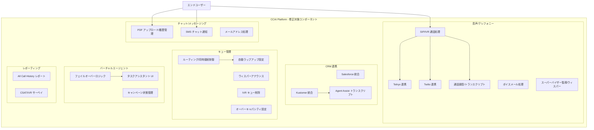

# Google Cloud Contact Center as a Service (CCaaS): Bug Fixes - June 22, 2026

**リリース日**: 2026-06-22

**サービス**: Google Cloud Contact Center as a Service (CCaaS) / CCAI Platform

**機能**: バグ修正 (2026年6月22日)

**ステータス**: 修正済み (GA)

📊 [このアップデートのインフォグラフィックを見る](https://takech9203.github.io/google-cloud-news-summary/20260622-ccaas-bug-fixes-june-22.html)

## 概要

Google Cloud Contact Center as a Service (CCaaS) において、2026年6月22日付けで25件の重要なバグ修正がリリースされました。今回の修正は、音声通話 (Voice/Telephony)、チャット/メッセージング、CRM 連携 (Salesforce/Kustomer)、キュー管理、バーチャルエージェント、レポーティングの各領域にわたる包括的なものです。

これらのバグ修正により、コンタクトセンター運用における信頼性と安定性が大幅に向上します。特に、通話録音の欠落、CRM へのデータ連携不整合、キュー設定の不正動作など、運用品質に直接影響する重要な問題が解消されています。

対象ユーザーは、CCAI Platform を利用してオムニチャネルコンタクトセンターを運用する全ての組織です。Twilio、Telnyx などの CPaaS プロバイダーとの連携、Salesforce や Kustomer などの CRM 統合を活用している環境では、特に恩恵が大きいアップデートとなります。

**アップデート前の課題**

- 音声通話: SIP/IVR 通話が発信者切断時に間欠的に失敗し、Telnyx 通話で切断イベントが生成されず録音・トランスクリプトが欠落していた
- チャット: PDF アップロード後にセッション転送やページ更新で会話履歴が参照できなくなり、直接 SMS チャットの終了通知が送信されなかった
- CRM 連携: Kustomer で Agent Assist トランスクリプトがタイムラインノートではなくファイル添付として配信され、Salesforce でアウトバウンド通話が別ケースの所有権を不正に上書きしていた
- キュー管理: キューレベルの自動ラップアップ設定が意図せず無効化され、キュー設定ページで不整合な表示が発生していた
- バーチャルエージェント: 障害時に人間のエージェントが未設定でもフェイルオーバーを試行し、エラーが発生していた
- レポーティング: 営業時間外のボイスメール転送が All Call History レポートでエラーとして不正報告されていた

**アップデート後の改善**

- 音声通話の信頼性が向上し、SIP/IVR 通話の間欠的失敗が解消。Telnyx 通話で適切な切断イベントが生成され、録音とトランスクリプトが確実に保存されるようになった
- チャット機能が安定化し、PDF アップロード後のセッション転送でも会話履歴が維持され、SMS チャットの終了通知が正常に送信されるようになった
- CRM 連携の正確性が改善され、Kustomer/Salesforce との統合で正しいデータ形式・関連付けが行われるようになった
- キュー管理設定が正確に反映され、管理者の意図通りの動作が保証されるようになった
- バーチャルエージェントのフェイルオーバーロジックが適切に動作し、未設定時の不要なエラーが解消された
- レポーティングの精度が向上し、正確な通話履歴データが提供されるようになった

## アーキテクチャ図

この図は、今回のバグ修正で影響を受ける CCAI Platform の主要コンポーネントを6つのカテゴリに分類して示しています。各サブグラフ内の要素が個別の修正対象を表しています。

## サービスアップデートの詳細

### 音声/テレフォニー関連の修正 (8件)

1. **SIP/IVR 通話の間欠的失敗の修正**
   - バーチャルエージェント割り当て前に発信者が切断した場合に、SIP および IVR 通話が間欠的に失敗する問題を修正
   - 通話開始フェーズでのエラーハンドリングが改善された

2. **Telnyx 通話の切断イベント未生成の修正**
   - 正常終了した Telnyx 通話で切断イベントが生成されず、録音・トランスクリプトが欠落し、CCAI Platform ポータル上で通話がアクティブのまま表示される問題を修正
   - 通話ライフサイクル管理の信頼性が向上

3. **営業時間外ボイスメールグリーティングの修正**
   - エージェント間通話デフレクション時に営業時間外のボイスメールグリーティングが再生されない問題を修正

4. **着信音声通話の初期ルックアップ失敗の修正**
   - インバウンド音声通話が初期ルックアップフェーズでアプリケーションエラーにより失敗する問題を修正

5. **営業時間内のボイスメール不正デフレクションの修正**
   - エージェントデフレクションが有効な場合に、エージェントの利用可能時間内でもダイレクトインバウンド通話が不正にボイスメールに転送される問題を修正

6. **スーパーバイザー監視/ウィスパーのシステムエラーの修正**
   - スーパーバイザーの監視およびウィスパー機能が通話録音中にシステムエラーを発生させる問題を修正

7. **転送ボイスメールの削除不可の修正**
   - ソースキューが削除された場合に、エージェントが転送されたボイスメールを棄却できない問題を修正

8. **Twilio レコード削除時のエラーの修正**
   - Twilio レコードの削除時に不要なエラーが発生する問題を修正

### チャット/メッセージング関連の修正 (3件)

1. **PDF アップロード後の会話履歴喪失の修正**
   - チャットで PDF ドキュメントをアップロードした後、セッション転送やページ更新時に会話履歴が参照できなくなる問題を修正
   - メディア添付と会話コンテキストの永続化が改善された

2. **SMS チャット終了通知の修正**
   - ダイレクト SMS チャットでチャット終了時に終了通知が送信されない問題を修正

3. **メールアドレスのアンダースコア変換の修正**
   - ショートカット内のメールアドレスのアンダースコアが、エージェントからエンドユーザーへ送信時にダブルバックスラッシュに変換される問題を修正

### CRM 連携関連の修正 (5件)

1. **Kustomer: Agent Assist トランスクリプトの配信形式の修正**
   - Agent Assist トランスクリプトが CRM にタイムラインノートではなくファイル添付として配信される問題を修正
   - エージェントが会話コンテキストを直接タイムラインで確認できるようになった

2. **Kustomer: 重複会話レコードの修正**
   - 通話中に CRM で重複した会話レコードが作成される問題を修正

3. **Kustomer: SMS チャットのチケット未作成の修正**
   - SMS チャットセッションで CRM にチケットが作成されない問題を修正

4. **Salesforce: アウトバウンド通話のケース所有権の修正**
   - アクティブケースからアウトバウンド通話を開始すると、別ユーザーに割り当てられた別のケースにリンクされ、そのケースの所有権が不正に上書きされる問題を修正

5. **Salesforce/Kustomer: データ整合性の全般的改善**
   - CRM との統合における正確なデータマッピングと関連付けが保証されるようになった

### キュー管理関連の修正 (6件)

1. **Deltacast: チャットルーティングの修正**
   - 企業全体の同時接続設定が無効で個別エージェント制限がアクティブな場合に、チャットが利用可能なエージェントに正しくルーティングされない問題を修正

2. **自動ラップアップ設定の不正無効化の修正**
   - キューレベルの自動ラップアップ設定がエンドユーザーの操作なしに無効化される問題を修正

3. **キュー設定ページのウィスパーアナウンス表示の修正**
   - キュー設定ページでウィスパーアナウンスのステータスが不整合に表示され、通話中にキュー名が再生されない問題を修正

4. **オーバーキャパシティデフレクション設定表示の修正**
   - キュー間を素早く移動した際に、キューページで不正なオーバーキャパシティデフレクション設定が表示される問題を修正

5. **連続 IVR キュー削除のパフォーマンス問題の修正**
   - 連続的な IVR キュー削除がパフォーマンス遅延とタイムアウトエラーを引き起こす問題を修正

6. **グローバル CSAT 設定と IVR サーベイの修正**
   - グローバル CSAT 設定を無効化すると、特定キューで有効化されている IVR サーベイまでブロックされる問題を修正

### バーチャルエージェント関連の修正 (3件)

1. **バーチャルエージェントのフェイルオーバーロジックの修正**
   - 障害時に人間のエージェントが設定されていない場合でも、バーチャルエージェントがフェイルオーバーを試行する問題を修正
   - 未設定の場合は適切にエラーハンドリングされるようになった

2. **タスクアシスタントの UI 表示の修正**
   - バーチャルタスクアシスタントのリクエスト開始後に「処理中」バナーとキャンセルボタンが即座に表示されない問題を修正

3. **キャンペーン状態遷移の修正**
   - キャンペーンが完了後も一時停止状態のままになり、完了状態に遷移しない問題を修正

## 技術仕様

### 修正カテゴリ別の影響範囲

| カテゴリ | 修正件数 | 影響チャネル | 主要コンポーネント |
|----------|----------|--------------|-------------------|
| 音声/テレフォニー | 8件 | Voice, IVR | SIP, Telnyx, Twilio, 通話録音 |
| チャット/メッセージング | 3件 | Chat, SMS, Email | WebChat, SMS Gateway |
| CRM 連携 | 5件 | All | Salesforce, Kustomer, Agent Assist |
| キュー管理 | 6件 | All | Routing Engine, Queue Config |
| バーチャルエージェント | 3件 | Voice, Chat | Dialogflow CX, Campaign Manager |

### CPaaS プロバイダー連携

| プロバイダー | 修正内容 | 影響 |
|-------------|---------|------|
| Telnyx | 切断イベント未生成 | 録音/トランスクリプト欠落の解消 |
| Twilio | レコード削除エラー | 不要なエラーログの排除 |
| Deltacast | チャットルーティング | 同時接続制御の正常化 |

## 設定方法

### 前提条件

1. CCAI Platform インスタンスが稼働中であること
2. 適切な管理者権限を持つアカウントでログインしていること

### 手順

今回のバグ修正はプラットフォーム側で自動的に適用されるため、ユーザー側での特別な設定変更は不要です。ただし、以下の確認を推奨します。

#### ステップ 1: キュー設定の確認

CCAI Platform ポータルにログインし、Settings > Queue で各キューの以下の設定が意図通りであることを確認してください。

- 自動ラップアップ設定
- ウィスパーアナウンス設定
- オーバーキャパシティデフレクション設定
- CSAT/IVR サーベイ設定

#### ステップ 2: CRM 連携の動作確認

Kustomer または Salesforce との連携を利用している場合は、以下を確認してください。

- Agent Assist トランスクリプトがタイムラインノートとして正しく表示されること (Kustomer)
- SMS チャットセッションでチケットが作成されること (Kustomer)
- アウトバウンド通話時のケース関連付けが正しいこと (Salesforce)

#### ステップ 3: テレフォニー動作の確認

Telnyx を利用している場合は、通話終了後に以下が正しく生成されることを確認してください。

- 切断イベント
- 通話録音
- トランスクリプト

## メリット

### ビジネス面

- **通話録音の完全性**: Telnyx 通話の切断イベント修正により、コンプライアンスおよび品質管理のための通話録音が確実に保存されるようになった
- **CRM データの正確性**: Salesforce/Kustomer との連携修正により、顧客データの一貫性と正確性が確保され、顧客対応品質が向上
- **レポーティングの信頼性**: All Call History レポートの不正報告修正により、正確なオペレーション分析と意思決定が可能に
- **エージェント生産性の向上**: ボイスメール処理、会話履歴アクセス、タスクアシスタント UI の改善により、エージェントの業務効率が向上

### 技術面

- **通話ライフサイクル管理の改善**: SIP/IVR 通話の初期フェーズにおけるエラーハンドリングが強化され、通話接続の信頼性が向上
- **キュー管理の安定性**: 設定の不正無効化やパフォーマンス遅延が解消され、管理者設定が確実に反映される
- **CPaaS 連携の堅牢性**: Telnyx、Twilio、Deltacast との連携における各種エラーが解消され、テレフォニーインフラの安定性が向上
- **スーパーバイザー機能の正常化**: 監視/ウィスパー機能が通話録音と干渉しなくなり、品質管理ワークフローが正常に動作

## デメリット・制約事項

### 制限事項

- 今回の修正はプラットフォーム側で自動適用されるが、一部環境では設定の再確認が推奨される
- 修正前に発生した欠落データ (Telnyx 通話の録音/トランスクリプトなど) は遡及的には復元されない

### 考慮すべき点

- CRM 連携の修正後、過去に不正に作成された重複レコードの整理が必要な場合がある (Kustomer)
- Salesforce でケース所有権が不正に上書きされた過去のデータについては、手動での確認・修正が必要な可能性がある
- キュー設定が不正に変更されていた場合、管理者による設定の再確認と必要に応じた再設定が必要

## ユースケース

### ユースケース 1: 大規模コンタクトセンターでの通話品質管理

**シナリオ**: Telnyx をテレフォニープロバイダーとして使用する大規模コンタクトセンターにおいて、一部の通話録音が欠落し、コンプライアンス要件を満たせない状況が発生していた。

**効果**: 切断イベントの正常生成により、全通話の録音およびトランスクリプトが確実に保存され、監査要件への完全準拠が実現。CCAI Platform ポータル上での通話ステータスも正確に反映される。

### ユースケース 2: Salesforce 連携による営業チームの顧客管理

**シナリオ**: 営業チームがアクティブケースからアウトバウンド通話を開始した際、別の営業担当者のケース所有権が不正に上書きされ、顧客対応の混乱が生じていた。

**効果**: ケース関連付けロジックの修正により、各通話が正しいケースに紐づけられ、所有権の不正変更が防止される。営業チーム間のデータ整合性が維持される。

### ユースケース 3: オムニチャネル対応でのチャットサポート

**シナリオ**: チャットでのサポート中に顧客が PDF を共有した後、セッション転送や担当者変更が発生すると会話履歴が失われ、顧客に同じ情報を再度求める必要があった。

**効果**: 会話履歴の永続化により、セッション転送後も完全なコンテキストが維持され、シームレスな顧客体験を提供できるようになった。

## 料金

CCAI Platform の料金は以下の課金モデルに基づきます (今回のバグ修正による料金変更はありません)。

| 課金モデル | 説明 |
|-----------|------|
| Concurrent agents | 月間で同時にサインインしたエージェントロールユーザーの最大数 |
| Named agents | 月間でエージェントロールを持つインスタンス内のユーザーの最大数 |
| Minutes used | エージェントロールユーザーがサインインしていた分数 |

テレフォニー料金は使用量に応じて別途課金されます。詳細な料金については [Google Cloud 営業チーム](https://cloud.google.com/contact) にお問い合わせください。

## 利用可能リージョン

CCAI Platform は以下の Google Cloud リージョンで利用可能です。

| リージョン | ロケーション | Advanced Reporting |
|-----------|-------------|-------------------|
| northamerica-northeast1 | Montreal | 対応 |
| northamerica-northeast2 | Toronto | - |
| us-central1 | Iowa | 対応 |
| us-east1 | South Carolina | 対応 |
| us-east4 | Virginia | - |
| us-west1 | Oregon | 対応 |
| southamerica-east1 | Sao Paulo | - |
| europe-west1 | Belgium | - |
| europe-west2 | London | 対応 |
| europe-west3 | Frankfurt | - |
| europe-west4 | Eemshaven | - |
| europe-west6 | Zurich | - |
| me-west1 | Tel Aviv | - |
| asia-northeast1 | Tokyo | 対応 |
| asia-northeast3 | Seoul | - |
| asia-south1 | Mumbai | - |
| asia-southeast1 | Singapore | - |
| asia-southeast2 | Jakarta | - |
| australia-southeast1 | Sydney | 対応 |

テレフォニーサービスは、Google Cloud マネージドおよび BYOC (Bring Your Own Carrier) オプションにより、23か国以上で利用可能です。

## 関連サービス・機能

- **Dialogflow CX**: CCAI Platform のバーチャルエージェント基盤。IVR および音声/チャットチャネルでの自動応答を提供。今回のフェイルオーバーロジック修正に関連
- **Agent Assist**: エージェント支援機能。リアルタイムのトランスクリプトおよびアシスト情報を提供。Kustomer へのトランスクリプト配信形式の修正に関連
- **Customer Experience Insights**: コンタクトセンターのインサイト分析。通話ドライバーやセンチメントの分析に使用
- **Salesforce 連携**: CRM 統合パートナー。ケース管理とアウトバウンド通話の関連付けの修正に関連
- **Kustomer 連携**: CRM 統合パートナー。チケット作成、会話レコード、トランスクリプト配信の修正に関連
- **Telnyx**: CPaaS テレフォニープロバイダー。通話インフラストラクチャの提供。切断イベントおよび録音の修正に関連
- **Twilio**: CPaaS プロバイダー。チャットインフラおよび通話サービスの提供。レコード管理の修正に関連
- **Gemini Enterprise for CX**: CCAI Platform を含む統合 CX ソリューション。Dialogflow CX、Agent Assist、Customer Experience Insights を統合

## 参考リンク

- 📊 [インフォグラフィック](https://takech9203.github.io/google-cloud-news-summary/20260622-ccaas-bug-fixes-june-22.html)
- [公式リリースノート](https://docs.cloud.google.com/release-notes#June_22_2026)
- [CCAI Platform ドキュメント](https://docs.cloud.google.com/contact-center/ccai-platform/docs)
- [CCAI Platform 概要](https://cloud.google.com/solutions/contact-center-as-a-service)
- [利用可能リージョン](https://docs.cloud.google.com/contact-center/ccai-platform/docs/localities)
- [高可用性設定ガイド](https://docs.cloud.google.com/contact-center/ccai-platform/docs/set-up-ccaas-for-high-availability)
- [SLA](https://cloud.google.com/terms/contact-center/ccai-platform/sla)

## まとめ

今回のリリースは、CCAI Platform の運用品質と信頼性を大幅に向上させる包括的なバグ修正です。特に、Telnyx 通話の録音欠落修正はコンプライアンス要件に直結する重要な改善であり、CRM 連携 (Salesforce/Kustomer) の修正は顧客データの正確性を回復します。CCAI Platform を利用中の組織は、キュー設定および CRM 連携の動作確認を行い、過去に影響を受けたデータの整合性を確認することを推奨します。

---

**タグ**: #GoogleCloud #CCAI #CCaaS #ContactCenter #BugFix #Telnyx #Twilio #Salesforce #Kustomer #AgentAssist #DialogflowCX #IVR #VoIP #CRM #QueueManagement
