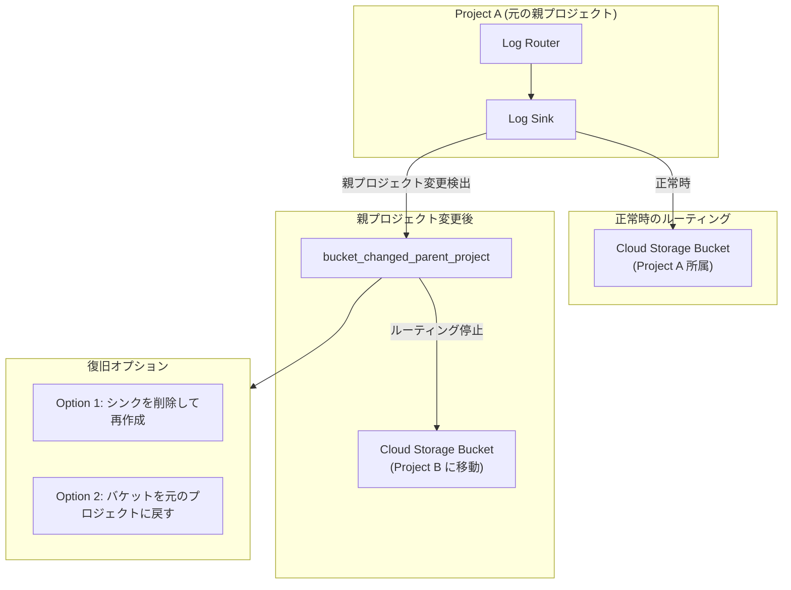

# Cloud Logging: ログシンクが Cloud Storage バケットの親プロジェクト変更時にルーティングを停止

**リリース日**: 2026-06-22

**サービス**: Cloud Logging

**機能**: ログシンクの Cloud Storage バケット親プロジェクト変更検出

**ステータス**: Security

:chart_with_upwards_trend: [このアップデートのインフォグラフィックを見る](https://takech9203.github.io/google-cloud-news-summary/20260622-cloud-logging-sink-bucket-project-change.html)

## 概要

Cloud Logging において、ログシンクのルーティング先として設定されている Cloud Storage バケットの親プロジェクトが変更された場合、そのログシンクはログエントリのルーティングを停止する動作が明確化された。この動作はセキュリティ上の保護措置として機能し、意図しないプロジェクト移動によるログデータの漏洩を防止する。

Cloud Logging は親プロジェクトの変更を検出すると、該当のログシンクを「設定不備 (misconfigured)」としてマークし、エラーコード `bucket_changed_parent_project` を報告する。管理者にはメール通知が送信され、Essential Contacts の Technical カテゴリに登録された連絡先、または IAM Project Owner ロールを持つユーザーに通知される。

このアップデートは、組織のリソース階層を変更する運用 (プロジェクト間でのバケット移動や組織再編) を行う管理者にとって重要であり、ログルーティングの継続性を確保するための対応手順を事前に把握しておく必要がある。

**アップデート前の課題**

- Cloud Storage バケットの親プロジェクトが変更された場合の影響が不明瞭で、ログの消失に気づくのが遅れる可能性があった
- バケット移動後もログシンクが動作し続けると仮定して運用設計されるケースがあった
- 親プロジェクト変更に伴うセキュリティリスク (意図しない宛先へのログ送信) への対策が不足していた

**アップデート後の改善**

- Cloud Logging がバケットの親プロジェクト変更を自動検出し、ログシンクを即座に停止する
- エラーコード `bucket_changed_parent_project` による明確なエラー通知が提供される
- 復旧方法として「シンクの再作成」または「バケットを元のプロジェクトに戻す」という明確な手順が文書化された

## アーキテクチャ図



Cloud Storage バケットの親プロジェクトが変更されると、Cloud Logging はログシンクを misconfigured としてマークし、ルーティングを停止する。復旧には新しいシンクの作成、またはバケットを元のプロジェクトに戻す操作が必要となる。

## サービスアップデートの詳細

### 主要機能

1. **親プロジェクト変更の自動検出**
   - Cloud Logging がルーティング先 Cloud Storage バケットの親プロジェクト変更を自動的に検出する
   - 検出時にログシンクを「misconfigured (設定不備)」としてマークし、ログエントリのルーティングを即座に停止する
   - セキュリティ保護として機能し、意図しない宛先へのログ送信を防止する

2. **エラー通知メカニズム**
   - エラーコード `bucket_changed_parent_project` がログエントリとして記録される
   - Essential Contacts の Technical カテゴリに登録された連絡先にメール通知が送信される
   - メール件名: `[ACTION REQUIRED] Cloud Logging sink configuration error`
   - シンク関連エラーはエラーグループごとに1日1回報告される

3. **復旧オプションの提供**
   - 既存のログシンクを削除し、同じ Cloud Storage バケットを宛先として新しいシンクを作成する
   - Cloud Storage バケットを元の Google Cloud プロジェクトに戻す
   - いずれの方法でも、修正後に到着した新しいログエントリからルーティングが再開される

## 技術仕様

### エラーコードと通知

| 項目 | 詳細 |
|------|------|
| エラーコード | `bucket_changed_parent_project` |
| 通知方法 | メール通知 + ログエントリ |
| 通知頻度 | 1日1回 (エラーグループごと) |
| 通知先 | Essential Contacts (Technical) または IAM Project Owner |
| ログ名 | `logging.googleapis.com%2Fsink_error` |
| リソースタイプ | `logging_sink` |

### エラーログの確認方法

```
logName:"logging.googleapis.com%2Fsink_error"
resource.type="logging_sink"
resource.labels.name="SINK_NAME"
```

Logs Explorer で上記クエリを使用し、シンクのエラーログを確認できる。`labels.error_code` フィールドに `bucket_changed_parent_project` が記録される。

## 設定方法

### 前提条件

1. 影響を受けるログシンクの名前を特定していること
2. Cloud Storage バケットの新しい親プロジェクトを把握していること
3. 適切な IAM 権限 (Logging Admin または同等の権限) を持つこと

### 手順

#### 復旧オプション 1: ログシンクの再作成

```bash
# 1. 既存のシンクの設定を確認
gcloud logging sinks describe SINK_NAME

# 2. 既存のシンクを削除
gcloud logging sinks delete SINK_NAME

# 3. 新しいシンクを作成 (同じバケットを宛先に指定)
gcloud logging sinks create SINK_NAME \
  storage.googleapis.com/BUCKET_NAME \
  --log-filter='YOUR_FILTER'

# 4. シンクのサービスアカウントに権限を付与
gcloud projects add-iam-policy-binding DESTINATION_PROJECT_ID \
  --member=serviceAccount:SERVICE_ACCOUNT \
  --role=roles/storage.objectCreator
```

新しいシンクを作成した後、シンクのサービスアカウント (writerIdentity) に対して、バケットの新しい親プロジェクトで `roles/storage.objectCreator` ロールを付与する必要がある。

#### 復旧オプション 2: バケットを元のプロジェクトに戻す

```bash
# バケットを元のプロジェクトに戻す (Storage Transfer Service または gcloud を使用)
# バケットを元のプロジェクトに戻した後、シンクは自動的にルーティングを再開する
```

バケットを元のプロジェクトに戻した場合、設定エラーが解消された後に到着した新しいログエントリからルーティングが再開される。

## メリット

### セキュリティ面

- **意図しないログ送信の防止**: バケットの所有権が変更された場合に自動的にルーティングを停止し、ログデータの意図しない漏洩を防止する
- **変更検出の自動化**: 管理者が手動で監視する必要なく、親プロジェクト変更が自動検出される

### 運用面

- **明確なエラー通知**: `bucket_changed_parent_project` エラーコードにより問題の原因が即座に判明する
- **復旧手順の明確化**: 2つの復旧オプションが文書化されており、状況に応じた対応が可能

## デメリット・制約事項

### 制限事項

- ログシンクが停止した場合、停止中のログエントリは失われる (バッファリングされない)
- 復旧後も、停止中に到着したログエントリを遡ってルーティングすることはできない
- Cloud Storage へのログルーティングはバッチ処理 (1時間ごと) のため、問題検出に最大2-3時間の遅延が生じる可能性がある

### 考慮すべき点

- 組織再編やプロジェクト統合時に、ログシンクの宛先バケットが影響を受ける可能性がある
- シンク再作成時には新しいサービスアカウントが生成されるため、宛先プロジェクトでの権限再付与が必要
- 複数のシンクが同一バケットを宛先としている場合、すべてのシンクが影響を受ける

## ユースケース

### ユースケース 1: 組織再編に伴うプロジェクト統合

**シナリオ**: 企業の組織再編により、複数の Google Cloud プロジェクトを統合する際に、ログアーカイブ用の Cloud Storage バケットを新しいプロジェクトに移動する必要がある。

**実装例**:
```bash
# 1. 移動前に影響を受けるシンクを事前に特定
gcloud logging sinks list --format="table(name, destination)"

# 2. バケット移動後、各シンクを再作成
gcloud logging sinks delete old-archive-sink
gcloud logging sinks create new-archive-sink \
  storage.googleapis.com/log-archive-bucket \
  --log-filter='severity>=WARNING'

# 3. 新しいサービスアカウントに権限を付与
gcloud logging sinks describe new-archive-sink --format="value(writerIdentity)"
```

**効果**: 計画的にシンクを再作成することで、ログデータの消失期間を最小限に抑えられる。

### ユースケース 2: セキュリティインシデント対応

**シナリオ**: バケットの親プロジェクトが不正に変更された場合 (侵害されたアカウントによるリソース移動など)、ログシンクが自動停止することで、攻撃者が管理するプロジェクトへのログ送信が防止される。

**効果**: セキュリティ保護として、機密情報を含むログデータが意図しない宛先に送信されるリスクを低減する。

## 料金

Cloud Logging のログルーティング自体には追加料金は発生しない。関連する料金情報は以下の通り。

| 項目 | 料金 | 無料枠 |
|------|------|--------|
| Logging ストレージ | $0.50/GiB | 50 GiB/プロジェクト/月 |
| Log Router | 追加料金なし | - |
| ログ保持 (30日超) | $0.01/GiB/月 | デフォルト保持期間内は無料 |

詳細は [Google Cloud Observability pricing](https://cloud.google.com/products/observability/pricing) を参照。

## 関連サービス・機能

- **Cloud Storage**: ログシンクのルーティング先として使用されるオブジェクトストレージ。バケットの親プロジェクト変更が本アップデートのトリガーとなる
- **Cloud Monitoring**: `exports/error_count` メトリクスによりシンクのルーティングエラーを監視可能
- **Essential Contacts**: シンク設定エラーのメール通知先を管理するサービス
- **IAM**: シンクのサービスアカウントに対する宛先プロジェクトでの権限管理に使用

## 参考リンク

- :chart_with_upwards_trend: [インフォグラフィック](https://takech9203.github.io/google-cloud-news-summary/20260622-cloud-logging-sink-bucket-project-change.html)
- [公式リリースノート](https://docs.google.com/release-notes#June_22_2026)
- [Errors routing to Cloud Storage](https://docs.cloud.google.com/logging/docs/export/troubleshoot#errors_exporting_to_cloud_storage)
- [ログシンクの設定と管理](https://docs.cloud.google.com/logging/docs/export/configure_export_v2)
- [ログルーティングの概要](https://docs.cloud.google.com/logging/docs/routing/overview)
- [シンクのトラブルシューティング](https://docs.cloud.google.com/logging/docs/export/troubleshoot)
- [料金ページ](https://cloud.google.com/products/observability/pricing)

## まとめ

Cloud Storage バケットの親プロジェクト変更時にログシンクが自動停止する動作は、セキュリティ保護として重要な機能である。組織再編やプロジェクト統合を計画している場合は、事前にログシンクの宛先バケットを確認し、移動後のシンク再作成手順を準備しておくことを推奨する。また、Cloud Monitoring でシンクのエラーメトリクスを監視するアラートを設定し、問題の早期検出体制を整えることが望ましい。

---

**タグ**: #CloudLogging #Security #LogSink #CloudStorage #Troubleshooting #LogRouting
