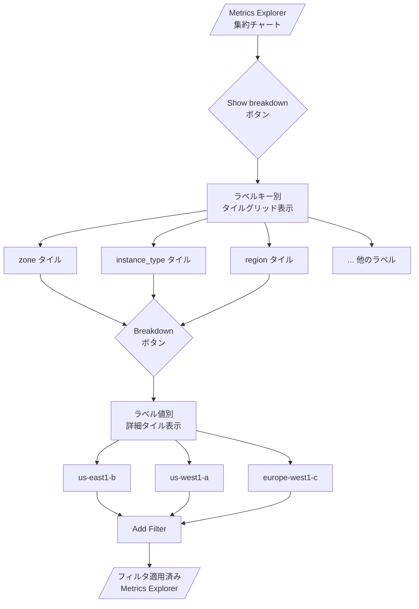

# Cloud Monitoring: Metrics Explorer チャートのラベル別ブレイクダウン機能

**リリース日**: 2026-06-22

**サービス**: Cloud Monitoring

**機能**: Metrics Explorer チャートのラベル別ブレイクダウン (Break down a chart by labels)

**ステータス**: GA (一般提供)

[このアップデートのインフォグラフィックを見る](https://takech9203.github.io/google-cloud-news-summary/20260622-cloud-monitoring-metrics-explorer-breakdown.html)

## 概要

Cloud Monitoring の Metrics Explorer に、チャートをラベル別にタイル状に分解して表示する「ブレイクダウン」機能が追加された。この機能により、集約された単一のチャートでは隠れてしまうスパイク、ディップ、トレンドを、ラベルキーごとに個別のタイルとして表示し、問題の根本原因を迅速に特定できる。

この機能は、インシデント調査時に特定のリソースタイプやリージョンが問題の原因かどうかを判断する際に特に有用である。集約設定により平均化されてしまうデータの中から、異常値を持つ特定のラベル値 (ゾーン、インスタンスタイプなど) を素早く発見し、フィルタを適用して分析を絞り込むことができる。

対象ユーザーは、Cloud Monitoring を利用してインフラストラクチャやアプリケーションの監視を行う SRE、DevOps エンジニア、プラットフォームエンジニアである。

**アップデート前の課題**

- 集約されたチャートでは、複数の時系列データが平均化され、個別のリソースやリージョンで発生しているスパイクやディップが隠れてしまっていた
- 特定のラベル値 (ゾーン、マシンタイプなど) に起因する異常を発見するには、手動でフィルタを追加して個別に確認する必要があった
- 問題の根本原因特定に時間がかかり、MTTR (平均修復時間) が長くなる傾向があった

**アップデート後の改善**

- 「Show breakdown」ボタン一つで、チャートがラベルキーごとのタイルグリッドに自動分解される
- 各タイルから直接フィルタを適用でき、ドリルダウン分析がシームレスに行える
- 集約により隠れていた異常パターンを視覚的に即座に把握できるようになった

## アーキテクチャ図

Metrics Explorer のブレイクダウン機能は、集約チャートからラベルキー別タイル、さらにラベル値別の詳細タイルへとドリルダウンし、最終的にフィルタとして Metrics Explorer に反映するワークフローを提供する。

## サービスアップデートの詳細

### 主要機能

1. **ラベルキー別タイルグリッド表示**
   - Metrics Explorer のツールバーで「Show breakdown」を選択すると、チャートがスプリットスクリーンに切り替わる
   - 左側に元のチャート、右側に「Breakdown by label」メニューとタイルのコレクションが表示される
   - 各タイルはメトリックおよびリソースラベルに関連付けられたキーに対応する

2. **ラベル値別ドリルダウン**
   - タイル上の「Breakdown」ボタンを選択すると、特定のラベルキーで更にブレイクダウンされる
   - 更新されたタイルペインには各ラベル値と「Add Filter」ボタンが表示される
   - スパイク、ディップ、トレンド、予期しない値を持つタイルを特定できる

3. **インタラクティブなフィルタ適用**
   - タイル上の「Add Filter」を選択すると、そのラベル値がチャートのクエリにフィルタとして追加される
   - フィルタの追加・削除はチャートのクエリに即座に反映される
   - 複数のラベルキーで順次ブレイクダウンを適用可能

4. **カスタムダッシュボードへの保存**
   - ブレイクダウン分析中にチャートをカスタムダッシュボードに保存できる
   - 適用されたフィルタはダッシュボード保存時に維持される

## 技術仕様

### 必要な権限

| 項目 | 詳細 |
|------|------|
| 必要な IAM ロール | `roles/monitoring.viewer` (Monitoring Viewer) |
| カスタムロール | 同等の権限を持つカスタムロールでも可 |
| スコープ | プロジェクトレベル |

### 制限事項

| 項目 | 詳細 |
|------|------|
| 対応チャートタイプ | ラインチャートのみ |
| ヒートマップ | 非対応 |
| スプリットスクリーン保存 | チャートとブレイクダウンキーのスプリットスクリーン表示自体は保存不可 |

## 設定方法

### 前提条件

1. Google Cloud プロジェクトで Cloud Monitoring が有効であること
2. `roles/monitoring.viewer` 以上の IAM ロールが付与されていること
3. メトリックデータが収集されていること (ラインチャートとして表示可能なメトリック)

### 手順

#### ステップ 1: Metrics Explorer を開く

Google Cloud Console で Monitoring > Metrics Explorer に移動する。メトリックを選択してラインチャートを表示する。

#### ステップ 2: ブレイクダウンを表示する

Metrics Explorer のツールバーで「Show breakdown」を選択する。スプリットスクリーンが表示され、ラベルキーごとのタイルが表示される。

#### ステップ 3: ラベルキーを選択してドリルダウン

タイル上の「Breakdown」ボタンを選択して、特定のラベルキー (例: zone) でブレイクダウンする。各ゾーンのデータが個別のタイルに表示される。

#### ステップ 4: フィルタを適用する

異常が見られるタイルの「Add Filter」を選択し、クエリにフィルタを追加する。チャートとタイルが更新され、フィルタに一致する時系列データのみが表示される。

#### ステップ 5: 元の画面に戻る

「Close breakdown」を選択して Metrics Explorer に戻る。適用したフィルタは維持される。

## メリット

### ビジネス面

- **MTTR の短縮**: インシデント調査時に問題の根本原因を迅速に特定でき、障害からの復旧時間を短縮
- **運用効率の向上**: 手動でフィルタを試行錯誤する時間を削減し、オペレーションチームの生産性向上

### 技術面

- **隠れた異常の可視化**: 集約により隠蔽されていたスパイクやトレンドをラベル単位で即座に確認可能
- **インタラクティブな分析**: タイルからフィルタを直接適用するワークフローにより、仮説検証のサイクルが高速化
- **ノーコード分析**: クエリの手動編集なしに、GUI 操作だけで多次元的なメトリック分析が可能

## デメリット・制約事項

### 制限事項

- ラインチャートのみ対応。ヒートマップ、積み上げ棒グラフなど他のウィジェットタイプでは使用不可
- スプリットスクリーン表示 (チャートとブレイクダウンキーの並列表示) 自体をダッシュボードに保存することはできない
- フィルタの追加・削除はチャートのクエリを直接変更するため、ブレイクダウン終了後もフィルタが残る点に注意

### 考慮すべき点

- ラベルのカーディナリティが高い場合 (数百のラベル値が存在する場合)、タイル数が多くなり視認性が低下する可能性がある
- ブレイクダウンは一時的な調査ツールであり、常時表示のダッシュボードとして保存する場合はフィルタ適用後のチャートを保存する運用が必要

## ユースケース

### ユースケース 1: リージョン別のレイテンシスパイク調査

**シナリオ**: Cloud Load Balancing のバックエンドレイテンシが全体平均で上昇しているアラートを受信した。しかし全リージョンの平均値を見ても、どのリージョンが問題かわからない。

**効果**: ブレイクダウン機能で `zone` ラベルを選択すると、`asia-northeast1-a` でのみレイテンシが急上昇していることが即座に判明。フィルタを適用してそのゾーンに絞った詳細分析に移行できる。

### ユースケース 2: マシンタイプ別の CPU 使用率分析

**シナリオ**: GCE インスタンスの CPU 使用率が集約チャートでは安定しているように見えるが、特定のマシンタイプで問題が発生していないか確認したい。

**効果**: `machine_type` ラベルでブレイクダウンすることで、`e2-micro` インスタンスのみ CPU が100% に張り付いていることを発見。リソース不足のインスタンスを特定してスケールアップの判断ができる。

### ユースケース 3: サービス別のエラーレート特定

**シナリオ**: Cloud Run の全サービスのエラーレートが集約で表示されているが、どのサービスに問題があるか切り分けたい。

**効果**: `service_name` ラベルでブレイクダウンし、特定のサービスのエラーレートが急増していることを特定。即座にフィルタを適用してそのサービスのログ・トレースと連携した調査を開始できる。

## 料金

Cloud Monitoring の Metrics Explorer およびブレイクダウン機能自体の利用に追加料金は発生しない。Cloud Monitoring の料金はメトリックの取り込み量 (バイトまたはサンプル数) に基づいて課金される。

- Google Cloud システムメトリクス: 無料
- カスタムメトリクス/外部メトリクス: 取り込み量に応じた課金

詳細は [Google Cloud Observability pricing](https://cloud.google.com/products/observability/pricing) を参照。

## 関連サービス・機能

- **Cloud Monitoring カスタムダッシュボード**: ブレイクダウン分析で得られたフィルタ付きチャートを保存して永続的に監視
- **Cloud Monitoring アラートポリシー**: Metrics Explorer で特定したメトリック条件をアラートポリシーとして設定可能
- **Cloud Logging**: メトリクスの異常を発見した後、対応するログエントリとの相関分析に活用
- **Cloud Trace**: レイテンシ関連のメトリクスで異常を発見した場合のトレース分析との連携
- **PromQL**: Metrics Explorer で PromQL を使用してメトリクスを表示している場合もブレイクダウン機能と組み合わせ可能

## 参考リンク

- [インフォグラフィック](https://takech9203.github.io/google-cloud-news-summary/20260622-cloud-monitoring-metrics-explorer-breakdown.html)
- [公式リリースノート](https://docs.cloud.google.com/release-notes#June_22_2026)
- [Break down a chart by labels - ドキュメント](https://docs.cloud.google.com/monitoring/charts/breakdown-chart-by-labels)
- [Metrics Explorer の使い方](https://docs.cloud.google.com/monitoring/charts/metrics-explorer)
- [Cloud Monitoring 料金ページ](https://cloud.google.com/products/observability/pricing)

## まとめ

Cloud Monitoring の Metrics Explorer ブレイクダウン機能は、集約チャートの裏に隠れた異常パターンを即座に可視化し、インシデント調査の効率を大幅に向上させる。SRE やDevOps エンジニアは、この機能を日常的な監視ワークフローに組み込み、特に障害発生時のラベル別ドリルダウン分析に活用することを推奨する。

---

**タグ**: #CloudMonitoring #MetricsExplorer #Observability #可観測性 #BreakdownByLabels #インシデント対応
