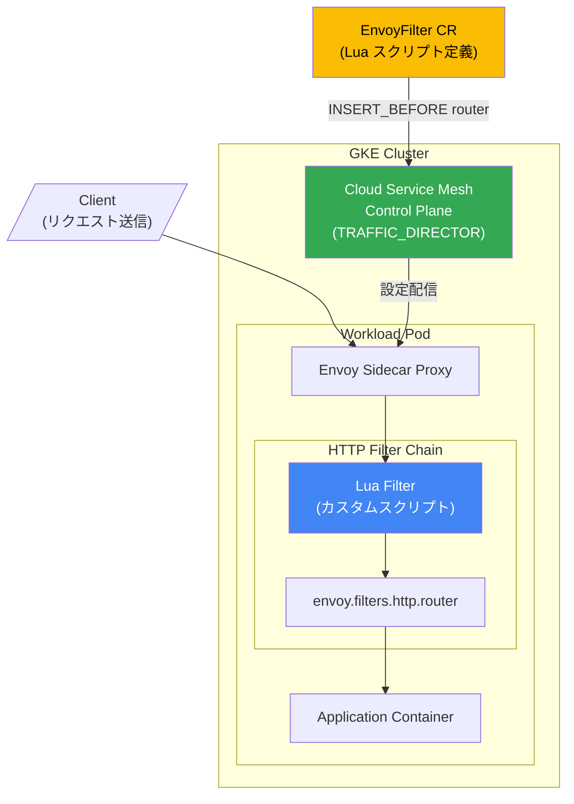

# Cloud Service Mesh: Envoy Lua Filter (Preview)

**リリース日**: 2026-06-22

**サービス**: Cloud Service Mesh

**機能**: Envoy Lua Filter (データプレーン拡張)

**ステータス**: Preview (Rapid リリースチャネル)

📊 [このアップデートのインフォグラフィックを見る](https://takech9203.github.io/google-cloud-news-summary/20260622-cloud-service-mesh-envoy-lua-filter.html)

## 概要

Cloud Service Mesh の EnvoyFilter API において、Envoy Lua Filter (`type.googleapis.com/envoy.extensions.filters.http.lua.v3.Lua`) が Preview 機能として Rapid リリースチャネルで利用可能になった。これにより、Envoy プロキシの HTTP フィルターチェーンに Lua スクリプトを挿入し、リクエスト/レスポンスの処理をカスタマイズできるようになる。

Lua Filter は Cloud Service Mesh のデータプレーン拡張 (Data Plane Extensibility) 機能の一部として提供される。EnvoyFilter API を通じて Envoy の設定を拡張し、標準の Istio API では実現できないカスタムロジックを実装できる。Wasm フィルターと比較して、Lua スクリプトはコンパイル不要で迅速に実装できるため、プロトタイピングやシンプルなリクエスト変換に適している。

**アップデート前の課題**

- Cloud Service Mesh のデータプレーンでカスタムロジックを実行するには、Wasm フィルターの開発・コンパイル・デプロイが必要だった
- シンプルなヘッダー操作やリクエスト変換でも、本格的なフィルター開発のオーバーヘッドが発生していた
- EnvoyFilter API で利用可能な拡張は LocalRateLimit、GrpcWeb、Compressor に限られていた

**アップデート後の改善**

- Lua スクリプトを `inline_string` フィールドで直接記述し、コンパイル不要でカスタムロジックを実装可能になった
- リクエスト/レスポンスヘッダーの動的操作、ルーティング判断の補助、ログ拡張などを簡潔に実現可能
- Rapid リリースチャネルの TRAFFIC_DIRECTOR コントロールプレーン実装で Preview として利用可能

## アーキテクチャ図



Envoy Lua Filter は EnvoyFilter カスタムリソースとして定義され、TRAFFIC_DIRECTOR コントロールプレーンを経由してサイドカープロキシに配信される。Lua スクリプトは HTTP フィルターチェーン内で router フィルターの前に挿入され、リクエスト処理のカスタマイズを行う。

## サービスアップデートの詳細

### 主要機能

1. **インライン Lua スクリプト実行**
   - `default_source_code.inline_string` フィールドで Lua コードを直接記述
   - コンパイルやビルドパイプラインが不要
   - リクエスト/レスポンスの両フェーズでスクリプトを実行可能

2. **EnvoyFilter API を通じた宣言的設定**
   - Kubernetes カスタムリソースとして Lua フィルターを定義
   - `workloadSelector` による適用対象の制御
   - `INSERT_BEFORE` オペレーションで router フィルターの前に挿入

3. **セキュリティ制約付きサンドボックス実行**
   - 外部呼び出し (`httpCall`) は使用不可
   - ファイル I/O、デバッグライブラリ、FFI は無効化
   - スクリプトサイズとパッチ数に上限を設定

## 技術仕様

### サポートされるフィールド

| フィールド | Rapid チャネル | Regular チャネル | Stable チャネル |
|-----------|:---:|:---:|:---:|
| `stat_prefix` | 対応 | - | - |
| `default_source_code.inline_string` | 対応 | - | - |

### スクリプト制限

| 制約項目 | 上限値 |
|---------|--------|
| 個別スクリプトサイズ | 50 KB |
| クラスター内全スクリプト合計サイズ | 100 KB |
| クラスター内 Lua EnvoyFilter configPatches 合計数 | 10 |

### サポートされない Lua 機能

| カテゴリ | 制限対象 |
|---------|---------|
| Envoy ラッパー | `httpCall`, `filterContext` |
| Lua 標準ライブラリ | `collectgarbage`, `dofile`, `getmetatable`, `loadfile`, `rawset`, `setfenv`, `setmetatable` |
| モジュール | `module` |
| OS パッケージ | `execute`, `remove`, `rename`, `setlocale` |
| I/O・デバッグ | `io`, `debug` ライブラリ全体 |
| LuaJIT 拡張 | `ffi`, `jit` |

### EnvoyFilter API 制約

| フィールド | サポート状況 |
|-----------|------------|
| `configPatches[].applyTo` | `HTTP_FILTER` のみ |
| `configPatches[].patch.operation` | `INSERT_FIRST` および `INSERT_BEFORE` (router フィルター使用時) のみ |
| `configPatches[].match.listener.filter.name` | `envoy.filters.network.http_connection_manager` のみ |
| `configPatches[].match.listener.filter.subFilter.name` | `envoy.filters.http.router` のみ |
| `targetRefs` | 非サポート |
| `configPatches[].patch.filterClass` | 非サポート |

## 設定方法

### 前提条件

1. Cloud Service Mesh が GKE クラスターにプロビジョニングされていること
2. TRAFFIC_DIRECTOR コントロールプレーン実装を使用していること
3. GKE クラスターが Rapid リリースチャネルに設定されていること
4. 対象ネームスペースでサイドカーインジェクションが有効であること

### 手順

#### ステップ 1: ネームスペースの設定確認

```bash
# Rapid チャネルのリビジョンラベルを確認
kubectl get namespace TARGET_NAMESPACE -o jsonpath='{.metadata.labels.istio\.io/rev}'
# "asm-managed-rapid" であることを確認
```

#### ステップ 2: Lua フィルターの EnvoyFilter リソース作成

```yaml
apiVersion: networking.istio.io/v1alpha3
kind: EnvoyFilter
metadata:
  name: custom-lua-filter
  namespace: TARGET_NAMESPACE
spec:
  workloadSelector:
    labels:
      app: TARGET_APP
  configPatches:
  - applyTo: HTTP_FILTER
    match:
      context: SIDECAR_INBOUND
      listener:
        filterChain:
          filter:
            name: "envoy.filters.network.http_connection_manager"
            subFilter:
              name: "envoy.filters.http.router"
    patch:
      operation: INSERT_BEFORE
      value:
        name: envoy.filters.http.lua
        typed_config:
          "@type": type.googleapis.com/udpa.type.v1.TypedStruct
          type_url: type.googleapis.com/envoy.extensions.filters.http.lua.v3.Lua
          value:
            stat_prefix: custom_lua
            default_source_code:
              inline_string: |
                function envoy_on_request(request_handle)
                  request_handle:headers():add("x-custom-header", "processed-by-lua")
                end
                function envoy_on_response(response_handle)
                  response_handle:headers():add("x-response-processed", "true")
                end
```

#### ステップ 3: 適用と確認

```bash
# EnvoyFilter を適用
kubectl apply -f lua-filter.yaml

# ステータス確認
kubectl get envoyfilter -n TARGET_NAMESPACE custom-lua-filter -o yaml
```

`status.conditions` で `Accepted` が `True` であることを確認する。

## メリット

### ビジネス面

- **迅速なプロトタイピング**: Wasm フィルターの開発・コンパイルサイクルなしに、即座にカスタムロジックをテスト可能
- **運用コスト削減**: シンプルなリクエスト変換やヘッダー操作を、追加インフラなしで実現

### 技術面

- **軽量な拡張**: Lua スクリプトはインラインで記述でき、別途のビルドパイプラインが不要
- **宣言的管理**: EnvoyFilter CR として GitOps ワークフローに統合可能
- **セキュリティサンドボックス**: 外部呼び出しやファイルアクセスが制限され、安全に実行可能

## デメリット・制約事項

### 制限事項

- Preview 段階のため、本番環境での使用は推奨されない (Pre-GA Offerings Terms が適用)
- Rapid リリースチャネルでのみ利用可能 (Regular/Stable では未対応)
- `httpCall` が使用できないため、外部サービスへの呼び出しは不可
- スクリプトサイズの上限が厳しい (単一 50KB、クラスター全体 100KB)
- クラスター内の Lua EnvoyFilter パッチ数は最大 10 に制限

### 考慮すべき点

- 複雑な Lua スクリプトはパフォーマンスに影響を与える可能性がある (十分なリソーステストが必要)
- サポート範囲は「ユーザーが提供した設定がワークロードに伝播されること」に限定され、スクリプト自体の正確性はサポート対象外
- 不正な設定はメッシュを不安定化させる可能性がある
- TRAFFIC_DIRECTOR コントロールプレーン実装でのみサポート (istiod 実装では非対応)

## ユースケース

### ユースケース 1: リクエストヘッダーの動的追加

**シナリオ**: マイクロサービス間の通信で、リクエストの属性に基づいてカスタムヘッダーを付加し、下流サービスでのルーティング判断やログ記録に活用する。

**実装例**:
```lua
function envoy_on_request(request_handle)
  local path = request_handle:headers():get(":path")
  if string.find(path, "/api/v2") then
    request_handle:headers():add("x-api-version", "v2")
  end
end
```

**効果**: アプリケーションコードを変更せずに、メッシュレベルでリクエストメタデータを付加できる。

### ユースケース 2: レスポンスヘッダーのサニタイズ

**シナリオ**: バックエンドサービスが返すデバッグ用ヘッダーやサーバーバージョン情報を、外部クライアントに露出しないよう削除する。

**実装例**:
```lua
function envoy_on_response(response_handle)
  response_handle:headers():remove("x-debug-info")
  response_handle:headers():remove("server")
end
```

**効果**: セキュリティ強化のため、サービスメッシュのエッジでセンシティブなヘッダーを確実に除去できる。

### ユースケース 3: カスタムメトリクス用のタグ付け

**シナリオ**: 特定のリクエストパターンを識別するためのヘッダーを付加し、Envoy の統計情報やアクセスログでの分析を容易にする。

**効果**: `stat_prefix` と組み合わせて、Lua フィルター経由の処理に関するメトリクスを収集し、オブザーバビリティを向上させる。

## 料金

Cloud Service Mesh の料金体系に準じる。Lua Filter 自体に追加料金は発生しない。

- Cloud Service Mesh は GKE Enterprise のサブスクリプションに含まれる、またはスタンドアロンサービスとして利用可能
- 詳細は [Cloud Service Mesh 料金ページ](https://cloud.google.com/service-mesh/pricing) を参照

## 関連サービス・機能

- **EnvoyFilter API (LocalRateLimit)**: 同じ EnvoyFilter API で設定可能なレート制限フィルター (GA)
- **EnvoyFilter API (GrpcWeb)**: gRPC-Web プロトコル変換フィルター (GA)
- **EnvoyFilter API (Compressor)**: レスポンス圧縮フィルター (GA)
- **Cloud Service Mesh Observability**: Lua フィルターの `stat_prefix` で生成されるメトリクスの監視
- **GKE (Google Kubernetes Engine)**: Cloud Service Mesh の実行基盤、Rapid リリースチャネルの設定が必要

## 参考リンク

- 📊 [インフォグラフィック](https://takech9203.github.io/google-cloud-news-summary/20260622-cloud-service-mesh-envoy-lua-filter.html)
- [公式リリースノート](https://docs.google.com/release-notes#June_22_2026)
- [データプレーン拡張ドキュメント](https://docs.cloud.google.com/service-mesh/docs/data-plane-extensibility#typegoogleapiscomenvoyextensionsfiltershttpluav3lua)
- [Cloud Service Mesh サポート機能一覧](https://docs.cloud.google.com/service-mesh/docs/supported-features-managed)
- [リリースチャネルの選択](https://docs.cloud.google.com/service-mesh/docs/managed/select-a-release-channel)
- [料金ページ](https://cloud.google.com/service-mesh/pricing)

## まとめ

Cloud Service Mesh で Envoy Lua Filter が Preview として利用可能になったことで、Wasm フィルターの開発コストをかけずにデータプレーンのカスタマイズが可能になった。現時点では Rapid チャネル限定かつ Preview のため本番利用には注意が必要だが、ヘッダー操作やリクエスト変換などのシンプルなユースケースにおいて、迅速なプロトタイピングや軽量な拡張を実現する有効な選択肢となる。GA 昇格に向けて Regular/Stable チャネルへの展開が期待される。

---

**タグ**: #CloudServiceMesh #EnvoyFilter #Lua #DataPlaneExtensibility #Preview #ServiceMesh #GKE #Envoy
