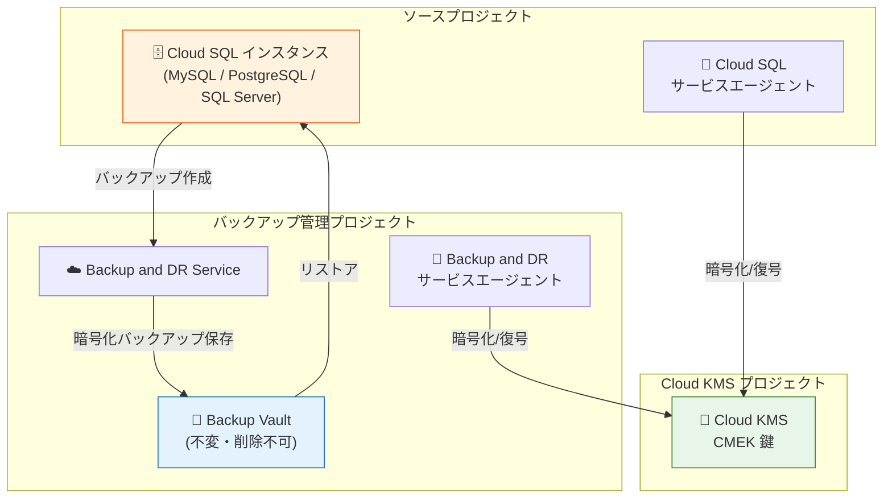

# Cloud SQL: CMEK サポートによるエンハンスドバックアップが GA

**リリース日**: 2026-06-22

**サービス**: Cloud SQL for MySQL / Cloud SQL for PostgreSQL / Cloud SQL for SQL Server

**機能**: Customer-managed encryption key (CMEK) サポートによるエンハンスドバックアップ

**ステータス**: GA (一般提供)

📊 [このアップデートのインフォグラフィックを見る](https://takech9203.github.io/google-cloud-news-summary/20260622-cloud-sql-cmek-enhanced-backups-ga.html)

## 概要

Cloud SQL のエンハンスドバックアップにおける顧客管理暗号化鍵 (CMEK) サポートが一般提供 (GA) となった。これにより、CMEK が有効化された Cloud SQL インスタンスを Google Cloud Backup and DR Service で保護できるようになる。本アップデートは Cloud SQL for MySQL、Cloud SQL for PostgreSQL、Cloud SQL for SQL Server の全 3 エンジンに適用される。

エンハンスドバックアップは、従来のスタンダードバックアップと異なり、バックアップを一元化されたバックアップ管理プロジェクトで管理・保存する仕組みであり、Backup and DR Service を活用して強制保持、きめ細かなスケジューリング、モニタリングを提供する。今回の GA により、CMEK で暗号化されたインスタンスのバックアップデータも、インスタンスと同じ鍵で保護されつつ、Backup Vault の不変性・削除不可性の恩恵を受けられるようになった。

**アップデート前の課題**

- CMEK 対応インスタンスでエンハンスドバックアップを利用する場合、CMEK サポートが Preview 段階であり本番環境での利用に制約があった
- 標準バックアップでは、バックアップがソースインスタンスと同一プロジェクトに保存されるため、プロジェクト削除時にバックアップも失われるリスクがあった
- CMEK 暗号化されたバックアップの一元管理と長期保持を両立する GA レベルのソリューションが存在しなかった

**アップデート後の改善**

- CMEK 対応 Cloud SQL インスタンスのエンハンスドバックアップが GA となり、本番環境で SLA 付きで利用可能になった
- Backup Vault に保存されたバックアップはプロジェクト削除からも保護され、CMEK 暗号化を維持したまま最大 10 年間保持できる
- Cloud SQL サービスエージェントと Backup and DR サービスエージェントがそれぞれ独立して CMEK にアクセスするため、一方のアクセス権失効時も他方の機能が維持される

## アーキテクチャ図



Cloud SQL インスタンスの CMEK 鍵は Cloud KMS で管理され、Cloud SQL サービスエージェントと Backup and DR サービスエージェントの両方がこの鍵にアクセスする。エンハンスドバックアップはインスタンスと同じ CMEK で暗号化され、別プロジェクトの Backup Vault に不変・削除不可な状態で保存される。

## サービスアップデートの詳細

### 主要機能

1. **CMEK 暗号化の継承**
   - エンハンスドバックアップは、インスタンスに設定された CMEK を自動的に継承して暗号化される
   - Backup Vault に設定された CMEK ではなく、インスタンスの CMEK が使用される
   - 鍵のローテーション後も、バックアップ作成時のアクティブな主キーバージョンが使用される

2. **デュアルサービスエージェントによるアクセス制御**
   - Cloud SQL サービスエージェント: インスタンスの暗号化/復号に使用
   - Backup and DR サービスエージェント: バックアップの暗号化/復号に使用
   - 両エージェントに独立して `roles/cloudkms.cryptoKeyEncrypterDecrypter` ロールを付与

3. **Backup Vault による不変ストレージ**
   - バックアップは Google マネージドの安全なストレージに保存
   - 不変性 (Immutability): データの変更が不可能
   - 削除不可性 (Indelibility): 最小強制保持期間中の削除が不可能
   - ソースプロジェクトが削除されてもバックアップは保護される

4. **全 3 エンジン対応**
   - Cloud SQL for MySQL
   - Cloud SQL for PostgreSQL
   - Cloud SQL for SQL Server
   - すべてのエンジンで同一の CMEK エンハンスドバックアップ機能を利用可能

## 技術仕様

### エンハンスドバックアップと標準バックアップの比較

| 機能 | 標準バックアップ | エンハンスドバックアップ |
|------|-----------------|------------------------|
| 一元化されたバックアップ管理 | - | 対応 |
| Backup Vault | - | 対応 |
| 自動バックアップスケジュール | 日次のみ | 時間単位、日次、週次、月次、年次 |
| バックアップ保持期間 | 最大 1 年 | 最大 10 年 |
| プロジェクト削除時のバックアップ保持 | - | 対応 |
| 強制保持とリテンションロック | - | 対応 |
| CMEK サポート | 対応 | 対応 (GA) |
| ポイントインタイムリカバリ (PITR) | 対応 | 対応 |
| インスタンス削除後の PITR | 対応 | 対応 |
| クロスリージョンバックアップとリストア | 対応 | - |

### 鍵アクセス失効時の動作

| シナリオ | インスタンスへの影響 | バックアップへの影響 |
|----------|---------------------|---------------------|
| Cloud SQL サービスエージェントのアクセス失効 | インスタンスが一時停止 | 既存バックアップのリストアは可能 |
| Backup and DR サービスエージェントのアクセス失効 | インスタンスは稼働継続 | 新規バックアップ不可、既存バックアップのリストア不可 |
| 鍵バージョンの無効化 | 該当鍵バージョンで暗号化されたバックアップのリストア不可 | 有効な主キーバージョンがあれば新規バックアップは作成可能 |
| 鍵バージョンの破棄 | 対象バックアップが永久にリストア不可 | 復元不可能 |

### 必要な IAM パーミッション

```
backupdr.backupPlans.list
backupdr.backupPlanAssociations.createForCloudSqlInstance
backupdr.backupPlanAssociations.fetchForCloudSqlInstance
backupdr.backupPlanAssociations.list
backupdr.backupPlanAssociations.getForCloudSqlInstance
backupdr.backupPlanAssociations.triggerBackupForCloudSqlInstance
backupdr.backupPlanAssociations.deleteForCloudSqlInstance
backupdr.backupPlans.useForCloudSqlInstance
backupdr.bvdataSources.get
backupdr.bvdataSources.list
```

## 設定方法

### 前提条件

1. Cloud SQL インスタンスが CMEK で暗号化されていること
2. Backup and DR API が有効化されていること
3. Backup Vault がインスタンスと互換性のあるリージョンに作成されていること
4. Backup and DR サービスエージェントに CMEK 鍵への `roles/cloudkms.cryptoKeyEncrypterDecrypter` ロールが付与されていること

### 手順

#### ステップ 1: Backup and DR サービスエージェントへの鍵アクセス権付与

```bash
# Backup and DR サービスエージェントに Cloud KMS CryptoKey 暗号化/復号ロールを付与
gcloud kms keys add-iam-policy-binding KMS_KEY_ID \
  --location=REGION \
  --keyring=KMS_KEYRING_ID \
  --member="serviceAccount:service-PROJECT_NUMBER@gcp-sa-backupdr.iam.gserviceaccount.com" \
  --role="roles/cloudkms.cryptoKeyEncrypterDecrypter"
```

Backup and DR サービスエージェントがインスタンスの CMEK 鍵にアクセスできるようにする。

#### ステップ 2: エンハンスドバックアップの有効化

```bash
# バックアッププランをインスタンスに関連付け
gcloud backup-dr backup-plan-associations create ASSOCIATION_NAME \
  --resource="projects/PROJECT_ID/instances/INSTANCE_NAME" \
  --resource-type="sqladmin.googleapis.com/Instance" \
  --backup-plan=BACKUP_PLAN_ID \
  --project=PROJECT_ID \
  --location=REGION
```

バックアッププランを CMEK 対応 Cloud SQL インスタンスに関連付けてエンハンスドバックアップを有効化する。

#### ステップ 3: オンデマンドバックアップの実行 (任意)

```bash
# オンデマンドバックアップをトリガー
gcloud backup-dr backup-plan-associations trigger-backup BACKUP_PLAN_ASSOCIATION_NAME \
  --backup-rule-id=BACKUP_RULE_ID \
  --project=PROJECT_ID \
  --location=BACKUP_VAULT_LOCATION
```

スケジュール以外にオンデマンドでバックアップを作成する場合に使用する。

## メリット

### ビジネス面

- **コンプライアンス要件への対応**: CMEK による暗号化とエンハンスドバックアップの強制保持により、金融規制や業界標準 (PCI DSS、HIPAA 等) のデータ保護要件を満たしやすくなる
- **データ保護の強化**: プロジェクト削除やアカウント侵害時にもバックアップが保護されるため、ランサムウェアや内部脅威からの復旧が可能
- **長期保持**: 最大 10 年間のバックアップ保持により、法的保持義務やアーカイブ要件に対応

### 技術面

- **暗号化の一貫性**: インスタンスとバックアップが同一の CMEK で暗号化されるため、鍵管理が簡素化
- **分離されたセキュリティ境界**: Cloud SQL とバックアップで異なるサービスエージェントを使用するため、攻撃面が最小化
- **一元管理**: 複数プロジェクトの Cloud SQL バックアップを単一の Backup and DR コンソールで管理可能

## デメリット・制約事項

### 制限事項

- Backup Vault と Cloud SQL インスタンスは同一リージョンまたは互換性のあるロケーションに配置する必要がある
- クロスリージョンバックアップとリストアはエンハンスドバックアップでは非対応 (標準バックアップのみ)
- Disaster Recovery (DR) レプリカを持つインスタンスではエンハンスドバックアップを有効化できない
- エンハンスドバックアップを使用中のインスタンスはレプリカに降格できない
- レプリカインスタンスにバックアッププランを関連付けることはできない
- Cloud KMS 鍵リングのロケーションはインスタンスのリージョンと一致する必要がある (マルチリージョンやグローバル鍵は使用不可)

### 考慮すべき点

- 元の鍵バージョンを破棄すると対象バックアップは永久に復元不可能になるため、鍵のライフサイクル管理が極めて重要
- Cloud SQL サービスエージェントと Backup and DR サービスエージェントの両方に鍵へのアクセス権を維持する必要がある
- バックアッププランの変更には、既存のプラン関連付けを削除してから新しいプランを関連付ける必要がある

## ユースケース

### ユースケース 1: 金融機関のデータベースバックアップコンプライアンス

**シナリオ**: 金融機関が顧客データを Cloud SQL for PostgreSQL に保存しており、規制要件により暗号化鍵の完全な管理と 7 年間のバックアップ保持が求められている。

**効果**: CMEK エンハンスドバックアップにより、自社管理の暗号化鍵でバックアップを保護しつつ、Backup Vault のリテンションロックで 7 年間の強制保持を実現。プロジェクト削除やアカウント侵害からもバックアップが保護される。

### ユースケース 2: マルチプロジェクト環境の統合バックアップ管理

**シナリオ**: 大規模企業が複数の GCP プロジェクトにまたがる Cloud SQL インスタンス (MySQL、PostgreSQL、SQL Server 混在) を運用しており、すべてのバックアップを統合的に管理したい。

**効果**: 一元化された Backup and DR プロジェクトですべてのインスタンスのバックアップを管理。CMEK による暗号化を維持しながら、バックアップの監視・レポーティングを統合。エンジンの種類を問わず同一のバックアップポリシーを適用可能。

### ユースケース 3: ランサムウェア対策としての不変バックアップ

**シナリオ**: サイバー攻撃によりソースプロジェクトが侵害された場合でも、データベースを復旧可能な状態を維持したい。

**効果**: Backup Vault の不変性・削除不可性により、攻撃者がソースプロジェクトの管理者権限を奪取してもバックアップの改ざん・削除が不可能。CMEK の鍵アクセスが Backup and DR サービスエージェント側で独立して維持されていればリストアが可能。

## 料金

エンハンスドバックアップの料金は Backup and DR Service の料金体系に基づき、Backup Vault に保存されたバックアップの総サイズに応じて課金される。CMEK の使用自体に追加料金は発生しないが、Cloud KMS の鍵使用料 (暗号化/復号操作) は別途発生する。

詳細な料金については以下を参照:
- [Backup and DR Service 料金](https://cloud.google.com/backup-disaster-recovery/pricing)
- [Cloud KMS 料金](https://cloud.google.com/kms/pricing)

## 利用可能リージョン

CMEK は Cloud SQL の全インスタンスロケーションで利用可能。ただし、Cloud KMS 鍵リングのロケーションは Cloud SQL インスタンスのリージョンと一致する必要がある。Backup Vault はインスタンスのロケーションと互換性のあるリージョンまたはマルチリージョンに配置する必要がある。

## 関連サービス・機能

- **Cloud KMS**: CMEK 鍵の作成・管理・ローテーションを担当。Cloud EKM による外部鍵管理にも対応
- **Backup and DR Service**: バックアップの一元管理、スケジューリング、モニタリングを提供するマネージドサービス
- **Cloud SQL エンハンスドバックアップ**: Backup and DR を活用した Cloud SQL の高機能バックアップオプション (2025 年 12 月に GA)
- **Cloud KMS Autokey**: CMEK 鍵の自動生成機能。ただし BackupRun リソースの鍵は自動生成されない
- **VPC Service Controls**: CMEK 鍵が別プロジェクトにある場合、KMS ホスティングプロジェクトをセキュリティ境界に追加する必要がある

## 参考リンク

- 📊 [インフォグラフィック](https://takech9203.github.io/google-cloud-news-summary/20260622-cloud-sql-cmek-enhanced-backups-ga.html)
- [公式リリースノート](https://docs.cloud.google.com/release-notes#June_22_2026)
- [Cloud SQL CMEK ドキュメント (MySQL)](https://docs.cloud.google.com/sql/docs/mysql/cmek)
- [Cloud SQL CMEK ドキュメント (PostgreSQL)](https://docs.cloud.google.com/sql/docs/postgres/cmek)
- [Cloud SQL CMEK ドキュメント (SQL Server)](https://docs.cloud.google.com/sql/docs/sqlserver/cmek)
- [Cloud SQL バックアップオプション](https://docs.cloud.google.com/sql/docs/mysql/backup-recovery/backup-options)
- [エンハンスドバックアップの管理](https://docs.cloud.google.com/sql/docs/mysql/backup-recovery/manage-enhanced-backups)
- [Backup and DR Service 概要](https://docs.cloud.google.com/backup-disaster-recovery/docs/concepts/backup-dr)
- [Backup and DR Service 料金](https://cloud.google.com/backup-disaster-recovery/pricing)

## まとめ

Cloud SQL の CMEK エンハンスドバックアップの GA は、規制要件の厳しい環境でデータベースを運用する組織にとって重要なマイルストーンである。顧客管理暗号化鍵による暗号化を維持しながら、Backup Vault の不変性・プロジェクト分離・長期保持を活用できるため、コンプライアンスとセキュリティを大幅に強化できる。CMEK 対応の Cloud SQL インスタンスを運用している場合は、エンハンスドバックアップへの移行を検討し、まず Backup and DR サービスエージェントへの鍵アクセス権付与から始めることを推奨する。

---

**タグ**: #CloudSQL #MySQL #PostgreSQL #SQLServer #CMEK #暗号化 #バックアップ #BackupAndDR #セキュリティ #GA #CloudKMS
