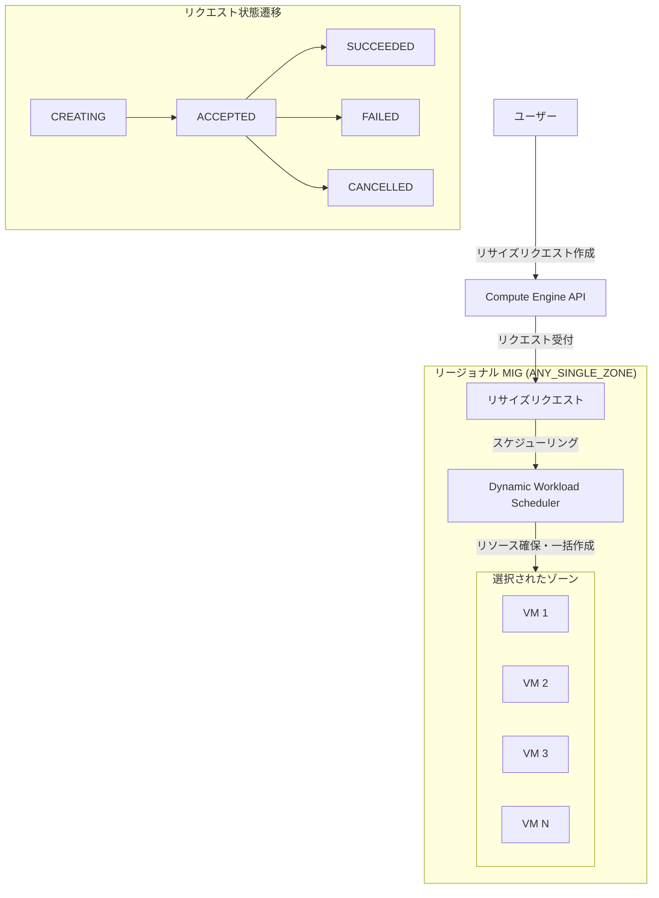

# Compute Engine: リージョナル MIG リサイズリクエスト - 一般提供開始

**リリース日**: 2026-06-22

**サービス**: Compute Engine

**機能**: Regional MIG resize requests (リージョナル MIG リサイズリクエスト)

**ステータス**: GA (一般提供)

📊 [このアップデートのインフォグラフィックを見る](https://takech9203.github.io/google-cloud-news-summary/20260622-compute-engine-mig-resize-requests-ga.html)

## 概要

Compute Engine のリージョナルマネージドインスタンスグループ (MIG) において、リサイズリクエストを使用してインスタンスを一括作成する機能が一般提供 (GA) となった。この機能により、リージョナル MIG 内で指定した数の VM インスタンスを、リソースが利用可能になった時点で全て同時に作成できるようになる。

リサイズリクエストは、GPU などの高需要リソースを確保する際に特に有用であり、Flex-start プロビジョニングモデルまたは Reservation-bound プロビジョニングモデルと組み合わせて使用する。Flex-start モデルでは vCPU、GPU、メモリに対して最大 53% の割引が適用され、リソースが利用可能になり次第 VM が作成される。部分的なキャパシティに対する課金を回避し、全てのリソースが揃った時点で一括作成されるため、コスト最適化にも貢献する。

主な対象ユーザーは、AI/ML ワークロードの実行に GPU リソースを必要とするデータサイエンティストや ML エンジニア、バッチ処理で大量のコンピューティングリソースを一時的に必要とするプラットフォームエンジニアである。

**アップデート前の課題**

- リージョナル MIG でリサイズリクエストを使用する場合、以前はゾーナル MIG でのみ GA として利用可能であり、リージョナル MIG では制限があった
- リージョン内の複数ゾーンにまたがる VM の一括作成を MIG の仕組みで管理する標準的な手段が限定されていた
- GPU などの高需要リソースを大量に確保する際、リソースが徐々にしか利用可能にならず部分的なキャパシティに対して課金が発生する可能性があった
- 複数のゾーンにまたがるワークロードの展開時に、手動でゾーン選択を管理する必要があった

**アップデート後の改善**

- リージョナル MIG でリサイズリクエストが GA として利用可能になり、リージョン内での一括インスタンス作成が正式にサポートされた
- ANY_SINGLE_ZONE ターゲット分散シェイプにより、リソースの可用性やクォータに基づいて最適なゾーンが自動的に選択される
- 全てのリソースが利用可能になるまで課金が発生せず、一括作成によるコスト最適化が実現された
- Dynamic Workload Scheduler との連携により、リソースの確保がスケジューリングベースで最適化された

## アーキテクチャ図



リサイズリクエストはユーザーからの作成要求を受け付けた後、Dynamic Workload Scheduler によりリソースの可用性が確認され、全てのリソースが揃った時点でリージョン内の単一ゾーンに VM が一括作成される。

## サービスアップデートの詳細

### 主要機能

1. **リージョナル MIG での一括インスタンス作成**
   - リージョナル MIG 内で `resizeBy` パラメータにより指定した数の VM を全て同時に作成
   - ANY_SINGLE_ZONE ターゲット分散シェイプを使用し、最適なゾーンが自動選択される
   - VM は可能な限り物理的に近い場所に配置される

2. **Flex-start VM の作成**
   - 最大 7 日間実行可能なワークロード向け
   - リソースが利用可能になり次第、VM が作成される
   - vCPU、GPU、メモリに対して最大 53% の割引が適用

3. **Reservation-bound VM の作成**
   - カレンダーモードの将来のリザベーション用に自動作成されたリザベーションを消費
   - A4X Max、A4X、A4、A3 Ultra、H4D マシンタイプに対応
   - リザベーション開始時刻以降に VM が作成される

4. **VM 名の指定 (プレビュー)**
   - `instanceNames` パラメータで個別の VM 名を指定可能
   - 名前の数により作成される VM 数が決定される

## 技術仕様

### リサイズリクエストのプロパティ

| 項目 | 詳細 |
|------|------|
| resizeBy | 作成する VM 数を指定 |
| instanceNames | VM 名のリストを指定 (プレビュー) |
| requestedRunDuration | VM の実行時間 (10 分 ~ 7 日間) |
| 状態遷移 | CREATING -> ACCEPTED -> SUCCEEDED / FAILED / CANCELLED |
| 自動削除 | 完了/失敗/キャンセル後 14 日で自動削除 |

### 対応マシンタイプ

| プロビジョニングモデル | 対応マシンタイプ |
|------|------|
| Flex-start | 全ての GPU マシンタイプ (A4X Max・A4X を除く)、H4D |
| Reservation-bound | A4X Max、A4X、A4、A3 Ultra、H4D |

### リージョナル MIG の要件

| 項目 | 要件 |
|------|------|
| ターゲット分散シェイプ | ANY_SINGLE_ZONE のみ |
| 修復 | オフにする必要あり |
| オートスケーリング | 削除する必要あり |
| アップデートタイプ | Opportunistic に設定 |
| スタンバイプールモード | manual (デフォルト) |

### 必要な IAM 権限

| 権限 | 用途 |
|------|------|
| compute.instanceTemplates.create | インスタンステンプレートの作成 |
| compute.instanceGroupManagers.create | MIG の作成 |
| compute.instanceGroupManagers.update | リサイズリクエストの作成 |

推奨ロール: `roles/compute.instanceAdmin.v1` (Compute Instance Admin v1)

## 設定方法

### 前提条件

1. Flex-start VM の場合、リクエストするリソースに対する十分なクォータがあること
2. インスタンステンプレートが所定の要件を満たしていること
3. MIG で修復がオフ、オートスケーリングが未設定であること

### 手順

#### ステップ 1: インスタンステンプレートの作成

Flex-start VM 用のインスタンステンプレートでは以下を設定する必要がある:
- `maxRunDuration` と `instanceTerminationAction` の指定
- リザベーション消費の防止
- Flex-start プロビジョニングモデルの使用

#### ステップ 2: リージョナル MIG の作成

```bash
gcloud compute instance-groups managed create MIG_NAME \
    --template TEMPLATE_NAME \
    --size 0 \
    --region REGION \
    --target-distribution-shape any-single-zone
```

注: MIG のサイズは 0 で作成し、リサイズリクエストで VM を追加する。

#### ステップ 3: 修復の無効化とオートスケーリングの削除

```bash
# 修復をオフにする
gcloud compute instance-groups managed update MIG_NAME \
    --region REGION \
    --default-action-on-vm-failure do-nothing

# オートスケーラーが存在する場合は削除
gcloud compute instance-groups managed stop-autoscaling MIG_NAME \
    --region REGION
```

#### ステップ 4: リサイズリクエストの作成

```bash
gcloud compute instance-groups managed resize-requests create MIG_NAME \
    --resize-request=RESIZE_REQUEST_NAME \
    --resize-by=COUNT \
    --region=REGION
```

パラメータ:
- `MIG_NAME`: MIG の名前
- `RESIZE_REQUEST_NAME`: リサイズリクエストの名前 (MIG 内で一意)
- `COUNT`: 一括作成する VM の数
- `REGION`: MIG が存在するリージョン

#### ステップ 5: リサイズリクエストの状態確認

```bash
gcloud compute instance-groups managed resize-requests describe MIG_NAME \
    --resize-request=RESIZE_REQUEST_NAME \
    --region=REGION
```

## メリット

### ビジネス面

- **コスト最適化**: 部分的なキャパシティに対する課金を回避し、全リソースが揃った時点でのみ課金開始。Flex-start では最大 53% の割引が適用
- **GPU リソースの確保**: 高需要の GPU リソースを確実に確保できる仕組みにより、AI/ML プロジェクトのスケジュール遅延リスクを軽減
- **運用効率の向上**: リソース確保の自動化により、インフラチームの手動作業を削減

### 技術面

- **アトミックな一括作成**: 全ての VM が同時に作成されるため、分散ワークロード (分散学習など) の開始タイミングが統一される
- **VM の近接配置**: 可能な限り物理的に近い場所に VM が配置され、ネットワークレイテンシを最小化
- **リージョンレベルの柔軟性**: ANY_SINGLE_ZONE により、リソースの可用性に基づいて最適なゾーンが自動選択される
- **Dynamic Workload Scheduler 連携**: リソースの空き状況を監視し、最適なタイミングで VM を作成

## デメリット・制約事項

### 制限事項

- リージョナル MIG では ANY_SINGLE_ZONE ターゲット分散シェイプのみ使用可能
- MIG の修復機能をオフにする必要がある
- オートスケーリングとの併用は不可 (オートスケーラーの削除が必須)
- リサイズリクエストで作成された VM にはローリングアップデートを適用できない
- Flex-start VM の停止・再作成は不可
- ACCEPTED 状態のリサイズリクエストがある場合、MIG のターゲットサイズ変更やカナリアアップデートは不可
- プレースメントポリシーの指定は不可
- Per-instance configuration や All-instances configuration の適用は不可

### 考慮すべき点

- まれに部分的な VM 作成が発生する可能性があり、その場合は自動削除されるが一時的な課金が発生する可能性がある
- ACCEPTED 状態のリクエストをキャンセルしない限り、作成中 (CREATING) の VM を個別に削除できない
- MIG 削除時に進行中のリサイズリクエストがある場合、SUCCEEDED に遷移するまで削除が待機される
- Flex-start VM の実行時間は最大 7 日間に制限される

## ユースケース

### ユースケース 1: 大規模 AI/ML 分散学習

**シナリオ**: 数十台の GPU VM を同時に起動して分散学習ジョブを実行する必要がある。全ての VM が揃わないと学習を開始できないため、部分的な起動では無駄な課金が発生する。

**実装例**:
```bash
# A100 GPU x 50 台の一括作成リクエスト
gcloud compute instance-groups managed resize-requests create ml-training-mig \
    --resize-request=training-job-001 \
    --resize-by=50 \
    --region=us-central1
```

**効果**: 50 台全ての GPU VM が同時に作成されるため、部分起動による無駄な課金がなくなり、学習開始タイミングが統一される。最大 53% の割引により大幅なコスト削減も実現。

### ユースケース 2: バッチ処理の一時的なスケールアウト

**シナリオ**: 毎日の定期バッチ処理で大量のコンピューティングリソースを一時的に必要とし、処理完了後はリソースを解放したい。

**実装例**:
```bash
# 実行時間を指定した一括作成 (24 時間後に自動削除)
gcloud compute instance-groups managed resize-requests create batch-mig \
    --resize-request=daily-batch-001 \
    --resize-by=100 \
    --requested-run-duration=86400s \
    --region=asia-northeast1
```

**効果**: requestedRunDuration により VM が自動的に削除されるため、リソースの解放忘れによる不要な課金を防止。

### ユースケース 3: リザベーション消費による確定キャパシティの利用

**シナリオ**: 将来のリザベーション (カレンダーモード) を購入しており、予約開始時に確実に VM を起動して利用したい。

**効果**: リザベーション開始時刻に自動的に VM が作成され、予約したリソースを確実に消費。追加のクォータも不要。

## 料金

リサイズリクエストの作成、キャンセル、削除自体に料金は発生しない。

### Flex-start VM の料金

- Dynamic Workload Scheduler の料金体系に基づく
- vCPU、GPU、メモリに対して最大 53% の割引
- 従量課金 (Pay-as-you-go)
- VM 作成時から課金開始、実行時間終了時または削除時に課金終了

### Reservation-bound VM の料金

- リザベーション消費リソースに対する追加課金なし
- リザベーション外のリソース (ディスク、IP アドレスなど) は通常料金
- リザベーション終了時に VM が自動削除される

詳細は [Dynamic Workload Scheduler の料金ページ](https://cloud.google.com/products/dws/pricing) を参照。

## 利用可能リージョン

リージョナル MIG リサイズリクエストは、Compute Engine の MIG がサポートされる全てのリージョンで利用可能。ただし、使用するマシンタイプ (特に GPU マシンタイプ) の可用性はリージョンおよびゾーンにより異なる。ANY_SINGLE_ZONE ターゲット分散シェイプにより、指定リージョン内のリソースが利用可能なゾーンが自動的に選択される。

GPU リソースの可用性については [GPU リージョンとゾーン](https://cloud.google.com/compute/docs/gpus/gpu-regions-zones) を参照。

## 関連サービス・機能

- **Dynamic Workload Scheduler**: リサイズリクエストのスケジューリングと Flex-start VM のリソース確保を管理
- **Compute Engine リザベーション**: Reservation-bound プロビジョニングモデルでリサイズリクエストと連携
- **AI Hypercomputer**: MIG リサイズリクエストを活用した大規模 AI/ML ワークロード向けインフラストラクチャ
- **GKE Dynamic Workload Scheduler (flex-start)**: GKE 環境でのリサイズリクエスト相当の機能 (ProvisioningRequest を使用)
- **Cloud Monitoring**: MIG の状態やリサイズリクエストの進捗を監視
- **Capacity Planner**: VM および GPU の実際の使用量と予測使用量を可視化

## 参考リンク

- 📊 [インフォグラフィック](https://takech9203.github.io/google-cloud-news-summary/20260622-compute-engine-mig-resize-requests-ga.html)
- [公式リリースノート](https://docs.cloud.google.com/release-notes#June_22_2026)
- [About resize requests in a MIG](https://docs.cloud.google.com/compute/docs/instance-groups/about-resize-requests-mig)
- [Create resize requests in a MIG](https://docs.cloud.google.com/compute/docs/instance-groups/create-resize-requests-mig)
- [Manage resize requests in a MIG](https://docs.cloud.google.com/compute/docs/instance-groups/manage-resize-requests-mig)
- [Dynamic Workload Scheduler 料金](https://cloud.google.com/products/dws/pricing)
- [リージョナル MIG の分散シェイプ](https://docs.cloud.google.com/compute/docs/instance-groups/regional-mig-distribution-shape)

## まとめ

リージョナル MIG リサイズリクエストの GA 化により、GPU などの高需要リソースをリージョンレベルで一括確保する仕組みが正式に利用可能となった。AI/ML ワークロードにおける分散学習や大規模バッチ処理において、部分的なリソース確保による無駄な課金を避けつつ、最大 53% の割引でコスト効率の良いリソース利用が実現される。大規模な GPU ワークロードを運用するチームは、この機能の導入によりリソース確保の信頼性向上とコスト最適化を検討すべきである。

---

**タグ**: #ComputeEngine #MIG #ResizeRequests #GPU #DynamicWorkloadScheduler #FlexStart #AI #ML #GA
