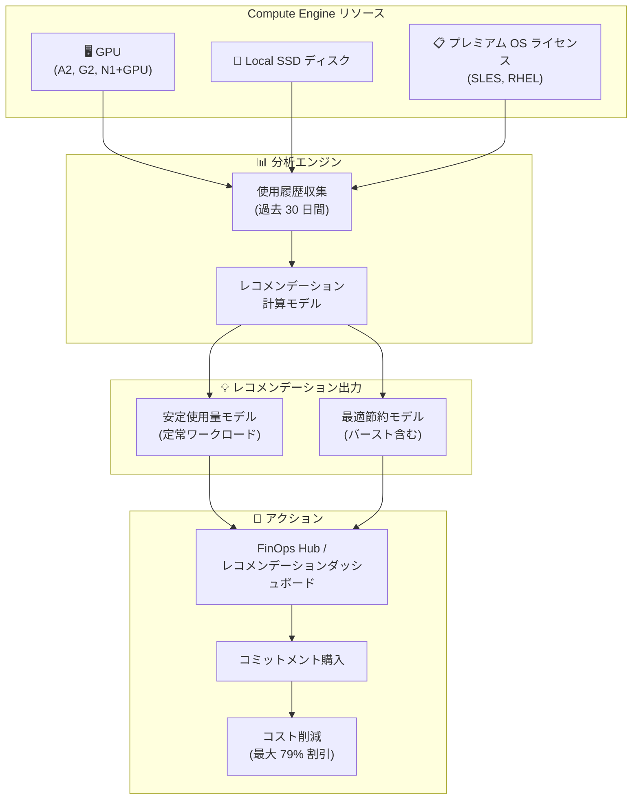

# Compute Engine / Cloud Billing: リソースベース CUD レコメンデーションが GPU、Local SSD、OS ライセンスに対応

**リリース日**: 2026-06-22

**サービス**: Compute Engine / Cloud Billing

**機能**: リソースベース CUD レコメンデーション (GPU、Local SSD ディスク、OS ライセンス対応)

**ステータス**: GA (一般提供)

📊 [このアップデートのインフォグラフィックを見る](https://takech9203.github.io/google-cloud-news-summary/20260622-compute-engine-resource-cud-recommendations-gpu-ssd-os.html)

## 概要

Google Cloud は、リソースベースの確約利用割引 (CUD: Committed Use Discount) レコメンデーション機能を GPU、Local SSD ディスク、プレミアム OS ライセンスに対して一般提供 (GA) として拡張した。これにより、これらのリソースを使用しているユーザーは、過去の使用量データに基づいた最適なコミットメント購入の推奨を自動的に受け取ることができるようになった。

CUD レコメンデーションは、Google Cloud が Compute Engine インスタンスの支出傾向をコミットメントあり/なしの両面から分析し、月次ベースで生成する。リスト価格で課金されているリソース使用量に対して追加のコミットメントを購入することで、GPU ワークロードや Local SSD を活用したハイパフォーマンスストレージ、プレミアム OS 環境のコスト最適化が可能となる。

対象ユーザーは、Compute Engine で GPU (A2、G2、N1 + GPU など)、Local SSD ディスク、または SLES/RHEL などのプレミアム OS ライセンスを定常的に利用している組織の FinOps 担当者、クラウドアーキテクト、インフラ管理者である。

**アップデート前の課題**

- GPU、Local SSD、OS ライセンスに対する CUD レコメンデーションが提供されておらず、最適なコミットメント購入量を手動で分析する必要があった
- リソースベース CUD レコメンデーションは vCPU とメモリに限定されており、GPU ワークロードの多い環境ではコスト最適化の機会を見逃しやすかった
- コミットメント購入の意思決定に必要なデータ (使用率の傾向、損益分岐点) を自身で計算する必要があった

**アップデート後の改善**

- GPU、Local SSD ディスク、プレミアム OS ライセンスに対して自動的に CUD レコメンデーションが生成されるようになった
- FinOps Hub のレコメンデーションダッシュボードから、推奨されるコミットメント購入量と期待される節約額を直接確認可能になった
- 過去 30 日間の使用履歴に基づく安定使用量モデルと最適節約モデルの 2 種類のレコメンデーションが提供される

## アーキテクチャ図



Compute Engine のリソース使用状況が分析エンジンで処理され、2 種類のレコメンデーションモデルを経て FinOps Hub に表示される流れを示している。ユーザーはレコメンデーションに基づきコミットメントを購入し、コスト削減を実現する。

## サービスアップデートの詳細

### 主要機能

1. **GPU 向け CUD レコメンデーション**
   - A2 (Accelerator-optimized)、G2/G4 (Graphics-optimized)、N1 + GPU 構成に対応
   - GPU は最大 55% (一部タイプは最大 65%) のオンデマンド価格からの割引が可能
   - GPU コミットメント購入時はリザベーションの作成・アタッチが必須

2. **Local SSD ディスク向け CUD レコメンデーション**
   - C3、C3D、C4、C4A、C4D、N1、N2、N2D、C2、C2D、H4D、Z3 など多数のマシンシリーズに対応
   - Local SSD は最大 55% のオンデマンド価格からの割引が可能
   - 大部分のマシンシリーズでリザベーションのアタッチが必須 (C4/C4A/C4D/H4D/Z3 の Titanium SSD は例外)

3. **プレミアム OS ライセンス向け CUD レコメンデーション**
   - SUSE Linux Enterprise Server (SLES): 最大 79% 割引
   - SLES for SAP: 最大 63% 割引
   - Red Hat Enterprise Linux (RHEL): 最大 20% 割引
   - ハードウェアコミットメントとは別に購入可能

4. **レコメンデーション計算モデル**
   - **安定使用量モデル**: 30 日間の連続稼働リソースに基づく定常ワークロード向け推奨
   - **最適節約モデル**: バースト利用も含め純節約額を最大化する推奨 (損益分岐点を超える使用期間を考慮)

## 技術仕様

### CUD 割引率

| リソースタイプ | 最大割引率 | 備考 |
|------|------|------|
| GPU (一般) | 最大 55% | ほとんどの GPU タイプ |
| GPU (一部タイプ) | 最大 65% | 特定の GPU タイプ |
| Local SSD ディスク | 最大 55% | 全対象マシンシリーズ共通 |
| OS ライセンス (SLES) | 最大 79% | SUSE Linux Enterprise Server |
| OS ライセンス (SLES for SAP) | 最大 63% | SAP 向け SLES イメージ |
| OS ライセンス (RHEL) | 最大 20% | Red Hat Enterprise Linux |

### コミットメント期間と適用条件

| 項目 | 詳細 |
|------|------|
| コミットメント期間 | 1 年または 3 年 |
| 割引率 | 3 年プランの方が高い割引率 |
| スコープ | リージョン単位 (CUD シェアリングで Billing Account 配下の全プロジェクトに適用可) |
| GPU リザベーション | コミットメント購入時にリザベーションのアタッチが必須 |
| Local SSD リザベーション | 大部分のマシンシリーズで必須 (Titanium SSD は例外あり) |
| 課金 | 月額課金 (使用有無に関わらず契約期間終了まで請求) |
| キャンセル | 購入後のキャンセル不可 |

### 必要な権限 (レコメンデーション閲覧)

```
# FinOps Hub へのアクセス (以下いずれか)
roles/billing.viewer          # Billing Account Viewer
roles/billing.admin           # Billing Account Administrator

# レコメンデーション詳細の確認
roles/recommender.viewer      # Recommender Viewer (Cloud Billing Account に付与)
roles/viewer                  # Project Viewer (各プロジェクト)
```

## 設定方法

### 前提条件

1. Cloud Billing アカウントに対する Billing Account Viewer 以上の権限
2. レコメンデーション対象プロジェクトに対する Project Viewer 以上の権限
3. 対象リソース (GPU / Local SSD / プレミアム OS) の 30 日以上の使用実績

### 手順

#### ステップ 1: FinOps Hub でレコメンデーションを確認

Google Cloud コンソールで「Billing」>「FinOps Hub」に移動し、「Potential savings/month」チャートから「View all recommendations」をクリックする。CUD 関連のレコメンデーションが GPU、Local SSD、OS ライセンスごとに表示される。

#### ステップ 2: レコメンデーションの詳細確認とシナリオモデリング

個別のレコメンデーションをクリックして詳細を確認する。「Create a scenario」でカバー率やコミットメント期間を調整し、最適な購入量をシミュレーションできる。

#### ステップ 3: コミットメントの購入

```bash
# gcloud CLI でリソースベースコミットメントを購入する例 (GPU)
gcloud compute commitments create my-gpu-commitment \
    --region=us-central1 \
    --plan=36-month \
    --resources=type=nvidia-tesla-a100,amount=4 \
    --reservations-from-file=reservations.yaml
```

レコメンデーションに基づいてコミットメントを購入する。GPU の場合はリザベーションの同時作成が必須となる。

## メリット

### ビジネス面

- **GPU ワークロードのコスト最適化**: AI/ML トレーニングやレンダリングなど GPU 集約型ワークロードで最大 65% のコスト削減が可能
- **FinOps の自動化**: 手動分析なしに最適なコミットメント購入量の推奨を受けられ、意思決定の迅速化と精度向上に寄与
- **OS ライセンスコストの大幅削減**: SLES 環境で最大 79% の削減が可能で、SAP on Google Cloud のような大規模環境で特にインパクトが大きい

### 技術面

- **データドリブンな最適化**: 過去 30 日間の実使用データに基づく 2 種類の計算モデル (安定使用量/最適節約) により、ワークロード特性に合った推奨を提供
- **シナリオモデリング対応**: カバー率や期間を変更した場合の節約額をシミュレーション可能で、複数パターンの比較検討が容易
- **CUD シェアリングとの連携**: Billing Account 配下の全プロジェクトでコミットメントを共有できるため、組織全体での最適化が可能

## デメリット・制約事項

### 制限事項

- CUD レコメンデーションは A3 Ultra、A4、A4X、A4X Max マシンシリーズには未対応
- Cloud TPU に対する CUD レコメンデーションは利用不可
- リソースベース CUD レコメンデーションは Compute Engine SKU を使用するリソースのみが対象 (Compute Engine、GKE、Managed Service for Apache Spark、Managed Service for Apache Airflow 1、Vertex AI で使用される VM)
- コミットメント購入後のキャンセルは不可

### 考慮すべき点

- GPU コミットメント購入時にはリザベーションの作成・アタッチが必須であり、ゾーン単位での容量確保が必要
- コミットメントはリソースの使用有無に関わらず月額で課金されるため、使用量が減少した場合でも費用が発生し続ける
- レコメンデーション生成には最低 30 日間の使用履歴が必要
- CUD シェアリングの設定状況 (2026 年 6 月 16 日以降作成のアカウントはデフォルト有効) を確認の上、コミットメントのスコープを理解しておく必要がある

## ユースケース

### ユースケース 1: AI/ML トレーニング環境のコスト最適化

**シナリオ**: 機械学習チームが A2 インスタンス (NVIDIA A100 GPU) を常時 4 台以上使用してモデルトレーニングを実施している。現在はオンデマンド価格で課金されている。

**効果**: CUD レコメンデーションにより安定使用量を特定し、3 年コミットメントを購入することで最大 65% のコスト削減。月額数千ドル単位の節約が期待できる。

### ユースケース 2: SAP on Google Cloud の OS ライセンスコスト削減

**シナリオ**: SAP HANA 環境で SLES for SAP ライセンスを大量に使用している。各 VM のライセンス費用がオンデマンド価格で積み上がっている。

**効果**: OS ライセンスの CUD レコメンデーションに基づき SLES for SAP コミットメントを購入することで、最大 63% の OS ライセンスコスト削減を実現。

### ユースケース 3: ハイパフォーマンスデータベースの Local SSD コスト最適化

**シナリオ**: リアルタイムデータ処理基盤として N2 インスタンスに Local SSD を多数アタッチし、低レイテンシのストレージを常時利用している。

**効果**: Local SSD 向け CUD レコメンデーションに基づき 1 年または 3 年コミットメントを購入し、最大 55% のストレージコスト削減を実現。

## 料金

CUD レコメンデーション機能自体は無料で利用可能。コミットメントを購入した場合の割引率は以下の通り。

### 割引率一覧

| リソースタイプ | 1 年コミットメント | 3 年コミットメント |
|--------|-----------------|-----------------|
| GPU (一般) | 最大 37% | 最大 55% |
| GPU (一部タイプ) | 最大 43% | 最大 65% |
| Local SSD ディスク | 最大 37% | 最大 55% |
| SLES | -- | 最大 79% |
| SLES for SAP | -- | 最大 63% |
| RHEL | -- | 最大 20% |

※ 具体的な割引率はリージョンおよびリソースタイプにより異なる。最新の料金は [VM instances pricing](https://cloud.google.com/compute/vm-instance-pricing) および [Disk and image pricing](https://cloud.google.com/compute/disks-image-pricing) を参照。

## 関連サービス・機能

- **Cloud Billing FinOps Hub**: CUD レコメンデーションの表示・管理を行うダッシュボード
- **Recommender API**: プログラマティックに CUD レコメンデーションを取得可能 (BigQuery エクスポート経由でも利用可)
- **Compute Engine Reservations**: GPU/Local SSD コミットメント購入時に必須となるゾーン単位の容量予約
- **CUD シェアリング**: Billing Account 配下の複数プロジェクトでコミットメント割引を共有する機能
- **Compute Flexible CUD (Spend-based)**: リソースベースの代替としてドルベースで柔軟に割引を適用する方式 (ただし GPU は対象外)

## 参考リンク

- 📊 [インフォグラフィック](https://takech9203.github.io/google-cloud-news-summary/20260622-compute-engine-resource-cud-recommendations-gpu-ssd-os.html)
- [公式リリースノート](https://docs.cloud.google.com/release-notes#June_22_2026)
- [CUD レコメンデーション ドキュメント](https://docs.cloud.google.com/docs/cuds-recommender)
- [リソースベース CUD 概要](https://docs.cloud.google.com/compute/docs/instances/committed-use-discounts-overview)
- [リソースベース CUD 購入ガイド](https://docs.cloud.google.com/compute/docs/instances/signing-up-committed-use-discounts)
- [FinOps Hub レコメンデーションダッシュボード](https://docs.cloud.google.com/billing/docs/how-to/finops-recommendations-dashboard)
- [VM instances pricing](https://cloud.google.com/compute/vm-instance-pricing)
- [Disk and image pricing](https://cloud.google.com/compute/disks-image-pricing)

## まとめ

今回のアップデートにより、GPU、Local SSD ディスク、プレミアム OS ライセンスを定常的に利用している組織は、データドリブンな CUD レコメンデーションを活用して最適なコミットメント購入の判断が可能になった。特に AI/ML ワークロードや SAP 環境など高コストリソースを使用している場合、FinOps Hub でレコメンデーションを確認し、シナリオモデリングで最適なコミットメント期間とカバー率を検討することを推奨する。

---

**タグ**: #ComputeEngine #CloudBilling #CUD #CommittedUseDiscount #GPU #LocalSSD #OSLicense #FinOps #コスト最適化 #GA
