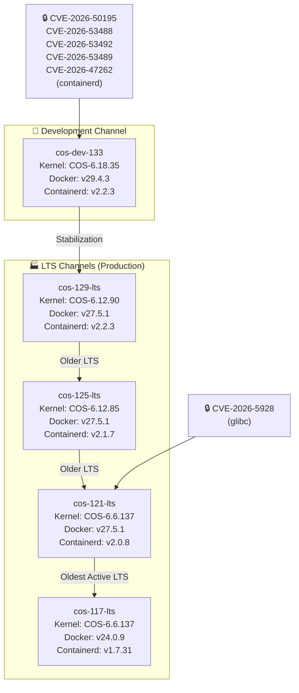

# Container Optimized OS (COS): 2026年6月イメージアップデートおよびセキュリティ修正

**リリース日**: 2026-06-22

**サービス**: Container Optimized OS (COS)

**機能**: 2026年6月イメージアップデートおよびセキュリティ修正

**ステータス**: リリース済み

📊 [このアップデートのインフォグラフィックを見る](https://takech9203.github.io/google-cloud-news-summary/20260622-container-optimized-os-june-updates.html)

## 概要

Container Optimized OS (COS) の全チャネル (dev、LTS) にわたるイメージアップデートがリリースされた。今回のリリースでは、5つのイメージが更新され、containerd における複数の CVE 修正および glibc の脆弱性修正が含まれている。

特に注目すべきは、cos-dev-133 チャネルでの containerd に関する5件のセキュリティ修正 (CVE-2026-50195、CVE-2026-53488、CVE-2026-53492、CVE-2026-53489、CVE-2026-47262) と、cos-121 LTS での glibc の脆弱性修正 (CVE-2026-5928) である。コンテナランタイムの基盤となるコンポーネントのセキュリティ修正であるため、GKE ノードや Compute Engine 上でコンテナワークロードを実行しているすべてのユーザーに影響する。

cos-dev-133 では Docker v29.4.3 および最新カーネル COS-6.18.35 が採用されており、logrotate、oslogin、cos-gpu-installer、sqlite などの主要パッケージも大幅にアップグレードされている。

## アーキテクチャ図



COS のリリースチャネル構造と、各チャネルでのセキュリティ修正の適用状況を示す。dev チャネルで最新の containerd セキュリティ修正が適用され、cos-121 LTS では glibc の脆弱性が修正されている。

## サービスアップデートの詳細

### セキュリティ修正

1. **containerd の脆弱性修正 (cos-dev-133)**
   - CVE-2026-50195: app-containers/containerd の脆弱性修正
   - CVE-2026-53488: app-containers/containerd の脆弱性修正
   - CVE-2026-53492: app-containers/containerd の脆弱性修正
   - CVE-2026-53489: app-containers/containerd の脆弱性修正
   - CVE-2026-47262: app-containers/containerd の脆弱性修正
   - コンテナランタイムの基盤コンポーネントに関する修正であり、コンテナのセキュリティ境界に影響する可能性がある

2. **glibc の脆弱性修正 (cos-121-lts)**
   - CVE-2026-5928: sys-libs/glibc の脆弱性修正
   - C ライブラリの脆弱性であり、システム全体のセキュリティに関わる重要な修正

### cos-dev-133 の主要パッケージアップグレード

1. **logrotate v3.22.0-r1**
   - ログローテーション機能の最新版

2. **oslogin v20260605.00**
   - OS Login 機能の更新 (IAM ベースの SSH アクセス管理)

3. **google-breakpad v2026.06.03.194714-r275**
   - クラッシュレポートライブラリの更新

4. **cos-gpu-installer v2.7.4**
   - GPU ドライバインストーラーの更新 (GPU ワークロード利用者に影響)

5. **sqlite v3.53.2-r1**
   - 組み込みデータベースエンジンの更新

6. **less v704**
   - テキストビューアの更新

## 技術仕様

### イメージバージョンマトリックス

| イメージ名 | チャネル | カーネル | Docker | Containerd | サポート終了 |
|-----------|---------|---------|--------|------------|-------------|
| cos-dev-133-19879-0-0 | dev | COS-6.18.35 | v29.4.3 | v2.2.3 | 未定 |
| cos-129-19506-224-52 | LTS | COS-6.12.90 | v27.5.1 | v2.2.3 | 2028年3月 |
| cos-125-19216-395-112 | LTS | COS-6.12.85 | v27.5.1 | v2.1.7 | 2027年9月 |
| cos-121-18867-381-184 | LTS | COS-6.6.137 | v27.5.1 | v2.0.8 | 2027年3月 |
| cos-117-18613-613-62 | LTS | COS-6.6.137 | v24.0.9 | v1.7.31 | 2026年9月 |

### セキュリティ修正サマリー

| CVE ID | 影響コンポーネント | 対象イメージ |
|--------|-------------------|-------------|
| CVE-2026-50195 | app-containers/containerd | cos-dev-133 |
| CVE-2026-53488 | app-containers/containerd | cos-dev-133 |
| CVE-2026-53492 | app-containers/containerd | cos-dev-133 |
| CVE-2026-53489 | app-containers/containerd | cos-dev-133 |
| CVE-2026-47262 | app-containers/containerd | cos-dev-133 |
| CVE-2026-5928 | sys-libs/glibc | cos-121-lts |

### カーネルバージョン比較

| チャネル | カーネル系列 | バージョン |
|---------|------------|-----------|
| dev (133) | COS-6.18 | 6.18.35 |
| LTS 129 | COS-6.12 | 6.12.90 |
| LTS 125 | COS-6.12 | 6.12.85 |
| LTS 121 | COS-6.6 | 6.6.137 |
| LTS 117 | COS-6.6 | 6.6.137 |

## 設定方法

### イメージの確認

```bash
# 利用可能な COS イメージを一覧表示
gcloud compute images list --project=cos-cloud --filter="family:cos-129-lts"

# 最新イメージの詳細確認
gcloud compute images describe-from-family cos-129-lts --project=cos-cloud
```

### インスタンスの更新

```bash
# 自動更新が有効な場合、イメージは自動的に適用される
# 手動で新しいイメージを使用する場合:
gcloud compute instances create INSTANCE_NAME \
  --image-family=cos-129-lts \
  --image-project=cos-cloud \
  --zone=ZONE
```

### GKE ノードプールの更新

```bash
# GKE ノードプールのイメージを更新
gcloud container clusters upgrade CLUSTER_NAME \
  --node-pool=POOL_NAME \
  --image-type=COS_CONTAINERD \
  --zone=ZONE
```

## メリット

### セキュリティ面

- **containerd の複数脆弱性修正**: コンテナランタイムの基盤コンポーネントが堅牢化され、コンテナエスケープや権限昇格のリスクが低減
- **glibc の脆弱性修正**: システム全体のセキュリティが向上し、メモリ破壊やバッファオーバーフロー等の攻撃リスクが低減

### 技術面

- **最新カーネル (6.18.35)**: dev チャネルで最新の Linux カーネル機能とパフォーマンス改善を先行検証可能
- **GPU ワークロード対応強化**: cos-gpu-installer v2.7.4 により GPU ドライバの互換性と安定性が向上

## デメリット・制約事項

### 制限事項

- containerd の CVE 修正は現時点で cos-dev-133 のみに適用されており、LTS チャネルへのバックポートは今後のリリースで行われる見込み
- cos-117 LTS のサポート終了が 2026年9月に迫っており、早期のマイグレーション計画が必要

### 考慮すべき点

- cos-dev チャネルは本番環境での使用は推奨されない (テスト・実験用途)
- イメージ更新時にはノードの再起動が必要となるため、ワークロードの可用性を考慮した計画的なローリングアップデートが推奨される
- cos-117 から cos-121 以降へのマイグレーションでは Docker バージョンが v24.x から v27.x に大幅に変更されるため、互換性テストが必要

## 関連サービス・機能

- **Google Kubernetes Engine (GKE)**: COS は GKE のデフォルトノード OS イメージとして使用される。ノード自動アップグレード機能により、セキュリティ修正が自動的に適用される
- **Compute Engine**: COS イメージを使用してコンテナ最適化 VM を直接作成可能
- **Artifact Registry / Container Registry**: COS 上で動作するコンテナイメージの保存・管理
- **Cloud Monitoring**: COS ノードのヘルスチェックとセキュリティ監視

## 参考リンク

- 📊 [インフォグラフィック](https://takech9203.github.io/google-cloud-news-summary/20260622-container-optimized-os-june-updates.html)
- [公式リリースノート](https://docs.cloud.google.com/release-notes#June_22_2026)
- [Container Optimized OS ドキュメント](https://cloud.google.com/container-optimized-os/docs)
- [COS バージョニングスキーム](https://cloud.google.com/container-optimized-os/docs/concepts/versioning)
- [COS セキュリティ概要](https://cloud.google.com/container-optimized-os/docs/concepts/security)
- [COS リリースノート (dev)](https://cloud.google.com/container-optimized-os/docs/release-notes/dev)
- [COS リリースノート (milestone 129)](https://cloud.google.com/container-optimized-os/docs/release-notes/m129)
- [COS リリースノート (milestone 121)](https://cloud.google.com/container-optimized-os/docs/release-notes/m121)

## まとめ

今回の COS イメージアップデートでは、containerd と glibc に関する重要なセキュリティ修正が含まれている。特に cos-121 LTS を使用している環境では glibc の CVE-2026-5928 への対応として速やかなイメージ更新が推奨される。また、cos-117 LTS のサポート終了が 2026年9月に迫っているため、cos-121 以降への計画的なマイグレーションを検討すべきである。

---

**タグ**: #ContainerOptimizedOS #COS #Security #CVE #Containerd #Docker #Kernel #GKE #ComputeEngine
