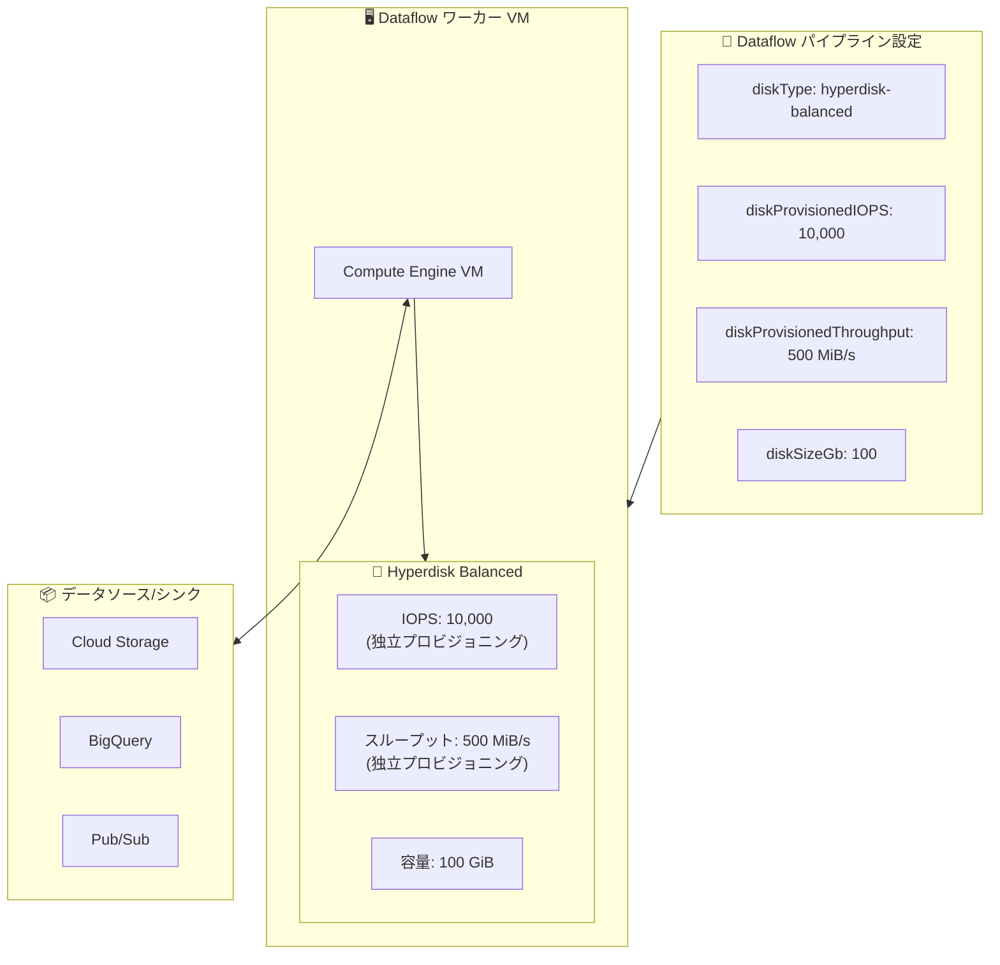

# Dataflow: Hyperdisk Balanced ディスクのサポート

**リリース日**: 2026-06-22

**サービス**: Dataflow

**機能**: Hyperdisk Balanced ディスクによるワーカー VM のディスク構成

**ステータス**: Feature

📊 [このアップデートのインフォグラフィックを見る](https://takech9203.github.io/google-cloud-news-summary/20260622-dataflow-hyperdisk-balanced.html)

## 概要

Dataflow ワーカー VM で Hyperdisk Balanced ディスクが利用可能になった。これにより、ディスクサイズとは独立して IOPS とスループットをプロビジョニングできるようになり、パイプラインのワークロード要件に応じた最適なディスクパフォーマンスを設定できる。

Hyperdisk Balanced は Google Cloud の汎用ブロックストレージであり、最大 160,000 IOPS と 2,400 MiB/s のスループットを単一ボリュームでプロビジョニングできる。Dataflow では `diskProvisionedIOPS` と `diskProvisionedThroughput` (Java SDK) または `disk_provisioned_iops` と `disk_provisioned_throughput_mibps` (Python/Go SDK) のパイプラインオプションを通じて、これらの値を独立して制御できる。

この機能は、I/O 集約型のバッチパイプラインやストリーミングパイプラインを実行する Solutions Architect やデータエンジニアにとって、ディスクパフォーマンスのボトルネックを解消するための重要なオプションとなる。

**アップデート前の課題**

- Dataflow ワーカー VM のディスクタイプは pd-standard や pd-ssd に限定されており、IOPS とスループットはディスクサイズに比例して決まるため、パフォーマンスを上げるにはディスクサイズを大きくする必要があった
- ディスクサイズの増加はストレージコストの増加を意味し、必要なのはパフォーマンスだけの場合でも無駄なコストが発生していた
- I/O 集約型ワークロードでは、必要な IOPS を得るためにオーバープロビジョニングが避けられなかった

**アップデート後の改善**

- Hyperdisk Balanced によりディスクサイズとは独立して IOPS とスループットをプロビジョニング可能になった
- ワークロードの I/O パターンに正確に合わせたパフォーマンス設定ができるため、コスト最適化が可能になった
- 最大 160,000 IOPS、2,400 MiB/s のスループットまでスケールでき、高負荷なデータ処理パイプラインにも対応可能になった

## アーキテクチャ図



Dataflow ワーカー VM に Hyperdisk Balanced ディスクを接続し、IOPS・スループット・容量をそれぞれ独立して設定する構成を示している。パイプラインオプションで指定した値がワーカー VM のディスクパフォーマンスに直接反映される。

## サービスアップデートの詳細

### 主要機能

1. **Hyperdisk Balanced ディスクタイプのサポート**
   - Dataflow ワーカー VM のディスクタイプとして `hyperdisk-balanced` を指定可能
   - Java: `workerDiskType` パイプラインオプション
   - Python: `worker_disk_type` パイプラインオプション (値は `compute.googleapis.com/projects/PROJECT_ID/zones/ZONE/diskTypes/hyperdisk-balanced`)
   - Go: `disk_type` パイプラインオプション

2. **IOPS の独立プロビジョニング**
   - ディスクサイズとは無関係に IOPS を設定可能
   - 設定範囲: 3,000 ~ 160,000 IOPS (ディスクサイズによる制限あり)
   - 未設定時のデフォルト: 3,000 IOPS
   - Java: `diskProvisionedIOPS`
   - Python/Go: `disk_provisioned_iops`

3. **スループットの独立プロビジョニング**
   - ディスクサイズとは無関係にスループットを設定可能
   - 設定範囲: 140 ~ 2,400 MiB/s (プロビジョニングされた IOPS に依存)
   - 未設定時のデフォルト: 140 MiB/s
   - Java: `diskProvisionedThroughput`
   - Python/Go: `disk_provisioned_throughput_mibps`

## 技術仕様

### パイプラインオプション一覧

| オプション (Java) | オプション (Python/Go) | 説明 | デフォルト値 |
|---|---|---|---|
| `workerDiskType` | `worker_disk_type` / `disk_type` | ディスクタイプ | Dataflow が自動選択 |
| `diskProvisionedIOPS` | `disk_provisioned_iops` | プロビジョニング IOPS | 3,000 IOPS |
| `diskProvisionedThroughput` | `disk_provisioned_throughput_mibps` | プロビジョニングスループット (MiB/s) | 140 MiB/s |
| `diskSizeGb` | `disk_size_gb` | ディスクサイズ (GB) | ジョブタイプにより異なる |

### Hyperdisk Balanced パフォーマンス制限

| 項目 | 制限値 |
|------|--------|
| 最大 IOPS (単一ボリューム) | 160,000 |
| 最大スループット (単一ボリューム) | 2,400 MiB/s |
| ディスクサイズ範囲 | 4 GiB ~ 64 TiB |
| ベースライン IOPS (無料) | 3,000 |
| ベースラインスループット (無料) | 140 MiB/s |

### IOPS に対する設定可能スループット範囲

| プロビジョニング IOPS | 設定可能スループット (MiB/s) |
|---|---|
| 3,000 | 140 ~ 750 |
| 4,000 | 140 ~ 1,000 |
| 8,000 | 140 ~ 2,000 |
| 32,000 | 140 ~ 2,400 |
| 160,000 | 625 ~ 2,400 |

### 必須 SDK バージョン

- Apache Beam SDK 2.74.0 以降が必要

## 設定方法

### 前提条件

1. Apache Beam SDK バージョン 2.74.0 以降がインストールされていること
2. Dataflow ワーカーが Hyperdisk Balanced をサポートするマシンタイプを使用していること

### 手順

#### ステップ 1: Java SDK での設定例

```java
PipelineOptions options = PipelineOptionsFactory.create();
options.as(DataflowPipelineOptions.class).setWorkerDiskType("hyperdisk-balanced");
options.as(DataflowPipelineOptions.class).setDiskProvisionedIOPS(10000L);
options.as(DataflowPipelineOptions.class).setDiskProvisionedThroughput(500L);
options.as(DataflowPipelineOptions.class).setDiskSizeGb(100);
```

#### ステップ 2: Python SDK での設定例

```python
pipeline_options = PipelineOptions([
    '--worker_disk_type=compute.googleapis.com/projects/PROJECT_ID/zones/ZONE/diskTypes/hyperdisk-balanced',
    '--disk_provisioned_iops=10000',
    '--disk_provisioned_throughput_mibps=500',
    '--disk_size_gb=100',
])
```

#### ステップ 3: Go SDK での設定例

```go
// パイプラインオプションで Hyperdisk Balanced を指定
--disk_type=compute.googleapis.com/projects/PROJECT_ID/zones/ZONE/diskTypes/hyperdisk-balanced
--disk_provisioned_iops=10000
--disk_provisioned_throughput_mibps=500
--disk_size_gb=100
```

## メリット

### ビジネス面

- **コスト最適化**: ディスクサイズを不必要に大きくせず、必要なパフォーマンスだけをプロビジョニングすることで、ストレージコストを削減できる
- **パフォーマンス予測可能性**: 固定されたプロビジョニング値により、パイプラインの実行時間をより正確に見積もることが可能

### 技術面

- **独立スケーリング**: IOPS、スループット、容量をそれぞれ独立して制御でき、ワークロードに最適な構成が可能
- **高パフォーマンス**: 最大 160,000 IOPS、2,400 MiB/s のスループットにより、大規模 I/O 集約型パイプラインの処理が高速化
- **サブミリ秒レイテンシ**: Hyperdisk Balanced はサブミリ秒レイテンシを実現する設計

## デメリット・制約事項

### 制限事項

- Apache Beam SDK 2.74.0 以降が必要。それ以前のバージョンでは IOPS/スループットのプロビジョニングオプションは使用不可
- Dataflow で使用可能な Hyperdisk タイプは Hyperdisk Balanced のみ (Hyperdisk Extreme、Hyperdisk Throughput 等は対象外)
- ワーカー VM のマシンタイプが Hyperdisk Balanced をサポートしている必要がある
- プロビジョニングされたパフォーマンスは、VM レベルのパフォーマンス上限を超えることはできない

### 考慮すべき点

- Streaming Engine 使用時またはマシンタイプが N4 の場合は Persistent Disk を指定すべきではない (ドキュメントの記載に注意)
- IOPS/スループットの変更は 4 時間に 1 回のみ可能 (ただし Dataflow のジョブでは通常ジョブ作成時に設定)
- Hyperdisk はリソースベースの CUD やサステインド使用ディスカウントの対象外

## ユースケース

### ユースケース 1: 大規模バッチ ETL パイプライン

**シナリオ**: 数百 GB のデータを Cloud Storage から読み込み、変換して BigQuery に書き込むバッチパイプライン。Dataflow Shuffle を使用しないケースでは、シャッフルデータの I/O がボトルネックとなる。

**実装例**:
```bash
python -m my_pipeline \
  --runner=DataflowRunner \
  --worker_disk_type=compute.googleapis.com/projects/my-project/zones/us-central1-a/diskTypes/hyperdisk-balanced \
  --disk_provisioned_iops=50000 \
  --disk_provisioned_throughput_mibps=1000 \
  --disk_size_gb=200
```

**効果**: ディスク I/O スループットを 1,000 MiB/s にプロビジョニングすることで、シャッフルフェーズの処理時間を大幅に短縮できる。

### ユースケース 2: ストリーミングパイプラインのステート管理

**シナリオ**: Streaming Engine を使用しないストリーミングジョブで、大量のステートデータをローカルディスクに保持する必要がある場合。

**効果**: 高い IOPS をプロビジョニングすることで、ステートの読み書きレイテンシを低減し、イベント処理のスループットを向上できる。

## 料金

Hyperdisk Balanced の料金は、プロビジョニングされた容量・IOPS・スループットに基づいて課金される。ベースラインパフォーマンス (3,000 IOPS、140 MiB/s) は無料で含まれる。

### 料金例

| 項目 | 単価 (us-central1) |
|------|-------------------|
| 容量 (GB あたり/月) | $0.080 |
| IOPS (ベースライン超過分、1 IOPS あたり/月) | $0.005 |
| スループット (ベースライン超過分、1 MiB/s あたり/月) | $0.040 |

### 料金計算例 (100 GiB、10,000 IOPS、500 MiB/s)

| 項目 | 計算 | 月額 |
|------|------|------|
| 容量 | 100 GiB x $0.080 | $8.00 |
| IOPS (超過分) | (10,000 - 3,000) x $0.005 | $35.00 |
| スループット (超過分) | (500 - 140) x $0.040 | $14.40 |
| **合計** | | **$57.40** |

## 関連サービス・機能

- **Compute Engine Hyperdisk**: Dataflow ワーカー VM のディスクとして使用される基盤ストレージサービス
- **Dataflow Shuffle**: バッチジョブでは Dataflow Shuffle を使用することでディスク I/O の依存を軽減可能。Shuffle を使わない場合に Hyperdisk Balanced が特に有効
- **Streaming Engine**: ストリーミングジョブでは Streaming Engine によりディスク使用量を削減。Streaming Engine 使用時は Persistent Disk の指定は不要
- **Dataflow Prime**: ワーカー VM のリソースを自動最適化。ただし特定の VM タイプ指定はサポートしていない

## 参考リンク

- 📊 [インフォグラフィック](https://takech9203.github.io/google-cloud-news-summary/20260622-dataflow-hyperdisk-balanced.html)
- [公式リリースノート](https://docs.cloud.google.com/release-notes#June_22_2026)
- [Dataflow ワーカー VM のディスクタイプ設定](https://docs.cloud.google.com/dataflow/docs/guides/configure-worker-vm#disk-type)
- [IOPS とスループットのプロビジョニング](https://docs.cloud.google.com/dataflow/docs/guides/configure-worker-vm#provisioned-performance)
- [Hyperdisk Balanced について](https://docs.cloud.google.com/compute/docs/disks/hd-types/hyperdisk-balanced)
- [Hyperdisk 料金](https://docs.cloud.google.com/compute/disks-image-pricing#disk)
- [Dataflow パイプラインオプション リファレンス](https://docs.cloud.google.com/dataflow/docs/reference/pipeline-options#worker-level_options)

## まとめ

Dataflow で Hyperdisk Balanced ディスクが利用可能になったことで、I/O 集約型パイプラインのパフォーマンスをディスクサイズに依存せず最適化できるようになった。特に Dataflow Shuffle や Streaming Engine を使用しないパイプラインにおいて、ディスク I/O がボトルネックとなるケースでの効果が大きい。既存のパイプラインで I/O 関連の性能問題がある場合は、Apache Beam SDK 2.74.0 以降にアップデートし、Hyperdisk Balanced のプロビジョニングオプションの活用を検討すべきである。

---

**タグ**: #Dataflow #HyperdiskBalanced #IOPS #Throughput #WorkerVM #DiskPerformance #ApacheBeam #BatchProcessing #StreamingProcessing
