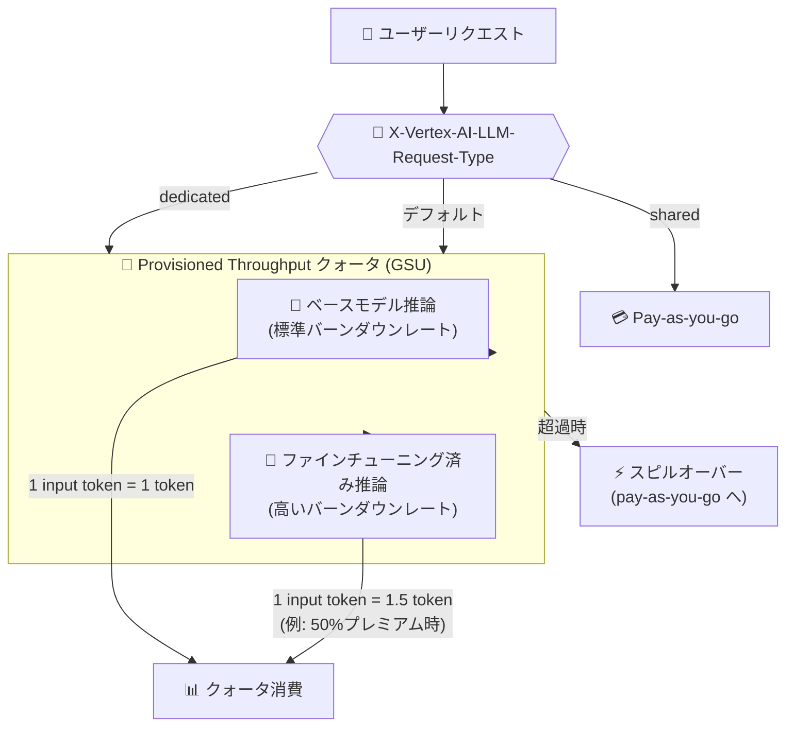

# Gemini Enterprise Agent Platform: Provisioned Throughput でファインチューニング済み Gemini 3 モデル推論をサポート

**リリース日**: 2026-06-22

**サービス**: Gemini Enterprise Agent Platform

**機能**: Provisioned Throughput - Supervised Fine-tuned Model Support

**ステータス**: Preview

📊 [このアップデートのインフォグラフィックを見る](https://takech9203.github.io/google-cloud-news-summary/20260622-gemini-agent-platform-provisioned-throughput-fine-tuned.html)

## 概要

Gemini Enterprise Agent Platform の Provisioned Throughput が、教師ありファインチューニング済み Gemini 3 モデルの推論をサポートするようになった。これにより、ファインチューニング済みモデルのエンドポイントに対しても、ベースモデルと同一の Provisioned Throughput クォータを使用してスループットを確保できる。

本機能は Preview ステータスで提供されており、教師ありファインチューニングをサポートする Google モデルに対して Provisioned Throughput を適用できる。重要な変更点として、Gemini 3 以降ではファインチューニング済みモデルの推論にはベースモデルと比較して高いバーンダウンレートが適用される。このプレミアムは、ファインチューニング推論の料金プレミアムに比例する。

対象ユーザーは、本番環境でファインチューニング済み Gemini 3 モデルを使用しており、安定したスループットとコスト予測性を必要とするエンタープライズユーザーである。

**アップデート前の課題**

- Gemini 3 のファインチューニング済みモデルに対して Provisioned Throughput によるスループット保証ができなかった
- ファインチューニング済みモデルの推論を本番環境で安定的に運用するには pay-as-you-go に依存する必要があった
- ファインチューニング済みモデルのスループットが他のワークロードの影響を受ける可能性があった

**アップデート後の改善**

- Provisioned Throughput をベースモデルとファインチューニング済みモデルの両方に適用可能になった
- 同一クォータでベースモデルとファインチューニング済みモデルの推論を管理でき、運用が簡素化された
- `X-Vertex-AI-LLM-Request-Type` ヘッダーでトラフィック制御が可能になり、コスト管理の柔軟性が向上した

## アーキテクチャ図



Provisioned Throughput クォータ内でベースモデルとファインチューニング済みモデルの推論が共存する仕組みを示す。Gemini 3 以降ではファインチューニング済み推論に高いバーンダウンレートが適用され、同じトークン数でもより多くのクォータを消費する。

## サービスアップデートの詳細

### 主要機能

1. **共有クォータモデル**
   - ファインチューニング済みモデルのエンドポイントと対応するベースモデルが同一の Provisioned Throughput クォータにカウントされる
   - 例: `gemini-3.1-flash-lite` 向けに購入した Provisioned Throughput は、そのプロジェクト内で作成された `gemini-3.1-flash-lite` のファインチューニング版からのリクエストも優先する

2. **差別化バーンダウンレート (Gemini 3 以降)**
   - Gemini 3 以降のモデルでは、ファインチューニング済み推論のバーンダウンレートがベースモデルより高い
   - プレミアムはファインチューニング推論の料金プレミアムに比例する
   - 例: ファインチューニング推論がベースモデルの 50% 増の料金の場合、バーンダウンレートも 50% 増 (1 input text token = 1.5 tokens)

3. **トラフィック制御**
   - `X-Vertex-AI-LLM-Request-Type` HTTP ヘッダーでリクエストごとのトラフィック制御が可能
   - `dedicated`: Provisioned Throughput のみ使用 (超過時は 429 エラー)
   - `shared`: pay-as-you-go のみ使用 (Provisioned Throughput をバイパス)
   - デフォルト: 超過分は自動的に pay-as-you-go にスピルオーバー

## 技術仕様

### バーンダウンレートの変更 (Gemini 3 以降)

| 項目 | ベースモデル | ファインチューニング済みモデル (50%プレミアム例) |
|------|------|------|
| 1 input text token | 1 token | 1.5 tokens |
| 1 output text token | モデル依存 (例: 6 tokens) | モデル依存 (例: 9 tokens) |
| クォータ消費速度 | 標準 | 高い (プレミアム比例) |

### Gemini 3 以前との比較

| 項目 | Gemini 3 以前 | Gemini 3 以降 |
|------|------|------|
| クォータ共有 | あり | あり |
| バーンダウンレート | ベースモデルと同一 | ファインチューニング版は高い |
| プレミアム計算 | なし | 料金プレミアムに比例 |

### トラフィック制御の設定例

```python
from google import genai
from google.genai.types import HttpOptions

client = genai.Client(
    http_options=HttpOptions(
        api_version="v1",
        headers={
            # Provisioned Throughput のみ使用
            "X-Vertex-AI-LLM-Request-Type": "dedicated"
        },
    )
)

response = client.models.generate_content(
    model="gemini-3.1-flash-lite",  # ファインチューニング済みモデル ID を指定
    contents="Your prompt here",
)
```

## 設定方法

### 前提条件

1. Provisioned Throughput の注文が有効であること (対象モデルに対して GSU を購入済み)
2. ファインチューニング済みモデルが Provisioned Throughput を購入したプロジェクト内で作成されていること
3. 以下のいずれかの IAM ロールが付与されていること:
   - `Gemini Enterprise Agent Platform Administrator`
   - `Gemini Enterprise Agent Platform Platform Provisioned Throughput Admin`

### 手順

#### ステップ 1: Provisioned Throughput の購入

Google Cloud コンソールからベースモデル (例: `gemini-3.1-flash-lite`) に対して Provisioned Throughput を購入する。ファインチューニング済みモデルは同一クォータを自動的に使用する。

#### ステップ 2: GSU 必要量の計算

ファインチューニング済みモデルの高いバーンダウンレートを考慮して GSU を計算する:

```
# 計算例 (50% プレミアムの場合)
base_input_tokens_per_query = 1000
ft_burndown_adjusted = 1000 * 1.5 = 1500  # ファインチューニング版
output_tokens_per_query = 300 * 6 * 1.5 = 2700  # 出力も同様にプレミアム適用
total_per_query = 1500 + 2700 = 4200
total_per_second = 4200 * QPS
GSUs_needed = total_per_second / throughput_per_GSU
```

#### ステップ 3: リクエストの実行

特別なコード変更なしで、Provisioned Throughput が自動的にファインチューニング済みモデルの推論に適用される。

## メリット

### ビジネス面

- **コスト予測性の向上**: ファインチューニング済みモデルの推論コストを固定費として管理できる
- **運用の簡素化**: ベースモデルとファインチューニング版を同一クォータで一元管理

### 技術面

- **スループット保証**: 本番環境でファインチューニング済みモデルの応答時間を安定化
- **柔軟なトラフィック制御**: ヘッダーによるリクエストレベルの制御で、開発環境と本番環境を使い分け可能
- **自動スピルオーバー**: 超過分は自動的に pay-as-you-go に回され、リクエスト失敗を回避

## デメリット・制約事項

### 制限事項

- Preview ステータスであり、SLA の対象外
- ファインチューニング済みモデルの推論はベースモデルと比較して高いバーンダウンレートが適用されるため、同じ GSU 数でも実効スループットが低下する
- Provisioned Throughput はモデルエイリアスでは使用できず、具体的なモデルバージョン ID を指定する必要がある
- バッチ予測 (batch prediction) はサポートされない
- Vertex AI Agents や Agent Search から呼び出されるモデルには適用されない

### 考慮すべき点

- GSU の見積もり時にファインチューニング版の高いバーンダウンレートを考慮する必要がある
- Provisioned Throughput は途中キャンセル不可のコミットメント契約である
- プレミアム率は料金ページで確認し、正確な GSU 必要量を算出すること

## ユースケース

### ユースケース 1: 金融機関のカスタマイズ済みチャットボット

**シナリオ**: 銀行が Gemini 3.1 Flash-Lite をファインチューニングして、社内用語や規制要件に対応したチャットボットを運用。毎秒 50 リクエストの安定スループットが必要。

**効果**: Provisioned Throughput により応答レイテンシの安定化とコストの固定化を実現。高いバーンダウンレートを考慮した GSU 購入で、ピーク時もスループットを保証。

### ユースケース 2: SaaS プロバイダーのマルチテナント推論

**シナリオ**: SaaS プロバイダーがテナントごとにファインチューニングした Gemini 3 モデルを使用。ベースモデルの汎用リクエストとファインチューニング版の特化リクエストが混在。

**効果**: 同一 Provisioned Throughput クォータでベースモデルとファインチューニング版を管理でき、リソース効率が向上。ヘッダーによる制御で重要テナントを優先処理。

## 料金

Provisioned Throughput は GSU 単位の固定費サブスクリプションで提供される。ファインチューニング済みモデルの推論は、ベースモデルの料金プレミアムに比例した高いバーンダウンレートが適用される。

詳細な料金情報は以下を参照:
- [Provisioned Throughput 料金](https://cloud.google.com/gemini-enterprise-agent-platform/generative-ai/pricing#provisioned-throughput)
- [モデルチューニング料金](https://cloud.google.com/gemini-enterprise-agent-platform/generative-ai/pricing#model-tuning)

## 関連サービス・機能

- **Supervised Fine-tuning**: Gemini モデルをカスタムデータで教師ありチューニングし、ドメイン固有の性能を向上させる機能
- **Standard Pay-as-you-go**: Provisioned Throughput の代替となる従量課金モデル
- **Cloud Monitoring**: Provisioned Throughput の使用状況をモニタリングダッシュボードで監視
- **Gen AI Evaluation Service**: ファインチューニング済みモデルの品質を評価するサービス

## 参考リンク

- 📊 [インフォグラフィック](https://takech9203.github.io/google-cloud-news-summary/20260622-gemini-agent-platform-provisioned-throughput-fine-tuned.html)
- [公式リリースノート](https://docs.cloud.google.com/release-notes#June_22_2026)
- [Provisioned Throughput - Supported Models](https://docs.cloud.google.com/gemini-enterprise-agent-platform/models/provisioned-throughput/supported-models#supervised-fine-tuned-model-support)
- [Provisioned Throughput の使用方法](https://docs.cloud.google.com/gemini-enterprise-agent-platform/models/provisioned-throughput/use-provisioned-throughput)
- [Provisioned Throughput の購入](https://docs.cloud.google.com/gemini-enterprise-agent-platform/models/provisioned-throughput/purchase-provisioned-throughput)
- [教師ありファインチューニング](https://docs.cloud.google.com/gemini-enterprise-agent-platform/models/tuning/supervised-tuning)
- [GSU とバーンダウンレートの計算](https://docs.cloud.google.com/gemini-enterprise-agent-platform/models/provisioned-throughput/measure-provisioned-throughput)
- [料金ページ](https://cloud.google.com/gemini-enterprise-agent-platform/generative-ai/pricing)

## まとめ

Provisioned Throughput によるファインチューニング済み Gemini 3 モデルの推論サポートにより、エンタープライズユーザーはカスタマイズ済みモデルの本番運用において安定したスループットとコスト予測性を確保できるようになった。GSU の計算時には Gemini 3 以降で導入された高いバーンダウンレートを考慮する必要があるため、既存の Provisioned Throughput 注文を見直し、ファインチューニング済みモデルの使用量に応じた追加 GSU の購入を検討すべきである。

---

**タグ**: #GeminiEnterpriseAgentPlatform #ProvisionedThroughput #Gemini3 #FineTuning #SupervisedTuning #GSU #Preview
