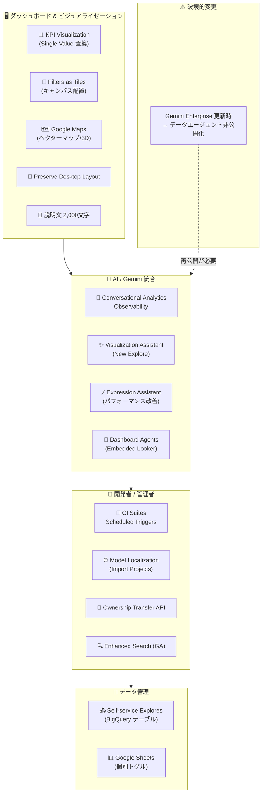

# Looker: Release 26.10 - ダッシュボード・ビジュアライゼーション・AI 機能の大規模アップデート

**リリース日**: 2026-06-22

**サービス**: Looker (Google Cloud core) / Looker (original)

**機能**: Release 26.10 (複数の新機能、変更、破壊的変更を含むメジャーリリース)

**ステータス**: 複数機能が Preview / GA

📊 [このアップデートのインフォグラフィックを見る](https://takech9203.github.io/google-cloud-news-summary/20260622-looker-26-10-release.html)

## 概要

Looker 26.10 は、ダッシュボード体験の刷新、ビジュアライゼーション機能の強化、AI/Gemini 統合の拡張、開発者向け CI/CD ワークフローの改善を含む大規模なリリースです。13 の新機能 (Preview/GA)、4 つの変更、1 つの破壊的変更が含まれています。

特に注目すべきは、KPI (Single Value) ビジュアライゼーションの Preview 導入、フィルターをタイルとしてキャンバスに配置できる機能、Google Maps の大幅なエンハンスメント、そして Conversational Analytics の可観測性メトリクスです。また、Gemini Enterprise との連携における破壊的変更があり、既存のデータエージェントの再公開が必要になる点に注意が必要です。

このリリースは、ダッシュボード作成者、データアナリスト、Looker 管理者、埋め込み Looker を利用する開発者の全てに影響します。

**アップデート前の課題**

- Single Value チャートのスタイリングオプションが限定的で、スパークラインや比較表示ができなかった
- ダッシュボードフィルターはフィルターバーに固定され、関連するタイルの近くに配置できなかった
- CI スイートは手動実行または PR トリガーのみで、定期的なスケジュール実行ができなかった
- インポートされたプロジェクトのロケール定義を統合することができなかった
- ダッシュボード・Looks の説明文が文字数制限により十分な情報を記載できなかった
- コンテンツオーナーの変更は手動作業が必要で、プログラマティックな一括処理ができなかった

**アップデート後の改善**

- KPI (Single Value) チャートでスパークライン、バーチャート、比較表示、背景色カスタマイズが可能に
- フィルターをドラッグ可能なタイルとしてダッシュボードキャンバスに自由配置可能に
- CI スイートが月次、週次、日次、時間単位、分単位のスケジュール実行に対応
- `import_locale_defs: yes` でインポートプロジェクトのロケール定義を統合可能に
- ダッシュボード・Looks の説明文制限が 2,000 文字に拡張
- API 経由でダッシュボード、ボード、エージェントのオーナーシップをプログラマティックに変更可能に

## アーキテクチャ図



Looker 26.10 の主要な新機能カテゴリとその関係を示す図。ダッシュボード・ビジュアライゼーション、AI/Gemini 統合、開発者向け機能、データ管理の 4 カテゴリに分類され、Gemini Enterprise の破壊的変更が AI 統合に影響を与える。

## サービスアップデートの詳細

### ⚠️ 破壊的変更 (重要)

**Gemini Enterprise インスタンス更新時のデータエージェント非公開化**

Looker に接続されている Gemini Enterprise インスタンスを更新すると、以前の Gemini Enterprise インスタンスに公開していたデータエージェントが全て**非公開**になります。

- Looker 内からこれらのデータエージェントにアクセスすることは引き続き可能
- 新しい Gemini Enterprise インスタンスに**再公開**しなければ、Gemini Enterprise でエージェントとチャットできない
- 対象: Looker (Google Cloud core) および Looker (original) の両方

**対応手順:**
1. Gemini Enterprise インスタンスの更新前に、公開済みデータエージェントの一覧を確認
2. 更新後、各データエージェントの Publish settings から Gemini Enterprise 設定を再度有効化
3. ユーザーへの Gemini Enterprise User IAM ロール付与が必要に応じて再確認

---

### ダッシュボード & ビジュアライゼーション

1. **KPI (Single Value) ビジュアライゼーション (Preview)**
   - 既存の Single Value チャートを置き換える新しい KPI チャートオプション
   - セカンダリビジュアライゼーション: スパークライン (Area chart) またはバーチャートを KPI 値と共に表示し、トレンドや分布を可視化
   - 比較表示の強化: 任意のメジャーに対する比較が可能 (1行目、2行目、最終行、合計行から選択)
   - スタイリングオプション強化: タイルの背景色、値の配置 (左/中央/右) のカスタマイズ
   - Looker 26.10 以降のインスタンスで利用可能。デフォルトでは無効
   - 有効化: Admin > Preview Features > KPI Visualization トグルをオン

2. **Filters as Tiles (Preview)**
   - ダッシュボードフィルターをキャンバス上のドラッグ可能なタイルに変換
   - 関連するビジュアライゼーションタイルの近くにフィルターを配置可能
   - ビューアーは特定のタイルに適用されているフィルターを確認可能 (Show Filters)
   - フィルターバーとキャンバスの間で自由に移動可能
   - LookML ダッシュボードでもサポート
   - 有効化: Admin > Preview Features > Filters as tiles and tile-level filter context トグルをオン

3. **Google Maps エンハンスメント (Preview)**
   - **ベクターマップ**: 数千のデータポイントをシームレスにレンダリング、チルト・回転・3D 押し出しに対応
   - **デュアルアクシスメトリック比較**: ヒートマップとポイントを使用し、単一マップ上で複数のビジネスメトリクスを同時分析
   - **コンテキスト・カスタムオーバーレイ**: ライブ交通情報、公共交通、自転車ルートのレイヤリング、アイコン・色・サイズの詳細なスタイリング制御

4. **Preserve Desktop Layout**
   - ダッシュボードエディターが小さいブラウザやモバイル画面でもデスクトップレイアウトを維持する設定を有効化可能
   - ユーザーはズームスライダーでタイルを拡大し、デスクトップビューとモバイルビューを切り替え可能

5. **ダッシュボード・Looks の説明文制限拡張**
   - 文字数制限を 2,000 文字に引き上げ
   - 包括的な説明、運用定義、注釈を追加可能
   - 標準のコンテンツ編集権限 (Edit content access level、save_dashboards、save_looks) を持つユーザーが利用可能

### AI / Gemini 統合

6. **Conversational Analytics Observability メトリクス (Preview)**
   - エンゲージメントとトークン使用量データを含む強化された可観測性メトリクス
   - System Activity ダッシュボード内の Conversational Analytics ダッシュボードで確認可能
   - Looker (original) インスタンスのみで利用可能
   - 有効化: Admin > Preview Features > Conversational Analytics Observability トグルをオン

7. **Visualization Assistant (New Explore Experience)**
   - Gemini ベースの Visualization Assistant が新しい Explore エクスペリエンスで利用可能に
   - 自然言語でビジュアライゼーションのカスタマイズや提案を受けられる

8. **Gemini Expression Assistant パフォーマンス改善**
   - Explore でのカスタムフィールド作成を支援する Expression Assistant のパフォーマンスが向上

9. **Dashboard Agents の Embedded Looker 対応** (変更)
   - 埋め込み Looker 環境でダッシュボードエージェントが利用可能に
   - 適切なパーミッションを持つ Embed ユーザーがアクセス可能な全ての埋め込みダッシュボードでエージェントを表示可能

10. **Conversational Analytics データエージェントのビジュアライゼーション対応** (変更)
    - Gemini Enterprise に公開されたデータエージェントがビジュアライゼーションをサポート

11. **Dashboard Summary の独立有効化** (変更)
    - Dashboard Summary 機能をデータエージェントとは別に有効化可能に
    - Enable Dashboard Summary 設定が独立した設定項目として提供

### 開発者 / CI

12. **CI Suites スケジュールトリガー**
    - Continuous Integration スイートに定期実行スケジュールを設定可能
    - 対応頻度: 月次 (特定日時)、週次 (特定曜日・時刻)、日次 (特定時刻)、時間単位 (1/2/3/4/6/8/12 時間ごと)、分単位 (5/10/15/20/30 分ごと)
    - スケジュール実行では本番バージョンのリポジトリを検証し、全エラーを返却
    - Looker IDE の Suites ページから Trigger on a schedule トグルで設定

13. **Model Localization for Imported Projects (Preview)**
    - インポートされたプロジェクトのロケール定義をインポート元プロジェクトの定義と統合可能
    - マニフェストファイルの `localization_settings` に `import_locale_defs: yes` を追加
    - 優先順位ルール: インポート元プロジェクトのキーが常に優先、インポート順序で重複を解決

14. **Programmatic Ownership Transfer API**
    - Looker API 経由でダッシュボード、ボード、エージェントのオーナーをプログラマティックに変更
    - ユーザーのオフボーディングやロール変更時のコンテンツ再割り当てを簡素化
    - 新しいオーナーには自動的に Manage/Edit アクセスが付与
    - 既存の認定バッジは維持
    - API 実行者には `save_content` と `manage_spaces` パーミッションが必要
    - 注意: オーナーシップ移転は親フォルダ、モデル、基盤の Looks へのアクセスを自動付与しない

### データ管理 & 検索

15. **Enhanced Search (GA)**
    - コンテンツ検索機能が一般提供開始
    - 保存済みコンテンツの検索体験が改善

16. **Self-service Explores アップデート**
    - **BigQuery テーブルからのアップロード**: BigQuery データベーステーブルからデータをアップロードして Self-service Explore を作成可能に
    - **Google Sheets トグルの分離**: データアップロードと Google Sheets インポートのトグルが独立し、管理者がより細かくデータアップロードを制御可能に

17. **Granular Dashboard Sizing デフォルト有効化** (変更)
    - ダッシュボードタイルのサイズとレイアウトをより細かい粒度で変更可能な機能がデフォルトで有効化

## 技術仕様

### KPI Visualization 要件

| 項目 | 詳細 |
|------|------|
| 最低バージョン | Looker 26.10 以降 |
| インスタンスタイプ | Looker (original) - Looker ホスト / Looker (Google Cloud core) |
| 有効化方法 | Admin > Preview Features > KPI Visualization |
| デフォルト状態 | 無効 |
| 必要な権限 | explore パーミッション + 対象モデルへのアクセス |

### CI スケジュールトリガー設定

| 頻度 | 設定オプション |
|------|------|
| Monthly | 特定の日と時刻 |
| Weekly | 特定の曜日と時刻 |
| Daily | 特定の時刻 |
| Hourly | 1/2/3/4/6/8/12 時間ごと (開始・終了時刻指定) |
| Minutes | 5/10/15/20/30 分ごと (開始・終了時刻指定) |
| Specific months | 特定月の特定日時 |
| Specific days | 特定曜日の特定時刻 |

### Model Localization 設定例

```lkml
# manifest.lkml (インポート元プロジェクト)
project_name: "my_project"

localization_settings: {
  default_locale: en
  localization_level: permissive
  import_locale_defs: yes
}
```

### Ownership Transfer API の権限要件

| 要件 | 詳細 |
|------|------|
| API 実行者パーミッション | `save_content` + `manage_spaces` (アセットが存在するフォルダに対して) |
| 対象アセット | ダッシュボード、ボード、エージェント |
| 新オーナーへの自動付与 | Manage/Edit アクセス (エージェントの場合) |
| 認定バッジ | 移転後も維持 |
| 注意事項 | 親フォルダ・モデル・基盤 Looks へのアクセスは自動付与されない |

## 設定方法

### 前提条件

1. Looker (Google Cloud core) または Looker (original) インスタンスが 26.10 以降にアップデート済みであること
2. 各 Preview 機能の有効化には Looker Admin ロールが必要

### 手順

#### ステップ 1: KPI Visualization の有効化

1. Looker Admin パネルにログイン
2. General > Preview Features ページに移動
3. KPI Visualization トグルをオンに切り替え

#### ステップ 2: Filters as Tiles の有効化

1. Admin > Preview Features ページに移動
2. Filters as tiles and tile-level filter context トグルをオンに切り替え

#### ステップ 3: CI スケジュールトリガーの設定

1. Looker IDE を開き、Continuous Integration アイコンをクリック
2. Suites タブから対象のスイートを編集 (または新規作成)
3. Trigger on a schedule トグルを有効化
4. 実行頻度と時刻を設定
5. Update suite (または Create suite) をクリックして保存

#### ステップ 4: Model Localization (Import Projects) の設定

```lkml
# インポート元プロジェクトの manifest.lkml に追加
localization_settings: {
  default_locale: en
  localization_level: permissive
  import_locale_defs: yes
}
```

## メリット

### ビジネス面

- **ダッシュボード表現力の向上**: KPI ビジュアライゼーション、Filters as Tiles、Google Maps エンハンスメントにより、データストーリーテリングの質が大幅に向上
- **運用効率化**: Ownership Transfer API により、ユーザーのオフボーディングプロセスが自動化可能
- **モバイル対応強化**: Preserve Desktop Layout により、モバイルデバイスでのダッシュボード閲覧体験が改善
- **AI 活用の拡大**: Dashboard Agents の Embedded 対応により、外部ユーザーにも AI 支援分析を提供可能

### 技術面

- **品質保証の自動化**: CI スケジュールトリガーにより、LookML の定期的な自動検証が可能に
- **国際化対応の改善**: Model Localization のプロジェクトインポート対応により、複数プロジェクト間でのロケール管理が効率化
- **可観測性の向上**: Conversational Analytics Observability により、AI 機能のエンゲージメントとコスト (トークン使用量) を監視可能
- **データ管理の柔軟性**: Self-service Explores の BigQuery テーブル対応と Google Sheets トグル分離により、データ管理がより細かく制御可能

## デメリット・制約事項

### 制限事項

- KPI Visualization は Preview であり、限定的なサポートのみ提供
- Conversational Analytics Observability メトリクスは Looker (original) インスタンスのみで利用可能
- Filters as Tiles を無効化すると、キャンバスに配置済みのフィルタータイルは空白タイルとして表示される
- Gemini Enterprise インスタンス更新時にデータエージェントの再公開が必須 (破壊的変更)

### 考慮すべき点

- Preview 機能はデフォルト無効のため、管理者が明示的に有効化する必要がある
- Gemini Enterprise を利用している場合、インスタンス更新計画に再公開作業を含める必要がある
- Ownership Transfer API は親フォルダへのアクセスを自動付与しないため、追加のアクセス設定が必要な場合がある
- KPI Visualization を有効化すると、既存の Single Value チャートが KPI (Single Value) に置き換わるため、既存ダッシュボードへの影響を事前確認すべき

## ユースケース

### ユースケース 1: エグゼクティブ KPI ダッシュボードの刷新

**シナリオ**: 経営陣向けダッシュボードで売上、利益率、顧客数などの KPI を表示しているが、トレンドを把握するために別のタイルを参照する必要があった。

**実装例**:
- KPI (Single Value) チャートを有効化
- 各 KPI タイルにスパークライン (Area chart) を追加して過去 12 ヶ月のトレンドを表示
- 比較表示で前年同期との差分を自動計算
- フィルターを関連する KPI グループの近くにタイルとして配置

**効果**: 1 つのタイルで KPI 値、トレンド、比較が完結し、ダッシュボードの密度と情報伝達力が向上

### ユースケース 2: LookML プロジェクトの品質自動監視

**シナリオ**: 複数の開発者が LookML を変更する環境で、本番環境のデータ品質を定期的に検証したい。

**実装例**:
- CI スイートで SQL Validator、Content Validator、Assert Validator を設定
- Daily トリガーを早朝 (業務開始前) に設定
- 本番リポジトリの検証を毎日自動実行

**効果**: 開発者が気づかなかったデータ品質の劣化やコンテンツの破損を早期に発見し、業務影響を最小化

### ユースケース 3: 多国籍企業でのローカライゼーション統合

**シナリオ**: 共通データモデルプロジェクトをインポートし、各国向けプロジェクトでローカライズしているが、インポート元の新しいラベルが反映されなかった。

**実装例**:
```lkml
# 各国向けプロジェクトの manifest.lkml
localization_settings: {
  default_locale: ja
  localization_level: permissive
  import_locale_defs: yes
}
```

**効果**: 共通プロジェクトのロケール定義が各国プロジェクトに自動統合され、翻訳の一貫性が向上

## 料金

Looker の料金体系は以下の通りです。具体的な料金は営業チームへの問い合わせが必要です。

| エディション | 概要 | API コール上限 (月次) |
|-------------|------|---------------------|
| Standard | 50 ユーザー以下の小規模チーム向け | クエリ 1,000 / 管理 1,000 |
| Enterprise | セキュリティ強化、無制限ユーザー | クエリ 100,000 / 管理 10,000 |
| Embed | 外部分析・カスタムアプリ向け | クエリ 500,000 / 管理 100,000 |

今回のリリースに含まれる機能は追加料金なしで利用可能です (Gemini Enterprise 連携機能は Gemini Enterprise ライセンスが別途必要)。

## 関連サービス・機能

- **Gemini Enterprise**: Looker データエージェントの公開先。インスタンス更新時の破壊的変更に注意
- **BigQuery**: Self-service Explores でのテーブルアップロード元として利用
- **Google Maps Platform**: Looker の Google Maps ビジュアライゼーション機能の基盤
- **Google Sheets**: Self-service Explores でのデータインポート元
- **Looker Embed SDK**: Dashboard Agents の埋め込み環境での利用に関連
- **Cloud IAM**: Gemini Enterprise ユーザーアクセス管理、Discovery Engine Admin ロール

## 参考リンク

- 📊 [インフォグラフィック](https://takech9203.github.io/google-cloud-news-summary/20260622-looker-26-10-release.html)
- [公式リリースノート](https://docs.cloud.google.com/release-notes#June_22_2026)
- [Looker Release Notes](https://docs.cloud.google.com/looker/docs/release-notes)
- [KPI (Single Value) Visualization ドキュメント](https://docs.cloud.google.com/looker/docs/kpi-single-value-options)
- [Filters as Tiles ドキュメント](https://docs.cloud.google.com/looker/docs/filters-user-defined-dashboards#filters_as_tiles)
- [CI Suites スケジュールトリガー](https://docs.cloud.google.com/looker/docs/ci-create-suite#schedule-trigger)
- [Model Localization - Project Import](https://docs.cloud.google.com/looker/docs/model-localization#model_localization_and_project_import)
- [Conversational Analytics Overview](https://docs.cloud.google.com/looker/docs/conversational-analytics-overview)
- [Data Agents - Gemini Enterprise 公開](https://docs.cloud.google.com/looker/docs/conversational-analytics-looker-data-agents#publish-data-agents)
- [Google Maps Visualization Options](https://docs.cloud.google.com/looker/docs/google-map-options)
- [Looker 料金ページ](https://cloud.google.com/looker/pricing)

## まとめ

Looker 26.10 は、ダッシュボード体験、ビジュアライゼーション、AI 統合の全方位でプラットフォームの成熟度を引き上げるリリースです。特に KPI Visualization と Filters as Tiles はダッシュボードの表現力を大幅に向上させ、CI スケジュールトリガーは DevOps ワークフローを強化します。**Gemini Enterprise を利用している組織は、インスタンス更新時のデータエージェント再公開の計画を事前に立てることを強く推奨します。** Preview 機能を評価し、本番環境での有効化を段階的に進めることをお勧めします。

---

**タグ**: #Looker #Release26.10 #Dashboard #Visualization #KPI #Gemini #ConversationalAnalytics #CI #Localization #BreakingChange #GoogleMaps #SelfService #API
