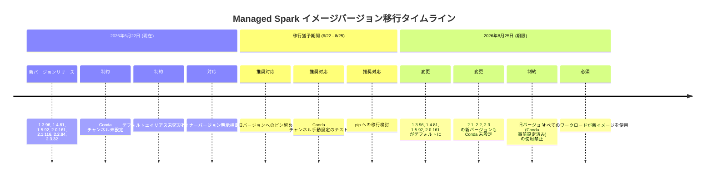

# Managed Service for Apache Spark: 新イメージバージョンにおける Conda チャンネル事前設定の廃止 (破壊的変更)

**リリース日**: 2026-06-22

**サービス**: Managed Service for Apache Spark (旧 Dataproc on Compute Engine)

**機能**: 新イメージバージョンでの Conda チャンネル事前設定の削除

**ステータス**: Breaking Change

:chart_with_upwards_trend: [このアップデートのインフォグラフィックを見る](https://takech9203.github.io/google-cloud-news-summary/20260622-managed-spark-conda-channels-breaking-change.html)

## 概要

Managed Service for Apache Spark において、新しいサブマイナーイメージバージョン (1.3.96、1.4.81、1.5.92、2.0.161、2.1.116、2.2.84、2.3.32) がリリースされた。これらの新バージョンには **Conda チャンネルが事前設定されておらず**、2026 年 8 月 25 日までデフォルトエイリアス (例: `2.3-debian12`、`2.3-ubuntu22` など) にマッピングされない。

これは **破壊的変更** であり、Conda を使用してパッケージをインストールしているワークロードに直接影響を与える。2026 年 8 月 25 日以降は、Conda が事前設定された旧バージョンの使用が禁止されるため、すべてのワークロードが新イメージへの移行を完了する必要がある。

なお、新イメージには Apache Iceberg 1.10 サポート (2.3 でオプトイン)、Spark のスキュー結合・自己結合最適化のデフォルト有効化、スケジューラー exitTimeout の 30 秒設定など、パフォーマンス改善も含まれている。

**アップデート前の課題**

- Conda チャンネルが事前設定されており、クラスター作成時に `dataproc:conda.packages` プロパティを指定するだけでパッケージをインストールできた
- デフォルトエイリアス (例: `2.3-debian12`) を使用して最新のサブマイナーバージョンを自動的に取得できた
- Conda の設定を意識せずに Python パッケージ管理が可能だった

**アップデート後の改善**

- Iceberg 1.10 サポート (2.3 イメージ) により、最新のテーブルフォーマット機能が利用可能に
- Spark のスキュー結合 (skewed-join) および自己結合 (self-join) 最適化がデフォルトで有効化され、パフォーマンスが向上
- スケジューラー exitTimeout が 30 秒に設定され、リソース解放の制御が改善

## アーキテクチャ図



この図は、2026 年 6 月 22 日の新バージョンリリースから 8 月 25 日のデフォルト切り替え期限までの移行タイムラインを示している。約 2 ヶ月の猶予期間内に対応を完了する必要がある。

## サービスアップデートの詳細

### 主要機能

1. **Conda チャンネル事前設定の廃止 (破壊的変更)**
   - 新サブマイナーバージョンには Conda チャンネルが事前設定されていない
   - `dataproc:conda.packages` プロパティによるパッケージインストールは、チャンネルを手動設定しない限り失敗する
   - デフォルトエイリアス (例: `2.3-debian12`) は 8 月 25 日まで新バージョンにマッピングされない

2. **Apache Iceberg 1.10 サポート (2.3 イメージ)**
   - クラスタープロパティによるオプトインで有効化
   - スキーマ進化、タイムトラベル、ACID トランザクションなどの Iceberg 機能を最新版で利用可能
   - BigLake Iceberg REST カタログとの連携が強化

3. **Spark パフォーマンス最適化のデフォルト有効化**
   - スキュー結合 (skewed-join) 最適化: データの偏りがある結合操作で自動的にパーティションを分割し、パフォーマンスを改善
   - 自己結合 (self-join) 最適化: 同一テーブルの結合操作を効率化
   - スケジューラー exitTimeout: 30 秒に設定され、アイドル状態のエグゼキューターの解放タイミングを制御

## 技術仕様

### 影響を受けるイメージバージョン

| バージョン | サブマイナー | デフォルト化日 | 備考 |
|-----------|------------|--------------|------|
| 1.3 | 1.3.96 | 2026/08/25 | サポート終了済み、最終バージョン |
| 1.4 | 1.4.81 | 2026/08/25 | サポート終了済み、最終バージョン |
| 1.5 | 1.5.92 | 2026/08/25 | サポート終了済み、最終バージョン |
| 2.0 | 2.0.161 | 2026/08/25 | サポート終了済み、最終バージョン |
| 2.1 | 2.1.116 | 2026/08/25 以降 | 8/25 以降のすべての新サブマイナーも Conda 未設定 |
| 2.2 | 2.2.84 | 2026/08/25 以降 | 8/25 以降のすべての新サブマイナーも Conda 未設定 |
| 2.3 | 2.3.32 | 2026/08/25 以降 | Iceberg 1.10 サポート含む |

### イメージ指定方法の変更

| 項目 | 変更前 | 変更後 (8/25 まで) |
|------|--------|-------------------|
| エイリアス指定 | `--image-version=2.3-debian12` | 使用不可 (新バージョンにマッピングされない) |
| サブマイナー指定 | `--image-version=2.3.31-debian12` | `--image-version=2.3.32-debian12` (明示指定必須) |
| Conda パッケージ | `dataproc:conda.packages='pkg==1.0'` で自動インストール | チャンネル手動設定が必要、または pip を使用 |

## 設定方法

### 前提条件

1. gcloud CLI が最新バージョンであること
2. 既存クラスターの使用イメージバージョンを把握していること
3. ワークロードで使用している Conda パッケージのリストを整理していること

### 手順

#### ステップ 1: 現在のクラスターイメージバージョンを確認

```bash
# クラスターのイメージバージョンを確認
gcloud dataproc clusters describe CLUSTER_NAME \
    --region=REGION \
    --format="value(config.softwareConfig.imageVersion)"
```

現在のバージョンが新バージョンより古い場合、当面はそのまま使用可能。

#### ステップ 2: 暫定対応 - 旧バージョンへのピン留め

```bash
# 旧バージョン (Conda 事前設定済み) を明示指定してクラスターを作成
gcloud dataproc clusters create my-cluster \
    --region=us-central1 \
    --image-version=2.3.31-debian12 \
    --properties='^#^dataproc:conda.packages=pandas==2.1.4,scikit-learn==1.5.2'
```

8 月 25 日まではこの方法で既存のワークフローを維持できる。

#### ステップ 3: 恒久対応 - Conda チャンネルの手動設定

```bash
# conda 環境設定ファイルを作成
cat > environment.yaml << 'EOF'
name: spark-env
channels:
  - conda-forge
  - defaults
dependencies:
  - pandas=2.1.4
  - scikit-learn=1.5.2
  - numpy=1.26.4
EOF

# Cloud Storage にアップロード
gcloud storage cp environment.yaml gs://my-bucket/conda/environment.yaml

# 新バージョンのクラスターを環境設定ファイル付きで作成
gcloud dataproc clusters create my-cluster \
    --region=us-central1 \
    --image-version=2.3.32-debian12 \
    --properties='dataproc:conda.env.config.uri=gs://my-bucket/conda/environment.yaml'
```

#### ステップ 4: 代替案 - pip パッケージの使用

```bash
# pip を使用してパッケージをインストール (Conda チャンネル不要)
gcloud dataproc clusters create my-cluster \
    --region=us-central1 \
    --image-version=2.3.32-debian12 \
    --properties='^#^dataproc:pip.packages=pandas==2.1.4,scikit-learn==1.5.2,numpy==1.26.4'
```

`dataproc:pip.packages` プロパティは Conda チャンネルに依存しないため、新バージョンでもそのまま動作する。

## デメリット・制約事項

### 制限事項

- 2026 年 8 月 25 日以降、Conda が事前設定された旧イメージバージョンは使用禁止となる
- `dataproc:conda.env.config.uri` と `dataproc:conda.packages` / `dataproc:pip.packages` は同時に使用できない
- クラスター作成時の Conda パッケージインストールはタイムアウト制限 (10 分) がある
- バージョン 1.3、1.4、1.5、2.0 はすでにサポート終了済みだが、8 月 25 日に最終バージョンが強制適用される

### 考慮すべき点

- 移行猶予期間は約 2 ヶ月 (6/22 - 8/25) であり、すべての本番ワークロードのテストと更新が必要
- 初期化アクション (initialization actions) で Conda を使用している場合も影響を受ける可能性がある
- 内部 IP のみのクラスターでは、外部 Conda リポジトリへのアクセスに追加のネットワーク設定が必要
- `dataproc:pip.packages` への移行が最もシンプルな回避策だが、一部のパッケージは Conda でのみ提供される場合がある

## ユースケース

### ユースケース 1: データサイエンスチームの移行

**シナリオ**: ML パイプラインで `dataproc:conda.packages` を使用して scikit-learn、pandas、numpy をインストールしているチーム

**実装例**:
```bash
# 移行前 (旧バージョン)
gcloud dataproc clusters create ml-cluster \
    --image-version=2.3-debian12 \
    --properties='^#^dataproc:conda.packages=scikit-learn==1.5.2,pandas==2.1.4'

# 移行後 (新バージョン - pip 使用)
gcloud dataproc clusters create ml-cluster \
    --image-version=2.3.32-debian12 \
    --properties='^#^dataproc:pip.packages=scikit-learn==1.5.2,pandas==2.1.4'
```

**効果**: Conda チャンネルへの依存を排除し、8 月 25 日以降も継続して動作するクラスターを構築できる

### ユースケース 2: Iceberg 1.10 の活用

**シナリオ**: データレイクハウスで Iceberg テーブルを使用しており、最新の Iceberg 機能 (1.10) を活用したいチーム

**実装例**:
```bash
# Iceberg 1.10 を有効化した 2.3.32 クラスターの作成
gcloud dataproc clusters create lakehouse-cluster \
    --region=us-central1 \
    --image-version=2.3.32-debian12 \
    --optional-components=ICEBERG \
    --properties='dataproc:conda.env.config.uri=gs://my-bucket/conda/environment.yaml'
```

**効果**: 最新の Iceberg 機能 (スキーマ進化の改善、パフォーマンス向上) を利用しつつ、Conda 環境も適切に設定できる

## 関連サービス・機能

- **Managed Service for Apache Spark Serverless**: サーバーレスランタイムも同様のバージョン体系を使用しており、影響範囲の確認が必要
- **Cloud Storage**: Conda 環境設定ファイル (`environment.yaml`) のホスティング先として使用
- **Apache Iceberg / BigLake**: 2.3 イメージでの Iceberg 1.10 サポートにより、データレイクハウスアーキテクチャとの連携が強化
- **Spark パフォーマンス最適化**: `spark.dataproc.enhanced.optimizer.enabled` および `spark.dataproc.enhanced.execution.enabled` プロパティによる追加のパフォーマンス向上が利用可能

## 参考リンク

- :chart_with_upwards_trend: [インフォグラフィック](https://takech9203.github.io/google-cloud-news-summary/20260622-managed-spark-conda-channels-breaking-change.html)
- [公式リリースノート](https://docs.cloud.google.com/release-notes#June_22_2026)
- [Python 環境設定ドキュメント](https://docs.cloud.google.com/managed-spark/docs/tutorials/python-configuration)
- [イメージバージョン一覧](https://docs.cloud.google.com/managed-spark/docs/concepts/versioning/dataproc-version-clusters)
- [Iceberg コンポーネント](https://docs.cloud.google.com/managed-spark/docs/concepts/components/iceberg)
- [Spark パフォーマンス最適化](https://docs.cloud.google.com/managed-spark/docs/guides/performance-enhancements)
- [料金ページ](https://cloud.google.com/managed-spark/pricing)

## まとめ

この破壊的変更は、Managed Service for Apache Spark を利用するすべてのユーザーに影響する可能性がある重要なアップデートである。**即座に対応が必要なアクションアイテム** として、(1) 現在のワークロードで Conda パッケージを使用しているかの確認、(2) 旧バージョンへのピン留めによる暫定対応、(3) 8 月 25 日までに pip への移行または Conda チャンネル手動設定への恒久対応を推奨する。新イメージには Iceberg 1.10 や Spark 最適化などの有益な改善も含まれているため、計画的な移行によりパフォーマンスの向上も期待できる。

---

**タグ**: #ManagedSpark #Dataproc #BreakingChange #Conda #Python #ImageVersion #Iceberg #SparkOptimization #Migration
