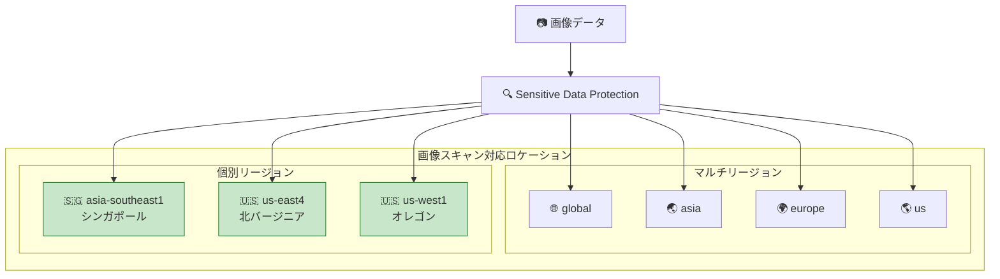

# Sensitive Data Protection: 画像スキャン対応リージョン拡大とテーブルデータプロファイルのタイムスタンプ修正

**リリース日**: 2026-06-22

**サービス**: Sensitive Data Protection

**機能**: 画像スキャン対応リージョン拡大 / テーブルデータプロファイル expiration_time 修正

**ステータス**: Change / Fixed

📊 [このアップデートのインフォグラフィックを見る](https://takech9203.github.io/google-cloud-news-summary/20260622-sensitive-data-protection-image-scanning-regions.html)

## 概要

Sensitive Data Protection の画像スキャン機能が、新たに 3 つのクラウドリージョン（asia-southeast1、us-east4、us-west1）で利用可能になった。これにより、これらのリージョンで画像内の機密データの検出（inspection）やマスキング（redaction）が可能となり、データレジデンシー要件を満たしながら画像内の個人情報を保護できるようになった。

また、2025 年 7 月から 2026 年 6 月の間に BigQuery にエクスポートされたテーブルデータプロファイルにおいて、有効期限が設定されていないテーブルの `expiration_time` フィールドに NULL ではなく誤った `1970-01-01` タイムスタンプが記録されていた不具合が修正された。今後のエクスポートでは正しい有効期限タイムスタンプが表示される。

**アップデート前の課題**

- 画像スキャン機能は global、asia（マルチリージョン）、europe（マルチリージョン）、us（マルチリージョン）の限定されたロケーションでのみ利用可能だった
- asia-southeast1、us-east4、us-west1 リージョンでは画像ファイルがバイナリファイルとしてスキャンされ、OCR による文字認識やコンテンツ検出が行われなかった
- BigQuery にエクスポートしたテーブルデータプロファイルで expiration_time が `1970-01-01`（Unix エポック）として誤記録されていた

**アップデート後の改善**

- asia-southeast1（シンガポール）、us-east4（北バージニア）、us-west1（オレゴン）で画像スキャンが利用可能になった
- これらのリージョンで OCR による画像内テキスト検出、画像コンテンツ検出、画像コンテキスト分類が利用可能になった
- テーブルデータプロファイルの expiration_time が正しく NULL として記録されるようになった

## アーキテクチャ図

画像スキャン機能の対応ロケーション全体図。緑色のノードが今回新たに追加されたリージョンを示す。

## サービスアップデートの詳細

### 主要機能

1. **画像スキャンのリージョン拡大**
   - asia-southeast1（シンガポール）: ASEAN 地域のデータレジデンシー要件に対応
   - us-east4（北バージニア）: 米国東海岸の政府機関やエンタープライズ向け
   - us-west1（オレゴン）: 米国西海岸のワークロードに対応
   - OCR によるテキスト検出、画像コンテンツ検出、画像コンテキスト分類のすべてが利用可能

2. **テーブルデータプロファイルの expiration_time 修正**
   - 影響期間: 2025 年 7 月 〜 2026 年 6 月
   - 症状: 有効期限が設定されていないテーブルの expiration_time に `1970-01-01` が記録された
   - 修正後: 正しく NULL が記録される
   - 既にエクスポート済みの誤ったデータについては、新規エクスポートで上書きされる

3. **画像スキャンの動作仕様**
   - 画像スキャン非対応リージョンでは画像ファイルはバイナリファイルとしてスキャンされる
   - 代替オプション: inspection ではサンプリングを有効にしてスキップ可能
   - Discovery では画像処理のフォールバックロケーションを設定可能

## 技術仕様

### 画像スキャン対応ロケーション一覧

| ロケーション | タイプ | 説明 |
|------|------|------|
| global | グローバル | すべてのリージョンからアクセス可能 |
| asia | マルチリージョン | アジアのデータセンター |
| asia-southeast1 | リージョン | シンガポール |
| europe | マルチリージョン | EU 加盟国のデータセンター |
| us | マルチリージョン | 米国のデータセンター |
| us-east4 | リージョン | 北バージニア |
| us-west1 | リージョン | オレゴン |

### 画像スキャンで利用可能なスキャニングモード

| スキャニングモード | 説明 |
|------|------|
| OCR (光学文字認識) | 画像内のテキストベース infoType を検出 |
| 画像コンテンツ検出 | 画像のピクセルと特徴を分析し、特定のオブジェクトを検出 |
| 画像コンテキスト分類 | 画像全体を分析してテーマやカテゴリを分類 |

## メリット

### ビジネス面

- **データレジデンシー対応強化**: ASEAN 地域（asia-southeast1）での画像データ処理がリージョン内で完結可能になり、データ所在地要件を満たしやすくなった
- **コンプライアンス対応**: 特定リージョン内でのデータ処理が必須の規制環境でも画像スキャンが利用可能に

### 技術面

- **画像検出精度の向上**: バイナリスキャンではなく OCR や画像認識により、これらのリージョンでの検出精度が大幅に向上
- **データ品質の改善**: テーブルプロファイルの expiration_time 修正により、BigQuery での分析・監視の信頼性が向上

## デメリット・制約事項

### 制限事項

- 画像スキャン非対応リージョンでは依然としてバイナリファイルとしてのスキャンとなる
- 2025 年 7 月〜2026 年 6 月に既にエクスポートされた誤った expiration_time データは自動修正されない（再エクスポートが必要）

### 考慮すべき点

- 画像スキャン対応リージョンであってもリージョナルエンドポイントを使用する場合は、そのリージョンがサポートされていることを確認する必要がある
- expiration_time の不具合を持つ既存データを使って分析を行っている場合は、再プロファイリングを検討すべき

## ユースケース

### ユースケース 1: ASEAN 地域でのドキュメントスキャン

**シナリオ**: シンガポールに拠点を持つ金融機関が、顧客から受け取った本人確認書類（パスポート、ID カード等）の画像内に含まれる個人情報を検出・マスキングしたい。PDPA（Personal Data Protection Act）に基づき、データはシンガポールリージョン内で処理する必要がある。

**効果**: asia-southeast1 リージョンで画像スキャンが可能になったことで、データを他リージョンに転送することなく、リージョン内で完結した画像内機密データの検出・マスキングが実現可能に。

### ユースケース 2: テーブルプロファイル監視の信頼性回復

**シナリオ**: 組織全体のデータガバナンスとして BigQuery テーブルのプロファイル情報を定期エクスポートし、テーブルの有効期限を監視している。expiration_time が 1970-01-01 になっているレコードの解釈に混乱が生じていた。

**効果**: 修正後は expiration_time が正しく NULL として記録されるため、「有効期限なし」のテーブルを正確に識別でき、データライフサイクル管理の自動化が信頼性を持って運用可能に。

## 料金

Sensitive Data Protection の画像スキャン料金はバイト数ベースで課金される。

| サービスタイプ | 料金 |
|--------|---------|
| Google Cloud ストレージの Inspection | $1/GB から（ボリューム割引あり） |
| インラインコンテンツ Inspection | $3/GB から（ボリューム割引あり） |
| 月間 1 GB まで | 無料 |

リージョンの追加による料金変更はない。詳細は [Sensitive Data Protection 料金ページ](https://cloud.google.com/sensitive-data-protection/pricing) を参照。

## 利用可能リージョン

画像スキャン機能は以下のロケーションで利用可能:

- **グローバル**: global
- **マルチリージョン**: asia、europe、us
- **個別リージョン**: asia-southeast1（シンガポール）、us-east4（北バージニア）、us-west1（オレゴン）

Sensitive Data Protection 自体はこれら以外の多数のリージョンでも利用可能だが、画像スキャン機能は上記ロケーションに限定される。

## 関連サービス・機能

- **Cloud Storage**: 画像ファイルの保存先としてストレージ Inspection と連携
- **BigQuery**: テーブルデータプロファイルのエクスポート先として利用。今回の expiration_time 修正が直接関係
- **Security Command Center**: Sensitive Data Protection の検出結果をセキュリティインシデントとして連携
- **Cloud Vision API**: 画像認識の補完サービス（Sensitive Data Protection は機密データ検出に特化）

## 参考リンク

- 📊 [インフォグラフィック](https://takech9203.github.io/google-cloud-news-summary/20260622-sensitive-data-protection-image-scanning-regions.html)
- [公式リリースノート](https://docs.cloud.google.com/release-notes#June_22_2026)
- [画像スキャン対応ロケーション](https://cloud.google.com/sensitive-data-protection/docs/locations#image-limitations)
- [画像の Inspection と Redaction](https://cloud.google.com/sensitive-data-protection/docs/inspecting-images)
- [データプロファイルの BigQuery エクスポート分析](https://cloud.google.com/sensitive-data-protection/docs/analyze-data-profiles)
- [料金ページ](https://cloud.google.com/sensitive-data-protection/pricing)

## まとめ

今回のアップデートは、Sensitive Data Protection の画像スキャン機能のリージョン拡大と、データプロファイルエクスポートの不具合修正という 2 つの改善を含む。特に asia-southeast1 の追加は ASEAN 地域でのデータレジデンシー要件を持つ組織にとって重要であり、画像内機密データの保護をリージョン内で完結できるようになる。また、expiration_time の修正については、過去データに影響がある場合は再エクスポートを推奨する。

---

**タグ**: #SensitiveDataProtection #DLP #ImageScanning #DataProfiles #BigQuery #RegionExpansion #BugFix #DataResidency #ASEAN
