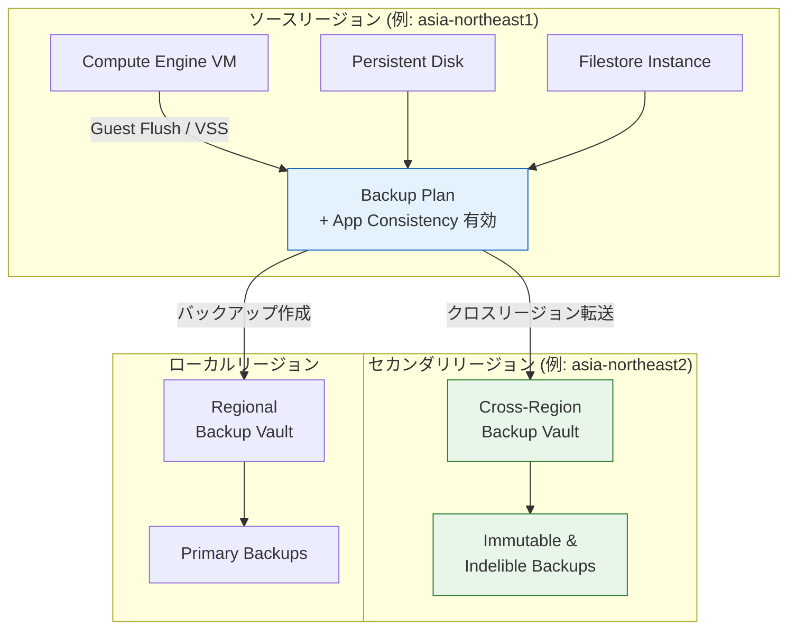

# Backup and DR Service: クロスリージョンバックアップ GA およびアプリケーション整合性バックアップの Console 対応

**リリース日**: 2026-06-23

**サービス**: Backup and DR Service

**機能**: Cross-region backups GA / Application-consistent backups via Console

**ステータス**: GA (General Availability)

[このアップデートのインフォグラフィックを見る](https://takech9203.github.io/google-cloud-news-summary/20260623-backup-and-dr-cross-region-ga.html)

## 概要

Google Cloud Backup and DR Service に 2 つの重要なアップデートが発表された。1 つ目は、Compute Engine インスタンスのアプリケーション整合性バックアップを Google Cloud Console から直接設定できるようになったこと。2 つ目は、クロスリージョンバックアップが一般提供 (GA) となり、リージョン障害に対する保護が本番ワークロードで利用可能になったことである。

クロスリージョンバックアップは 2026 年 4 月 8 日に Preview として発表されていた機能で、今回の GA により SLA の対象となり、本番環境での利用が推奨される段階に到達した。Compute Engine インスタンス、Compute Engine ディスク、および Filestore インスタンスを、ソースとは異なるセカンダリリージョンにバックアップを保存することで、リージョン全体の障害からワークロードを保護できる。

アプリケーション整合性バックアップの Console 対応は、これまで gcloud CLI、Terraform、API のみで設定可能だった Guest Flush / VSS オプションを、Cloud Console の Backup Plans UI から直接有効化できるようにしたもので、運用管理者にとって設定の敷居を大きく下げる改善となっている。

**アップデート前の課題**

- クロスリージョンバックアップは Preview 段階であり、本番ワークロードでの利用に SLA が保証されていなかった
- アプリケーション整合性バックアップ (Guest Flush / VSS) の設定には gcloud CLI、Terraform、または API を使用する必要があり、コンソールからは設定できなかった
- リージョン障害に対する保護には、マルチリージョン Backup Vault を使用する必要があり、バックアップ先のリージョンを明示的に指定する柔軟性がなかった

**アップデート後の改善**

- クロスリージョンバックアップが GA となり、SLA の下で本番ワークロードに適用可能になった
- Cloud Console の Backup Plans 画面から「Enable Application Consistency」チェックボックスで簡単にアプリケーション整合性を有効化できるようになった
- ソースリージョンとは異なる特定のセカンダリリージョンを明示的に選択でき、データレジデンシー要件やコンプライアンス要件に柔軟に対応できるようになった

## アーキテクチャ図



クロスリージョンバックアップでは、ソースリージョンのワークロードからバックアップを作成し、明示的に指定したセカンダリリージョンの Backup Vault に保存する。アプリケーション整合性オプションにより、バックアップ取得時にデータの一貫性が確保される。

## サービスアップデートの詳細

### 主要機能

1. **クロスリージョンバックアップ (GA)**
   - Compute Engine インスタンス、Compute Engine ディスク、Filestore インスタンスが対象
   - ソースワークロードとは異なるリージョンの Backup Vault にバックアップを保存
   - バックアップ先リージョンを明示的に選択可能
   - リージョン障害時のディザスタリカバリに対応
   - データレジデンシー要件への準拠を支援

2. **アプリケーション整合性バックアップの Console 対応**
   - Cloud Console の Backup Plans 画面から直接設定可能
   - Guest Flush (Linux) または VSS (Windows) オプションを有効化
   - バックアップ取得前にアプリケーションのトランザクションを完了し、保留中の書き込みをディスクにフラッシュ
   - リカバリ時にアプリケーションデータの整合性を保証

3. **Backup Vault によるイミュータブルストレージ**
   - バックアップデータの変更不可 (Immutability) と削除不可 (Indelibility) を保証
   - 最小強制保持期間 (最大 99 年) の設定が可能
   - ランサムウェア攻撃や誤操作からのデータ保護

## 技術仕様

### クロスリージョンバックアップとマルチリージョンバックアップの比較

| 項目 | クロスリージョンバックアップ | マルチリージョンバックアップ |
|------|------|------|
| バックアップ先の選択 | ユーザーが明示的にリージョンを指定 | Google が大陸内の 2 リージョンに自動配置 |
| ユースケース | コンプライアンス、データレジデンシー法、特定 DR サイト | 高可用性、運用のシンプルさ |
| 管理オーバーヘッド | 中程度 (ターゲットペアリングの設定が必要) | 低 (単一 Vault で自動バランシング) |
| 対象ワークロード | Compute Engine インスタンス、ディスク、Filestore | Compute Engine インスタンス、ディスク、Cloud SQL |
| CMEK | Backup Vault と同じリージョンの鍵を使用 | Backup Vault と同じリージョンの鍵を使用 |

### ワークロード別サポート状況

| ワークロード | リージョン | マルチリージョン | クロスリージョン |
|------|------|------|------|
| Compute Engine インスタンス | 対応 | 対応 | 対応 |
| Compute Engine ディスク | 対応 | 対応 | 対応 |
| Filestore インスタンス | 対応 | 非対応 | 対応 |
| Cloud SQL インスタンス | 対応 | 対応 | 非対応 |
| AlloyDB クラスタ | 対応 | 非対応 | 非対応 |

### アプリケーション整合性の設定

```bash
# gcloud CLI でのバックアッププラン作成例 (Guest Flush 有効)
gcloud backup-dr backup-plans create my-app-consistent-plan \
  --compute-instance-properties=guest-flush=true \
  --resource-type=compute.googleapis.com/Instance \
  --location=asia-northeast1 \
  --project=my-project \
  --backup-vault=my-backup-vault \
  --backup-rule=rule-id=daily-rule,recurrence=DAILY,\
time-zone=Asia/Tokyo,backup-window-start=2,backup-window-end=6,\
retention-days=30 \
  --max-custom-on-demand-retention-days=90
```

## 設定方法

### 前提条件

1. Backup and DR Service API が有効化されていること
2. Backup Vault がセカンダリリージョンに作成済みであること (クロスリージョンの場合)
3. Linux 環境でアプリケーション整合性を使用する場合は、事前・事後スクリプトが作成済みであること
4. 適切な IAM 権限が付与されていること

### 手順

#### ステップ 1: クロスリージョン Backup Vault の作成

Cloud Console の Backup and DR Service ページから、セカンダリリージョンに新しい Backup Vault を作成する。ソースワークロードのリージョンとは異なるリージョンを選択する。

#### ステップ 2: アプリケーション整合性を有効にした Backup Plan の作成

```
1. Cloud Console で Backup and DR Service > Backup Plans に移動
2. 「Create Backup Plan」をクリック
3. Resource type: 「Compute Engine VMs」を選択
4. Backup vault location: セカンダリリージョンの Backup Vault を選択
5. Backup rule を設定 (頻度、保持期間など)
6. 「Enable application consistent snapshot」チェックボックスを有効化
7. 「Create」をクリック
```

#### ステップ 3: ワークロードへの Backup Plan の適用

作成した Backup Plan を対象の Compute Engine インスタンスに関連付ける。

## メリット

### ビジネス面

- **ディザスタリカバリの強化**: リージョン全体の障害が発生してもセカンダリリージョンからリカバリ可能
- **コンプライアンス対応**: データレジデンシー法に基づき、バックアップの保存先リージョンを明示的に制御可能
- **運用コスト最適化**: マルチリージョンに比べて、必要な特定リージョンのみにバックアップを保存することでコストを制御

### 技術面

- **データ整合性の保証**: Guest Flush / VSS によりバックアップ取得時のアプリケーションデータの一貫性を確保
- **柔軟なリージョン選択**: 同一大陸内に限定されず、任意のサポートリージョン間でクロスリージョンバックアップが可能
- **Console からの簡便な設定**: CLI 不要でアプリケーション整合性バックアップを設定できるため、運用者の負荷を軽減

## デメリット・制約事項

### 制限事項

- Hyperdisk ではアプリケーション整合性スナップショットはサポートされていない
- クロスリージョンバックアップは Cloud SQL および AlloyDB では利用不可 (Cloud SQL はマルチリージョンを使用)
- Backup Plan は Cloud Console で作成する場合、ソースワークロードと同じリージョンに作成する必要がある
- クロスリージョン転送にはリージョン間データ転送料金が発生する

### 考慮すべき点

- クロスリージョンバックアップのターゲットペアリング設定には、マルチリージョンに比べて管理オーバーヘッドが発生する
- CMEK を使用する場合、Backup Vault と同じリージョンに暗号化鍵を配置する必要がある
- Linux 環境でのアプリケーション整合性には事前・事後スクリプトの準備が必要

## ユースケース

### ユースケース 1: リージョン障害からの DR

**シナリオ**: 東京リージョン (asia-northeast1) で稼働するミッションクリティカルな Compute Engine VM を、大阪リージョン (asia-northeast2) にバックアップして、リージョン障害に備える。

**効果**: 東京リージョン全体が利用不能になった場合でも、大阪リージョンの Backup Vault からリカバリが可能。RPO はバックアップ頻度に応じて制御される。

### ユースケース 2: データレジデンシー要件への対応

**シナリオ**: EU のデータレジデンシー規制により、バックアップデータを EU 内の特定の国に保管する必要がある場合、ソースリージョン (europe-west3: フランクフルト) からクロスリージョンで europe-west9 (パリ) にバックアップを保存する。

**効果**: マルチリージョンでは Google が自動的にリージョンを選択するが、クロスリージョンでは明示的にバックアップ先を指定でき、規制要件を確実に満たせる。

### ユースケース 3: データベース VM のアプリケーション整合性バックアップ

**シナリオ**: Windows VM 上で動作する SQL Server データベースのバックアップにおいて、VSS を使用してアプリケーション整合性を確保し、リカバリ時のデータ破損リスクを排除する。

**効果**: Cloud Console から「Enable Application Consistency」を有効にするだけで、VSS ベースのアプリケーション整合性バックアップが自動的に実行され、データベースのトランザクション一貫性が保証される。

## 料金

Backup and DR Service は使用量に基づく月額課金。クロスリージョンバックアップでは以下のコスト要素が発生する。

- **バックアップストレージ料金**: Backup Vault に保存されたデータ量に基づく
- **管理料金**: バックアップ管理のための料金
- **リージョン間データ転送料金**: ソースリージョンからセカンダリリージョンへのデータ転送に課金

詳細な料金は [Backup and DR 料金ページ](https://cloud.google.com/backup-disaster-recovery/pricing) を参照。

## 利用可能リージョン

クロスリージョンバックアップ用の Backup Vault は、北米、南米、ヨーロッパ、中東、アフリカ、アジア太平洋、インドの各地理エリアにまたがる 30 以上のリージョンで作成可能。主なリージョンには以下が含まれる:

- **北米**: us-central1, us-east1, us-east4, us-west1, us-west2, northamerica-northeast1 など
- **ヨーロッパ**: europe-west1, europe-west2, europe-west3, europe-west4, europe-north1 など
- **アジア太平洋**: asia-northeast1 (東京), asia-northeast2 (大阪), asia-northeast3 (ソウル), asia-southeast1, australia-southeast1 など

## 関連サービス・機能

- **Compute Engine**: バックアップ対象のプライマリワークロード。インスタンスおよび Persistent Disk のバックアップに対応
- **Filestore**: クロスリージョンバックアップの対象ワークロードの 1 つ
- **Cloud KMS**: CMEK によるバックアップデータの暗号化に使用
- **Cloud Monitoring / Cloud Logging**: バックアップジョブのモニタリングとアラート設定
- **Security Command Center**: バックアップデータの削除や脅威の検出に対応

## 参考リンク

- [インフォグラフィック](https://takech9203.github.io/google-cloud-news-summary/20260623-backup-and-dr-cross-region-ga.html)
- [公式リリースノート](https://docs.cloud.google.com/release-notes#June_23_2026)
- [Back up Compute Engine instances](https://docs.cloud.google.com/backup-disaster-recovery/docs/cloud-console/compute/compute-instance-backup)
- [Backup vaults for immutable and indelible backups](https://docs.cloud.google.com/backup-disaster-recovery/docs/concepts/backup-vault#regions)
- [料金ページ](https://cloud.google.com/backup-disaster-recovery/pricing)

## まとめ

今回のアップデートにより、Backup and DR Service はリージョン障害に対するエンタープライズグレードの保護機能を GA レベルで提供するとともに、アプリケーション整合性バックアップの設定を大幅に簡素化した。ディザスタリカバリ戦略の強化やコンプライアンス要件への対応を検討している組織は、クロスリージョンバックアップの導入を早期に評価し、既存のバックアッププランにアプリケーション整合性オプションを有効化することを推奨する。

---

**タグ**: #BackupAndDR #DisasterRecovery #CrossRegion #ApplicationConsistency #GA #ComputeEngine #Filestore #BackupVault #DataProtection
