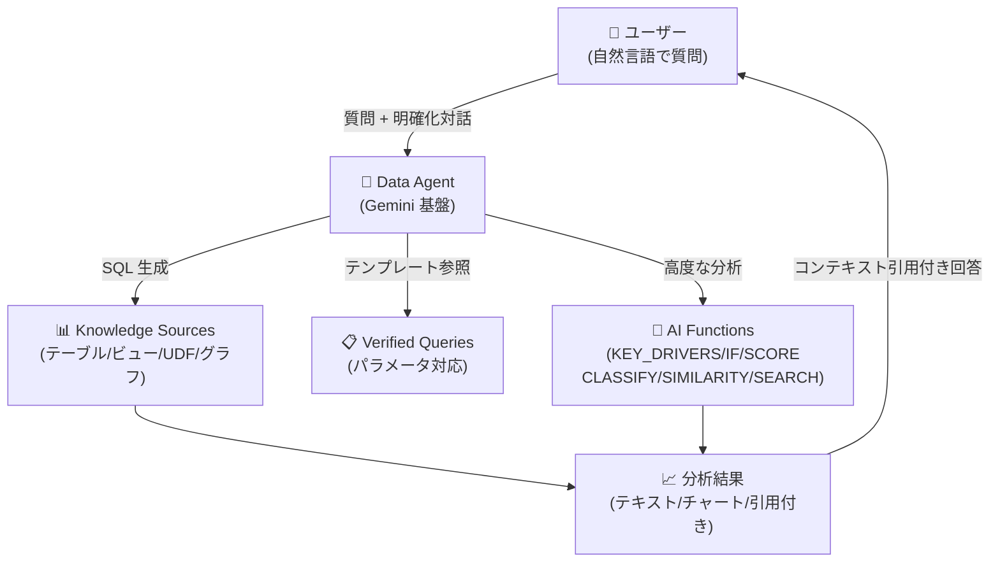

# BigQuery: Conversational Analytics が一般提供 (GA) に昇格

**リリース日**: 2026-06-23

**サービス**: BigQuery

**機能**: Conversational Analytics (会話型分析)

**ステータス**: GA (一般提供)

📊 [このアップデートのインフォグラフィックを見る](https://takech9203.github.io/google-cloud-news-summary/20260623-bigquery-conversational-analytics-ga.html)

## 概要

BigQuery の Conversational Analytics (会話型分析) が一般提供 (GA) になった。この機能は、自然言語でデータエージェントと対話し、BigQuery のデータについて質問できる機能である。Gemini for Google Cloud を基盤としており、SQL を書かずにデータ分析が可能になる。

GA リリースにより、モデル選択の柔軟性、エージェントの思考モード切替、明確化質問、コンテキスト引用、Verified Query でのパラメータサポート、複数の AI 関数 (AI.KEY_DRIVERS, AI.IF, AI.SCORE, AI.CLASSIFY, AI.SIMILARITY, AI.SEARCH) のサポートが追加された。

また、データセットとの会話作成機能がプレビューとして提供開始された。これにより、個別のテーブルを指定せずにデータセット全体に対して質問でき、エージェントが関連テーブルを自動的に特定して結合する。

**アップデート前の課題**

- データ分析に SQL の知識が必要で、ビジネスユーザーが直接データにアクセスすることが困難だった
- エージェントで使用するモデルの選択肢が限定されており、GA モデルとプレビューモデルの使い分けができなかった
- エージェントの思考モードを会話中に変更できず、柔軟な分析ができなかった
- エージェントの回答がどのデータソースに基づいているか不明確だった
- Verified Query でパラメータを使用できず、動的なクエリテンプレートの作成が制限されていた

**アップデート後の改善**

- GA モデルのみ、または GA + プレビューモデルの混合利用を選択可能になった
- 会話内でエージェントの思考モード (Fast / Thinking) を切り替え可能になった
- エージェントがユーザーの入力に対して明確化質問を行い、より正確な回答を生成できるようになった
- 回答にコンテキスト引用が含まれ、回答の根拠となるデータソースを確認できるようになった
- Verified Query でパラメータがサポートされ、再利用可能な動的クエリテンプレートの作成が可能になった
- AI.KEY_DRIVERS, AI.IF, AI.SCORE, AI.CLASSIFY, AI.SIMILARITY, AI.SEARCH の AI 関数がエージェントの回答生成で利用可能になった

## アーキテクチャ図



BigQuery Conversational Analytics のデータフローを示す。ユーザーが自然言語で質問すると、Data Agent が Gemini を使用して SQL を生成し、Knowledge Sources や AI Functions を活用して分析結果を返す。

## サービスアップデートの詳細

### 主要機能

1. **モデル選択の柔軟性**
   - エージェントで使用するモデルを GA モデルのみ、または GA + プレビューモデルの混合から選択可能
   - ユースケースに応じて安定性と最新機能のバランスを調整可能

2. **思考モードの切り替え**
   - 会話中にエージェントの思考モードを変更可能
   - Fast モード: 大半の質問に最適な高速応答
   - Thinking モード: 詳細な推論が必要な複雑な質問向け

3. **明確化質問 (Clarifying Questions)**
   - エージェントがユーザーの曖昧な入力に対して追加質問を行う
   - より正確で意図に沿った回答の生成を支援

4. **コンテキスト引用 (Context Citations)**
   - エージェントの回答に、使用されたデータソースの引用情報を含む
   - 回答の透明性と検証可能性を向上

5. **Verified Query のパラメータサポート**
   - Verified Query (旧 Golden Query) でクエリパラメータを使用可能
   - 動的なフィルタや条件をパラメータ化し、再利用可能なクエリテンプレートを作成

6. **AI 関数の統合**
   - AI.KEY_DRIVERS: データの変動要因を特定
   - AI.IF: セマンティックなフィルタリング
   - AI.SCORE: 入力にスコアを付与しランキング
   - AI.CLASSIFY: テキストや非構造化データの分類
   - AI.SIMILARITY: セマンティック類似度に基づくフィルタリング
   - AI.SEARCH: セマンティック検索

7. **データセットとの会話 (プレビュー)**
   - テーブルを個別に指定せずにデータセット全体に対して質問可能
   - エージェントが自動的に関連テーブルを特定し、必要に応じて結合

## 技術仕様

### サポートされる AI 関数

| AI 関数 | ユースケース | 説明 |
|---------|------------|------|
| AI.KEY_DRIVERS | 変動要因分析 | データの変化の主要因を特定 |
| AI.IF | セマンティックフィルタ | 自然言語条件でのブール判定 |
| AI.SCORE | スコアリング/ランキング | 入力にスコアを付与し順位付け |
| AI.CLASSIFY | 分類 | テキストやデータをカテゴリに分類 |
| AI.SIMILARITY | 類似度検索 | セマンティック類似度に基づくフィルタ |
| AI.SEARCH | セマンティック検索 | 自然言語に基づく全文検索 |

### IAM ロール

| ロール | 説明 |
|--------|------|
| `roles/geminidataanalytics.dataAgentUser` | データエージェントとの会話権限 |
| `roles/geminidataanalytics.dataAgentCreator` | データエージェントの作成権限 |
| `roles/geminidataanalytics.dataAgentEditor` | データエージェントの編集権限 |
| `roles/geminidataanalytics.dataAgentOwner` | データエージェントの所有者権限 |
| `roles/geminidataanalytics.dataAgentStatelessUser` | 直接会話の作成権限 |
| `roles/cloudaicompanion.user` | Gemini for Google Cloud ユーザー権限 |

### セキュリティ

- ユーザーがアクセス権限を持つデータとリソースのみにアクセス可能
- VPC-SC セキュリティコントロールに対応
- 書き込み操作や DML クエリの実行は不可
- リモート関数の実行は不可
- 明示的に選択された Knowledge Source のみにアクセス
- 会話履歴は本人のみに共有 (他ユーザーとの共有不可)

## 設定方法

### 前提条件

1. Google Cloud プロジェクトで課金が有効であること
2. 以下の API を有効化:
   - BigQuery API
   - Gemini Data Analytics API
   - Gemini for Google Cloud API

### 手順

#### ステップ 1: 必要な IAM ロールの付与

```bash
# データエージェントユーザーロールの付与
gcloud projects add-iam-policy-binding PROJECT_ID \
  --member="user:USER_EMAIL" \
  --role="roles/geminidataanalytics.dataAgentUser"

# Gemini for Google Cloud ユーザーロールの付与
gcloud projects add-iam-policy-binding PROJECT_ID \
  --member="user:USER_EMAIL" \
  --role="roles/cloudaicompanion.user"
```

#### ステップ 2: データエージェントの作成

1. Google Cloud Console で BigQuery Agents ページに移動
2. 「Agent Catalog」タブを選択
3. 「Create Agent」をクリック
4. Knowledge Source (テーブル、ビュー、UDF) を選択
5. エージェントのコンテキストと指示を設定
6. Verified Query を追加 (オプション、パラメータ利用可能)
7. 保存して公開

#### ステップ 3: 会話の開始

1. BigQuery Studio で対象のデータセットまたはテーブルを選択
2. 「Chat」ボタンをクリック
3. 質問を入力し、モード (Fast / Thinking) を選択
4. 送信して結果を確認

## メリット

### ビジネス面

- **データ民主化**: SQL の知識がないビジネスユーザーでも直接データ分析が可能
- **分析速度の向上**: 自然言語で即座に質問でき、データインサイトの取得時間を大幅短縮
- **透明性の確保**: コンテキスト引用により、回答の根拠を確認でき、意思決定の信頼性が向上

### 技術面

- **AI 関数の自動活用**: エージェントが質問に応じて適切な AI 関数を自動的に選択・実行
- **再利用可能なクエリテンプレート**: パラメータ付き Verified Query により、一貫性のある分析パターンを構築可能
- **セキュリティの担保**: 既存の IAM ポリシー、VPC-SC、行/列レベルのアクセス制御がそのまま適用

## デメリット・制約事項

### 制限事項

- エージェントは書き込み操作を実行できない (読み取り専用)
- リモート関数の実行は不可
- グラフをデータソースとして使用する場合、1 エージェントあたり 1 グラフに制限
- テーブルとグラフをデータソースとして混在させることは不可
- AI.SEARCH 関数はオートノミック埋め込み生成が有効なテーブルでのみ使用可能

### 考慮すべき点

- 大規模テーブル、データ結合、AI 関数の頻繁な呼び出しはクエリコストを増加させる
- AI による出力は事実と異なる場合があるため、重要な意思決定では検証が推奨される
- データセットとの会話機能はまだプレビュー段階であり、本番利用には注意が必要

## ユースケース

### ユースケース 1: 営業データの即時分析

**シナリオ**: 営業マネージャーが四半期の売上トレンドと変動要因を自然言語で分析する

**実装例**:
```
質問: "今四半期の売上が前四半期と比べてどう変化しているか、変動の主な要因を特定して"
```

エージェントが AI.KEY_DRIVERS 関数を活用し、売上変動の主要因を自動的に特定して回答する。

**効果**: データチームへの分析依頼なしに、営業マネージャーが自ら数分でインサイトを取得可能

### ユースケース 2: カスタマーレビューのセマンティック分析

**シナリオ**: プロダクトマネージャーが顧客レビューデータに対してセマンティックなフィルタリングとスコアリングを行う

**実装例**:
```
質問: "製品の UI に関する否定的なレビューを重要度順に上位10件表示して"
```

エージェントが AI.IF でセマンティックフィルタリングし、AI.SCORE で重要度スコアを付与して結果を返す。

**効果**: 従来は複雑な NLP パイプラインが必要だったレビュー分析を、自然言語の質問だけで実現

### ユースケース 3: データセット横断的な探索分析

**シナリオ**: データアナリストが大規模データセットの全テーブルを対象に探索的分析を行う (プレビュー機能)

**実装例**:
```
質問: "このデータセットで顧客の購買パターンと地域の関係を分析して"
```

データセット会話機能により、エージェントが関連テーブルを自動特定し結合して分析する。

**効果**: テーブル構造を事前に把握せずとも、データセット全体を対象とした探索分析が可能

## 料金

Conversational Analytics の利用には BigQuery の計算料金が適用される。エージェントが質問に答えるために実行するクエリに対して、通常の BigQuery 計算料金が課金される。

- オンデマンド料金またはスロット予約の料金モデルに準拠
- AI 関数の使用は Gemini Enterprise Agent Platform の呼び出し料金が別途発生
- `big_query_max_billed_bytes` パラメータによるクエリ単位のコスト制限が可能

詳細は [BigQuery 計算料金](https://docs.cloud.google.com/bigquery/pricing#analysis_pricing_models) および [エージェント料金](https://cloud.google.com/products/data-agents/pricing) を参照。

## 利用可能リージョン

Conversational Analytics は以下の 3 つのロケーションをサポート:

| ロケーション | 説明 |
|------------|------|
| US MREP | 米国マルチリージョン |
| EU MREP | 欧州マルチリージョン |
| Global | グローバル |

Knowledge Source のリージョンに基づいてデフォルトのロケーションが自動選択される。エージェント作成時にロケーションを変更可能 (作成後の変更は不可)。

## 関連サービス・機能

- **Gemini for Google Cloud**: Conversational Analytics の基盤となる AI エンジン
- **BigQuery AI Functions**: エージェントが分析に活用する AI/ML 関数群
- **Data Studio**: Conversational Analytics のデータエージェントと対話可能な別のインターフェース
- **Knowledge Catalog**: テーブルメタデータやデータインサイトの管理、ビジネス用語集との連携
- **Gemini Enterprise**: データエージェントを組織全体に公開可能 (A2A プロトコル対応)
- **Conversational Analytics API**: プログラマティックなエージェント操作と会話管理

## 参考リンク

- 📊 [インフォグラフィック](https://takech9203.github.io/google-cloud-news-summary/20260623-bigquery-conversational-analytics-ga.html)
- [公式リリースノート](https://docs.cloud.google.com/release-notes#June_23_2026)
- [Conversational Analytics ドキュメント](https://docs.cloud.google.com/bigquery/docs/conversational-analytics)
- [会話の作成 (データセット)](https://docs.cloud.google.com/bigquery/docs/create-conversations#datasets)
- [データエージェントの作成](https://docs.cloud.google.com/bigquery/docs/create-data-agents)
- [BigQuery 料金](https://docs.cloud.google.com/bigquery/pricing#analysis_pricing_models)
- [エージェント料金](https://cloud.google.com/products/data-agents/pricing)
- [Conversational Analytics API](https://docs.cloud.google.com/gemini/docs/conversational-analytics-api/overview)

## まとめ

BigQuery Conversational Analytics の GA 昇格は、データ分析の民主化における大きな前進である。SQL の専門知識がないビジネスユーザーでも、自然言語で高度なデータ分析が可能になり、AI 関数の自動活用により従来は複雑な実装が必要だったセマンティック分析やスコアリングも会話形式で実現できる。まずは既存の BigQuery テーブルに対してデータエージェントを作成し、チーム内での分析ワークフローの効率化を検討することを推奨する。

---

**タグ**: #BigQuery #ConversationalAnalytics #GA #Gemini #AI関数 #自然言語分析 #DataAgent
