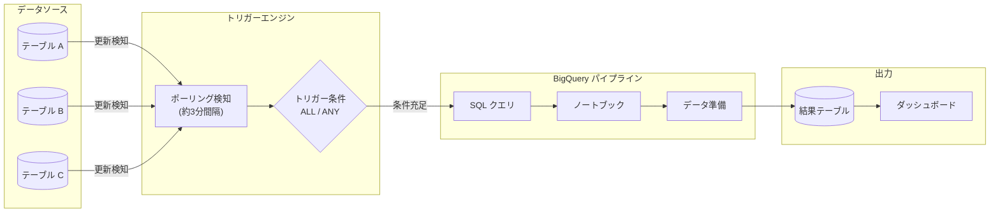

# BigQuery: パイプラインのトリガーベーススケジューリング (Preview)

**リリース日**: 2026-06-23

**サービス**: BigQuery

**機能**: Pipeline trigger-based scheduling

**ステータス**: Preview

[このアップデートのインフォグラフィックを見る](https://takech9203.github.io/google-cloud-news-summary/20260623-bigquery-pipeline-trigger-scheduling.html)

## 概要

BigQuery パイプラインに、テーブル更新をトリガーとしたイベント駆動型のスケジューリング機能が Preview として追加されました。これにより、特定の BigQuery テーブルへの更新を検知して、パイプラインの実行を自動的にトリガーできるようになります。

従来の時間ベースのスケジューリング (cron 形式) に加え、データの変更に応じてリアクティブにパイプラインを実行できるため、データの鮮度を保ちつつ不要な実行を削減できます。BigQuery パイプラインは Dataform を基盤としており、SQL クエリ、ノートブック、データ準備 (Data Preparation) のコードアセットを順序立てて実行するワークフローを構築できます。

この機能は、データパイプラインの自動化を推進するデータエンジニアや、リアルタイムに近いデータ分析基盤を構築する Solutions Architect にとって重要なアップデートです。

**アップデート前の課題**

- パイプラインの実行は固定スケジュール (時間ベース) でしか設定できなかった
- ソーステーブルの更新タイミングとパイプライン実行のタイミングにずれが生じ、データの鮮度に問題があった
- 固定スケジュールでは、データ更新がない場合でも不要なパイプライン実行が発生していた
- データ更新を検知して処理を開始するには、外部のオーケストレーションツール (Cloud Composer など) の構築が必要だった

**アップデート後の改善**

- テーブルの更新を検知して自動的にパイプラインを実行するイベント駆動型スケジューリングが可能になった
- 単一テーブル、複数テーブルの ALL 条件 (すべて更新時)、ANY 条件 (いずれか更新時) でトリガー条件を定義可能
- Min Execution Duration (最小実行間隔) と Max Wait Duration (最大待機時間) でトリガーの挙動を細かく制御可能
- 外部オーケストレーションツールなしで、BigQuery 内でイベント駆動パイプラインを完結できるようになった

## アーキテクチャ図

BigQuery テーブルの更新を約 3 分間隔のポーリングで検知し、設定されたトリガー条件 (ALL/ANY) が満たされた場合にパイプラインの実行を自動的に開始するフローを示しています。

## サービスアップデートの詳細

### 主要機能

1. **イベント駆動型パイプライン実行**
   - 指定した BigQuery テーブルへの更新を検知して、パイプラインの実行を自動トリガー
   - 固定スケジュールではなく、データ変更に応じたリアクティブな実行が可能
   - パイプライン内の SQL クエリ、ノートブック、データ準備を順序立てて実行

2. **柔軟なトリガー条件定義**
   - **単一テーブル監視**: 1 つのテーブルの更新でトリガー
   - **ALL 条件 (すべてのテーブル更新)**: 指定した全テーブルが更新された場合にのみトリガー
   - **ANY 条件 (いずれかのテーブル更新)**: 指定したテーブルのいずれかが更新された場合にトリガー

3. **実行間隔の制御パラメータ**
   - **Min Execution Duration (最小実行間隔)**: トリガーの最小発火間隔を設定 (3 分 - 24 時間、デフォルト 3 分)
   - **Max Wait Duration (最大待機時間)**: テーブル更新がなくても強制的にトリガーを発火する期間を設定 (1 秒 - 7 日間)

4. **認証方式の選択**
   - サービスアカウントによる実行
   - Google アカウントのユーザー認証情報による実行 (Preview)

## 技術仕様

### トリガー設定パラメータ

| パラメータ | 説明 | 設定範囲 | デフォルト |
|-----------|------|---------|-----------|
| Trigger Condition | トリガー条件 (ALL/ANY) | ALL または ANY | - |
| Min Execution Duration | 最小実行間隔 | 3 分 - 24 時間 | 3 分 |
| Max Wait Duration | 最大待機時間 | 1 秒 - 7 日間 | 未設定 (更新時のみ実行) |
| Polling Interval | テーブル状態チェック間隔 | 約 3 分 (固定) | 3 分 |

### 制限事項

| 項目 | 詳細 |
|------|------|
| ポーリング間隔 | 約 3 分 (即時ではない。テーブル変更からトリガー発火まで遅延が発生する) |
| API クォータ消費 | 各監視テーブルがポーリング間隔ごとに BigQuery API を呼び出す |
| 多数テーブル監視時 | BigQuery API クォータ消費に注意が必要 |

### 必要な IAM ロール

| 操作 | 必要なロール |
|------|------------|
| トリガー作成・編集・削除 | `roles/dataform.Admin` (パイプラインに対して) |
| サービスアカウント使用 | `roles/iam.serviceAccountUser` (サービスアカウントに対して) |
| パイプラインの表示・実行 | `roles/dataform.Viewer` (プロジェクトに対して) |
| スケジュールの表示 | `roles/dataform.Editor` (プロジェクトに対して) |

## 設定方法

### 前提条件

1. BigQuery パイプラインが作成済みであること
2. パイプラインスケジューリング用のサービスアカウントに適切な IAM ロールが付与されていること
3. Dataform サービスエージェントに `roles/iam.serviceAccountTokenCreator` が付与されていること

### 手順

#### ステップ 1: パイプラインの選択

Google Cloud コンソールで BigQuery ページに移動し、左ペインの Explorer からプロジェクトを展開して「Pipelines」をクリックし、対象のパイプラインを選択します。

#### ステップ 2: トリガーの作成

1. パイプライン詳細画面で「Trigger」をクリック
2. トリガー名を入力
3. 認証セクションで認証方式を選択:
   - 「Execute with selected service account」でサービスアカウントを選択
   - または「Execute with my user credentials」(Preview) でユーザー認証情報を使用

#### ステップ 3: トリガー条件の設定

1. Configuration Type で「Trigger (event-based execution)」を選択
2. Search tables フィールドで監視対象のテーブルを追加
3. Trigger Condition を選択:
   - 「Wait for ALL tables to update」: 全テーブル更新時にトリガー
   - 「Trigger if ANY table updates」: いずれかのテーブル更新時にトリガー

#### ステップ 4: オプション設定

1. (任意) Max Wait Duration: テーブル更新がなくても強制実行する期間を設定
2. (任意) Min Execution Duration: トリガーの最小発火間隔を設定
3. 「Create schedule」をクリックして作成完了

## メリット

### ビジネス面

- **データ鮮度の向上**: ソースデータの更新後、最短 3 分でパイプラインが実行され、分析データが最新化される
- **コスト最適化**: データ更新がない場合の不要なパイプライン実行を削減し、計算コストを抑制
- **運用工数削減**: 外部オーケストレーションツールの構築・運用が不要になり、BigQuery 内で完結

### 技術面

- **イベント駆動アーキテクチャの簡素化**: BigQuery ネイティブでイベント駆動パイプラインを構築でき、外部依存を排除
- **柔軟な条件設定**: ALL/ANY 条件と実行間隔パラメータにより、複雑なデータ依存関係を表現可能
- **Dataform 基盤の信頼性**: Dataform のワークフロー管理機能を活用した堅牢な実行制御

## デメリット・制約事項

### 制限事項

- ポーリングベースのため即時性に限界がある (約 3 分の遅延)
- 監視テーブル数が多い場合、BigQuery API クォータを消費する
- Preview 段階のため、サポートが限定的で SLA の対象外
- Google Cloud コンソールからのみ設定可能 (API/CLI 未対応の可能性)

### 考慮すべき点

- ポーリング間隔が固定 (約 3 分) のため、サブ分レベルのリアルタイム性が必要な場合は別のアプローチが必要
- Min Execution Duration のデフォルトが 3 分のため、高頻度のテーブル更新では意図しないスキップが発生する可能性
- Preview 機能のため本番ワークロードへの適用は慎重に検討が必要

## ユースケース

### ユースケース 1: データウェアハウスの段階的更新

**シナリオ**: ETL パイプラインでソーステーブルにデータがロードされた後、派生テーブルやマートテーブルを自動的に更新したい場合。ソースデータの到着タイミングが不定期であるため、固定スケジュールではデータの鮮度にばらつきが生じていた。

**効果**: ソーステーブルの更新を検知して自動的に下流の変換処理が実行されるため、データの鮮度が向上し、不要な実行コストも削減される。

### ユースケース 2: 複数データソースの統合分析

**シナリオ**: 複数の部門から異なるタイミングでデータが BigQuery テーブルに投入される。すべてのソーステーブルが更新された時点で統合レポートを生成したい。

**効果**: ALL 条件のトリガーを使用することで、すべてのソーステーブルが更新されたことを確認してから統合処理を実行でき、データの整合性が保証される。

### ユースケース 3: ML モデルの自動再学習

**シナリオ**: 学習データテーブルに新しいデータが追加された際に、ノートブックによるモデル再学習パイプラインを自動実行したい。

**効果**: ANY 条件のトリガーと Min Execution Duration の組み合わせにより、学習データの更新頻度に応じた適切な間隔でモデルを再学習できる。

## 料金

BigQuery パイプラインのトリガーベーススケジューリング自体に追加料金は明示されていませんが、以下のコストが発生します:

- パイプライン実行時の BigQuery クエリ実行コスト (オンデマンドまたはリザベーション)
- ノートブック実行時の Colab Enterprise ランタイムコスト
- ポーリングによる BigQuery API 呼び出し (API クォータに影響)

詳細は [BigQuery の料金ページ](https://cloud.google.com/bigquery/pricing) を参照してください。

## 関連サービス・機能

- **Dataform**: BigQuery パイプラインの基盤技術。ワークフロー管理、依存関係解決、スケジューリングを提供
- **BigQuery Scheduled Queries**: 従来の時間ベーススケジューリング機能。トリガーベーススケジューリングと併用可能
- **Cloud Composer (Apache Airflow)**: より複雑なオーケストレーションが必要な場合の代替手段。マルチクラウドやハイブリッド環境対応
- **Pub/Sub + Cloud Functions**: リアルタイムイベント駆動が必要な場合の代替アーキテクチャ
- **BigQuery Data Transfer Service**: 外部データソースからの定期的なデータ取り込み。トリガーのソースとなるテーブル更新の元になりうる

## 参考リンク

- [このアップデートのインフォグラフィック](https://takech9203.github.io/google-cloud-news-summary/20260623-bigquery-pipeline-trigger-scheduling.html)
- [公式リリースノート](https://docs.cloud.google.com/release-notes#June_23_2026)
- [Trigger-based scheduling ドキュメント](https://docs.cloud.google.com/bigquery/docs/schedule-pipelines#trigger-based-scheduling)
- [BigQuery パイプラインの概要](https://docs.cloud.google.com/bigquery/docs/pipelines-introduction)
- [パイプラインのスケジューリング](https://docs.cloud.google.com/bigquery/docs/schedule-pipelines)
- [料金ページ](https://cloud.google.com/bigquery/pricing)
- [フィードバック・サポート: bigquery-event-based-triggers@google.com](mailto:bigquery-event-based-triggers@google.com)

## まとめ

BigQuery パイプラインのトリガーベーススケジューリングは、データ変更に応じたイベント駆動型パイプライン実行を BigQuery ネイティブで実現する重要な機能です。固定スケジュールの限界を超え、データの鮮度向上とコスト最適化を同時に達成できます。Preview 段階ですが、データウェアハウスの段階的更新や ML モデルの自動再学習など、多くのユースケースに適用可能なため、開発環境での検証を推奨します。

---

**タグ**: #BigQuery #Pipeline #EventDriven #TriggerScheduling #DataAutomation #Dataform #Preview
