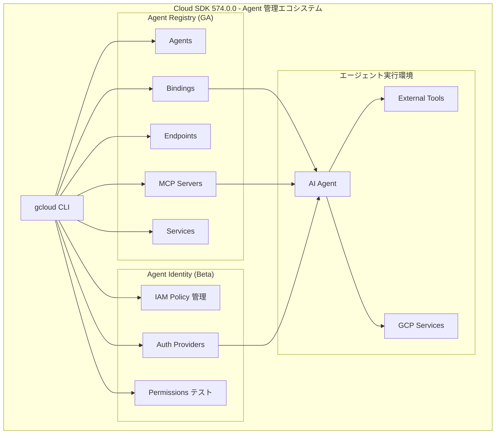

# Cloud SDK: 574.0.0 リリース

**リリース日**: 2026-06-23

**サービス**: Cloud SDK

**機能**: Cloud SDK 574.0.0 リリース - Agent Registry GA、Agent Identity IAM コマンド追加、各種修正と機能強化

**ステータス**: GA / Beta / Alpha (コマンドにより異なる)

[このアップデートのインフォグラフィックを見る](https://takech9203.github.io/google-cloud-news-summary/20260623-cloud-sdk-574-0-0.html)

## 概要

Cloud SDK 574.0.0 がリリースされ、AI エージェント関連の管理機能が大幅に強化された。最も注目すべきは **Agent Registry コマンドグループの GA (一般提供)** であり、AI エージェント、MCP サーバー、エンドポイントの一元管理が gcloud CLI から正式に利用可能になった。

Agent Registry は、Model Context Protocol (MCP) サーバー、ツール、AI エージェントを Google Cloud 内で保存・検出・ガバナンスするための集中カタログである。今回の GA 昇格により、`gcloud agent-registry` コマンドグループが正式サポートされ、エージェント、バインディング、エンドポイント、MCP サーバー、サービスなどのリソースを CLI から管理できるようになった。

また、Agent Identity の auth-providers に対する IAM コマンド (beta) の追加により、エージェントの認証プロバイダーに対するきめ細かいアクセス制御が可能になった。その他、BigQuery の stderr/stdout バグ修正、Compute Engine の url-maps import バグ修正、Kubernetes Engine の kubectl 更新など、多数の改善が含まれている。

**アップデート前の課題**

- Agent Registry のリソース管理は alpha チャンネルのみで利用可能であり、本番環境での使用には適さなかった
- Agent Identity の auth-providers に対する IAM ポリシー操作 (get/set/add/remove/test) が CLI からサポートされていなかった
- BigQuery CLI で stderr メッセージが stdout に出力されるバグがあり、パイプライン処理で問題が発生していた
- Compute Engine の `url-maps import` でカスタム timeout と retryPolicy (numRetries) がデフォルト値にリセットされるバグがあった

**アップデート後の改善**

- Agent Registry が GA となり、本番環境で安定した CLI 管理が可能になった
- Agent Identity auth-providers の IAM コマンド (beta) により、認証プロバイダーのアクセス制御がセルフサービスで実現可能になった
- BigQuery CLI の出力バグが修正され、正確な stderr/stdout の分離が保証されるようになった
- Compute Engine url-maps import のバグ修正により、既存の URL マップ設定が意図せず変更されるリスクが解消された

## アーキテクチャ図



Agent Registry (GA) と Agent Identity (Beta) の連携により、エージェントの登録・検出からアクセス制御まで一貫した CLI 管理が実現される。

## サービスアップデートの詳細

### 主要機能

1. **Agent Registry コマンドグループ (GA)**
   - `gcloud agent-registry` コマンドグループが一般提供開始
   - サブコマンド: `agents`, `bindings`, `endpoints`, `mcp-servers`, `operations`, `services`
   - API バージョン: `agentregistry/v1`
   - MCP サーバーの登録・検出・管理、エージェントのバインディング管理が可能

2. **Agent Identity auth-providers IAM コマンド (Beta)**
   - `gcloud beta agent-identity auth-providers get-iam-policy` - IAM ポリシーの取得
   - `gcloud beta agent-identity auth-providers set-iam-policy` - IAM ポリシーの設定
   - `gcloud beta agent-identity auth-providers add-iam-policy-binding` - IAM バインディングの追加
   - `gcloud beta agent-identity auth-providers remove-iam-policy-binding` - IAM バインディングの削除
   - `gcloud beta agent-identity auth-providers test-iam-permissions` - IAM 権限のテスト

3. **AI Platform - Semantic Governance Policy Engine (Beta)**
   - `gcloud beta ai semantic-governance-policy-engine deprovision` コマンドの追加
   - テナントプロジェクト、GKE クラスタ、PSC サービスアタッチメントを含むリソースの廃止が可能

4. **BigQuery の修正と改善**
   - stderr メッセージが stdout に出力されるバグの修正
   - `--gcloud_config_cache` フラグの追加 (gcloud CLI から取得するデータのキャッシュを有効化)
   - `bq show --routine` での BigQuery Python UDF のコンテナリクエスト同時実行数の表示追加
   - API リクエストの user-agent HTTP ヘッダーに AI Agent 情報を追加

5. **Compute Engine の修正と改善**
   - `url-maps import` でカスタム timeout と retryPolicy (numRetries) がデフォルトにリセットされるバグの修正
   - `--vsock-mode` フラグの追加 (ALPHA) - VSOCK モードの有効化/無効化
   - `--purpose` フラグを `public-delegated-prefixes create` で beta に昇格

6. **Kubernetes Engine**
   - デフォルト kubectl を 1.35.3 から 1.35.6 に更新
   - RAPID チャンネル用に kubectl 1.36.2 を追加
   - kubectl 1.30 (1.30.14) から kubectl 1.36 (1.36.2) まで全バージョン利用可能

7. **Cloud Memorystore**
   - `--zone-distribution-config-zones` フラグの追加
   - `gcloud memorystore instances create` および `gcloud redis clusters create` でマルチゾーンクラスタ作成時に複数ゾーン指定が可能

8. **Network Security**
   - `ull-mirroring-engines` と `ull-mirroring-collectors` コマンドを beta および GA に昇格

9. **Cloud Datastream / Database Migration**
   - 両サービスで Regional Endpoints (REP) のサポートを追加

10. **その他**
    - Backup For GKE: non-default universe domains への対応
    - Cluster Director: `--quickstart-cluster` サポート追加
    - Colab: Hyperdisk Balanced ディスクタイプオプションの追加

## 技術仕様

### Agent Registry コマンド構成

| コマンドグループ | 説明 | API バージョン |
|------|------|------|
| `gcloud agent-registry agents` | Agent リソースの管理 | v1 |
| `gcloud agent-registry bindings` | Binding リソースの管理 | v1 |
| `gcloud agent-registry endpoints` | Endpoint リソースの管理 | v1 |
| `gcloud agent-registry mcp-servers` | MCP Server リソースの管理 | v1 |
| `gcloud agent-registry operations` | Operation リソースの管理 | v1 |
| `gcloud agent-registry services` | Service リソースの管理 | v1 |

### Agent Identity IAM コマンド

| コマンド | 説明 | ステータス |
|------|------|------|
| `get-iam-policy` | authProvider の IAM ポリシーを取得 | Beta |
| `set-iam-policy` | authProvider の IAM ポリシーを設定 | Beta |
| `add-iam-policy-binding` | IAM ポリシーバインディングを追加 | Beta |
| `remove-iam-policy-binding` | IAM ポリシーバインディングを削除 | Beta |
| `test-iam-permissions` | IAM 権限をテスト | Beta |

### kubectl バージョン一覧

| チャンネル | バージョン |
|------|------|
| デフォルト | 1.35.6 |
| RAPID | 1.36.2 |
| kubectl.1.30 | 1.30.14 |
| kubectl.1.31 | 1.31.14 |
| kubectl.1.32 | 1.32.13 |
| kubectl.1.33 | 1.33.13 |
| kubectl.1.34 | 1.34.9 |
| kubectl.1.35 | 1.35.6 |
| kubectl.1.36 | 1.36.2 |

## 設定方法

### 前提条件

1. Cloud SDK がインストールされていること
2. 対象プロジェクトで必要な API が有効化されていること

### 手順

#### ステップ 1: Cloud SDK のアップデート

```bash
# Cloud SDK を最新版に更新
gcloud components update
```

#### ステップ 2: Agent Registry の利用 (GA)

```bash
# MCP サーバーの一覧表示
gcloud agent-registry mcp-servers list \
  --project=PROJECT_ID \
  --location=REGION

# MCP サーバーの詳細表示
gcloud agent-registry mcp-servers describe SERVER_NAME \
  --location=REGION
```

#### ステップ 3: Agent Identity auth-providers の IAM 管理 (Beta)

```bash
# auth-provider の IAM ポリシーを取得
gcloud beta agent-identity auth-providers get-iam-policy \
  my-auth-provider --location=us-central1

# IAM バインディングの追加
gcloud beta agent-identity auth-providers add-iam-policy-binding \
  my-auth-provider \
  --location=us-central1 \
  --member='user:test-user@gmail.com' \
  --role='roles/agentidentity.user'

# IAM ポリシーの設定 (JSON ファイルから)
gcloud beta agent-identity auth-providers set-iam-policy \
  my-auth-provider policy.json --location=us-central1
```

## メリット

### ビジネス面

- **エージェント管理の本番運用対応**: Agent Registry の GA により、エンタープライズ環境でのエージェント管理が正式にサポートされ、SLA の対象となる
- **ガバナンスの強化**: Agent Identity の IAM コマンドにより、エージェントの認証プロバイダーに対するアクセス制御を組織のセキュリティポリシーに準拠して管理可能
- **運用効率の向上**: CLI からエージェント、MCP サーバー、エンドポイントの管理が一元化され、スクリプトや CI/CD パイプラインへの組み込みが容易

### 技術面

- **MCP 標準のネイティブサポート**: Model Context Protocol サーバーの登録・検出・バインディングが gcloud コマンドで完結
- **BigQuery パイプラインの信頼性向上**: stderr/stdout バグ修正により、シェルスクリプトでの BigQuery CLI 利用がより確実に
- **Compute Engine 構成の安定性**: url-maps import バグ修正により、Infrastructure as Code ワークフローでの設定ドリフトが解消

## デメリット・制約事項

### 制限事項

- Agent Identity auth-providers の IAM コマンドはまだ beta であり、今後変更される可能性がある
- Agent Registry は GA だが、サービス自体は Preview 段階のため、Pre-GA 条件が適用される場合がある
- `--vsock-mode` フラグは ALPHA のみで利用可能

### 考慮すべき点

- Agent Registry を利用するには Agent Registry API の有効化が必要
- Agent Identity auth manager を使用するには組織レベルでの設定が必要な場合がある
- kubectl のデフォルトバージョンが 1.35.6 に更新されるため、既存の kubectl スクリプトとの互換性を確認すること

## ユースケース

### ユースケース 1: エージェントフリートの一元管理

**シナリオ**: 複数の AI エージェントと MCP サーバーをプロジェクト内で運用しており、CLI からの管理・監査を行いたい

**実装例**:
```bash
# 登録されている全エージェントの確認
gcloud agent-registry agents list --location=us-central1

# MCP サーバーの登録状況確認
gcloud agent-registry mcp-servers list --location=us-central1

# バインディングの確認 (エージェントと MCP サーバーの接続)
gcloud agent-registry bindings list --location=us-central1
```

**効果**: エージェントの棚卸し、未使用リソースの特定、ガバナンス要件への対応が CLI から効率的に実行可能

### ユースケース 2: エージェント認証のアクセス制御

**シナリオ**: 特定のエージェントのみが外部サービスの認証プロバイダーを利用できるよう制限したい

**実装例**:
```bash
# 特定のエージェントにのみ auth-provider の利用権限を付与
gcloud beta agent-identity auth-providers add-iam-policy-binding \
  external-api-provider \
  --location=us-central1 \
  --member='principal://agents.global.org-123456789012.system.id.goog/resources/aiplatform/projects/9876543210/locations/us-central1/reasoningEngines/my-agent' \
  --role='roles/agentidentity.user'
```

**効果**: 最小権限の原則に基づき、エージェントごとに外部サービスへのアクセスを制御し、セキュリティリスクを最小化

## 関連サービス・機能

- **Gemini Enterprise Agent Platform**: Agent Registry はその中核コンポーネントとして、エージェントのガバナンスと統合インベントリを提供
- **Agent Identity (IAM)**: エージェントに SPIFFE ベースの暗号学的 ID を付与し、MCP サーバーやクラウドリソースへの安全な認証を実現
- **Vertex AI Agent Engine**: Agent Identity によりエージェントの独自 ID での認証が可能
- **Cloud Memorystore**: マルチゾーン構成の強化により高可用性キャッシュの構築が容易に
- **GKE / Kubernetes Engine**: kubectl の定期的な更新により最新の Kubernetes 機能へのアクセスを維持

## 参考リンク

- [公式リリースノート](https://docs.cloud.google.com/release-notes#June_23_2026)
- [Cloud SDK リリースノート全文](https://docs.cloud.google.com/sdk/docs/release-notes)
- [Agent Registry 概要](https://docs.cloud.google.com/agent-registry/overview)
- [Agent Identity 概要](https://docs.cloud.google.com/iam/docs/agent-identity-overview)
- [gcloud agent-registry リファレンス](https://docs.cloud.google.com/sdk/gcloud/reference/agent-registry)
- [Agent Identity auth-providers 管理](https://docs.cloud.google.com/iam/docs/manage-auth-providers)
- [Cloud SDK インストール](https://cloud.google.com/sdk/docs/install)

## まとめ

Cloud SDK 574.0.0 は AI エージェント管理の観点で重要なマイルストーンとなるリリースである。Agent Registry の GA 昇格により、MCP サーバーやエージェントの CLI 管理が本番環境で正式にサポートされ、Agent Identity の IAM コマンド追加によりエージェントの認証プロバイダーに対するきめ細かいアクセス制御が可能になった。AI エージェントを活用している組織は、速やかに Cloud SDK をアップデートし、Agent Registry によるエージェントフリートの一元管理と IAM ベースのガバナンス体制の構築を検討すべきである。

---

**タグ**: #CloudSDK #AgentRegistry #AgentIdentity #MCP #IAM #BigQuery #ComputeEngine #GKE #kubectl #Memorystore #NetworkSecurity #Datastream #DatabaseMigration
