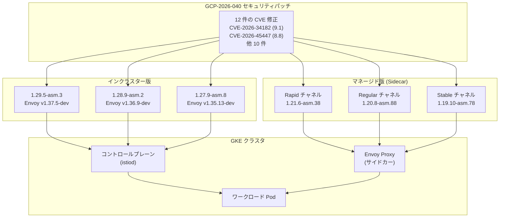

# Cloud Service Mesh: セキュリティパッチ GCP-2026-040 (12 件の CVE 修正)

**リリース日**: 2026-06-23

**サービス**: Cloud Service Mesh

**機能**: セキュリティパッチ (GCP-2026-040)

**ステータス**: ローリングアウト中

[このアップデートのインフォグラフィックを見る](https://takech9203.github.io/google-cloud-news-summary/20260623-cloud-service-mesh-security-patches-gcp-2026-040.html)

## 概要

Google Cloud は、Cloud Service Mesh (インクラスターおよびマネージド) に対して、セキュリティ脆弱性 GCP-2026-040 を修正する複数のセキュリティパッチをリリースした。今回のパッチでは合計 12 件の CVE が修正されており、最も深刻度の高い CVE-2026-34182 は CVSS スコア 9.1 (Medium 評価)、CVE-2026-45447 は CVSS 8.8 (High 評価) と高いスコアを持つ。

インクラスター版では 3 つのバージョン系列 (1.29.x、1.28.x、1.27.x) に対してそれぞれパッチがリリースされ、マネージド版では Rapid、Regular、Stable の全 3 チャネルに新しいサイドカーイメージがローリングアウトされている。今回のロールアウトは、2026 年 6 月 12 日に事前にアナウンスされていたロールアウトに先行する形で配信されている。

対象ユーザーは、Cloud Service Mesh を利用しているすべての GKE クラスタ管理者、プラットフォームエンジニア、およびセキュリティチームである。CVE-2026-45447 が High 評価であること、また複数の CVE が同時に修正されていることから、速やかなアップグレードが推奨される。

**アップデート前の課題**

- Envoy Proxy に 12 件のセキュリティ脆弱性が存在し、CVE-2026-45447 (High/8.8) を含む深刻な攻撃ベクトルが存在していた
- CVE-2026-34182 (CVSS 9.1) により、特定条件下で重大なセキュリティリスクが発生する可能性があった
- インクラスター版およびマネージド版の全バージョンが脆弱な状態にあった

**アップデート後の改善**

- 12 件すべての CVE が修正され、Envoy Proxy のセキュリティリスクが解消される
- インクラスター版 3 バージョン系列 (1.29.x、1.28.x、1.27.x) すべてにパッチが提供された
- マネージド版の全 3 リリースチャネル (Rapid、Regular、Stable) にパッチが配信されている
- 2026 年 6 月 12 日にアナウンスされたロールアウトよりも前倒しで修正が適用される

## アーキテクチャ図



GCP-2026-040 のセキュリティパッチがインクラスター版 (3 バージョン系列) およびマネージド版 (3 リリースチャネル) を通じて GKE クラスタのコントロールプレーンとプロキシに適用される流れを示す。

## サービスアップデートの詳細

### 主要機能

1. **インクラスター版セキュリティパッチ (3 バージョン)**
   - 1.29.5-asm.3 (Envoy v1.37.5-dev): 最新メジャーバージョン系列のパッチ
   - 1.28.9-asm.2 (Envoy v1.36.9-dev): 1 つ前のメジャーバージョン系列のパッチ
   - 1.27.9-asm.8 (Envoy v1.35.13-dev): 2 つ前のメジャーバージョン系列のパッチ
   - すべてのバージョンで GCP-2026-040 に記載された脆弱性が修正されている

2. **マネージド版サイドカーパッチ (3 チャネル)**
   - Rapid: 1.21.6-asm.38 (最新機能の早期利用向け)
   - Regular: 1.20.8-asm.88 (バランス重視の標準環境向け)
   - Stable: 1.19.10-asm.78 (安定性最優先の本番環境向け)
   - マネージドデータプレーンが有効な場合、プロキシは自動的に更新される

3. **6 月 12 日アナウンスのロールアウトに先行**
   - 今回のセキュリティパッチロールアウトは、2026 年 6 月 12 日に事前にアナウンスされていたロールアウトに先行する
   - セキュリティ脆弱性の深刻度を考慮し、前倒しでの配信が決定された
   - CVE パッチの場合、GKE メンテナンスウィンドウの設定に関わらず高優先度で適用が開始される

## 技術仕様

### インクラスター版パッチバージョン一覧

| バージョン系列 | パッチバージョン | Envoy バージョン | 対象 |
|---------------|-----------------|-----------------|------|
| 1.29.x | 1.29.5-asm.3 | v1.37.5-dev | インクラスター |
| 1.28.x | 1.28.9-asm.2 | v1.36.9-dev | インクラスター |
| 1.27.x | 1.27.9-asm.8 | v1.35.13-dev | インクラスター |

### マネージド版パッチバージョン一覧

| リリースチャネル | パッチバージョン | リビジョンラベル | 用途 |
|-----------------|-----------------|----------------|------|
| Rapid | 1.21.6-asm.38 | `asm-managed-rapid` | プレプロダクション、早期検証 |
| Regular | 1.20.8-asm.88 | `asm-managed` | 標準的な本番環境 (推奨) |
| Stable | 1.19.10-asm.78 | `asm-managed-stable` | 安定性最優先の本番環境 |

### CVE 一覧

| CVE ID | 深刻度 (Google 評価) | CVSS スコア | 備考 |
|--------|---------------------|-------------|------|
| CVE-2026-34182 | Medium | 9.1 | 最高 CVSS スコア |
| CVE-2026-45447 | High | 8.8 | 最高深刻度評価 |
| CVE-2026-7383 | Low | 8.1 | |
| CVE-2026-34180 | Low | 7.5 | |
| CVE-2026-45445 | Medium | 7.5 | |
| CVE-2026-9076 | Low | 7.5 | |
| CVE-2026-42766 | Low | 5.9 | |
| CVE-2026-42767 | Low | 5.9 | |
| CVE-2026-34743 | Low | 5.3 | |
| CVE-2026-45446 | Low | 4.8 | |
| CVE-2026-42770 | Low | 3.7 | |
| CVE-2026-40226 | Medium | 0.0 | 理論上の脆弱性 |

## 設定方法

### インクラスター版のアップグレード手順

#### 前提条件

1. GKE クラスタで Cloud Service Mesh のインクラスター版が稼働していること
2. `gcloud` CLI がインストール済みで、適切な権限を持つアカウントで認証されていること
3. 現在のバージョンが 1.27.x、1.28.x、または 1.29.x 系列であること

#### ステップ 1: 現在のバージョン確認

```bash
# 現在インストールされている Cloud Service Mesh のリビジョンを確認
kubectl get pods -n istio-system -l app=istiod -o jsonpath='{.items[*].metadata.labels.istio\.io/rev}'
```

現在のリビジョンラベルを確認し、アップグレード先のバージョンを決定する。

#### ステップ 2: 新しいコントロールプレーンのインストール (カナリアアップグレード)

```bash
# 例: 1.29.5-asm.3 へのアップグレード
# asmcli を使用して新しいリビジョンをインストール
./asmcli install \
  --project_id PROJECT_ID \
  --cluster_name CLUSTER_NAME \
  --cluster_location CLUSTER_LOCATION \
  --fleet_id FLEET_PROJECT_ID \
  --output_dir ./asm_output \
  --enable_all
```

新しいリビジョンがインストールされると、既存のコントロールプレーンと並行して動作する。

#### ステップ 3: 名前空間のリビジョンラベルを更新

```bash
# 新しいリビジョンラベルに切り替え
kubectl label namespace NAMESPACE istio.io/rev=asm-1295-3 --overwrite

# ワークロードの再起動でサイドカーを更新
kubectl rollout restart deployment -n NAMESPACE
```

段階的に名前空間を移行し、問題がないことを確認してから次の名前空間に進む。

### マネージド版の場合

マネージドデータプレーンが有効なクラスタでは、セキュリティパッチは自動的にローリングアウトされる。ただし、StatefulSet や Job は手動で再起動する必要がある。

```bash
# StatefulSet の手動再起動
kubectl rollout restart statefulset -n NAMESPACE

# マネージドデータプレーンの状態確認
kubectl get dataplanecontrols -o yaml
```

## メリット

### セキュリティ面

- **12 件の脆弱性を一括修正**: CVSS 9.1 を含む複数の脆弱性が単一のパッチで修正され、攻撃対象面が大幅に縮小される
- **全バージョン系列への同時提供**: サポート対象の全バージョン (インクラスター 3 系列 + マネージド 3 チャネル) にパッチが提供され、バージョンに関わらず保護される
- **前倒しでの提供**: 6 月 12 日のアナウンスよりも早期に修正が提供され、脆弱性が存在する期間が短縮される

### 運用面

- **マネージド版の自動更新**: マネージドデータプレーンを利用している場合、手動介入なしでプロキシが更新される
- **カナリアアップグレード対応**: インクラスター版ではリビジョンベースのカナリアアップグレードにより、安全にパッチを適用可能
- **ロールバック容易性**: 問題発生時にリビジョンラベルの変更で容易にロールバックが可能

## デメリット・制約事項

### 制限事項

- インクラスター版の場合、手動でのアップグレード作業が必要 (カナリアアップグレードの実施)
- StatefulSet や Job はマネージドデータプレーンでも自動更新されないため、手動再起動が必要
- ワークロード Pod の再起動が必要なため、一時的なサービス中断が発生する可能性がある

### 考慮すべき点

- CVE-2026-34182 の CVSS スコアが 9.1 と高いにもかかわらず Google 評価が Medium であることから、Cloud Service Mesh 固有の文脈では影響が限定的と判断されている可能性がある。ただし速やかな適用が推奨される
- 今回のロールアウトが 6 月 12 日のアナウンス分に先行するため、スケジュール管理に注意が必要
- Envoy バージョンが `-dev` サフィックスを持つことに留意 (開発ビルドベース)

## ユースケース

### ユースケース 1: マネージド Cloud Service Mesh を利用する本番環境

**シナリオ**: GKE クラスタでマネージド Cloud Service Mesh を使用し、Regular チャネルを利用している本番環境。マネージドデータプレーンが有効化済み。

**対応**: セキュリティパッチ 1.20.8-asm.88 は自動的にローリングアウトされるため、基本的に手動対応は不要。ただし StatefulSet がある場合は手動で再起動する。

```bash
# StatefulSet の確認と再起動
kubectl get statefulsets --all-namespaces -l istio.io/rev
kubectl rollout restart statefulset -n TARGET_NAMESPACE
```

**効果**: CVE-2026-45447 (High/8.8) を含む 12 件の脆弱性が自動的に修正され、セキュリティリスクが解消される。

### ユースケース 2: インクラスター版のカナリアアップグレード

**シナリオ**: 複数の名前空間でマイクロサービスを運用しており、インクラスター Cloud Service Mesh 1.29.x を使用。セキュリティパッチを段階的に適用したい。

**対応**: 1.29.5-asm.3 を新しいリビジョンとしてインストールし、テスト用名前空間から段階的に移行する。

**効果**: カナリアアップグレードにより、本番トラフィックへの影響を最小化しながら 12 件の CVE 修正を安全に適用できる。

## 関連サービス・機能

- **GKE (Google Kubernetes Engine)**: Cloud Service Mesh が動作する基盤。GKE のリリースチャネルとマネージド版のチャネルが対応している
- **Cloud Service Mesh セキュリティ速報**: GCP-2026-040 の詳細な脆弱性情報が記載される
- **Envoy Proxy**: Cloud Service Mesh のデータプレーンとして使用。今回のパッチは Envoy の脆弱性修正が中心
- **Binary Authorization**: パッチ適用後のイメージ検証に活用可能

## 参考リンク

- [このアップデートのインフォグラフィック](https://takech9203.github.io/google-cloud-news-summary/20260623-cloud-service-mesh-security-patches-gcp-2026-040.html)
- [公式リリースノート](https://docs.cloud.google.com/release-notes#June_23_2026)
- [Cloud Service Mesh セキュリティ速報](https://docs.cloud.google.com/service-mesh/docs/security-bulletins#gcp-2026-040)
- [Cloud Service Mesh アップグレードガイド](https://docs.cloud.google.com/service-mesh/docs/upgrade/upgrade)
- [Cloud Service Mesh リビジョン概要](https://docs.cloud.google.com/service-mesh/docs/revisions-overview)

## まとめ

Cloud Service Mesh に対して GCP-2026-040 のセキュリティパッチがリリースされ、CVE-2026-45447 (High/8.8) や CVE-2026-34182 (CVSS 9.1) を含む 12 件の脆弱性が修正された。インクラスター版 (1.29.5-asm.3、1.28.9-asm.2、1.27.9-asm.8) およびマネージド版 (全 3 チャネル) の両方にパッチが提供されている。特に High 評価の CVE を含むため、速やかなアップグレードまたは自動ロールアウトの完了確認が推奨される。

---

**タグ**: #CloudServiceMesh #Security #GCP-2026-040 #Envoy #CVE #GKE #ServiceMesh #セキュリティパッチ
