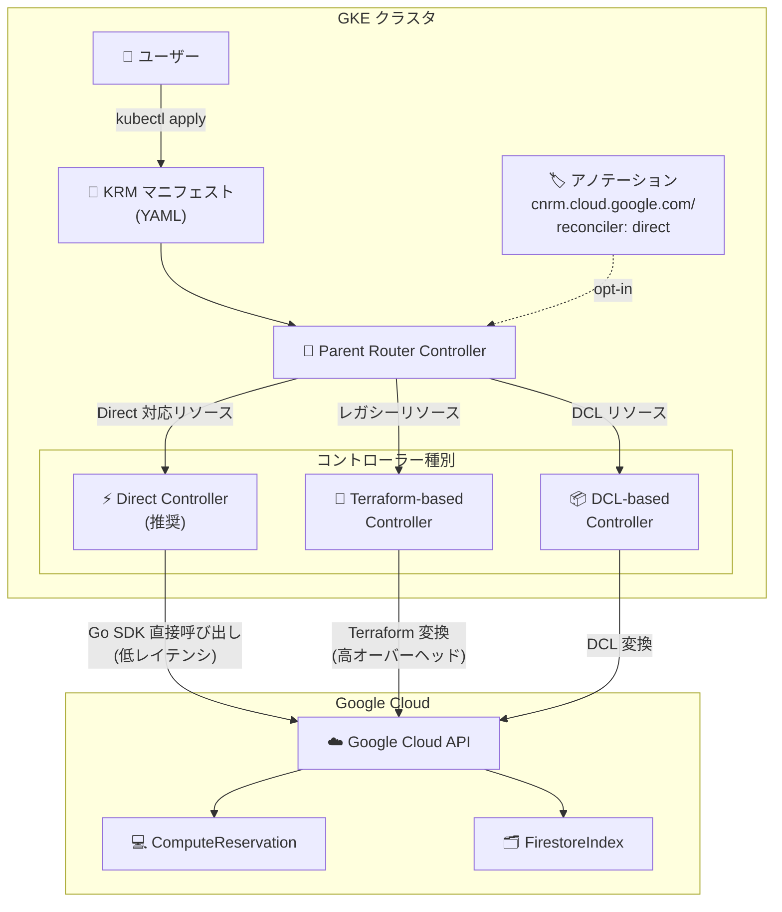

# Config Connector: バージョン 1.152.0 リリース

**リリース日**: 2026-06-23

**サービス**: Config Connector

**機能**: バージョン 1.152.0 - 新フィールド追加、Direct Reconciliation 拡張、バグ修正

**ステータス**: 利用可能 (Available)

📊 [このアップデートのインフォグラフィックを見る](https://takech9203.github.io/google-cloud-news-summary/20260623-config-connector-1-152-0.html)

## 概要

Config Connector バージョン 1.152.0 がリリースされた。今回のアップデートでは、ComputeReservation と ComputeForwardingRule への新フィールド追加、ComputeReservation と FirestoreIndex への Direct Reconciliation サポート拡張、および複数のバグ修正が含まれている。

Config Connector は Kubernetes Resource Model (KRM) を使用して Google Cloud リソースを宣言的に管理するためのオープンソースの Kubernetes アドオンである。Kubernetes のマニフェストを通じて Google Cloud リソースのライフサイクルを管理し、Infrastructure as Code (IaC) のワークフローを Kubernetes ネイティブに実現する。今回のリリースでは、Direct Controller への移行が継続的に進められており、Terraform ベースのコントローラーからの脱却による性能向上と信頼性改善が図られている。

主な対象ユーザーは、GKE 上で Config Connector を利用してインフラストラクチャを管理しているプラットフォームエンジニアおよび SRE チームである。

**アップデート前の課題**

- ComputeReservation で予約の共有設定 (shareSettings) を KRM マニフェスト経由で管理できなかった
- ComputeForwardingRule の実際のターゲットリソース情報を status から確認できなかった
- ComputeReservation と FirestoreIndex は Terraform ベースまたは DCL ベースのコントローラーで処理されており、リコンシリエーションのレイテンシやリソース消費が大きかった
- SQLInstance の availabilityType フィールドで大文字小文字の違いにより意図しない差分が検出されることがあった
- Preview Tool で型付きリソースを使用するとクラッシュし、デフォルト設定時にハングする問題があった

**アップデート後の改善**

- ComputeReservation の spec.shareSettings フィールドにより、プロジェクト間での予約共有を宣言的に管理可能になった
- ComputeForwardingRule の status.target フィールドにより、Google Cloud API 側で解決された実際のターゲット情報を確認可能になった
- ComputeReservation と FirestoreIndex で Direct Reconciler を opt-in で使用でき、リコンシリエーションの高速化とリソース効率の改善が得られる
- SQLInstance の availabilityType 比較が大文字小文字を区別しなくなり、不要なリコンシリエーションループが解消された
- Preview Tool の安定性が向上し、型付きリソースとデフォルト処理が正常に動作するようになった

## アーキテクチャ図



Config Connector の Parent Router Controller がリソースのアノテーションと静的マッピングに基づいて、適切なコントローラー (Direct / Terraform-based / DCL-based) にリコンシリエーションをルーティングする構成を示す。v1.152.0 では ComputeReservation と FirestoreIndex に Direct Controller サポートが追加された。

## サービスアップデートの詳細

### 主要機能

1. **ComputeReservation: spec.shareSettings フィールド追加**
   - Compute Engine の予約リソースにおいて、プロジェクト間共有設定を KRM マニフェストから宣言的に管理可能になった
   - `shareType` で共有タイプ (SPECIFIC_PROJECTS など) を指定し、`projectMap` で共有先プロジェクトを定義できる
   - これにより、組織内の複数プロジェクト間で予約容量を効率的に配分する設定を GitOps ワークフローに組み込める

2. **ComputeForwardingRule: status.target フィールド追加**
   - Forwarding Rule の status に `target` フィールドが追加され、Google Cloud API から返される実際のターゲットリソース情報を確認可能になった
   - spec.target で設定した参照が API 側でどのリソースに解決されたかを status から読み取れるようになった
   - トラブルシューティング時にターゲットの整合性を容易に検証できる

3. **Direct Reconciliation サポート拡張 (ComputeReservation, FirestoreIndex)**
   - `cnrm.cloud.google.com/reconciler: direct` アノテーションを追加することで opt-in で Direct Controller を使用可能
   - Direct Controller は Google Cloud Go SDK を直接使用し、Terraform の変換オーバーヘッドを排除
   - リコンシリエーションレイテンシの改善、CPU/メモリ消費の削減、構造化された差分レポートの提供が期待できる

## 技術仕様

### 新フィールドの詳細

| リソース | フィールド | 種別 | 説明 |
|---------|-----------|------|------|
| ComputeReservation | spec.shareSettings | spec (設定) | 予約の共有設定 (shareType, projectMap) |
| ComputeReservation | spec.shareSettings.shareType | spec (設定) | 共有タイプ (SPECIFIC_PROJECTS など) |
| ComputeReservation | spec.shareSettings.projectMap | spec (設定) | 共有先プロジェクトのマッピング |
| ComputeForwardingRule | status.target | status (観測) | API が解決した実際のターゲットリソース URL |

### Direct Reconciler opt-in アノテーション

```yaml
apiVersion: compute.cnrm.cloud.google.com/v1beta1
kind: ComputeReservation
metadata:
  name: my-reservation
  annotations:
    cnrm.cloud.google.com/reconciler: direct
spec:
  zone: us-central1-a
  shareSettings:
    shareType: SPECIFIC_PROJECTS
    projectMap:
    - keyRef:
        external: "project-id-to-share-with"
      value:
        projectIDRef:
          external: "project-id-to-share-with"
  specificReservation:
    count: 10
    instanceProperties:
      machineType: n2-standard-4
```

### バグ修正の詳細

| Issue | リソース | 修正内容 |
|-------|---------|----------|
| [#8025](https://github.com/GoogleCloudPlatform/k8s-config-connector/pull/8025) | SQLInstance | availabilityType の大文字小文字比較を修正。不要なリコンシリエーションループを解消 |
| [#7743](https://github.com/GoogleCloudPlatform/k8s-config-connector/pull/7743) | Preview Tool | 型付きリソースでのクラッシュとデフォルト設定時のハングを修正 |
| [#7371](https://github.com/GoogleCloudPlatform/k8s-config-connector/pull/7371) | ComputeForwardingRule | target フィールドのマッチングロジックを修正 |
| [#8479](https://github.com/GoogleCloudPlatform/k8s-config-connector/pull/8479) | ComputeFutureReservation | 将来の予約時刻に対するバリデーションロジックを修正 |

## 設定方法

### 前提条件

1. GKE クラスタに Config Connector がインストールされていること (v1.152.0 以上)
2. Workload Identity Federation for GKE が有効であること
3. 対象リソースの管理に必要な IAM 権限がサービスアカウントに付与されていること

### 手順

#### ステップ 1: Config Connector のアップグレード

```bash
# 手動インストールの場合: 最新のオペレーターバンドルをダウンロード
gcloud storage cp gs://configconnector-operator/1.152.0/release-bundle.tar.gz release-bundle.tar.gz
tar zxvf release-bundle.tar.gz

# オペレーターを適用
kubectl apply -f operator-system/configconnector-operator.yaml
```

#### ステップ 2: Direct Reconciler を opt-in で有効化

```yaml
# ComputeReservation に Direct Reconciler を有効化する例
apiVersion: compute.cnrm.cloud.google.com/v1beta1
kind: ComputeReservation
metadata:
  name: shared-reservation
  annotations:
    cnrm.cloud.google.com/reconciler: direct
spec:
  zone: asia-northeast1-a
  shareSettings:
    shareType: SPECIFIC_PROJECTS
    projectMap:
    - keyRef:
        external: "shared-project-id"
      value:
        projectIDRef:
          external: "shared-project-id"
  specificReservation:
    count: 5
    instanceProperties:
      machineType: n2-standard-8
      minCpuPlatform: "Intel Ice Lake"
```

#### ステップ 3: FirestoreIndex で Direct Reconciler を使用

```yaml
apiVersion: firestore.cnrm.cloud.google.com/v1beta1
kind: FirestoreIndex
metadata:
  name: my-index
  annotations:
    cnrm.cloud.google.com/reconciler: direct
spec:
  collectionRef:
    name: my-collection
  fields:
  - fieldPath: "field1"
    order: ASCENDING
  - fieldPath: "field2"
    order: DESCENDING
```

## メリット

### ビジネス面

- **マルチプロジェクト予約管理の効率化**: shareSettings フィールドにより、組織内の複数プロジェクト間で Compute Engine の予約容量を一元的かつ宣言的に管理でき、コスト最適化のガバナンスが強化される
- **運用の可視性向上**: status.target フィールドにより、Forwarding Rule の実際のルーティング状態を Kubernetes リソースの status から直接確認でき、問題の検出・解決が迅速化される

### 技術面

- **リコンシリエーション性能の向上**: Direct Controller は Terraform 変換レイヤーを経由しないため、リコンシリエーションレイテンシが大幅に短縮され、CPU/メモリ消費も削減される
- **構造化された差分レポート**: Direct Controller は cnrm-controller-manager ログに構造化された差分を出力し、リコンシリエーションループの原因特定が容易になる
- **GitOps ワークフローとの親和性向上**: 新フィールドの追加により、より多くのインフラ設定を KRM マニフェストとして Git リポジトリで管理可能になった

## デメリット・制約事項

### 制限事項

- Direct Reconciler は opt-in 方式であり、既存のリソースに自動適用されない。アノテーションの追加が必要
- shareSettings.shareType が Immutable であるため、共有タイプを変更する場合はリソースの再作成が必要
- Direct Controller への移行は段階的に進められており、すべてのリソースタイプで利用可能ではない

### 考慮すべき点

- Direct Controller への切り替え後は、Terraform ベースのコントローラーとは異なる動作をする可能性があるため、テスト環境での検証を推奨
- FirestoreIndex は以前 v1.123.0 で state-into-spec 設定に起因するリグレッションがあったため、既存環境でのアップグレード時には動作確認が重要
- 本バージョンへのアップグレードは最大 3 マイナーバージョン前からのロールバックが可能 (namespaced mode の場合)

## ユースケース

### ユースケース 1: マルチチームでの予約容量共有

**シナリオ**: 大規模組織で、プラットフォームチームが Compute Engine の予約を一括購入し、複数のプロダクトチームのプロジェクトに共有配分する。

**実装例**:
```yaml
apiVersion: compute.cnrm.cloud.google.com/v1beta1
kind: ComputeReservation
metadata:
  name: org-shared-reservation
  namespace: platform-team
  annotations:
    cnrm.cloud.google.com/reconciler: direct
spec:
  zone: asia-northeast1-a
  shareSettings:
    shareType: SPECIFIC_PROJECTS
    projectMap:
    - keyRef:
        name: team-a-project
      value:
        projectIDRef:
          name: team-a-project
    - keyRef:
        name: team-b-project
      value:
        projectIDRef:
          name: team-b-project
  specificReservation:
    count: 20
    instanceProperties:
      machineType: n2-standard-16
```

**効果**: 予約の共有設定が GitOps で管理され、チームの追加・削除も Pull Request ベースで監査可能になる。Direct Reconciler により設定変更の反映も高速化される。

### ユースケース 2: Firestore インデックスの大規模管理

**シナリオ**: マイクロサービスアーキテクチャで多数の Firestore コレクションのインデックスを管理しており、リコンシリエーションの遅延がデプロイパイプラインのボトルネックになっている。

**効果**: Direct Reconciler を opt-in することで、インデックス作成・更新のリコンシリエーションが高速化され、CI/CD パイプラインのデプロイ時間が短縮される。構造化された差分ログにより、インデックス変更の追跡も容易になる。

## 料金

Config Connector 自体は無料のオープンソースツールであり、追加料金なしで利用できる。ただし、以下のコストが関連する:

- **GKE クラスタ**: Config Connector を実行するための GKE クラスタ費用
- **管理対象リソース**: Config Connector で作成・管理する Google Cloud リソース (Compute Engine 予約、Firestore など) の通常料金

### 料金例

| 項目 | 月額料金 (概算) |
|------|-----------------|
| Config Connector アドオン | 無料 |
| Config Connector コントローラー (GKE リソース消費) | GKE ノード料金に含まれる |
| Compute Engine 予約 (n2-standard-4 x 10台) | 予約割引適用後の料金 |

## 利用可能リージョン

Config Connector は GKE クラスタ上で動作するため、GKE が利用可能なすべてのリージョンで使用可能。管理対象リソース (ComputeReservation, FirestoreIndex 等) の利用可能リージョンは各サービスのドキュメントを参照。

## 関連サービス・機能

- **Google Kubernetes Engine (GKE)**: Config Connector のホスト環境。Workload Identity Federation との連携で認証を管理
- **Compute Engine**: ComputeReservation と ComputeForwardingRule の管理対象サービス。予約と負荷分散の設定を KRM で宣言的に管理
- **Firestore**: FirestoreIndex の管理対象サービス。インデックス定義を Kubernetes マニフェストとして管理
- **Cloud SQL**: SQLInstance のバグ修正に関連。Direct Controller による完全移行が進行中
- **Config Controller**: Config Connector のマネージド版。最新バージョンを自動的に利用可能
- **Anthos Config Management**: GitOps ワークフローと組み合わせて、Config Connector マニフェストの継続的デリバリーを実現

## 参考リンク

- 📊 [インフォグラフィック](https://takech9203.github.io/google-cloud-news-summary/20260623-config-connector-1-152-0.html)
- [公式リリースノート](https://cloud.google.com/config-connector/docs/release-notes)
- [Config Connector コントローラータイプ](https://cloud.google.com/config-connector/docs/concepts/controller-types)
- [Config Connector リコンシリエーション戦略](https://cloud.google.com/config-connector/docs/concepts/reconciliation)
- [ComputeReservation リファレンス](https://cloud.google.com/config-connector/docs/reference/resource-docs/compute/computereservation)
- [ComputeForwardingRule リファレンス](https://cloud.google.com/config-connector/docs/reference/resource-docs/compute/computeforwardingrule)
- [Config Connector 手動インストールガイド](https://cloud.google.com/config-connector/docs/how-to/install-manually)
- [GitHub リポジトリ](https://github.com/GoogleCloudPlatform/k8s-config-connector)

## まとめ

Config Connector 1.152.0 は、ComputeReservation の共有設定管理と Direct Reconciler の対象リソース拡大により、Kubernetes ネイティブなインフラ管理の機能と性能の両面が強化されたリリースである。特に Direct Controller への段階的移行が着実に進んでおり、既存の Terraform ベースコントローラーからの移行を検討しているチームは、opt-in アノテーションを活用して段階的に Direct Controller を評価することを推奨する。SQLInstance や Preview Tool のバグ修正も含まれているため、これらのリソースを管理している環境では早期のアップグレードが望ましい。

---

**タグ**: #ConfigConnector #KubernetesResourceModel #DirectReconciler #ComputeReservation #ComputeForwardingRule #FirestoreIndex #GKE #InfrastructureAsCode #GitOps
