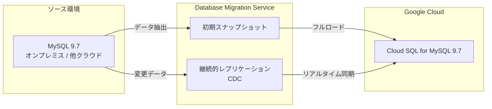

# Cloud Database Migration Service: MySQL 9.7 同種マイグレーション対応

**リリース日**: 2026-06-23

**サービス**: Cloud Database Migration Service

**機能**: MySQL 9.7 同種マイグレーションサポート

**ステータス**: GA (一般提供)

[このアップデートのインフォグラフィックを見る](https://takech9203.github.io/google-cloud-news-summary/20260623-database-migration-service-mysql-9-7.html)

## 概要

Google Cloud Database Migration Service が、MySQL の同種マイグレーション (Homogeneous Migration) において MySQL バージョン 9.7 をサポートするようになりました。これにより、MySQL 9.7 を使用するオンプレミス環境や他のクラウド環境から Cloud SQL for MySQL 9.7 への移行が可能になります。

MySQL 9.7 は MySQL Innovation Release の最新バージョンであり、パフォーマンスの向上やセキュリティ機能の強化が含まれています。今回のアップデートにより、最新バージョンの MySQL を使用している組織でも、Database Migration Service を活用したシームレスなクラウド移行が可能になりました。

**アップデート前の課題**

- MySQL 9.7 を使用している環境では Database Migration Service による直接的な移行ができなかった
- MySQL 9.7 環境のクラウド移行には手動でのダンプ・リストア作業や、サードパーティツールの利用が必要だった
- 最新バージョンの MySQL を使用している場合、ダウングレードしてからの移行を検討する必要があった

**アップデート後の改善**

- MySQL 9.7 ソースから Cloud SQL for MySQL 9.7 への直接的な同種マイグレーションが可能になった
- Amazon RDS、Amazon Aurora、Azure Database for MySQL、セルフマネージド MySQL など、多様なソースからの移行に対応
- 継続的レプリケーションによる最小ダウンタイムでの移行が実現可能

## アーキテクチャ図

Database Migration Service は初期スナップショットでソースデータを取得した後、Change Data Capture (CDC) による継続的レプリケーションで変更データをリアルタイムに同期します。

## サービスアップデートの詳細

### 主要機能

1. **MySQL 9.7 ソースデータベースのサポート**
   - Amazon RDS MySQL 9.7
   - セルフマネージド MySQL 9.7 (オンプレミスまたは任意のクラウド VM)
   - Cloud SQL for MySQL 9.7
   - Amazon Aurora MySQL 9.7
   - Microsoft Azure Database for MySQL 9.7

2. **Cloud SQL for MySQL 9.7 デスティネーションのサポート**
   - MySQL 9.7 ソースから Cloud SQL for MySQL 9.7 への直接移行
   - サーバーレスアーキテクチャによるスケーラブルな移行

3. **継続的レプリケーションによる最小ダウンタイム移行**
   - 初期スナップショット取得後に CDC ベースのリアルタイムレプリケーションを実行
   - ソースデータベースは移行中も稼働を継続
   - プロモーション時のダウンタイムは数秒程度

## 技術仕様

### サポートされるソースとデスティネーションの組み合わせ

| ソース | サポートバージョン |
|--------|-------------------|
| Amazon RDS | 5.6, 5.7, 8.0, 8.4, 9.7 |
| セルフマネージド MySQL | 5.5, 5.6, 5.7, 8.0, 8.4, 9.7 |
| Cloud SQL for MySQL | 5.6, 5.7, 8.0, 8.4, 9.7 |
| Amazon Aurora | 5.6, 5.7, 8.0, 8.4, 9.7 |
| Azure Database for MySQL | 5.7, 8.0, 8.4, 9.7 |

| デスティネーション | サポートバージョン |
|-------------------|-------------------|
| Cloud SQL for MySQL | 5.6, 5.7, 8.0, 8.4, 9.7 |

### マイグレーションタイプ

| タイプ | 説明 |
|--------|------|
| 継続的マイグレーション | 初期スナップショット + CDC による最小ダウンタイム移行 |
| ワンタイムマイグレーション | 単一時点のスナップショットによるダンプ・ロード |

## メリット

### ビジネス面

- **コスト不要**: 同種マイグレーションは Database Migration Service の追加料金なしで利用可能
- **最小ダウンタイム**: 継続的レプリケーションによりビジネスへの影響を最小限に抑えた移行が可能

### 技術面

- **サーバーレスアーキテクチャ**: インフラ管理不要でスケーラブルな移行を実現
- **最新バージョン対応**: MySQL 9.7 の新機能をそのまま Cloud SQL で活用可能
- **セキュアな移行**: SSL/TLS 暗号化および CMEK による継続的マイグレーションのデータ保護

## デメリット・制約事項

### 制限事項

- 後のマイナーバージョンから前のマイナーバージョンへの移行は非推奨
- Database Migration Service は完全にリージョナルなプロダクトであり、ソース・デスティネーション・接続プロファイル・マイグレーションジョブはすべて同一リージョンに配置する必要がある
- ソースデータベースのプラグインは移行不可

### 考慮すべき点

- 長時間実行トランザクションは移行中に避けることが推奨される
- AWS Aurora 以外からの移行では、リードレプリカからの移行が推奨される場合がある

## 料金

同種マイグレーション (MySQL to Cloud SQL for MySQL) は、Database Migration Service の追加料金なしで利用可能です。ただし、移行に関連する以下のリソースには通常の料金が適用されます。

| リソース | 料金 |
|----------|------|
| Database Migration Service | 無料 (同種マイグレーション) |
| Cloud SQL for MySQL インスタンス | Cloud SQL の通常料金 |
| Cloud Storage (バックアップファイル使用時) | Cloud Storage の通常料金 |
| ネットワーク転送 | ネットワークの通常料金 |

## 関連サービス・機能

- **Cloud SQL for MySQL**: マイグレーション先のマネージド MySQL サービス
- **Cloud SQL Enterprise Plus エディション**: 高パフォーマンス・高可用性が求められる本番ワークロード向け
- **Private Service Connect**: セキュアなネットワーク接続オプション (2025年8月より DMS でサポート)

## 参考リンク

- [このアップデートのインフォグラフィック](https://takech9203.github.io/google-cloud-news-summary/20260623-database-migration-service-mysql-9-7.html)
- [公式リリースノート](https://docs.cloud.google.com/release-notes#June_23_2026)
- [サポートされるソースとデスティネーションデータベース](https://docs.cloud.google.com/database-migration/docs/mysql/migration-src-and-dest)
- [Database Migration Service 概要](https://docs.cloud.google.com/database-migration/docs/overview)
- [料金ページ](https://docs.cloud.google.com/database-migration/pricing)

## まとめ

今回のアップデートにより、MySQL 9.7 を使用する環境から Cloud SQL for MySQL 9.7 への同種マイグレーションが Database Migration Service で正式にサポートされました。同種マイグレーションは追加料金なしで利用でき、継続的レプリケーションによる最小ダウンタイムでの移行が可能です。MySQL 9.7 環境のクラウド移行を検討している組織は、Database Migration Service を活用した移行計画を策定することを推奨します。

---

**タグ**: #DatabaseMigrationService #MySQL #CloudSQL #Migration #HomogeneousMigration #MySQL9.7
