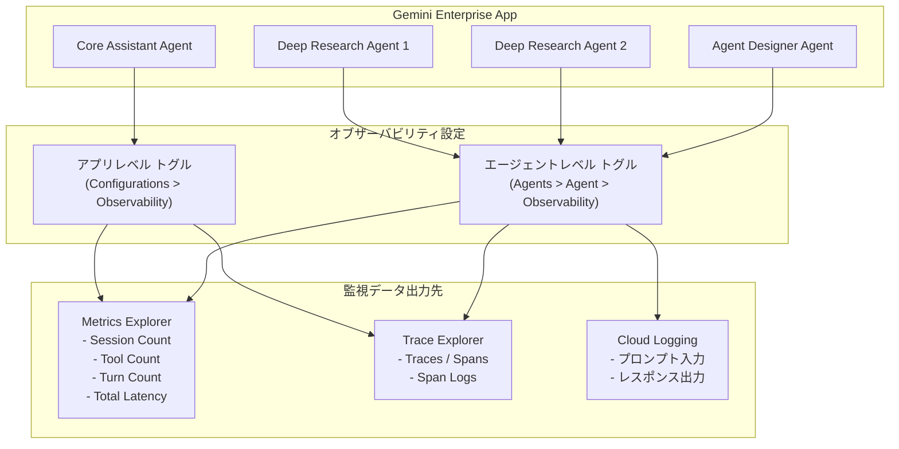

# Gemini Enterprise: Deep Research エージェントのオブザーバビリティ設定 (Preview)

**リリース日**: 2026-06-23

**サービス**: Gemini Enterprise

**機能**: Deep Research agents observability settings

**ステータス**: Public Preview

[このアップデートのインフォグラフィックを見る](https://takech9203.github.io/google-cloud-news-summary/20260623-gemini-enterprise-deep-research-observability.html)

## 概要

Gemini Enterprise において、Deep Research エージェント個別にオブザーバビリティ設定を構成できるようになりました。これにより、Agent Designer で作成した従業員向けエージェントと同様に、特定の Deep Research エージェントのメトリクスを Metrics Explorer で監視し、トレース結果を Trace Explorer で確認することが可能になります。

この機能は、エージェントレベルの Observability トグルを通じて有効化されます。Core Assistant エージェントで使用されるアプリレベルのトグルとは異なる設定方法である点が重要です。これにより、管理者は Deep Research エージェントごとに独立してオブザーバビリティを制御でき、きめ細かい監視体制を構築できます。

対象ユーザーは、Gemini Enterprise を利用して Deep Research エージェントを運用している組織の管理者やプラットフォームエンジニアです。特に、複数のエージェントを運用しており、パフォーマンスやレイテンシの可視化、トラブルシューティングが必要なチームに有用です。

**アップデート前の課題**

- Deep Research エージェント個別のオブザーバビリティ設定ができず、エージェント単位でのパフォーマンス監視が困難だった
- 特定の Deep Research エージェントのトレースやメトリクスを分離して確認する手段がなかった
- Core Assistant エージェント向けのアプリレベルのトグルのみが利用可能で、エージェントごとの粒度での制御ができなかった

**アップデート後の改善**

- Deep Research エージェントごとに個別のオブザーバビリティ設定が可能になった
- エージェントレベルのトグルにより、特定エージェントのみの監視を有効化・無効化できる
- Metrics Explorer および Trace Explorer で Deep Research エージェント固有のデータを確認できるようになった
- OpenTelemetry トレースとログの計装、プロンプト入力・レスポンス出力のロギングをエージェント単位で制御可能になった

## アーキテクチャ図



Core Assistant はアプリレベルのトグルで制御され、Deep Research エージェントおよび Agent Designer エージェントはそれぞれ独立したエージェントレベルのトグルで制御されます。有効化後、データは Cloud Monitoring (Metrics Explorer) と Cloud Trace (Trace Explorer) に送信されます。

## サービスアップデートの詳細

### 主要機能

1. **エージェントレベルのオブザーバビリティトグル**
   - Deep Research エージェントごとに独立してオブザーバビリティを有効化・無効化
   - Google Cloud コンソールの Agents セクションから該当エージェントを選択し、Observability タブで設定
   - REST API (`v1alpha`) を使用したプログラマティックな設定も可能

2. **OpenTelemetry トレースとログの計装**
   - `Enable instrumentation of OpenTelemetry traces and logs` を有効化することで、トレース、スパン、スパンログ、メトリクスを収集
   - 無効化するとすべてのデータ収集が停止し、ロギング設定も自動的にオフになる

3. **プロンプト入力・レスポンス出力のロギング**
   - `Enable logging of prompt inputs and response outputs` により、ユーザープロンプトとレスポンスの完全な内容を Cloud Logging に記録
   - PII を含む可能性のある機密データがログに含まれるため、アクセス制御が必須
   - OpenTelemetry 計装が有効な場合にのみ設定可能

4. **エージェント固有の Traces タブ**
   - 各 Deep Research エージェントの Traces タブで、トレーススパンのサマリーテーブルと詳細ビューを直接確認可能
   - スパンの種類: Agent to Tool、Invoke Agent、Agent to Model
   - 詳細ビューではグラフ表示とタイムライン表示を切り替え可能

5. **エージェント固有の Metrics タブ**
   - Overview ビュー: セッション数、平均セッション時間、エージェント呼び出し数、レイテンシ、トラフィック、エラーレート
   - Tools ビュー: ツール実行回数、P95 レイテンシ、ツール別コール数、ツール別エラーレート

## 技術仕様

### オブザーバビリティ設定オプション

| 設定項目 | 説明 |
|------|------|
| Enable instrumentation of OpenTelemetry traces and logs | 有効時: トレース、スパン、スパンログ、メトリクスを Cloud Logging で確認可能。無効時: すべてのデータ収集が停止 |
| Enable logging of prompt inputs and response outputs | 有効時: プロンプト入力とレスポンス出力を Cloud Logging に完全記録 (PII 含む可能性あり)。前提条件: OpenTelemetry 計装が有効であること |

### エージェントタイプ別の設定方法

| エージェントタイプ | 設定場所 | トグルレベル |
|------|------|------|
| Core Assistant | Configurations > Observability タブ | アプリレベル (engine-level) |
| Deep Research Agent | Agents > Agent名 > Observability タブ | エージェントレベル |
| Agent Designer Agent | Agents > Agent名 > Observability タブ | エージェントレベル |

### メトリクス仕様

| メトリクス名 | タイプ | 説明 |
|------|------|------|
| agent_session_count | CUMULATIVE, INT64 | エージェントごとのセッション数 |
| agent_turn_count | CUMULATIVE, INT64 | エージェントごとのセッションターン数 |
| agent_total_latencies | DELTA, DISTRIBUTION (ms) | エージェント呼び出しの合計レイテンシ分布 |
| tool_total_latencies | DELTA, DISTRIBUTION (ms) | ツール呼び出しの合計レイテンシ分布 |

### データ保持期間

| データ種別 | 保存先 | デフォルト保持期間 |
|------|------|------|
| トレース・スパン | Cloud Trace | 30 日 |
| メトリクス | Cloud Monitoring | 6 週間 |
| メトリクスプレフィックス | `discoveryengine.googleapis.com/` | - |

## 設定方法

### 前提条件

1. Gemini Enterprise Admin ロールまたは Google Cloud コンソール Gemini Enterprise User ロール
2. 既存の Gemini Enterprise Web アプリ
3. Metrics Explorer アクセスには `roles/monitoring.viewer` (Monitoring Viewer) ロール
4. Trace Explorer アクセスには `roles/cloudtrace.user` (Cloud Trace User) ロール

### 手順

#### ステップ 1: Google Cloud コンソールでのオブザーバビリティ有効化

1. Google Cloud コンソールで Gemini Enterprise ページに移動
2. 設定対象のアプリ名をクリック
3. **Agents** をクリック
4. 設定対象の Deep Research エージェント名をクリック
5. **Observability** タブをクリック
6. `Enable instrumentation of OpenTelemetry traces and logs` を有効化
7. (オプション) `Enable logging of prompt inputs and response outputs` を有効化

#### ステップ 2: REST API でのオブザーバビリティ有効化

```bash
curl -X PATCH -H "Authorization: Bearer $(gcloud auth print-access-token)" \
  -H "Content-Type: application/json" \
  -H "X-Goog-User-Project: PROJECT_ID" \
  "https://ENDPOINT_LOCATION-discoveryengine.googleapis.com/v1alpha/projects/PROJECT_ID/locations/LOCATION/collections/default_collection/engines/APP_ID/assistants/default_assistant/agents/AGENT_ID?updateMask=observabilityConfig" \
  -d '{
    "observabilityConfig": {
      "observabilityEnabled": true,
      "sensitiveLoggingEnabled": true
    }
  }'
```

パラメータ:
- `ENDPOINT_LOCATION`: API リクエストのマルチリージョン (`us`, `eu`, `global`)
- `PROJECT_ID`: プロジェクト ID
- `LOCATION`: データストアのマルチリージョン (`global`, `us`, `eu`)
- `APP_ID`: アプリ ID
- `AGENT_ID`: 設定対象のエージェント ID

#### ステップ 3: メトリクスの確認

1. Google Cloud コンソールで Metrics Explorer ページに移動
2. 「Select a metric」で `Gemini Enterprise Agent` プレフィックスのメトリクスを検索
3. Session Count、Tool Count、Turn Count、Total Latency などのメトリクスを選択

#### ステップ 4: トレースの確認

1. Google Cloud コンソールで Trace Explorer ページに移動、または
2. エージェントの Traces タブから直接トレーススパンを確認
3. Span ID をクリックしてトレース詳細 (グラフビュー/タイムラインビュー) を表示

## メリット

### ビジネス面

- **エージェント単位の SLA 管理**: Deep Research エージェントごとのパフォーマンスを個別に追跡し、SLA 準拠状況を把握可能
- **コスト最適化**: 特定エージェントのセッション数やツール呼び出し頻度を可視化し、リソース配分を最適化
- **トラブルシューティングの迅速化**: 問題のあるエージェントを特定し、根本原因分析までの時間を短縮

### 技術面

- **OpenTelemetry 準拠**: 業界標準の OpenTelemetry に基づくトレース・メトリクス収集で、既存の監視ツールとの統合が容易
- **きめ細かい制御**: エージェント単位で有効化・無効化できるため、必要なエージェントのみの監視でノイズを削減
- **エンドツーエンドの可視性**: Agent to Tool、Invoke Agent、Agent to Model のスパンタイプにより、リクエストのライフサイクル全体を追跡可能

## デメリット・制約事項

### 制限事項

- 本機能は Public Preview であり、Pre-GA Offerings Terms が適用される
- サポートが限定的であり、Preview 期間中の変更が他の Preview バージョンと互換性がない可能性がある
- `sensitiveLoggingEnabled` を有効にすると PII を含む可能性のあるデータがログに記録されるため、アクセス制御の厳格な管理が必要

### 考慮すべき点

- Core Assistant とは設定方法が異なる (アプリレベル vs エージェントレベル) ため、運用手順の使い分けが必要
- トレースデータの保持期間は 30 日 (Cloud Trace のデフォルト) であり、長期保存が必要な場合は別途エクスポート設定が必要
- メトリクスデータの保持期間は 6 週間 (Cloud Monitoring のデフォルト) であり、こちらも長期分析には追加構成が必要

## ユースケース

### ユースケース 1: Deep Research エージェントのパフォーマンスベースライン確立

**シナリオ**: 組織内で複数の Deep Research エージェントを運用しており、各エージェントのパフォーマンスベースラインを確立したい。市場調査用エージェントと競合分析用エージェントでレイテンシやツール利用パターンが異なることが想定される。

**実装例**:
```bash
# 市場調査用 Deep Research エージェントのオブザーバビリティを有効化
curl -X PATCH -H "Authorization: Bearer $(gcloud auth print-access-token)" \
  -H "Content-Type: application/json" \
  -H "X-Goog-User-Project: my-project" \
  "https://us-discoveryengine.googleapis.com/v1alpha/projects/my-project/locations/us/collections/default_collection/engines/my-app/assistants/default_assistant/agents/market-research-agent?updateMask=observabilityConfig" \
  -d '{
    "observabilityConfig": {
      "observabilityEnabled": true,
      "sensitiveLoggingEnabled": false
    }
  }'
```

**効果**: エージェントごとのセッション数、平均レイテンシ、ツール呼び出しパターンを定量的に把握し、SLA の設定やキャパシティプランニングに活用

### ユースケース 2: 障害時の根本原因分析

**シナリオ**: Deep Research エージェントの応答レイテンシが急増した際に、Trace Explorer を使用してボトルネックとなっているスパンを特定し、問題の原因がツール呼び出し (Agent to Tool) にあるのか、モデル推論 (Agent to Model) にあるのかを切り分けたい。

**効果**: スパンの親子関係とレイテンシ分布を視覚的に確認することで、障害の根本原因を迅速に特定し、MTTR (平均復旧時間) を短縮

## 関連サービス・機能

- **Cloud Monitoring (Metrics Explorer)**: Gemini Enterprise メトリクスの表示、カスタムダッシュボード作成、アラート設定
- **Cloud Trace (Trace Explorer)**: トレースとスパンの表示、パフォーマンスボトルネックの分析
- **Cloud Logging**: プロンプト入力・レスポンス出力のログ記録、使用状況監査ログ
- **Agent Designer**: カスタムエージェントの設計と構築 (同様のオブザーバビリティ設定が利用可能)
- **Gemini Enterprise Core Assistant**: アプリレベルのオブザーバビリティ設定で監視される中核アシスタント

## 参考リンク

- [インフォグラフィック](https://takech9203.github.io/google-cloud-news-summary/20260623-gemini-enterprise-deep-research-observability.html)
- [公式リリースノート](https://docs.cloud.google.com/release-notes#June_23_2026)
- [Manage observability settings ドキュメント](https://docs.cloud.google.com/gemini/enterprise/docs/manage-observability-settings)
- [Access metrics in Metrics Explorer](https://docs.cloud.google.com/gemini/enterprise/docs/access-metrics)
- [Access traces and spans in Trace Explorer](https://docs.cloud.google.com/gemini/enterprise/docs/access-traces-and-spans)
- [Deep Research Agent 概要](https://docs.cloud.google.com/gemini-enterprise-agent-platform/agents/google/deep-research)

## まとめ

今回のアップデートにより、Gemini Enterprise の Deep Research エージェントに対してエージェント単位でのオブザーバビリティ設定が可能になりました。これは、複数のエージェントを運用する組織にとって、パフォーマンス監視とトラブルシューティングの精度を大幅に向上させる重要な機能です。推奨されるアクションとして、まず主要な Deep Research エージェントでオブザーバビリティを有効化し、Metrics Explorer でベースラインメトリクスを確立した上で、アラートポリシーを設定することをお勧めします。

---

**タグ**: #GeminiEnterprise #DeepResearch #Observability #MetricsExplorer #TraceExplorer #OpenTelemetry #CloudMonitoring #CloudTrace #Preview
