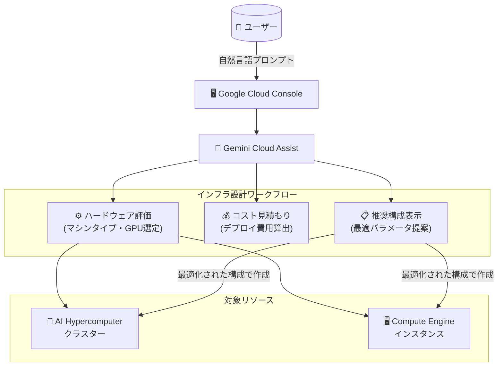

# AI Hypercomputer / Compute Engine: Gemini によるインフラストラクチャ設計支援

**リリース日**: 2026-06-23

**サービス**: AI Hypercomputer, Compute Engine

**機能**: Gemini を使用したインフラストラクチャ設計・最適化

**ステータス**: Preview

[このアップデートのインフォグラフィックを見る](https://takech9203.github.io/google-cloud-news-summary/20260623-gemini-infrastructure-design-preview.html)

## 概要

Google Cloud コンソールにおいて、Gemini を AI パワードインターフェースとして活用し、ハードウェアオプションの評価、デプロイコストの見積もり、クラスターや Compute Engine インスタンスの推奨構成の表示が可能になった。この機能は AI Hypercomputer と Compute Engine の両方で利用できる。

AI/ML ワークロードのためのクラスター設計や、汎用コンピュートインスタンスの構成決定において、Gemini に対話形式でプロンプトを入力することで、クラスターやインスタンスの作成・変更前に最適な構成に到達できる。これにより、インフラストラクチャ設計の意思決定プロセスが大幅に効率化される。

対象ユーザーは、GPU クラスターを設計する AI/ML エンジニア、大規模コンピューティング環境を構築するインフラエンジニア、コスト最適化を目指すクラウドアーキテクトである。

**アップデート前の課題**

- ハードウェアオプション (マシンタイプ、GPU 種別、ネットワーク構成) の評価には、複数のドキュメントページを横断して比較する必要があった
- デプロイコストの見積もりには、料金計算ツールと手動計算の組み合わせが必要だった
- AI Hypercomputer のクラスター構成 (A4, A3 Ultra, A3 Mega 等の選択、ネットワーク設定、ストレージ構成) の最適化には専門知識と試行錯誤が必要だった
- Compute Engine のインスタンスタイプ選定において、ワークロード特性に応じた最適な選択肢を見つけるのに時間がかかっていた

**アップデート後の改善**

- Gemini に自然言語でワークロード要件を伝えるだけで、最適なハードウェア構成の推奨を受けられるようになった
- コスト見積もりがインフラ設計のワークフロー内でインタラクティブに確認できるようになった
- クラスターやインスタンスの作成・変更前に、対話的に構成を最適化できるようになった
- 複数のドキュメントを参照する代わりに、統一されたインターフェースで設計判断を完結できるようになった

## アーキテクチャ図



Gemini がユーザーの自然言語プロンプトを受け取り、ハードウェア評価・コスト見積もり・構成推奨を行った上で、AI Hypercomputer クラスターまたは Compute Engine インスタンスの最適な設計を提案するフローを示している。

## サービスアップデートの詳細

### 主要機能

1. **ハードウェアオプションの評価**
   - ワークロード要件に基づいた最適なマシンタイプの提案
   - AI Hypercomputer: A4X Max, A4X, A4, A3 Ultra, A3 Mega, A3 High 等の GPU マシンシリーズからの選定支援
   - Compute Engine: General-purpose, Compute-optimized, Memory-optimized, Accelerator-optimized, Storage-optimized の各マシンファミリーからの選定支援

2. **デプロイコストの見積もり**
   - 選択した構成に基づくコストの事前算出
   - 異なる構成間のコスト比較
   - 消費モデル (Reservation-bound, Flex-start, Spot 等) に応じたコスト最適化

3. **推奨構成の表示**
   - ワークロード特性に最適化されたクラスター/インスタンス構成の提案
   - AI Hypercomputer: ネットワーク構成 (RoCE, GPUDirect RDMA)、ストレージ (Cloud Storage, Managed Lustre)、コンピュート構成の統合的な推奨
   - Compute Engine: vCPU、メモリ、ディスク (Hyperdisk, Persistent Disk, Local SSD)、ネットワーク設定の最適な組み合わせ提案

4. **対話的な最適化プロセス**
   - Gemini へのプロンプト入力による反復的な設計改善
   - クラスター/インスタンスの作成前に構成を検証
   - 既存クラスター/インスタンスの変更時にも活用可能

## 技術仕様

### 対応リソースタイプ

| カテゴリ | 対象 | 主な構成要素 |
|---------|------|-------------|
| AI Hypercomputer クラスター | GPU 最適化クラスター | マシンタイプ、GPU 数、ネットワーク、ストレージ、消費モデル |
| Compute Engine インスタンス | 汎用 VM | マシンファミリー/シリーズ、vCPU、メモリ、ディスク |

### AI Hypercomputer 対応マシンシリーズ

| 世代 | マシンシリーズ | GPU |
|------|--------------|-----|
| 第 4 世代 | A4X Max, A4X, A4 | NVIDIA B200 |
| 第 3 世代 | A3 Ultra | NVIDIA H200 |
| 第 3 世代 | A3 Mega, A3 High | NVIDIA H100 |

### 前提条件

1. Google Cloud プロジェクトで Gemini Cloud Assist API が有効化されていること
2. ユーザーに `Gemini Cloud Assist User` ロールが付与されていること
3. ユーザーに `Service Usage Consumer` ロールが付与されていること

### セットアップ

```bash
# Gemini Cloud Assist API の有効化
gcloud services enable geminicloudassist.googleapis.com

# IAM ロールの付与
gcloud projects add-iam-policy-binding PROJECT_ID \
  --member=user:USER_EMAIL \
  --role=roles/geminicloudassist.user

gcloud projects add-iam-policy-binding PROJECT_ID \
  --member=user:USER_EMAIL \
  --role=roles/serviceusage.serviceUsageConsumer
```

## メリット

### ビジネス面

- **設計時間の短縮**: 複数のドキュメントやツールを横断する必要がなくなり、インフラ設計の意思決定が迅速化
- **コスト最適化**: デプロイ前にコスト見積もりを確認できるため、予算超過リスクを低減
- **参入障壁の低下**: GPU クラスターや高性能コンピューティング環境の設計に必要な専門知識のハードルが下がる

### 技術面

- **構成の最適化**: ワークロード特性に基づいた推奨により、パフォーマンスとコストのバランスが向上
- **対話的な検証**: 作成前に構成を確認・修正できるため、再構築のリスクが低減
- **統合されたワークフロー**: ハードウェア選定からコスト確認、構成決定までが単一インターフェースで完結

## デメリット・制約事項

### 制限事項

- Preview 段階のため、本番環境での利用には「Pre-GA Offerings Terms」が適用される
- Preview 機能はサポートが限定的である可能性がある
- Google Cloud コンソール経由でのみ利用可能 (API/CLI からの直接利用は未確認)

### 考慮すべき点

- Gemini の推奨はあくまで参考情報であり、最終的な設計判断はユーザーが行う必要がある
- AI が生成する情報には不正確な内容が含まれる可能性があるため、出力の検証が推奨される
- 組織のセキュリティポリシーやデータレジデンシー要件に応じて、Gemini Cloud Assist の利用可否を確認する必要がある

## ユースケース

### ユースケース 1: 大規模 AI トレーニングクラスターの設計

**シナリオ**: LLM の分散トレーニングを行うため、数百 GPU 規模のクラスターを構築したい。最適な GPU マシンタイプ、ネットワーク構成、ストレージ構成を決定する必要がある。

**効果**: Gemini にトレーニングジョブの要件 (モデルサイズ、バッチサイズ、目標スループット) を伝えることで、A4 vs A3 Ultra の選定、必要なノード数、GPUDirect RDMA の要否、ストレージ (Cloud Storage vs Managed Lustre) の推奨を短時間で得られる。

### ユースケース 2: コスト効率の良い推論環境の構築

**シナリオ**: 推論ワークロード用のインフラを設計する際、パフォーマンス要件を満たしながらコストを最小化したい。

**効果**: Gemini にレイテンシ要件やスループット目標を伝え、複数の構成オプションのコスト比較を行うことで、消費モデル (Reservation vs Flex-start vs Spot) の選択を含む最適な構成を決定できる。

### ユースケース 3: 汎用ワークロードのインスタンス最適化

**シナリオ**: Web アプリケーションやバッチ処理のための Compute Engine インスタンスを構成したいが、最適なマシンファミリーやディスクタイプがわからない。

**効果**: Gemini にワークロード特性 (CPU バウンドかメモリバウンドか、ストレージ I/O 要件等) を伝えることで、N4, C4, M4 等の最適なシリーズとディスクタイプの推奨を得られる。

## 料金

Gemini Cloud Assist は現在 Preview 段階で無料で提供されている。一部機能は GA (一般提供) 時に課金が発生する可能性がある。詳細は [Gemini 料金ページ](https://cloud.google.com/products/gemini/pricing) を参照。

なお、この機能自体は設計支援ツールであり、実際にデプロイするインフラストラクチャ (GPU インスタンス、Compute Engine VM 等) の料金は別途発生する。

## 関連サービス・機能

- **[Gemini Cloud Assist](https://docs.cloud.google.com/cloud-assist/overview)**: Google Cloud コンソール全体で利用可能な AI アシスタント基盤
- **[Application Design Center](https://docs.cloud.google.com/application-design-center/docs/overview)**: アプリケーションアーキテクチャの視覚的設計ツール (Gemini 連携)
- **[AI Hypercomputer](https://docs.cloud.google.com/ai-hypercomputer/docs/overview)**: AI/ML ワークロード向けスーパーコンピューティングシステム
- **[Cluster Director](https://docs.cloud.google.com/cluster-director/docs/overview)**: AI Hypercomputer クラスターのデプロイ・管理ツール
- **[Cloud Hub](https://docs.cloud.google.com/hub/docs/overview)**: リソース・アプリケーションのコスト最適化と稼働率の管理

## 参考リンク

- [インフォグラフィック](https://takech9203.github.io/google-cloud-news-summary/20260623-gemini-infrastructure-design-preview.html)
- [公式リリースノート](https://docs.cloud.google.com/release-notes#June_23_2026)
- [Design and optimize your cluster with Gemini (AI Hypercomputer)](https://docs.cloud.google.com/ai-hypercomputer/docs/design-with-gemini)
- [Design your compute infrastructure with Gemini (Compute Engine)](https://docs.cloud.google.com/compute/docs/design-with-gemini)
- [Gemini Cloud Assist 概要](https://docs.cloud.google.com/cloud-assist/overview)
- [Gemini Cloud Assist セットアップ](https://docs.cloud.google.com/cloud-assist/set-up-gemini)
- [Gemini 料金ページ](https://cloud.google.com/products/gemini/pricing)
- [AI Hypercomputer 概要](https://docs.cloud.google.com/ai-hypercomputer/docs/overview)
- [Compute Engine マシンファミリー](https://docs.cloud.google.com/compute/docs/machine-resource)

## まとめ

Gemini によるインフラストラクチャ設計支援は、AI Hypercomputer クラスターと Compute Engine インスタンスの構成決定プロセスを根本的に変える機能である。自然言語対話によりハードウェア選定・コスト見積もり・構成最適化を統合的に行えるため、特に GPU クラスターのような複雑なインフラ設計において大きな生産性向上が期待できる。Preview 段階で無料利用可能なため、まずは既存プロジェクトで試用し、設計ワークフローへの組み込みを検討することを推奨する。

---

**タグ**: #AI-Hypercomputer #ComputeEngine #Gemini #GeminiCloudAssist #インフラ設計 #コスト最適化 #Preview #GPU #クラスター管理
