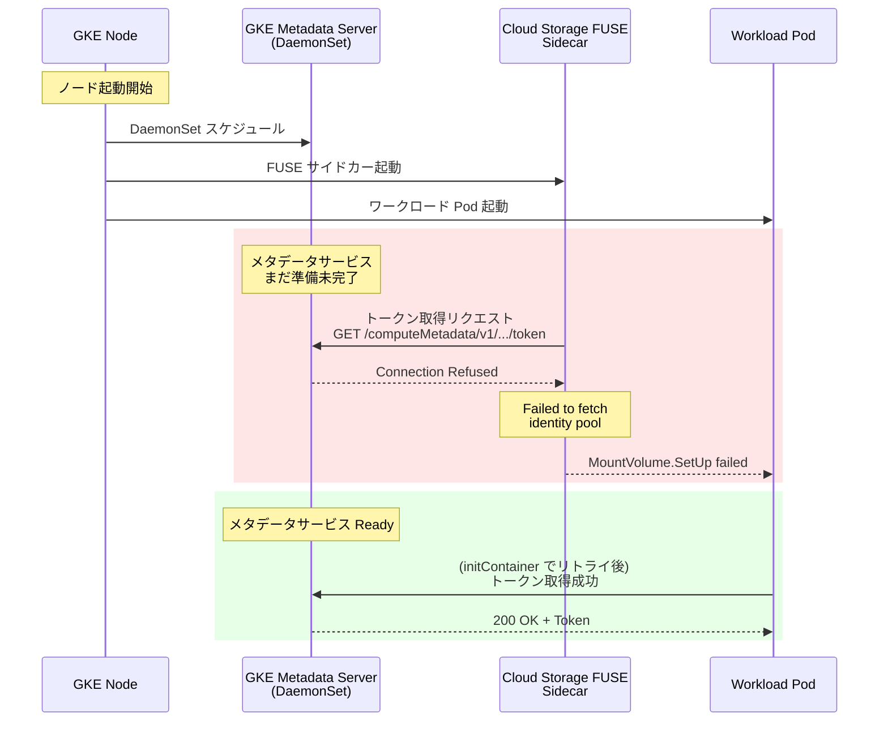

# Google Kubernetes Engine (GKE): 既知の問題 - Cloud Storage FUSE マウント失敗 / Dataplane V2 接続タイムアウト

**リリース日**: 2026-06-23

**サービス**: Google Kubernetes Engine (GKE)

**機能**: 既知の問題アドバイザリ - Cloud Storage FUSE CSI マウント失敗 + Dataplane V2 接続性問題

**ステータス**: Known Issue (修正バージョンあり)

[このアップデートのインフォグラフィックを見る](https://takech9203.github.io/google-cloud-news-summary/20260623-gke-csi-fuse-metadata-issue.html)

## 概要

2026 年 6 月 23 日、Google Cloud は GKE に関する 2 件の既知の問題を公式に発表した。いずれも GKE メタデータサービスの起動タイミングに起因するレースコンディションであり、ノード起動直後にワークロードがメタデータサーバーへ到達できないことで障害が発生する。

1 件目は **Cloud Storage FUSE CSI ドライバー**のマウント失敗である。GKE 1.34.1-gke.3899001 以降 (サイドカーマウンター v1.21.9 以降) で、FUSE サイドカーの起動時にメタデータサービスが応答可能な状態になっていないと、ボリュームのマウントに失敗する。

2 件目は **Dataplane V2 + Workload Identity Federation** 環境での一時的な接続タイムアウトである。GKE 1.35 以降ではノード起動が高速化されたことにより、起動直後のワークロードがメタデータサーバーへの接続に失敗する場合がある。

いずれもクラスタの可用性に直接影響するため、該当バージョンを使用している場合は速やかな対処が推奨される。

## アーキテクチャ図



ノード起動時のメタデータサービス準備状態とサイドカー/ワークロードの起動タイミングのレースコンディションを示す。メタデータサービスが Ready になる前にアクセスが発生すると接続拒否エラーとなる。

## サービスアップデートの詳細

### 問題 1: Cloud Storage FUSE CSI ドライバーのマウント失敗

**影響を受けるバージョン:**
- GKE 1.34.1-gke.3899001 以降 (サイドカーマウンター v1.21.9 以降)

**エラー症状:**

Pod イベントに以下のエラーが出力される:

```
MountVolume.SetUp failed for volume "volume-name" : rpc error: code = Internal desc = the sidecar container terminated due to Error, exit code: 255
```

gcsfuse-sidecar コンテナのログに以下が記録される:

```
Failed to fetch identity pool and identity provider details required for bucket access check,
got error Failed to set up metadata service: failed to get project:
Get "http://X.X.X.X/computeMetadata/v1/project/project-id":
dial tcp 169.254.169.254:80: connect: connection refused
for identity pool PROJECT_ID.svc.id.goog
and identity provider https://container.googleapis.com/v1/projects/PROJECT_ID/locations/LOCATION/clusters/CLUSTER_NAME
```

**原因:**

Cloud Storage FUSE サイドカーが Workload Identity Federation for GKE を使用してバケットアクセスの認証情報を取得する際、GKE メタデータサーバー (`169.254.169.254:80`) に接続する。ノード起動直後はメタデータサーバーの DaemonSet Pod がまだ Ready 状態になっておらず、接続が拒否される。

### 問題 2: Dataplane V2 + Workload Identity Federation の接続タイムアウト

**影響を受けるバージョン:**
- GKE 1.35 以降

**エラー症状:**
- ノード起動直後にワークロードが GKE メタデータサーバーへの接続タイムアウトまたは接続拒否を経験する
- Workload Identity Federation を使用した Google Cloud API への認証が一時的に失敗する

**原因:**

GKE 1.35 以降ではノード起動が高速化 (Faster Node Startup) されたことで、ワークロード Pod がスケジュールされるタイミングが従来より早くなった。その結果、メタデータサーバーの準備が完了する前にワークロードが認証リクエストを送信し、タイムアウトや接続拒否が発生する。

## 技術仕様

### 影響バージョンと修正バージョン

| 問題 | 影響バージョン | 修正バージョン |
|------|---------------|---------------|
| Cloud Storage FUSE CSI マウント失敗 | 1.34.1-gke.3899001+ (sidecar mounter 1.21.9+) | 1.34.8-gke.1218000+, 1.35.3-gke.2347000+, 1.36.0-gke.1266000+ |
| Dataplane V2 接続タイムアウト | 1.35 以降 | 将来のパッチで修正予定 |

### GKE メタデータサーバーの通信要件

| 項目 | 詳細 |
|------|------|
| メタデータサーバー IP | `169.254.169.254` |
| ポート | 80 (Dataplane V2 クラスタ) |
| プロトコル | HTTP |
| ヘッダー | `Metadata-Flavor: Google` |
| トークンエンドポイント | `/computeMetadata/v1/instance/service-accounts/default/token` |

## 緩和策

### 問題 1: Cloud Storage FUSE CSI の緩和策

#### 方法 A: 修正バージョンへのアップグレード (推奨)

```bash
# クラスタのバージョンを確認
gcloud container clusters describe CLUSTER_NAME \
  --location=LOCATION \
  --format="value(currentMasterVersion)"

# 修正バージョンへアップグレード
gcloud container clusters upgrade CLUSTER_NAME \
  --location=LOCATION \
  --cluster-version=1.34.8-gke.1218000
```

修正バージョン:
- **1.34 系**: 1.34.8-gke.1218000 以降
- **1.35 系**: 1.35.3-gke.2347000 以降
- **1.36 系**: 1.36.0-gke.1266000 以降

#### 方法 B: initContainer でメタデータサービスの準備を待機

Pod 定義に initContainer を追加し、メタデータサービスが応答可能になるまでリトライする:

```yaml
apiVersion: v1
kind: Pod
metadata:
  name: pod-with-gcsfuse
  annotations:
    gke-gcsfuse/volumes: "true"
spec:
  serviceAccountName: KSA_NAME
  initContainers:
  - image: gcr.io/google.com/cloudsdktool/cloud-sdk:alpine
    name: workload-identity-initcontainer
    command:
    - '/bin/bash'
    - '-c'
    - |
      curl -sS -H 'Metadata-Flavor: Google' \
        'http://169.254.169.254/computeMetadata/v1/instance/service-accounts/default/token' \
        --retry 30 --retry-connrefused --retry-max-time 60 \
        --connect-timeout 3 --fail --retry-all-errors > /dev/null \
        && exit 0 \
        || echo 'Retry limit exceeded. Failed to wait for metadata server.' >&2; exit 1
  containers:
  - image: gcr.io/your-project/your-image
    name: main-container
    volumeMounts:
    - name: gcs-fuse-csi-ephemeral
      mountPath: /data
  volumes:
  - name: gcs-fuse-csi-ephemeral
    csi:
      driver: gcsfuse.csi.storage.gke.io
      volumeAttributes:
        bucketName: BUCKET_NAME
```

#### 方法 C: サイドカーの手動インジェクション

サイドカーを手動でインジェクションすることで、initContainer がサイドカーの起動をブロックし、メタデータサービスの準備完了を確認した後にサイドカーが開始される。

### 問題 2: Dataplane V2 接続タイムアウトの緩和策

#### 方法 A: initContainer のデプロイ

問題 1 と同様の initContainer パターンを使用して、メタデータサーバーの準備完了を待機する:

```yaml
initContainers:
- image: gcr.io/google.com/cloudsdktool/cloud-sdk:alpine
  name: workload-identity-initcontainer
  command:
  - '/bin/bash'
  - '-c'
  - |
    curl -sS -H 'Metadata-Flavor: Google' \
      'http://169.254.169.254/computeMetadata/v1/instance/service-accounts/default/token' \
      --retry 30 --retry-connrefused --retry-max-time 60 \
      --connect-timeout 3 --fail --retry-all-errors > /dev/null \
      && exit 0 \
      || echo 'Retry limit exceeded. Failed to wait for metadata server.' >&2; exit 1
```

#### 方法 B: Network Policy で Faster Node Startup を無効化

ワークロードが存在しない Namespace に Network Policy を追加することで、GKE Dataplane V2 の Faster Node Startup 機能を無効化できる:

```yaml
apiVersion: networking.k8s.io/v1
kind: NetworkPolicy
metadata:
  name: disable-faster-startup
  namespace: no-workloads-namespace
spec:
  podSelector: {}
  policyTypes:
  - Ingress
  - Egress
```

この方法では、Network Policy の存在自体が Faster Node Startup を無効化するトリガーとなる。

## デメリット・制約事項

### 影響範囲

- Cloud Storage FUSE CSI ドライバーを使用するすべてのワークロードが影響を受ける可能性がある
- Workload Identity Federation for GKE を使用し、起動時にリトライロジックを持たないアプリケーションが影響を受ける
- 特にバースト的なスケールアウトやノードプールの自動スケーリング時に顕在化しやすい

### 考慮すべき点

- initContainer の追加は Pod の起動時間を数秒～最大 60 秒延長する可能性がある
- Network Policy による Faster Node Startup 無効化は、ノード起動速度の改善効果を失う
- 問題 2 (Dataplane V2) の根本修正は将来のパッチリリースで提供予定であり、現時点ではワークアラウンドのみ

## 関連サービス・機能

- **Cloud Storage FUSE CSI ドライバー**: GKE Pod から Cloud Storage バケットをファイルシステムとしてマウントするためのドライバー
- **Workload Identity Federation for GKE**: Kubernetes ServiceAccount と Google Cloud IAM を連携させる認証メカニズム
- **GKE Dataplane V2**: eBPF (Cilium) ベースのネットワークデータプレーン
- **GKE メタデータサーバー**: ノード上で DaemonSet として動作し、Workload Identity のトークン発行を仲介するコンポーネント

## 参考リンク

- [インフォグラフィック](https://takech9203.github.io/google-cloud-news-summary/20260623-gke-csi-fuse-metadata-issue.html)
- [公式リリースノート](https://docs.cloud.google.com/release-notes#June_23_2026)
- [Cloud Storage FUSE CSI ドライバー セットアップガイド](https://docs.cloud.google.com/kubernetes-engine/docs/how-to/cloud-storage-fuse-csi-driver-setup)
- [Cloud Storage FUSE CSI ドライバー トラブルシューティング (GitHub)](https://github.com/GoogleCloudPlatform/gcs-fuse-csi-driver/blob/main/docs/troubleshooting.md)
- [Workload Identity Federation 認証トラブルシューティング](https://docs.cloud.google.com/kubernetes-engine/docs/troubleshooting/authentication#troubleshoot-timeout)
- [GKE Dataplane V2 既知の問題](https://docs.cloud.google.com/kubernetes-engine/docs/how-to/dataplane-v2)
- [GKE 既知の問題一覧](https://docs.cloud.google.com/kubernetes-engine/docs/troubleshooting/known-issues)

## まとめ

GKE 1.34.1 以降および 1.35 以降で、ノード起動時のメタデータサービス準備状態に起因する 2 件の既知の問題が報告された。Cloud Storage FUSE CSI を使用している場合は修正バージョン (1.34.8-gke.1218000+, 1.35.3-gke.2347000+, 1.36.0-gke.1266000+) へのアップグレードが最も確実な対応策である。即座のアップグレードが困難な場合は、initContainer によるメタデータサービス待機パターンの適用を推奨する。Dataplane V2 の問題については将来のパッチで根本修正が予定されているため、当面は initContainer または Network Policy による緩和策で対処する。

---

**タグ**: #GKE #CloudStorageFUSE #CSIDriver #DataplaneV2 #WorkloadIdentity #KnownIssue #メタデータサーバー #トラブルシューティング
