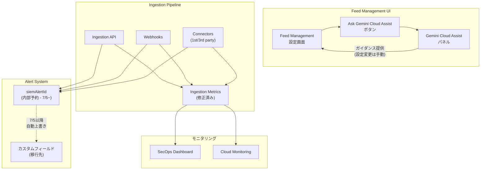

# Google SecOps: Gemini Cloud Assist in Feed Management / Ingestion Metrics修正 / siemAlertId フィールド予約

**リリース日**: 2026-06-23

**サービス**: Google SecOps (SIEM / SOAR)

**機能**: Gemini Cloud Assist Feed Management統合、Ingestion Metrics修正、siemAlertId フィールド予約

**ステータス**: GA (Feature / Change / Breaking)

:bar_chart: [このアップデートのインフォグラフィックを見る](https://takech9203.github.io/google-cloud-news-summary/20260623-google-secops-gemini-feed-management.html)

## 概要

Google SecOps に対する 3 つの重要なアップデートが発表された。第一に、Feed Management インターフェース内に Gemini Cloud Assist (GCA) が統合され、フィード作成・セットアップ・トラブルシューティングに関する AI アシスタンスが利用可能になった。第二に、ダッシュボードおよび Cloud Monitoring で表示されるインジェストメトリクスの過小報告が修正された。第三に、**siemAlertId フィールドが 2026 年 7 月 5 日より内部予約フィールドとなり、カスタムデータが自動上書きされる破壊的変更**が予告された。

特に siemAlertId の変更は、Ingestion API、Webhook、ファースト/サードパーティコネクタすべてに影響する破壊的変更であり、対象ユーザーは即座に対応が必要である。

**アップデート前の課題**

- Feed Management でフィード設定に迷った場合、別途ドキュメントを検索する必要があった
- インジェストメトリクスが実際のログ量よりも過小に報告されており、正確な容量把握が困難だった
- siemAlertId フィールドがカスタムデータの格納先として利用可能だった（非推奨ではあったが制限されていなかった）

**アップデート後の改善**

- Feed Management 画面内で「Ask Gemini Cloud Assist」ボタンを使い、フィード設定・前提条件・トラブルシューティングのガイダンスを即座に取得可能になった
- インジェストメトリクスが正確に報告されるようになり、容量計画の精度が向上した
- siemAlertId フィールドが内部アラート ID 専用に予約され、データモデルの一貫性が強化された（ただしカスタム利用は不可となる）

## アーキテクチャ図



Feed Management UI に Gemini Cloud Assist が統合され、Ingestion Pipeline のメトリクス報告が修正された。siemAlertId フィールドは 7 月 5 日以降、内部予約フィールドとなりカスタムデータは上書きされる。

## サービスアップデートの詳細

### 主要機能

1. **Gemini Cloud Assist in Feed Management (Feature)**
   - Feed Management インターフェースに「Ask Gemini Cloud Assist」ボタンが追加
   - フィード作成・設定に関する質問への回答を即座に取得可能
   - ログソースごとのインジェスト前提条件やセットアップ手順のガイダンス
   - 一般的なセットアップ問題の解決方法の提示
   - **重要**: GCA は推奨事項と回答を提供するのみで、設定変更は自動実行されない。推奨される変更はユーザーが手動で適用する必要がある

2. **Ingestion Metrics Reporting 修正 (Change)**
   - ダッシュボードおよび Cloud Monitoring で表示されるインジェストメトリクスの過小報告が解消
   - リージョンごとに 2026 年 6 月 29 日〜7 月 10 日の間に更新が有効化される
   - 更新有効化時に一時的なメトリクスのスパイクが表示される可能性がある
   - 実際のログインジェスト量に変更はなし
   - 過去のメトリクスは修正・バックフィルされない
   - **課金への影響なし**

3. **siemAlertId フィールド予約 (Breaking)**
   - **発効日**: 2026 年 7 月 5 日
   - siemAlertId フィールドが Chronicle SIEM 内部アラート ID 専用に予約される
   - 7 月 5 日以降、このフィールドに渡されたカスタム/ユーザー指定データはシステムにより自動上書きされる
   - **影響範囲**: Ingestion API、Webhooks、ファーストパーティ・サードパーティコネクタ全て
   - 現在 siemAlertId をカスタムフィールドとして使用している場合、**即座に別のフィールド名に移行が必要**
   - 移行しない場合、**データロスが発生**する

## 技術仕様

### siemAlertId 破壊的変更の影響範囲

| 項目 | 詳細 |
|------|------|
| 発効日 | 2026 年 7 月 5 日 |
| 影響を受ける取り込み方法 | Ingestion API, Webhooks, 1st-party connectors, 3rd-party connectors |
| 動作変更 | カスタム/ユーザー指定データが内部アラート ID で自動上書き |
| リスク | データロス（移行しない場合） |
| 対応期限 | 即座（7 月 5 日まで約 12 日間） |

### Ingestion Metrics 修正のロールアウト

| 項目 | 詳細 |
|------|------|
| ロールアウト期間 | 2026 年 6 月 29 日〜7 月 10 日 |
| 影響 | メトリクス表示の一時的スパイク（見かけ上） |
| 実際のログ量 | 変更なし |
| 過去データ | 修正・バックフィルなし |
| 課金影響 | なし |

### Gemini Cloud Assist の機能範囲

| 項目 | 詳細 |
|------|------|
| 対応範囲 | フィード作成、設定管理、前提条件確認、トラブルシューティング |
| 自動設定変更 | 非対応（推奨事項の提供のみ） |
| アクセス方法 | Feed Management UI 内「Ask Gemini Cloud Assist」ボタン |
| パッケージ要件 | Enterprise 以上（Gemini in security operations 含む） |

## 設定方法

### Gemini Cloud Assist in Feed Management の利用

#### 前提条件

1. Google SecOps Enterprise 以上のパッケージ
2. Gemini Cloud Assist API が有効化されていること
3. `roles/geminicloudassist.user` IAM ロールが付与されていること

#### 利用手順

1. Google SecOps コンソールで **Settings > Feeds** に移動
2. Feed Management 画面で **「Ask Gemini Cloud Assist」** ボタンをクリック
3. Gemini Cloud Assist パネルが開く
4. フィード設定に関する質問を入力（例: 「CrowdStrike EDR のフィード設定方法は？」）
5. 回答に基づき、手動でフィード設定を適用

### siemAlertId 移行手順

#### ステップ 1: 現在の使用箇所の特定

現在の Ingestion 設定で `siemAlertId` フィールドをカスタムデータとして使用している箇所を特定する。

- Ingestion API リクエストの JSON ペイロードを確認
- Webhook 設定のフィールドマッピングを確認
- サードパーティコネクタの出力フィールド設定を確認

#### ステップ 2: 代替フィールドへの移行

```json
// 移行前 (非推奨 - 7/5以降データロス)
{
  "siemAlertId": "custom-alert-correlation-id-123"
}

// 移行後 (推奨)
{
  "custom_alert_correlation_id": "custom-alert-correlation-id-123"
}
```

カスタムフィールドや UDM の `additional` フィールドなど、予約されていないフィールド名に移行する。

#### ステップ 3: 下流システムの更新

検知ルール (YARA-L)、SOAR プレイブック、ダッシュボードクエリなど、`siemAlertId` を参照している箇所をすべて新しいフィールド名に更新する。

## メリット

### ビジネス面

- **SOC 運用効率の向上**: Feed Management 内での AI アシストにより、新しいログソースのオンボーディング時間を短縮
- **正確な容量管理**: メトリクス修正により、実際のインジェスト量に基づく適切なキャパシティプランニングが可能に
- **データモデルの一貫性**: siemAlertId の予約により、内部アラート ID の信頼性が向上

### 技術面

- **セルフサービスのトラブルシューティング**: フィード設定の問題をドキュメント検索なしに解決可能
- **メトリクスの正確性**: Cloud Monitoring アラートポリシーの閾値がより信頼性の高いデータに基づく
- **予測可能なフィールドセマンティクス**: siemAlertId が常に内部アラート ID を指すことが保証される

## デメリット・制約事項

### 制限事項

- Gemini Cloud Assist は設定変更を自動実行しない（推奨事項の提供のみ）
- メトリクス修正により過去データとの不連続が生じる（バックフィルなし）
- siemAlertId のカスタム利用が完全に不可能になる（代替フィールドへの移行が必須）

### 考慮すべき点

- **siemAlertId 移行の緊急性**: 7 月 5 日まで約 12 日間しかない。移行しない場合はデータロスが確定する
- **メトリクススパイクへの対応**: 6 月 29 日〜7 月 10 日の間に表示されるスパイクは実際の異常ではないため、アラートの誤報に注意
- **Cloud Monitoring アラートポリシーの見直し**: メトリクス修正後、閾値の再調整が必要な場合がある
- Gemini Cloud Assist の回答は AI 生成であり、必ず公式ドキュメントで確認すること

## ユースケース

### ユースケース 1: 新しいログソースのオンボーディング

**シナリオ**: SOC チームが新たに CrowdStrike Falcon のログを Google SecOps に取り込みたいが、設定手順に不慣れ。

**実装例**:
1. Feed Management 画面で「Ask Gemini Cloud Assist」をクリック
2. 「CrowdStrike Falcon EDR のログを Amazon SQS 経由で取り込むにはどうすればよいですか？」と質問
3. GCA が前提条件（AWS SQS キュー設定、アクセスキー）とステップバイステップの手順を提示
4. 提示された手順に従い、手動でフィード設定を完了

**効果**: ドキュメント検索の時間を削減し、新規ログソースのオンボーディングを迅速化

### ユースケース 2: siemAlertId 移行の影響確認

**シナリオ**: SIEM チームが過去に構築した Ingestion パイプラインで siemAlertId をカスタム相関 ID として利用しており、7 月 5 日までに移行が必要。

**実装例**:
1. 全 Ingestion API リクエスト、Webhook 設定、コネクタマッピングを監査
2. `siemAlertId` を参照する YARA-L ルール・プレイブックを洗い出し
3. 新しいカスタムフィールド名（例: `custom_correlation_id`）に一括移行
4. 検知ルール・プレイブック・ダッシュボードの参照先を更新
5. 7 月 5 日前に検証環境でテスト

**効果**: データロスを防止し、検知・対応ワークフローの継続性を確保

## 料金

Google SecOps は 3 つのパッケージ（Standard / Enterprise / Enterprise Plus）で提供され、インジェスト量ベースの料金体系となっている。Gemini Cloud Assist in Feed Management は Enterprise 以上のパッケージに含まれる Gemini in security operations 機能の一部として利用可能。今回のメトリクス修正は課金に影響しない。

具体的な料金は営業担当への問い合わせが必要。

## 関連サービス・機能

- **Cloud Monitoring**: インジェストメトリクスのモニタリング・アラート設定に使用。今回の修正により表示されるメトリクス値が変更される
- **Gemini Cloud Assist**: Google Cloud 全体で利用可能な AI アシスタント。SecOps の Feed Management に統合された
- **Google SecOps Ingestion API**: siemAlertId の破壊的変更が直接影響する API。UDM イベントおよび非構造化ログの取り込みに使用
- **BigQuery (UDM Storage)**: Enterprise Plus パッケージで利用可能な SecOps データのエクスポート先。メトリクスの詳細分析に活用可能
- **Google Threat Intelligence**: SecOps プラットフォームの脅威インテリジェンス基盤

## 参考リンク

- :bar_chart: [インフォグラフィック](https://takech9203.github.io/google-cloud-news-summary/20260623-google-secops-gemini-feed-management.html)
- [公式リリースノート](https://docs.cloud.google.com/release-notes#June_23_2026)
- [Feed Management Overview](https://docs.cloud.google.com/chronicle/docs/administration/feed-management-overview)
- [Feed Management API](https://docs.cloud.google.com/chronicle/docs/reference/feed-management-api)
- [Gemini in Google SecOps](https://docs.cloud.google.com/chronicle/docs/secops/gemini-secops)
- [Gemini Cloud Assist セットアップ](https://docs.cloud.google.com/cloud-assist/set-up-gemini)
- [Ingestion Metrics の理解](https://docs.cloud.google.com/chronicle/docs/ingestion/understand-ingestion-metrics)
- [Cloud Monitoring によるインジェスト通知](https://docs.cloud.google.com/chronicle/docs/ingestion/ingestion-notifications-for-health-metrics)
- [Ingestion API リファレンス](https://docs.cloud.google.com/chronicle/docs/reference/ingestion-api)
- [Google SecOps 料金](https://cloud.google.com/products/security-operations/pricing)

## まとめ

今回のアップデートでは、Gemini Cloud Assist による Feed Management の AI 支援強化と、インジェストメトリクスの精度向上が提供された。しかし、最も重要かつ緊急性が高いのは **siemAlertId フィールドの予約（破壊的変更）** である。2026 年 7 月 5 日以降、このフィールドに渡されたカスタムデータは自動上書きされるため、現在カスタム用途で使用している全ての組織は、即座に代替フィールドへの移行を開始すべきである。対応期限まで約 12 日間しかなく、Ingestion API、Webhook、全コネクタが影響を受けるため、影響範囲の特定と移行計画の策定を最優先で実施することを強く推奨する。

---

**タグ**: #GoogleSecOps #SIEM #SOAR #GeminiCloudAssist #FeedManagement #IngestionMetrics #BreakingChange #siemAlertId #SecurityOperations #Chronicle
