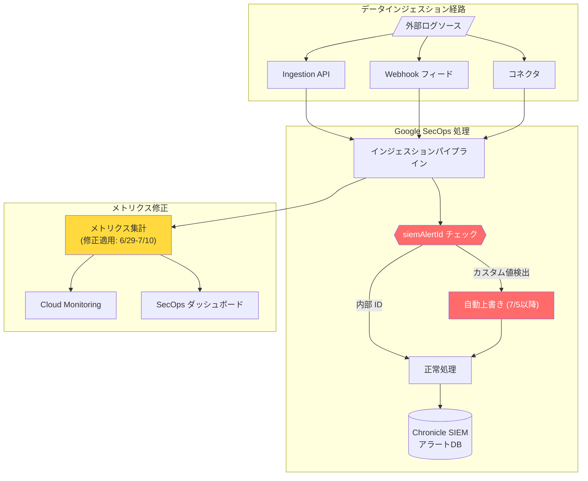

# Google SecOps (SIEM + SOAR): インジェスションメトリクス修正 + siemAlertId フィールド予約 (Breaking Change)

**リリース日**: 2026-06-23

**サービス**: Google SecOps (SIEM + SOAR)

**機能**: インジェスションメトリクスレポートの修正、siemAlertId フィールドの内部予約化

**ステータス**: Breaking Change / 修正適用予定

:chart_with_upwards_trend: [このアップデートのインフォグラフィックを見る](https://takech9203.github.io/google-cloud-news-summary/20260623-google-secops-ingestion-metrics-siemalertid.html)

## 概要

Google Security Operations (SecOps) において、2 つの重要な変更が発表された。第一に、インジェスションメトリクスのレポーティングに存在していた過少報告の問題が修正される。第二に、siemAlertId フィールドが Chronicle SIEM 内部アラート ID 専用として厳密に予約され、カスタムデータが自動的に上書きされるようになる。

特に siemAlertId の変更は **Breaking Change** であり、2026 年 7 月 5 日の適用期限までに対応しないとデータ損失が発生する。すべてのインジェスション方法 (Ingestion API、Webhook、コネクタ) が影響を受けるため、Google SecOps を利用するすべてのセキュリティチームに即座のアクションが求められる。

**アップデート前の課題**

- インジェスションメトリクス (ダッシュボードおよび Cloud Monitoring に表示) が一部過少報告されていた
- siemAlertId フィールドにカスタムデータを格納して運用しているユーザーが存在した
- siemAlertId の用途が明確に制限されておらず、内部用途と外部用途が混在していた

**アップデート後の改善**

- インジェスションメトリクスが正確に報告されるようになり、ダッシュボードと Cloud Monitoring でのデータ可視性が向上
- siemAlertId フィールドの用途が明確化され、Chronicle SIEM アラート ID の一貫性が保証される
- 内部アラート ID 管理の信頼性が向上し、SOAR 連携のアラート同期が安定化

## アーキテクチャ図



このフローは、インジェスション経路における siemAlertId の自動上書きポイントと、メトリクス修正が適用される箇所を示している。赤色のノードが Breaking Change の影響範囲、黄色がメトリクス修正の適用箇所を表す。

## サービスアップデートの詳細

### 主要機能

1. **インジェスションメトリクスレポートの修正**
   - Google Security Operations で一部のインジェスションメトリクスが過少報告されていた問題を解消
   - ダッシュボード (Data Ingestion and Health) および Cloud Monitoring に表示されるメトリクスが対象
   - 修正は 2026 年 6 月 29 日から 7 月 10 日の間に段階的に有効化される
   - 修正適用時に一時的な「見かけ上のスパイク」がメトリクスに表示される可能性がある
   - 実際のログ取り込み量に変更はなく、課金にも影響しない
   - 過去のメトリクスデータは修正されない (修正適用以降のデータのみ正確に反映)

2. **siemAlertId フィールドの内部予約化 (Breaking Change)**
   - 2026 年 7 月 5 日以降、siemAlertId フィールドは Chronicle SIEM 内部アラート ID 専用に厳密予約される
   - このフィールドにカスタムデータを渡した場合、システムが自動的に上書きする
   - すべてのインジェスション方法が影響を受ける:
     - Ingestion API (udmevents、unstructuredlogentries エンドポイント)
     - HTTPS Webhook フィード
     - サードパーティコネクタ (SOAR マーケットプレイス統合含む)
   - データ損失を防ぐため、7 月 5 日より前に別フィールドへの移行が必須

3. **siemAlertId の正しい用途**
   - Google Chronicle Alerts Creator ジョブがサードパーティアラートを SIEM に同期する際に自動付与
   - SIEM で生成されたアラートがコネクタ経由で取得される際に自動設定
   - ユーザーが手動で設定するフィールドではなく、システム内部で管理される識別子

## 技術仕様

### 影響を受けるメトリクス

| メトリクス | 表示場所 | 影響 |
|------|------|------|
| Total ingested log count | Cloud Monitoring (Chronicle Collector > Ingestion) | 修正後に数値増加の可能性 |
| Total ingested log size | Cloud Monitoring (Chronicle Collector > Ingestion) | 修正後に数値増加の可能性 |
| log_count | BigQuery エクスポート (ingestion_metrics テーブル) | 修正後に数値増加の可能性 |
| log_volume | BigQuery エクスポート (ingestion_metrics テーブル) | 修正後に数値増加の可能性 |
| Ingested Events Count | SecOps Data Ingestion and Health ダッシュボード | 修正後に数値増加の可能性 |

### siemAlertId 移行に関する仕様

| 項目 | 詳細 |
|------|------|
| 対象フィールド | `siemAlertId` (アラートオブジェクト内) |
| 適用開始日 | 2026 年 7 月 5 日 |
| 影響範囲 | Ingestion API、Webhook、全コネクタ |
| 動作変更 | カスタム値がシステムにより自動上書き |
| 推奨対応 | 別のカスタムフィールド (labels、UDM extensions 等) へ移行 |
| 移行期限 | 2026 年 7 月 5 日まで (約 12 日間) |

### 移行先の候補フィールド

```json
{
  "metadata": {
    "event_timestamp": "2026-06-23T12:00:00Z",
    "event_type": "GENERIC_EVENT"
  },
  "additional": {
    "fields": {
      "custom_alert_id": {
        "string_value": "your-custom-alert-identifier"
      }
    }
  }
}
```

または Ingestion Labels を使用:

```json
{
  "labels": [
    {
      "key": "custom_alert_id",
      "value": "your-custom-alert-identifier"
    }
  ]
}
```

## 設定方法

### 前提条件

1. Google SecOps インスタンスへの管理者アクセス権限
2. 現在 siemAlertId フィールドにカスタムデータを格納しているインジェスション設定の特定
3. 移行先フィールドの決定

### 手順

#### ステップ 1: 影響範囲の特定

現在 siemAlertId にカスタムデータを渡しているインジェスション設定を洗い出す。以下を確認:

- Ingestion API を呼び出すカスタムスクリプト
- Webhook フィードの設定
- SOAR マーケットプレイスのサードパーティコネクタ設定

#### ステップ 2: 移行先フィールドの選定

カスタムデータの用途に応じて適切な移行先を選定:

- **検索・フィルタリング用途**: UDM の `additional.fields` に移行
- **ラベル・タグ用途**: Ingestion labels (`labels[]`) に移行
- **アラート関連メタデータ**: `security_result` 内のカスタムフィールドに移行

#### ステップ 3: インジェスション設定の更新

移行先フィールドを使用するようにインジェスションコードまたは設定を更新する。

#### ステップ 4: 検証

更新後のデータが正しく取り込まれ、検索・検出ルールで参照可能であることを確認する。

#### ステップ 5: 検出ルールの更新

siemAlertId を参照している YARA-L 検出ルールがある場合、移行先フィールドを参照するよう更新する。

## メリット

### ビジネス面

- **正確なキャパシティプランニング**: メトリクス修正により、実際のインジェスション量を正確に把握でき、キャパシティプランニングの精度が向上
- **アラート管理の信頼性向上**: siemAlertId の一意性が保証され、SIEM-SOAR 間のアラート同期の信頼性が向上

### 技術面

- **メトリクス整合性**: ダッシュボード、Cloud Monitoring、BigQuery エクスポートすべてで一貫した正確なメトリクスを提供
- **システム内部 ID の保護**: 内部識別子の予約により、アラートのライフサイクル管理が安定化

## デメリット・制約事項

### 制限事項

- メトリクス修正適用時 (6/29-7/10) にアラートポリシーが誤発報する可能性がある
- 過去のメトリクスデータは遡及修正されないため、修正前後のデータ比較に注意が必要
- siemAlertId の移行に伴い、既存の検出ルール・ダッシュボード・レポートの更新が必要

### 考慮すべき点

- **緊急対応が必要**: siemAlertId の移行期限は 7 月 5 日 (約 12 日間) と短い
- **データ損失リスク**: 期限までに移行しない場合、siemAlertId に格納していたカスタムデータが上書きされ不可逆的に失われる
- **アラートポリシーの一時調整**: メトリクススパイクによる誤アラートを防ぐため、6/29-7/10 の期間はアラート閾値の一時的な調整を検討

## ユースケース

### ユースケース 1: サードパーティ SOAR 連携でカスタム ID を使用していた場合

**シナリオ**: Palo Alto XSOAR や ServiceNow ITSM など、サードパーティ製品からのアラートを Google SecOps に取り込む際に、siemAlertId フィールドに独自の識別子を格納していた。

**対応例**:
```json
{
  "additional": {
    "fields": {
      "external_soar_alert_id": {
        "string_value": "XSOAR-INCIDENT-12345"
      },
      "source_platform": {
        "string_value": "PaloAlto_XSOAR"
      }
    }
  }
}
```

**効果**: 7 月 5 日以降もカスタム識別子が保持され、クロスプラットフォームのアラート追跡が継続可能。

### ユースケース 2: メトリクススパイクへの対応

**シナリオ**: Cloud Monitoring でインジェスション量の閾値ベースアラートを設定しており、メトリクス修正によるスパイクで誤アラートが発生する可能性がある。

**対応例**:
1. 6 月 29 日前にアラートポリシーの閾値を一時的に引き上げ
2. 7 月 10 日以降に新しいベースラインを確認
3. 正確なベースラインに基づいて閾値を再設定

**効果**: 不要なインシデント対応を回避しつつ、修正後のメトリクスに基づく正確な監視体制を構築できる。

## 関連サービス・機能

- **Cloud Monitoring**: Google SecOps のインジェスションメトリクスの可視化とアラートポリシーに使用。Chronicle Collector メトリクス (Total ingested log count, Total ingested log size) が今回の修正対象
- **BigQuery**: ingestion_metrics テーブルへのエクスポートで詳細な SQL 分析が可能。修正後のメトリクスが正確に反映される
- **Google SecOps SOAR**: Google Chronicle Alerts Creator ジョブが siemAlertId を使用してアラート同期を管理。今回の変更でこの仕組みの信頼性が向上
- **SecOps Health Hub**: Data Ingestion and Health ダッシュボードでインジェスション状態を一元監視。メトリクス修正が反映される主要な表示先

## 参考リンク

- :chart_with_upwards_trend: [インフォグラフィック](https://takech9203.github.io/google-cloud-news-summary/20260623-google-secops-ingestion-metrics-siemalertid.html)
- [公式リリースノート](https://docs.google.com/release-notes#June_23_2026)
- [Ingestion API リファレンス](https://docs.cloud.google.com/chronicle/docs/reference/ingestion-api)
- [インジェスションメトリクスの理解](https://docs.cloud.google.com/chronicle/docs/ingestion/understand-ingestion-metrics)
- [インジェスションメトリクススキーマ](https://docs.cloud.google.com/chronicle/docs/reference/ingestion-metrics-schema)
- [Cloud Monitoring でのインジェスション通知設定](https://docs.cloud.google.com/chronicle/docs/ingestion/ingestion-notifications-for-health-metrics)
- [SIEM Webhook フィードの設定](https://docs.cloud.google.com/chronicle/docs/ingestion/setup-siem-webhook)
- [Google Chronicle SOAR 統合](https://docs.cloud.google.com/chronicle/docs/soar/marketplace-integrations/google-chronicle)

## まとめ

今回の Google SecOps アップデートで最も緊急性が高いのは、**2026 年 7 月 5 日に適用される siemAlertId フィールドの予約化** である。カスタムデータを siemAlertId に格納している場合、期限までに別フィールドへ移行しなければデータが自動上書きされ、不可逆的な損失が発生する。即座にインジェスション設定を監査し、影響を受けるパイプラインを特定して移行作業を開始することを強く推奨する。メトリクス修正については、6 月 29 日から 7 月 10 日の間に見かけ上のスパイクが発生する可能性があるため、アラートポリシーの閾値を事前に調整しておくことが望ましい。

---

**タグ**: #GoogleSecOps #Chronicle #SIEM #SOAR #BreakingChange #Ingestion #Metrics #siemAlertId #CloudMonitoring #SecurityOperations
