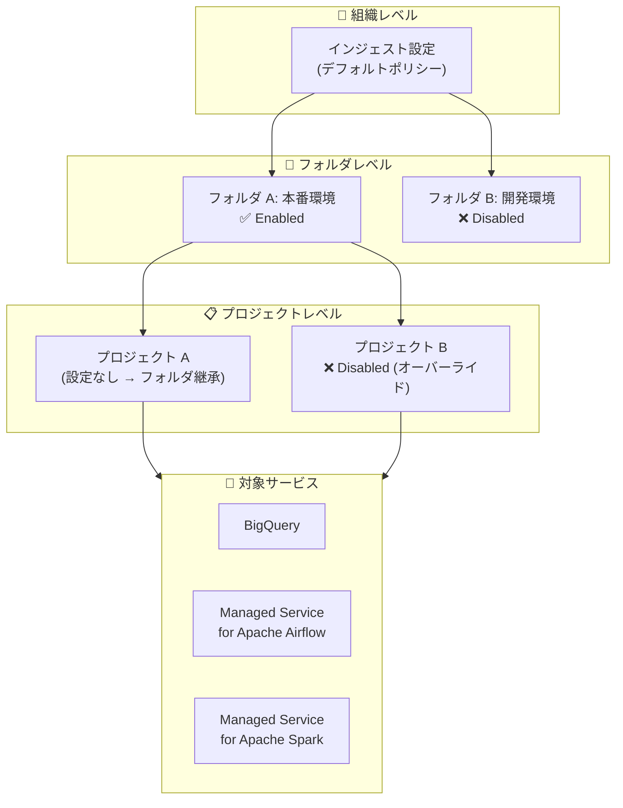

# Knowledge Catalog: データリネージインジェスト制御 (BigQuery / Managed Service for Apache Airflow)

**リリース日**: 2026-06-23

**サービス**: Knowledge Catalog (Dataplex)

**機能**: データリネージインジェスト制御 - BigQuery および Managed Service for Apache Airflow 対応

**ステータス**: Preview

📊 [このアップデートのインフォグラフィックを見る](https://takech9203.github.io/google-cloud-news-summary/20260623-knowledge-catalog-lineage-ingestion-control.html)

## 概要

Knowledge Catalog のデータリネージインジェスト制御機能が拡張され、BigQuery および Managed Service for Apache Airflow (Cloud Composer) に対して、組織・フォルダ・プロジェクトレベルでリネージデータの取り込みを有効化・無効化できるようになった。本機能は Preview として利用可能である。

これまでこの階層型インジェスト制御は Managed Service for Apache Spark (Dataproc) のみをサポートしていたが、今回のアップデートにより BigQuery と Managed Service for Apache Airflow にも対応範囲が拡大された。これにより、組織全体のデータガバナンスポリシーに基づいたリネージ収集の一元管理が可能になる。

**アップデート前の課題**

- BigQuery のリネージ取り込みは Data Lineage API を有効化するとプロジェクト全体で自動的に開始され、選択的に無効化する手段がなかった
- Managed Service for Apache Airflow のリネージ制御は環境単位でのみ可能で、組織・フォルダレベルでの一括管理ができなかった
- 開発環境や大量ワークロードのプロジェクトでリネージ収集を一元的に無効化する階層型のポリシー管理が困難だった

**アップデート後の改善**

- BigQuery のリネージインジェストを組織・フォルダ・プロジェクトの各レベルで選択的に有効/無効化可能になった
- Managed Service for Apache Airflow のリネージインジェストも同様に階層型で制御可能になった
- リソース階層に基づく継承ルール (プロジェクト > フォルダ > 組織) により、ガバナンスポリシーの一元管理が実現

## アーキテクチャ図



リソース階層に沿って最も具体的なレベルの設定が優先される。プロジェクトレベルの設定がない場合、親フォルダの設定が継承され、フォルダにも設定がなければ組織レベルの設定が適用される。

## サービスアップデートの詳細

### 主要機能

1. **階層型インジェスト制御**
   - 組織、フォルダ、プロジェクトの各レベルで設定可能
   - 最も具体的な (子に近い) レベルの設定が優先される
   - 設定がない場合はリソース階層を上方向にたどり、最初に見つかった設定が適用される

2. **BigQuery リネージインジェスト制御**
   - BigQuery の DDL/DML 操作 (CREATE TABLE、INSERT、UPDATE、DELETE、MERGE) やコピージョブによるリネージ収集を制御可能
   - プロジェクト単位で有効/無効を切り替えられるようになった

3. **Managed Service for Apache Airflow リネージインジェスト制御**
   - Cloud Composer 環境から報告されるリネージイベントの収集を階層型で制御
   - 従来の環境単位の制御に加え、組織・フォルダレベルでの一括管理が可能

4. **設定の継承ルール**
   - プロジェクトに設定あり → その設定が適用
   - プロジェクトに設定なし → 最も近い親フォルダの設定が適用
   - フォルダにも設定なし → 組織レベルの設定が適用
   - すべてのレベルに設定なし → サービスのデフォルト動作が適用

## 技術仕様

### Data Lineage API エンドポイント

| リソースレベル | エンドポイント |
|--------------|--------------|
| プロジェクト | `GET/PATCH https://datalineage.googleapis.com/v1/projects/{PROJECT_ID}/locations/global/config` |
| フォルダ | `GET/PATCH https://datalineage.googleapis.com/v1/folders/{FOLDER_ID}/locations/global/config` |
| 組織 | `GET/PATCH https://datalineage.googleapis.com/v1/organizations/{ORG_ID}/locations/global/config` |

### インテグレーション識別子

| サービス | integration 値 |
|---------|---------------|
| BigQuery | `BIGQUERY` |
| Managed Service for Apache Airflow | `COMPOSER` |
| Managed Service for Apache Spark | `DATAPROC` |
| Looker (Google Cloud core) | `LOOKER_CORE` |

### 設定 JSON 形式

```json
{
  "name": "projects/123456789012/locations/global/config",
  "ingestion": {
    "rules": [
      {
        "integrationSelector": {
          "integration": "BIGQUERY"
        },
        "lineageEnablement": {
          "enabled": false
        }
      },
      {
        "integrationSelector": {
          "integration": "COMPOSER"
        },
        "lineageEnablement": {
          "enabled": true
        }
      }
    ]
  },
  "etag": "1a2b3c4d5e"
}
```

## 設定方法

### 前提条件

1. Data Lineage API (`datalineage.googleapis.com`) がクライアントプロジェクトで有効化されていること
2. 適切な IAM 権限が付与されていること
3. クライアントプロジェクトが課金とクォータ用に構成されていること

### 手順

#### ステップ 1: 現在の設定を確認

```bash
curl -X GET \
  -H "Authorization: Bearer $(gcloud auth print-access-token)" \
  -H "x-goog-user-project: CLIENT_PROJECT_ID" \
  "https://datalineage.googleapis.com/v1/projects/PROJECT_ID/locations/global/config"
```

#### ステップ 2: BigQuery リネージインジェストを無効化 (例)

```bash
curl -X PATCH \
  -H "Authorization: Bearer $(gcloud auth print-access-token)" \
  -H "x-goog-user-project: CLIENT_PROJECT_ID" \
  -H "Content-Type: application/json" \
  -d '{
    "ingestion": {
      "rules": [
        {
          "integrationSelector": {
            "integration": "BIGQUERY"
          },
          "lineageEnablement": {
            "enabled": false
          }
        }
      ]
    }
  }' \
  "https://datalineage.googleapis.com/v1/projects/PROJECT_ID/locations/global/config"
```

#### ステップ 3: フォルダレベルで一括設定 (例)

```bash
curl -X PATCH \
  -H "Authorization: Bearer $(gcloud auth print-access-token)" \
  -H "x-goog-user-project: CLIENT_PROJECT_ID" \
  -H "Content-Type: application/json" \
  -d '{
    "ingestion": {
      "rules": [
        {
          "integrationSelector": {
            "integration": "BIGQUERY"
          },
          "lineageEnablement": {
            "enabled": false
          }
        },
        {
          "integrationSelector": {
            "integration": "COMPOSER"
          },
          "lineageEnablement": {
            "enabled": false
          }
        }
      ]
    }
  }' \
  "https://datalineage.googleapis.com/v1/folders/FOLDER_ID/locations/global/config"
```

設定の反映には最大 24 時間かかるが、通常は 2 時間以内に有効になる。

## メリット

### ビジネス面

- **コスト最適化**: 開発・テスト環境など不要なプロジェクトのリネージ収集を無効化し、Data Lineage API の課金を抑制
- **ガバナンスの一元管理**: 組織のデータガバナンスポリシーをリソース階層に沿って一貫して適用可能

### 技術面

- **階層型ポリシー管理**: 組織管理者がデフォルトポリシーを設定し、個別プロジェクトでオーバーライド可能な柔軟な構成
- **楽観的ロック (etag)**: 設定更新時に etag を使用した競合検出が可能で、複数管理者による同時変更の問題を防止
- **API ベースの制御**: REST API によるプログラム的な管理が可能で、Terraform や自動化ワークフローとの統合が容易

## デメリット・制約事項

### 制限事項

- 本機能は Preview であり、Pre-GA 提供条件が適用される。サポートが限定される可能性がある
- 設定変更の反映には最大 24 時間かかる場合がある (通常は 2 時間以内)
- すべてのリネージ情報はシステム内で 30 日間のみ保持される

### 考慮すべき点

- BigQuery のリネージを無効化するとテーブル・列レベルのリネージグラフが生成されなくなるため、コンプライアンス要件との整合性を事前に確認すること
- 階層型設定のため、意図しない継承が発生しないよう組織内の設定状態を把握しておく必要がある

## ユースケース

### ユースケース 1: 開発環境のリネージコスト削減

**シナリオ**: 大規模な組織で多数の開発・テストプロジェクトが存在し、BigQuery で頻繁にクエリが実行されているが、開発環境のリネージ情報は不要である。

**実装例**:
```bash
# 開発環境フォルダでBigQueryリネージを無効化
curl -X PATCH \
  -H "Authorization: Bearer $(gcloud auth print-access-token)" \
  -H "x-goog-user-project: CLIENT_PROJECT_ID" \
  -H "Content-Type: application/json" \
  -d '{"ingestion":{"rules":[{"integrationSelector":{"integration":"BIGQUERY"},"lineageEnablement":{"enabled":false}}]}}' \
  "https://datalineage.googleapis.com/v1/folders/DEV_FOLDER_ID/locations/global/config"
```

**効果**: 開発フォルダ配下のすべてのプロジェクトで BigQuery リネージインジェストが停止し、不要な課金を削減

### ユースケース 2: 本番環境のみリネージ監査を有効化

**シナリオ**: コンプライアンス要件により本番環境のデータフローの追跡が必要だが、組織全体ではリネージ収集をデフォルト無効にしたい。

**実装例**:
```bash
# 組織レベルでデフォルト無効
# → organizations/ORG_ID で enabled: false

# 本番フォルダでオーバーライド有効化
# → folders/PROD_FOLDER_ID で enabled: true
```

**効果**: 本番環境のみリネージが収集され、監査・コンプライアンス要件を満たしつつ全体のコストを最適化

## 料金

Knowledge Catalog のデータリネージは premium processing SKU で課金される。リネージ固有の課金を他の Knowledge Catalog 処理と区別するには、Cloud Billing レポートで `goog-dataplex-workload-type` ラベルの値 `LINEAGE` でフィルタリングできる。

詳細は [Knowledge Catalog 料金ページ](https://cloud.google.com/dataplex/pricing) を参照。

## 関連サービス・機能

- **BigQuery**: リネージ自動収集の対象となるデータウェアハウスサービス。DDL/DML 操作やコピージョブのリネージが記録される
- **Cloud Composer (Managed Service for Apache Airflow)**: DAG 実行時のリネージイベントを Data Lineage API に送信。環境単位の制御に加え、階層型制御が可能に
- **Managed Service for Apache Spark (Dataproc)**: 2026 年 1 月に同様の階層型リネージインジェスト制御が Preview として提供開始済み
- **Cloud Data Fusion**: インスタンス単位でのリネージ統合制御が可能
- **Looker (Google Cloud core)**: Preview としてリネージインジェスト制御をサポート

## 参考リンク

- 📊 [インフォグラフィック](https://takech9203.github.io/google-cloud-news-summary/20260623-knowledge-catalog-lineage-ingestion-control.html)
- [公式リリースノート](https://docs.cloud.google.com/release-notes#June_23_2026)
- [Control lineage ingestion (ドキュメント)](https://docs.cloud.google.com/dataplex/docs/about-data-lineage#control-lineage-ingestion)
- [Control lineage ingestion for a service](https://docs.cloud.google.com/dataplex/docs/use-lineage#control-ingestion)
- [Data lineage considerations](https://docs.cloud.google.com/dataplex/docs/lineage-considerations)
- [Knowledge Catalog 料金](https://cloud.google.com/dataplex/pricing)
- [Data Lineage REST API リファレンス](https://docs.cloud.google.com/dataplex/docs/reference/data-lineage/rest)

## まとめ

Knowledge Catalog のデータリネージインジェスト制御が BigQuery と Managed Service for Apache Airflow に拡大されたことで、組織全体のリネージ収集ポリシーをリソース階層に沿って一元管理できるようになった。特に大規模組織において、コスト最適化とコンプライアンス要件の両立を実現するための重要な機能である。本番環境ではリネージを有効にしつつ開発環境では無効にするといった運用が、フォルダレベルの設定一つで実現可能になる点が実用的である。

---

**タグ**: #KnowledgeCatalog #Dataplex #DataLineage #BigQuery #CloudComposer #DataGovernance #Preview
