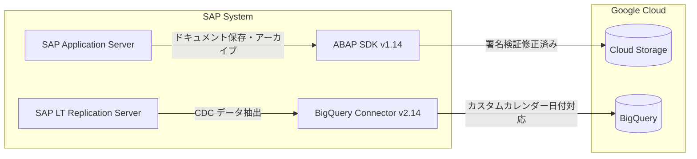

# SAP on Google Cloud: ABAP SDK v1.14 および BigQuery Connector for SAP v2.14

**リリース日**: 2026-06-23

**サービス**: SAP on Google Cloud

**機能**: ABAP SDK for Google Cloud v1.14 / BigQuery Connector for SAP v2.14

**ステータス**: GA (一般提供)

[このアップデートのインフォグラフィックを見る](https://takech9203.github.io/google-cloud-news-summary/20260623-sap-abap-sdk-v1-14-bigquery-connector.html)

## 概要

SAP on Google Cloud において、2 つのコンポーネントの新バージョンが一般提供 (GA) となった。ABAP SDK for Google Cloud v1.14 は Cloud Storage コンテンツリポジトリの署名検証に関するバグ修正と SPRO 設定メニューのクリーンアップを含む保守リリースである。BigQuery Connector for SAP v2.14 はカスタムカレンダータイプを使用した日付フィールドのレプリケーションサポートを追加し、SAP 固有の非標準日付形式を BigQuery へ正確に複製できるようになった。

これらのアップデートは、SAP システムと Google Cloud 間のデータ連携の信頼性と互換性を向上させるものであり、特に SAP の業務データを BigQuery で分析するユースケースにおいて、データの完全性が強化される。

**アップデート前の課題**

- Cloud Storage をコンテンツリポジトリとして使用する際、署名検証プロセスでエラーが発生する場合があった
- SPRO 設定メニューに未参照のノードが残っており、設定画面の整理が不十分だった
- SAP システムでカスタムカレンダータイプを使用する日付フィールド (標準範囲外の値をカスタム形式で格納) が BigQuery へ正しくレプリケーションできなかった

**アップデート後の改善**

- Cloud Storage コンテンツリポジトリの署名検証が正常に機能するようになり、ドキュメント保存・アーカイブの信頼性が向上した
- SPRO 設定メニューから未参照ノードが削除され、構成管理が簡潔になった
- カスタムカレンダータイプを使用した日付フィールドが BigQuery へ正確にレプリケーションされるようになり、SAP 固有の日付処理との互換性が確保された

## アーキテクチャ図



ABAP SDK v1.14 は Cloud Storage コンテンツリポジトリとの通信における署名検証を修正し、BigQuery Connector v2.14 は SAP から BigQuery へのデータレプリケーションにおいてカスタムカレンダータイプの日付フィールドをサポートする。

## サービスアップデートの詳細

### 主要機能

1. **ABAP SDK for Google Cloud v1.14 - 署名検証の修正**
   - Cloud Storage コンテンツリポジトリ機能で発生していた署名検証の問題を解決
   - SAP ArchiveLink サービス経由でのドキュメント保存・取得が安定的に動作
   - SAP のビジネスオブジェクトに添付されたドキュメント (PDF、画像等) の保管やビジネスデータのアーカイブに影響

2. **ABAP SDK for Google Cloud v1.14 - SPRO 設定メニューのクリーンアップ**
   - 未参照のノードを SPRO 設定メニューから削除
   - SDK の設定管理がより直感的になり、管理者の操作性が向上

3. **BigQuery Connector for SAP v2.14 - カスタムカレンダー日付フィールドのサポート**
   - SAP のカスタムカレンダータイプを使用した日付フィールドのレプリケーションに対応
   - 標準範囲外の値をカスタム形式で格納する日付データを正確に BigQuery へ複製
   - 業種固有のカレンダー (会計年度カレンダー、工場カレンダーなど) を使用する環境で特に有効

## 技術仕様

### バージョン情報

| 項目 | 詳細 |
|------|------|
| ABAP SDK for Google Cloud | v1.14 (On-premises or any cloud edition) |
| BigQuery Connector for SAP | v2.14 (On-premises or any cloud edition) |
| ステータス | GA (一般提供) |
| エディション | オンプレミスまたは任意のクラウド |

### BigQuery Connector for SAP v2.14 - カスタムカレンダー日付フィールドの仕様

| 項目 | 詳細 |
|------|------|
| 対象フィールド | カスタムカレンダータイプを使用する日付フィールド |
| 対応する値 | 標準範囲外の値をカスタム形式で格納するデータ |
| レプリケーション方式 | ストリーミング API、CDC (Pub/Sub 経由)、ファイルベース (Cloud Storage) の全方式で利用可能 |

### ABAP SDK v1.14 - セキュリティ設定テーブル (v2.14 で導入)

BigQuery Connector for SAP v2.14 では、設定テーブル `/GOOG/CLIENT_KEY` と `/GOOG/SERVIC_MAP` にカスタム認可グループ `ZSGC` が割り当てられる。

| 設定テーブル | 認可グループ |
|------|------|
| /GOOG/CLIENT_KEY | ZSGC |
| /GOOG/SERVIC_MAP | ZSGC |

## 設定方法

### 前提条件

1. SAP NetWeaver Application Server (ABAP) が稼働していること
2. ABAP SDK for Google Cloud の既存バージョンがインストールされていること
3. BigQuery Connector for SAP の既存バージョンがインストールされていること (BigQuery 連携を使用する場合)

### 手順

#### ステップ 1: ABAP SDK for Google Cloud v1.14 へのアップデート

SDK のアップデートは公式ドキュメントの手順に従って実施する。

```
トランザクション /GOOG/SDK_IMG を実行
→ ABAP SDK for Google Cloud > Basic Settings で設定を確認
```

詳細な手順: [Update the ABAP SDK for Google Cloud](https://docs.cloud.google.com/sap/docs/abap-sdk/on-premises-or-any-cloud/latest/install-config#abap-sdk-update)

#### ステップ 2: BigQuery Connector for SAP v2.14 へのアップデート

BigQuery Connector のアップデートは公式ドキュメントの手順に従って実施する。

詳細な手順: [Update BigQuery Connector for SAP](https://docs.cloud.google.com/sap/docs/bq-connector/latest/operations#bqc4sap-operations-bqc-update)

#### ステップ 3: 認可グループの設定 (BigQuery Connector v2.14)

v2.14 ではセキュリティ強化のため、設定テーブルに認可グループ `ZSGC` が割り当てられる。既存のユーザーロールにこの認可グループを追加する必要がある。

```
トランザクション PFCG を使用
→ 該当ロールに認可グループ ZSGC を追加
→ ユーザーマスターレコードを更新
```

## メリット

### ビジネス面

- **データ完全性の向上**: カスタムカレンダー日付フィールドが正確にレプリケーションされることで、SAP の業務データを BigQuery で分析する際のデータ品質が保証される
- **アーカイブの信頼性向上**: Cloud Storage コンテンツリポジトリの署名検証修正により、コンプライアンス要件を満たすドキュメントアーカイブが安定して動作する

### 技術面

- **互換性の拡大**: SAP 固有のカスタムカレンダータイプ (会計年度、工場カレンダーなど) を使用する環境でのデータレプリケーションが可能に
- **運用負荷の軽減**: 署名検証エラーへの対応が不要になり、Cloud Storage 連携の運用が安定化
- **セキュリティ強化**: 設定テーブルへの認可グループ適用により、構成情報へのアクセス制御が向上

## デメリット・制約事項

### 制限事項

- ABAP SDK for Google Cloud はオンプレミスまたは任意のクラウドエディションのみが対象 (SAP BTP エディションは別リリース)
- BigQuery Connector for SAP v2.14 へのアップデート後、認可グループ `ZSGC` をユーザーロールに追加しないと設定テーブルにアクセスできなくなる

### 考慮すべき点

- アップデート前にテスト環境での検証を推奨
- 認可グループの追加を忘れると既存ユーザーが設定変更できなくなるため、アップデート計画に含めること
- Cloud Storage コンテンツリポジトリを使用中の環境では、アップデート後に署名検証が正常に動作することを確認すること

## ユースケース

### ユースケース 1: 製造業における工場カレンダーデータの BigQuery 分析

**シナリオ**: 製造業の SAP 環境では、工場カレンダー (Factory Calendar) を使用して稼働日・非稼働日を管理している。これらのカレンダーは標準の日付範囲外のカスタム形式で値を格納しており、従来は BigQuery への正確なレプリケーションが困難だった。

**効果**: BigQuery Connector v2.14 により、工場カレンダーに基づく生産計画データや納期データが正確に BigQuery へレプリケーションされ、生産効率分析や需要予測に活用できるようになる。

### ユースケース 2: SAP ドキュメントの Cloud Storage アーカイブ

**シナリオ**: 企業が SAP のビジネスオブジェクトに添付された請求書 PDF や契約書をコンプライアンス要件に基づき Cloud Storage にアーカイブしている。署名検証の問題により一部のドキュメント操作でエラーが発生していた。

**効果**: ABAP SDK v1.14 の修正により、SAP ArchiveLink を通じた Cloud Storage へのドキュメント保存・取得が安定し、規制対応のためのアーカイブ運用が信頼性高く実施できる。

## 料金

ABAP SDK for Google Cloud および BigQuery Connector for SAP 自体は無料でインストール・使用できる。ただし、使用する Google Cloud サービス (BigQuery、Cloud Storage など) の料金は別途発生する。

- **BigQuery**: データの保管量とクエリ処理量に基づく従量課金
- **Cloud Storage**: データ保管量、ネットワーク転送量、操作回数に基づく従量課金

詳細は各サービスの料金ページを参照。

## 関連サービス・機能

- **BigQuery**: SAP データのレプリケーション先として使用。分析、AI/ML 処理に活用
- **Cloud Storage**: SAP ドキュメントのコンテンツリポジトリおよびファイルベースレプリケーションの保存先
- **Pub/Sub**: CDC レプリケーション方式で SAP から BigQuery へのリアルタイムデータ連携に使用
- **SAP LT Replication Server**: BigQuery Connector for SAP のプラットフォーム。CDC データの抽出を担当
- **Vertex AI**: ABAP SDK を通じて SAP から Vertex AI の AI/ML 機能にアクセス可能

## 参考リンク

- [インフォグラフィック](https://takech9203.github.io/google-cloud-news-summary/20260623-sap-abap-sdk-v1-14-bigquery-connector.html)
- [公式リリースノート](https://docs.cloud.google.com/release-notes#June_23_2026)
- [What's new with the ABAP SDK for Google Cloud (On-premises or any cloud)](https://docs.cloud.google.com/sap/docs/abap-sdk/on-premises-or-any-cloud/whats-new)
- [What's new with BigQuery Connector for SAP](https://docs.cloud.google.com/sap/docs/bq-connector/whats-new)
- [BigQuery Connector for SAP overview](https://docs.cloud.google.com/sap/docs/bq-connector/latest/overview)
- [Implement Cloud Storage as a content repository for SAP](https://docs.cloud.google.com/sap/docs/abap-sdk/on-premises-or-any-cloud/latest/implement-gcs-sap-content-repository)
- [ABAP SDK for Google Cloud のアップデート手順](https://docs.cloud.google.com/sap/docs/abap-sdk/on-premises-or-any-cloud/latest/install-config#abap-sdk-update)
- [BigQuery Connector for SAP のアップデート手順](https://docs.cloud.google.com/sap/docs/bq-connector/latest/operations#bqc4sap-operations-bqc-update)

## まとめ

ABAP SDK for Google Cloud v1.14 と BigQuery Connector for SAP v2.14 は、SAP と Google Cloud 間のデータ連携における信頼性と互換性を向上させる保守・機能拡張リリースである。特に BigQuery Connector のカスタムカレンダー日付フィールドサポートは、SAP 固有の日付管理を使用する企業にとって、データ分析基盤の完全性を確保する重要なアップデートとなる。SAP on Google Cloud を運用中の組織は、テスト環境での検証後に本番適用を計画することを推奨する。

---

**タグ**: SAP, ABAP SDK, BigQuery Connector, Cloud Storage, データレプリケーション, GA, オンプレミス, カスタムカレンダー, コンテンツリポジトリ
