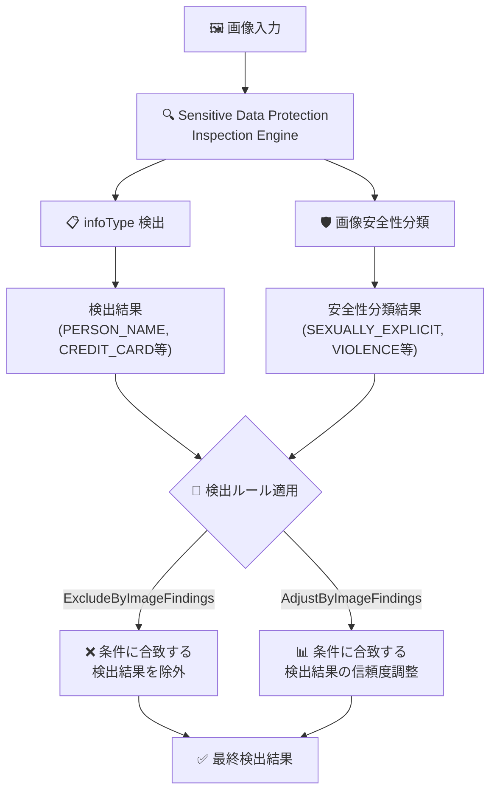

# Sensitive Data Protection: 画像安全性分類 infoType が検出ルールで利用可能に

**リリース日**: 2026-06-23

**サービス**: Sensitive Data Protection

**機能**: ExcludeByImageFindings / AdjustByImageFindings での画像安全性分類 infoType サポート

**ステータス**: Feature

📊 [このアップデートのインフォグラフィックを見る](https://takech9203.github.io/google-cloud-news-summary/20260623-sensitive-data-protection-image-safety-classification.html)

## 概要

Sensitive Data Protection の画像安全性分類 infoType (IMAGE_TYPE/CONTEXT/SEXUALLY_EXPLICIT、IMAGE_TYPE/CONTEXT/SEXUALLY_SUGGESTIVE、IMAGE_TYPE/CONTEXT/VIOLENCE) が、ExcludeByImageFindings および AdjustByImageFindings 検出ルールでサポートされるようになった。これにより、画像のテーマ的コンテンツに基づいて、他の検出結果の除外や信頼度の調整が可能になる。

この機能は、コンテンツモデレーションパイプラインにおいて、画像の安全性分類結果を他の検出結果のフィルタリングや重み付けに活用したいユーザーに向けたものである。例えば、暴力的なコンテンツとして分類された画像内で検出された個人情報の信頼度を上げたり、特定の安全性カテゴリの画像に含まれる検出結果を除外したりすることが可能になる。

**アップデート前の課題**

- 画像安全性分類 infoType は画像の検査・墨消しには使用できたが、ExcludeByImageFindings や AdjustByImageFindings のコンテキスト infoType としては利用できなかった
- 画像の安全性分類結果に基づいて他の検出結果をフィルタリングする場合、後処理で独自のロジックを実装する必要があった
- 安全性分類と他の検出結果の空間的関係に基づく動的な信頼度調整ができなかった

**アップデート後の改善**

- 画像安全性分類 infoType を ExcludeByImageFindings のコンテキスト infoType として指定し、安全性分類に基づく検出結果の除外が可能になった
- AdjustByImageFindings のコンテキスト infoType として指定し、安全性分類に基づく検出結果の信頼度調整が可能になった
- InspectConfig 内で完結する宣言的なルール定義により、後処理ロジックが不要になった

## アーキテクチャ図



画像安全性分類 infoType の検出結果が、他の infoType 検出結果に対する ExcludeByImageFindings / AdjustByImageFindings ルールのコンテキストとして機能するフローを示している。

## サービスアップデートの詳細

### 主要機能

1. **ExcludeByImageFindings での画像安全性分類 infoType サポート**
   - 画像安全性分類の結果に基づいて、ターゲット infoType の検出結果を除外できる
   - ImageContainmentType (encloses, fullyInside, overlaps) による空間的関係の指定が可能
   - matchingType は `MATCHING_TYPE_RULE_SPECIFIC` を使用する

2. **AdjustByImageFindings での画像安全性分類 infoType サポート**
   - 画像安全性分類の結果に基づいて、ターゲット infoType の信頼度 (Likelihood) を調整できる
   - minLikelihood による最小信頼度の閾値設定が可能
   - 信頼度の固定値設定または相対的な調整が可能

3. **対応する画像安全性分類 infoType**
   - `IMAGE_TYPE/CONTEXT/SEXUALLY_EXPLICIT`: 性的に露骨なコンテンツ
   - `IMAGE_TYPE/CONTEXT/SEXUALLY_SUGGESTIVE`: 性的に示唆的なコンテンツ
   - `IMAGE_TYPE/CONTEXT/VIOLENCE`: 暴力的なコンテンツ

## 技術仕様

### ExcludeByImageFindings の構成

| 項目 | 詳細 |
|------|------|
| コンテキスト infoType | IMAGE_TYPE/CONTEXT/SEXUALLY_EXPLICIT, IMAGE_TYPE/CONTEXT/SEXUALLY_SUGGESTIVE, IMAGE_TYPE/CONTEXT/VIOLENCE |
| ImageContainmentType | encloses, fullyInside, overlaps |
| matchingType | MATCHING_TYPE_RULE_SPECIFIC (必須) |
| 対象コンテンツ | 画像のみ (画像以外のコンテンツでは暗黙的に無視される) |

### AdjustByImageFindings の構成

| 項目 | 詳細 |
|------|------|
| コンテキスト infoType | IMAGE_TYPE/CONTEXT/SEXUALLY_EXPLICIT, IMAGE_TYPE/CONTEXT/SEXUALLY_SUGGESTIVE, IMAGE_TYPE/CONTEXT/VIOLENCE |
| ImageContainmentType | encloses, fullyInside, overlaps |
| minLikelihood | VERY_UNLIKELY, UNLIKELY, POSSIBLE, LIKELY, VERY_LIKELY |
| likelihoodAdjustment | 固定値 (fixedLikelihood) または相対値 (relativeLikelihood) |

### ExcludeByImageFindings の設定例

```json
{
  "inspectConfig": {
    "infoTypes": [
      { "name": "PERSON_NAME" },
      { "name": "IMAGE_TYPE/CONTEXT/VIOLENCE" }
    ],
    "ruleSet": [
      {
        "infoTypes": [
          { "name": "PERSON_NAME" }
        ],
        "rules": [
          {
            "exclusionRule": {
              "excludeByImageFindings": {
                "infoTypes": [
                  { "name": "IMAGE_TYPE/CONTEXT/VIOLENCE" }
                ],
                "imageContainmentType": {
                  "encloses": {}
                }
              },
              "matchingType": "MATCHING_TYPE_RULE_SPECIFIC"
            }
          }
        ]
      }
    ]
  }
}
```

### AdjustByImageFindings の設定例

```json
{
  "inspectConfig": {
    "infoTypes": [
      { "name": "CREDIT_CARD_NUMBER" },
      { "name": "IMAGE_TYPE/CONTEXT/SEXUALLY_EXPLICIT" }
    ],
    "ruleSet": [
      {
        "infoTypes": [
          { "name": "CREDIT_CARD_NUMBER" }
        ],
        "rules": [
          {
            "adjustmentRule": {
              "adjustByImageFindings": {
                "infoTypes": [
                  { "name": "IMAGE_TYPE/CONTEXT/SEXUALLY_EXPLICIT" }
                ],
                "minLikelihood": "LIKELY",
                "imageContainmentType": {
                  "encloses": {}
                }
              },
              "likelihoodAdjustment": {
                "fixedLikelihood": "VERY_LIKELY"
              }
            }
          }
        ]
      }
    ]
  }
}
```

## メリット

### ビジネス面

- **コンテンツモデレーションの高度化**: 画像の安全性分類とPII検出を組み合わせた高度なコンテンツポリシー適用が単一のAPIコールで実現できる
- **コンプライアンス対応の簡素化**: 有害コンテンツに含まれる個人情報の扱いを宣言的なルールで制御でき、カスタムコードの保守負担を軽減できる

### 技術面

- **宣言的な設定**: InspectConfig 内でルールを定義するだけで動作し、後処理パイプラインの構築が不要
- **柔軟な空間関係の指定**: encloses、fullyInside、overlaps の3種類の空間的関係を指定できるため、ユースケースに応じた精密な制御が可能
- **既存ワークフローとの互換性**: 既存の inspection/redaction ワークフローに追加のルールを加えるだけで利用可能

## デメリット・制約事項

### 制限事項

- 画像以外のコンテンツ (テキスト、テーブルなど) を検査する場合、このルールは暗黙的に無視される
- 画像安全性分類モデルはリアルワールドの画像に対して学習・評価されており、AI 生成画像では検出精度が低下する可能性がある
- 画像スキャンをサポートするロケーションでのみ利用可能

### 考慮すべき点

- AI 生成画像に対しては、微妙なコンテンツや文脈依存のシナリオが検出されない場合がある
- 高リスクな生成 AI アプリケーションでは、画像安全性分類のみに依存せず、追加の安全対策を検討すべき
- Document infoType (DOCUMENT_TYPE/*) は ExcludeByImageFindings / AdjustByImageFindings のコンテキスト infoType として使用できない

## ユースケース

### ユースケース 1: 有害画像内の PII 検出信頼度の引き上げ

**シナリオ**: UGC (ユーザー生成コンテンツ) プラットフォームで、暴力的または性的なコンテンツとして分類された画像内の個人情報を優先的に検出・対処したい。

**実装例**:
```json
{
  "inspectConfig": {
    "infoTypes": [
      { "name": "PERSON_NAME" },
      { "name": "IMAGE_TYPE/CONTEXT/VIOLENCE" }
    ],
    "ruleSet": [
      {
        "infoTypes": [{ "name": "PERSON_NAME" }],
        "rules": [
          {
            "adjustmentRule": {
              "adjustByImageFindings": {
                "infoTypes": [{ "name": "IMAGE_TYPE/CONTEXT/VIOLENCE" }],
                "minLikelihood": "POSSIBLE",
                "imageContainmentType": { "encloses": {} }
              },
              "likelihoodAdjustment": {
                "fixedLikelihood": "VERY_LIKELY"
              }
            }
          }
        ]
      }
    ]
  }
}
```

**効果**: 暴力的なコンテンツ内の個人名検出の信頼度が VERY_LIKELY に引き上げられ、優先的なレビューや自動対処のトリガーとして活用できる。

### ユースケース 2: 安全なコンテンツからの不要な検出除外

**シナリオ**: 教育プラットフォームで、安全性分類に該当しない通常の教材画像から、過剰に検出される特定の infoType を除外し、安全性分類に該当する画像では検出を維持したい。

**効果**: コンテンツの安全性コンテキストに基づいて検出ルールを動的に適用することで、誤検知を削減しつつ、リスクの高いコンテンツに対する検出感度を維持できる。

## 料金

Sensitive Data Protection の画像検査は、処理されたバイト数に基づいて課金される。

| カテゴリ | 料金 |
|--------|------|
| 最初の 1 GB | 無料 |
| Google Cloud ストレージの検査 | $1/GB から (ボリュームディスカウントあり) |
| 任意ソースからの検査 (ハイブリッド) | $3/GB から (ボリュームディスカウントあり) |
| インライン コンテンツ検査 | $3/GB から (ボリュームディスカウントあり) |
| インライン コンテンツ非識別化 | $2/GB から (ボリュームディスカウントあり) |

今回のアップデートによる追加料金は発生しない。検出ルール (ExcludeByImageFindings / AdjustByImageFindings) は InspectConfig の一部として処理されるため、通常の検査料金に含まれる。

## 関連サービス・機能

- **Cloud Vision AI**: 画像分析の基盤技術。Sensitive Data Protection の画像安全性分類とは異なるが、補完的な画像分析機能を提供
- **Content Safety API**: Google Cloud のコンテンツモデレーション API。Sensitive Data Protection と組み合わせたコンテンツポリシー適用に利用可能
- **Security Command Center**: Sensitive Data Protection の検出結果をセキュリティダッシュボードに統合し、組織全体のデータリスクを可視化

## 参考リンク

- 📊 [インフォグラフィック](https://takech9203.github.io/google-cloud-news-summary/20260623-sensitive-data-protection-image-safety-classification.html)
- [公式リリースノート](https://docs.google.com/release-notes#June_23_2026)
- [検出ルールの設定ドキュメント](https://docs.cloud.google.com/sensitive-data-protection/docs/creating-custom-infotypes-rules)
- [画像検査・墨消しの概要](https://docs.cloud.google.com/sensitive-data-protection/docs/concepts-image-redaction)
- [infoType リファレンス (画像コンテキスト infoType)](https://docs.cloud.google.com/sensitive-data-protection/docs/infotypes-reference#image-context)
- [InspectConfig REST API リファレンス](https://docs.cloud.google.com/sensitive-data-protection/docs/reference/rest/v2/InspectConfig)
- [料金ページ](https://cloud.google.com/sensitive-data-protection/pricing)

## まとめ

今回のアップデートにより、Sensitive Data Protection の画像安全性分類 infoType が ExcludeByImageFindings と AdjustByImageFindings の検出ルールで使用可能になった。これにより、画像のテーマ的な安全性分類結果を他の検出結果のフィルタリングや信頼度調整のコンテキストとして活用できるようになり、コンテンツモデレーションパイプラインの精度向上と実装の簡素化が期待できる。既に画像安全性分類や画像ベースの検出ルールを利用しているユーザーは、InspectConfig にルールを追加することで即座に活用可能である。

---

**タグ**: #SensitiveDataProtection #ImageSafety #ContentModeration #DLP #InspectionRules #ImageClassification #GoogleCloud
