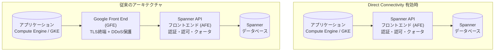

# Cloud Spanner: Direct Connectivity が GA (一般提供) に昇格

**リリース日**: 2026-06-23

**サービス**: Cloud Spanner

**機能**: Direct Connectivity (直接接続)

**ステータス**: GA (一般提供)

[このアップデートのインフォグラフィックを見る](https://takech9203.github.io/google-cloud-news-summary/20260623-spanner-direct-connectivity-ga.html)

## 概要

Cloud Spanner の Direct Connectivity (直接接続) 機能が一般提供 (GA) になりました。この機能を有効にすると、アプリケーションのトラフィックが Google Front End (GFE) サーバーをバイパスし、Spanner サーバーに直接ルーティングされます。これにより、全体的なレイテンシを削減できます。

従来の Spanner アーキテクチャでは、クライアントからのリクエストは必ず GFE を経由していました。GFE は TLS 接続の終端や DDoS 攻撃からの保護を担当しますが、このホップが追加のレイテンシを発生させていました。Direct Connectivity を有効にすることで、この GFE レイヤーをスキップし、アプリケーションから Spanner API フロントエンド (AFE) へ直接接続できるようになります。

この機能は、レイテンシに敏感なワークロードを Compute Engine または GKE 上で実行しているユーザーに特に有益です。

**アップデート前の課題**

- すべての Spanner API リクエストが Google Front End (GFE) を経由する必要があり、追加のネットワークホップによるレイテンシが発生していた
- GFE レイヤーでのレイテンシが高い場合でも、バイパスする手段がなかった (Preview 期間中を除く)
- レイテンシに敏感なアプリケーションでは GFE の処理時間が無視できないオーバーヘッドとなっていた

**アップデート後の改善**

- GFE をバイパスして Spanner サーバーに直接接続することで、全体的なレイテンシを削減
- 環境変数またはクライアントライブラリの設定で簡単に有効化可能
- クライアントサイドメトリクスで Direct Connectivity の使用状況をモニタリング可能
- GA となったことで本番環境での利用が公式にサポートされ、SLA の対象に

## アーキテクチャ図



Direct Connectivity を有効にすると、アプリケーションのトラフィックは GFE をバイパスし、Spanner API フロントエンド (AFE) に直接ルーティングされます。AFE は引き続き認証、認可、クォータチェックを実行するため、セキュリティは維持されます。

## サービスアップデートの詳細

### 主要機能

1. **GFE バイパスによるレイテンシ削減**
   - アプリケーショントラフィックが GFE を経由せず、直接 Spanner サーバーにルーティングされる
   - GFE レイヤーで発生していたレイテンシ (TLS 終端処理など) を排除
   - エンドツーエンドのレイテンシが改善される

2. **簡単な有効化方法**
   - 環境変数 `GOOGLE_SPANNER_ENABLE_DIRECT_ACCESS=true` の設定
   - クライアントライブラリの API 設定 (Java: `setEnableDirectAccess(true)`, Go: `ClientConfig.EnableDirectAccess`)
   - JDBC ドライバーの接続プロパティ (`enableDirectAccess=true`)

3. **クライアントサイドメトリクスによるモニタリング**
   - `directpath_enabled` ラベル: Direct Connectivity が有効かどうかを示す
   - `directpath_used` ラベル: 実際に Direct Connectivity が使用されたかどうかを示す
   - `spanner.googleapis.com/client/operation_latencies` および `spanner.googleapis.com/client/gfe_latencies` メトリクスで効果を確認可能

## 技術仕様

### 前提条件

| 項目 | 要件 |
|------|------|
| 実行環境 | Compute Engine または Google Kubernetes Engine (GKE) |
| エンドポイント | グローバルエンドポイント (`spanner.googleapis.com`) を使用 |
| ネットワーク構成 | Egress トラフィックが `34.126.0.0/18` および `2001:4860:8040::/42` に到達可能なルートとファイアウォールルール |
| Java クライアントライブラリ | バージョン 6.111.0 以降 |
| Go クライアントライブラリ | バージョン 1.88.0 以降 |
| IAM 権限 | `spanner.databases.get` 権限が必要 |

### 有効化方法

**方法 1: 環境変数**

```bash
export GOOGLE_SPANNER_ENABLE_DIRECT_ACCESS=true
```

**方法 2: Java クライアントライブラリ**

```java
SpannerOptions options = SpannerOptions.newBuilder()
    .setEnableDirectAccess(true)
    .build();
```

**方法 3: Go クライアントライブラリ**

```go
client, err := spanner.NewClientWithConfig(ctx, db,
    spanner.ClientConfig{
        EnableDirectAccess: true,
    })
```

**方法 4: JDBC ドライバー**

```
jdbc:cloudspanner:/projects/PROJECT/instances/INSTANCE/databases/DB?enableDirectAccess=true
```

## メリット

### ビジネス面

- **レイテンシ削減によるユーザー体験の向上**: データベースアクセスの応答時間が短縮されることで、エンドユーザーの体験が改善される
- **GA によるエンタープライズ利用の安心感**: 本番ワークロードでの利用が公式にサポートされ、SLA の対象となる

### 技術面

- **ネットワークホップの削減**: GFE レイヤーを経由しないことで、リクエストパスが短縮される
- **設定の容易さ**: 環境変数一つまたはクライアント設定の変更だけで有効化できる。アプリケーションコードの大幅な変更は不要
- **透過的なフォールバック**: 条件を満たさないリクエストは自動的に従来のパス (GFE 経由) にフォールバックする
- **メトリクスによる可視化**: Direct Connectivity の使用状況をクライアントサイドメトリクスで確認できる

## デメリット・制約事項

### 制限事項

- Compute Engine または GKE 上で実行されるアプリケーションのみが対象 (Cloud Run、App Engine などは非対象)
- グローバルエンドポイントを使用している場合のみ有効 (リージョナルエンドポイントでは利用不可)
- 対応クライアントライブラリは現時点で Java (6.111.0+) と Go (1.88.0+) のみ
- ネットワークのルートとファイアウォールルールで特定の IP レンジ (`34.126.0.0/18`, `2001:4860:8040::/42`) への Egress を許可する必要がある
- `spanner.databases.get` 権限が追加で必要

### 考慮すべき点

- GFE が提供する DDoS 保護レイヤーをバイパスすることになるが、Spanner AFE が引き続き認証・認可を実施
- VPC Service Controls やファイアウォールポリシーとの互換性を事前に確認する必要がある
- 有効化後はクライアントサイドメトリクスで `directpath_used` ラベルを確認し、実際に Direct Connectivity が使用されているかモニタリングすることを推奨

## ユースケース

### ユースケース 1: レイテンシクリティカルなトランザクション処理

**シナリオ**: 金融系のリアルタイムトランザクション処理システムが GKE 上で稼働しており、Spanner をバックエンドデータベースとして使用。数ミリ秒のレイテンシ削減がビジネスインパクトを持つ環境。

**実装例**:
```bash
# GKE Pod の環境変数として設定
kubectl set env deployment/transaction-service \
  GOOGLE_SPANNER_ENABLE_DIRECT_ACCESS=true
```

**効果**: GFE ホップの排除により、P99 レイテンシの改善が期待できる。特にリクエスト量が多い場合に累積的な効果が大きい。

### ユースケース 2: ゲームバックエンドのセッション管理

**シナリオ**: Compute Engine 上で動作するゲームサーバーが Spanner をセッションストアとして使用。プレイヤーのアクション応答速度がゲーム体験に直結するため、可能な限りレイテンシを最小化したい。

**効果**: Direct Connectivity により、セッション読み書きのレイテンシが短縮され、ゲームの応答性が向上する。

## 料金

Direct Connectivity 自体に追加料金は発生しません。通常の Spanner の料金体系が適用されます。

| エディション | コンピュート料金 (100 Processing Units/時間/レプリカ) |
|------------|------------------------------------------------------|
| Standard | $0.030 から |
| Enterprise | $0.041 から |
| Enterprise Plus | $0.057 から |

詳細は [Spanner 料金ページ](https://cloud.google.com/spanner/pricing) を参照してください。

## 関連サービス・機能

- **Cloud Monitoring**: クライアントサイドメトリクス (`directpath_enabled`, `directpath_used` ラベル) を使用して Direct Connectivity の状況をモニタリング
- **OpenTelemetry**: カスタムクライアントサイドメトリクスのキャプチャと可視化に対応
- **Compute Engine / GKE**: Direct Connectivity の対象実行環境
- **VPC ネットワーク**: ファイアウォールルールとルート設定が Direct Connectivity の前提条件

## 参考リンク

- [インフォグラフィック](https://takech9203.github.io/google-cloud-news-summary/20260623-spanner-direct-connectivity-ga.html)
- [公式リリースノート](https://docs.cloud.google.com/release-notes#June_23_2026)
- [Direct Connectivity ドキュメント](https://docs.cloud.google.com/spanner/docs/direct-connectivity)
- [Spanner レイテンシポイント](https://docs.cloud.google.com/spanner/docs/latency-points)
- [クライアントサイドメトリクス](https://docs.cloud.google.com/spanner/docs/client-side-metrics-descriptions)
- [Spanner エンドポイント](https://docs.cloud.google.com/spanner/docs/endpoints)
- [料金ページ](https://cloud.google.com/spanner/pricing)

## まとめ

Spanner Direct Connectivity の GA 昇格により、Compute Engine や GKE 上のアプリケーションは GFE をバイパスしてレイテンシを削減できるようになりました。環境変数の設定一つで有効化できるため、レイテンシに敏感なワークロードを運用しているユーザーは、対応クライアントライブラリのバージョンとネットワーク要件を確認の上、早期の導入検討を推奨します。

---

**タグ**: #CloudSpanner #DirectConnectivity #GA #レイテンシ最適化 #パフォーマンス #データベース
