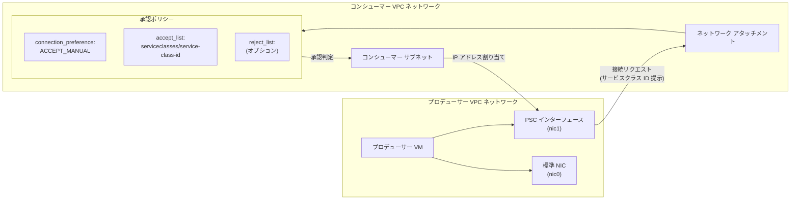

# Virtual Private Cloud (VPC): PSC インターフェースのネットワーク アタッチメント承認リストでサービスクラス ID をサポート (GA)

**リリース日**: 2026-06-23

**サービス**: Virtual Private Cloud (VPC)

**機能**: PSC interfaces - Service class IDs in network attachment accept list (GA)

**ステータス**: GA (一般提供)

[このアップデートのインフォグラフィックを見る](https://takech9203.github.io/google-cloud-news-summary/20260623-vpc-psc-interfaces-service-class-ids-ga.html)

## 概要

Google Cloud は、Private Service Connect (PSC) インターフェースにおけるネットワーク アタッチメントの承認リスト (accept list) でサービスクラス ID を使用した承認機能を一般提供 (GA) としてリリースしました。この機能により、サービスコンシューマーはプロジェクト ID だけでなく、サービスクラス ID を使用して PSC インターフェースの接続を承認できるようになります。

サービスクラス ID は、一部の Google サービスが提供する一意の識別子であり、そのサービスに対する承認を簡素化するために設計されています。コンシューマーはネットワーク アタッチメントの承認リストにサービスクラス ID を追加することで、特定の Google マネージドサービスからの接続を許可できます。これにより、個別のプロジェクト ID を管理する必要がなくなり、大規模環境でのアクセス制御が大幅に簡素化されます。

**アップデート前の課題**

- プロジェクト ID ベースの承認のみが利用可能であり、Google マネージドサービスが複数のプロジェクトから接続する場合、すべてのプロジェクト ID を個別に承認リストに追加する必要があった
- Google サービスのプロジェクト ID は内部的に変更される可能性があり、承認リストのメンテナンスが煩雑だった
- マネージドサービスのスケール変更やマイグレーション時に承認リストの更新が必要で、運用負荷が高かった

**アップデート後の改善**

- サービスクラス ID を使用することで、Google マネージドサービスからの接続を単一の識別子で承認可能になった
- プロジェクト ID の変更に依存しない安定した承認設定が可能になった
- 承認ポリシーの管理が簡素化され、運用負荷が大幅に軽減された

## アーキテクチャ図



PSC インターフェースがネットワーク アタッチメントへの接続を要求する際、サービスクラス ID を提示します。ネットワーク アタッチメントの承認ポリシーがそのサービスクラス ID を承認リストに含んでいれば接続が承認され、コンシューマー サブネットから IP アドレスが割り当てられます。

## サービスアップデートの詳細

### 主要機能

1. **サービスクラス ID ベースの承認**
   - ネットワーク アタッチメントの承認リストにサービスクラス ID を追加可能
   - Google マネージドサービスが提供する固有の識別子を使用して接続を承認
   - サービスクラス ID は `serviceclasses/` プレフィックスを付けて指定

2. **承認ポリシーの二重方式**
   - プロジェクト ID ベースとサービスクラス ID ベースの2つの承認方式を選択可能
   - 同一のネットワーク アタッチメント内では、プロジェクト ID とサービスクラス ID を混在させることはできない
   - 承認リストと拒否リストの両方でサービスクラス ID を使用可能

3. **セキュリティ検証**
   - プロデューサーが使用権限のないサービスクラス ID で接続を試みた場合、オペレーションが失敗
   - 承認リストと拒否リストの両方に同一のサービスクラス ID が含まれる場合、接続は拒否される
   - 既存の接続は承認リストの更新による影響を受けない

## 技術仕様

### 承認ポリシーの構成要素

| 項目 | 詳細 |
|------|------|
| connection_preference | `ACCEPT_AUTOMATIC` (全接続を自動承認) または `ACCEPT_MANUAL` (リストベース承認) |
| accept_list | 承認するプロジェクト ID またはサービスクラス ID のリスト |
| reject_list | 明示的に拒否するプロジェクト ID またはサービスクラス ID のリスト |
| リストの型制約 | 同一ポリシー内でプロジェクト ID とサービスクラス ID の混在は不可 |

### サービスクラス ID の形式

| 項目 | 詳細 |
|------|------|
| 形式 | `serviceclasses/<service-class-id>` |
| 指定場所 | ネットワーク アタッチメントの accept_list / reject_list |
| 提供元 | Google マネージドサービス (各サービスのドキュメントで確認) |

## 設定方法

### 前提条件

1. コンシューマー VPC ネットワークが作成済みであること
2. 接続を承認する Google サービスのサービスクラス ID を確認済みであること
3. ネットワーク アタッチメント用のサブネットが作成済みであること

### 手順

#### ステップ 1: サービスクラス ID ベースのネットワーク アタッチメントを作成

```bash
gcloud compute network-attachments create ATTACHMENT_NAME \
  --region=REGION \
  --connection-preference=ACCEPT_MANUAL \
  --producer-accept-list=serviceclasses/SERVICE_CLASS_ID_1,serviceclasses/SERVICE_CLASS_ID_2 \
  --subnets=SUBNET_NAME
```

サービスクラス ID を使用して、指定した Google マネージドサービスからの接続のみを承認するネットワーク アタッチメントを作成します。

#### ステップ 2: 拒否リストの追加 (オプション)

```bash
gcloud compute network-attachments update ATTACHMENT_NAME \
  --region=REGION \
  --producer-reject-list=serviceclasses/REJECTED_SERVICE_CLASS_ID
```

明示的に拒否するサービスクラス ID がある場合は、拒否リストに追加します。

#### ステップ 3: API を使用した設定 (代替手段)

```json
POST https://compute.googleapis.com/compute/v1/projects/PROJECT_ID/regions/REGION/networkAttachments
{
  "connectionPreference": "ACCEPT_MANUAL",
  "name": "ATTACHMENT_NAME",
  "producerAcceptLists": [
    "serviceclasses/SERVICE_CLASS_ID_1",
    "serviceclasses/SERVICE_CLASS_ID_2"
  ],
  "producerRejectLists": [],
  "subnetworks": [
    "https://compute.googleapis.com/compute/v1/projects/PROJECT_ID/regions/REGION/subnetworks/SUBNET_NAME"
  ]
}
```

#### ステップ 4: Google Cloud コンソールでの設定

Google Cloud コンソールの Private Service Connect ページから以下の手順で設定できます:

1. **Network attachments** をクリック
2. **Create network attachment** をクリック
3. 名前、ネットワーク、リージョン、サブネットワークを選択
4. **Accept connections for selected service classes** を選択
5. **Add accepted service class** をクリックし、承認するサービスクラスを選択
6. **Create network attachment** をクリック

## メリット

### ビジネス面

- **運用コストの削減**: プロジェクト ID の個別管理が不要になり、承認ポリシーのメンテナンス工数が削減される
- **サービス導入の迅速化**: 新しい Google マネージドサービスの導入時に、単一のサービスクラス ID を追加するだけで承認設定が完了する
- **ガバナンスの強化**: サービス単位での明確なアクセス制御により、コンプライアンス要件への対応が容易になる

### 技術面

- **抽象化されたアクセス制御**: プロジェクト ID の変更に影響されない安定した承認設定が実現する
- **スケーラブルな管理**: マネージドサービスが複数プロジェクトにまたがる場合でも、単一のサービスクラス ID で制御可能
- **セキュリティの向上**: 権限のないプロデューサーがサービスクラス ID を不正使用しようとした場合、自動的にオペレーションが失敗する

## デメリット・制約事項

### 制限事項

- 同一のネットワーク アタッチメント内で、プロジェクト ID とサービスクラス ID を混在させることはできない
- サービスクラス ID は一部の Google サービスのみが提供しており、すべてのサービスで利用可能ではない
- 既存のプロジェクト ID ベースの承認ポリシーをサービスクラス ID ベースに変更する場合、ネットワーク アタッチメントの再作成が必要な場合がある

### 考慮すべき点

- サービスクラス ID ベースの承認では、承認された Google サービスのみが接続可能であり、サードパーティのプロデューサーには適用されない
- 各 Google サービスのドキュメントでサービスクラス ID の要否を事前に確認する必要がある
- 承認リストの更新は既存の接続に影響しないため、既存接続を遮断したい場合は別途対応が必要

## ユースケース

### ユースケース 1: Datastream との PSC 接続

**シナリオ**: 企業が Datastream を使用してオンプレミスのデータベースから BigQuery へのデータレプリケーションを行っている。Datastream は PSC インターフェースを使用してコンシューマー VPC 内のリソースにアクセスする必要がある。

**実装例**:
```bash
gcloud compute network-attachments create datastream-attachment \
  --region=us-central1 \
  --connection-preference=ACCEPT_MANUAL \
  --producer-accept-list=serviceclasses/gcp-datastream \
  --subnets=datastream-subnet
```

**効果**: Datastream のプロジェクト ID を個別に管理する必要がなくなり、サービスクラス ID を一度設定するだけで承認が完了する。Datastream の内部プロジェクト構成が変更されても承認設定への影響がない。

### ユースケース 2: マルチサービスのマネージド環境

**シナリオ**: 企業が複数の Google マネージドサービス (Datastream、Vertex AI など) から PSC インターフェースを使用してコンシューマー VPC にアクセスさせたい。各サービスのリージョンごとにネットワーク アタッチメントを作成する。

**実装例**:
```bash
gcloud compute network-attachments create multi-service-attachment \
  --region=asia-northeast1 \
  --connection-preference=ACCEPT_MANUAL \
  --producer-accept-list=serviceclasses/service-a,serviceclasses/service-b \
  --subnets=managed-services-subnet
```

**効果**: 複数のマネージドサービスを単一のネットワーク アタッチメントの承認リストで一元管理でき、サービスの追加・削除も承認リストの更新だけで完了する。

## 料金

PSC インターフェースの料金は [VPC の料金ページ](https://cloud.google.com/vpc/pricing#psc-network-interface) に記載されています。サービスクラス ID ベースの承認機能自体に追加料金は発生しません。

## 関連サービス・機能

- **Private Service Connect エンドポイント**: コンシューマーからプロデューサーへの接続 (マネージドサービス イングレス) に使用。PSC インターフェースとは逆方向の通信
- **Private Service Connect バックエンド**: ロードバランサ経由で公開サービスや Google API にアクセスするための NEG ベースの構成
- **ネットワーク アタッチメント**: PSC インターフェースのコンシューマー側リソース。承認ポリシーを保持し、接続の受け入れを制御する
- **VPC Service Controls**: PSC インターフェースと組み合わせて使用可能。追加のルーティング設定が必要

## 参考リンク

- [インフォグラフィック](https://takech9203.github.io/google-cloud-news-summary/20260623-vpc-psc-interfaces-service-class-ids-ga.html)
- [公式リリースノート](https://docs.google.com/release-notes#June_23_2026)
- [ドキュメント: Authorization policies](https://docs.cloud.google.com/vpc/docs/about-network-attachments#connection-policies)
- [ドキュメント: About Private Service Connect interfaces](https://docs.cloud.google.com/vpc/docs/about-private-service-connect-interfaces)
- [ドキュメント: Create and manage network attachments](https://docs.cloud.google.com/vpc/docs/create-manage-network-attachments)
- [料金ページ: VPC pricing](https://cloud.google.com/vpc/pricing#psc-network-interface)

## まとめ

今回の GA リリースにより、PSC インターフェースのネットワーク アタッチメント承認リストでサービスクラス ID を使用した承認が正式にサポートされました。これにより、Google マネージドサービスとの PSC 接続において、プロジェクト ID に依存しないより安定的で管理しやすいアクセス制御が実現します。Google マネージドサービスとの PSC インターフェース接続を利用している、または計画している組織は、各サービスのドキュメントでサービスクラス ID の提供有無を確認し、承認ポリシーの移行を検討することを推奨します。

---

**タグ**: #VPC #PrivateServiceConnect #PSCインターフェース #ネットワークアタッチメント #サービスクラスID #アクセス制御 #GA #ネットワーキング
