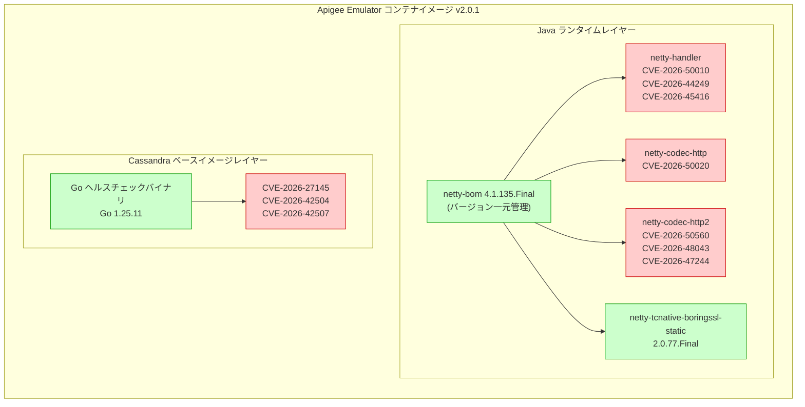

# Apigee X: Apigee Emulator v2.0.1 セキュリティホットフィックス

**リリース日**: 2026-06-24

**サービス**: Apigee X

**機能**: Apigee Emulator v2.0.1 セキュリティパッチ

**ステータス**: Security/Announcement

📊 [このアップデートのインフォグラフィックを見る](https://takech9203.github.io/google-cloud-news-summary/20260624-apigee-emulator-v2-0-1-security.html)

## 概要

2026年6月24日、Google Cloud は Apigee Emulator v2.0.1 をリリースした。これは v2.0.0 に対するセキュリティ専用のホットフィックスリリースであり、Netty ネットワーキングライブラリおよび組み込み Cassandra Go 標準ライブラリのヘルスチェックバイナリに存在する計10件のセキュリティ脆弱性 (CVE) に対処している。

本リリースには機能変更、API 変更、設定変更は一切含まれておらず、v2.0.0 のドロップイン・リプレースメントとして位置づけられている。Apigee Emulator は 2026年5月22日の v2.0.0 リリースから Apigee hybrid とは独立してバージョニング・リリースされるようになっており、本リリースはその独立リリース体制のもとで迅速にセキュリティパッチを提供する初めてのケースとなる。

対象ユーザーは、VS Code の Cloud Code 拡張機能を使用して Apigee API プロキシのローカル開発・テストを行っている開発者全般である。

**アップデート前の課題**

- Netty 4.1.133.Final に存在する7件の脆弱性 (netty-handler、netty-codec-http、netty-codec-http2) により、ローカル開発環境がリモートコード実行やサービス拒否攻撃のリスクにさらされていた
- Go 標準ライブラリ 1.25.10 に存在する3件の脆弱性により、Cassandra ヘルスチェックバイナリが攻撃対象となる可能性があった
- netty-tcnative-boringssl-static 2.0.53.Final は古い TLS ネイティブ実装を含んでおり、最新のセキュリティ修正が適用されていなかった
- 推移的依存関係 (transitive dependencies) の Netty アーティファクトバージョンが統一されておらず、脆弱なバージョンが混入するリスクがあった

**アップデート後の改善**

- Netty 4.1.135.Final へのアップグレードにより7件の CVE が修正され、HTTP/1.1、HTTP/2、TLS ハンドラの安全性が向上した
- netty-bom によるバージョン管理の一元化により、推移的依存関係の Netty アーティファクトが統一的にピン留めされ、将来のバージョン不整合リスクが排除された
- Go 1.25.11 への更新により3件の Go 標準ライブラリ CVE が修正された
- netty-tcnative-boringssl-static 2.0.77.Final への更新により、TLS ネイティブレイヤーの安全性が最新の状態になった

## アーキテクチャ図



本図は Apigee Emulator v2.0.1 のコンテナイメージ内における今回のセキュリティパッチの適用範囲を示している。赤色のノードが脆弱性の影響を受けていたコンポーネント、緑色のノードが修正適用後のコンポーネントを表す。

## サービスアップデートの詳細

### 主要機能

1. **Netty 4.1.135.Final へのアップグレード**
   - 4.1.133.Final から 4.1.135.Final へ更新
   - netty-handler (TLS/SSL ハンドシェイク処理) の3件の脆弱性を修正
   - netty-codec-http (HTTP/1.1 コーデック) の1件の脆弱性を修正
   - netty-codec-http2 (HTTP/2 コーデック) の3件の脆弱性を修正
   - netty-bom (Bill of Materials) を導入し、全推移的 netty-* アーティファクトのバージョンをピン留め

2. **Cassandra ベースイメージのリフレッシュ**
   - 組み込みヘルスチェックバイナリの Go 標準ライブラリを 1.25.10 から 1.25.11 へ更新
   - Go 標準ライブラリに関する3件の CVE を修正
   - ヘルスチェックバイナリは Cassandra コンテナの正常性確認に使用される

3. **netty-tcnative-boringssl-static の更新**
   - 2.0.53.Final から 2.0.77.Final へ更新
   - BoringSSL ベースの TLS ネイティブ実装を最新化
   - classifier variants (プラットフォーム固有バイナリ) を含む全バリアントが更新対象

## 技術仕様

### 修正された CVE 一覧

| CVE ID | コンポーネント | 影響を受けるモジュール |
|--------|---------------|----------------------|
| CVE-2026-50010 | Netty | netty-handler |
| CVE-2026-50020 | Netty | netty-codec-http |
| CVE-2026-50560 | Netty | netty-codec-http2 |
| CVE-2026-48043 | Netty | netty-codec-http2 |
| CVE-2026-44249 | Netty | netty-handler |
| CVE-2026-45416 | Netty | netty-handler |
| CVE-2026-47244 | Netty | netty-codec-http2 |
| CVE-2026-27145 | Go standard library | ヘルスチェックバイナリ |
| CVE-2026-42504 | Go standard library | ヘルスチェックバイナリ |
| CVE-2026-42507 | Go standard library | ヘルスチェックバイナリ |

### バージョン変更の詳細

| コンポーネント | 変更前 (v2.0.0) | 変更後 (v2.0.1) |
|---------------|----------------|----------------|
| Netty | 4.1.133.Final | 4.1.135.Final |
| Go standard library | 1.25.10 | 1.25.11 |
| netty-tcnative-boringssl-static | 2.0.53.Final | 2.0.77.Final |
| netty-bom | 未導入 | 4.1.135.Final (新規導入) |

### Netty コンポーネントの役割

| コンポーネント | 役割 |
|---------------|------|
| netty-handler | TLS/SSL ハンドシェイク、接続管理、タイムアウト処理 |
| netty-codec-http | HTTP/1.1 リクエスト・レスポンスのエンコード/デコード |
| netty-codec-http2 | HTTP/2 フレーム処理、ストリーム管理、HPACK 圧縮 |
| netty-tcnative-boringssl-static | BoringSSL を使用した高性能 TLS ネイティブ実装 |

## 設定方法

### 前提条件

1. VS Code がインストールされていること
2. Cloud Code 拡張機能がインストールされていること
3. Docker がインストールされ、実行中であること
4. 現在 Apigee Emulator v2.0.0 が使用されていること

### 手順

#### ステップ 1: エミュレーターバージョンの更新

VS Code の設定から Apigee Emulator のバージョンを更新する。

1. VS Code で **Settings** (設定) を開く
2. 検索バーに `apigee emulators` と入力
3. **Add item** をクリック
4. バージョンとして `2.0.1` を入力
5. **OK** をクリック

または、`settings.json` に直接追記:

```json
{
  "cloudcode.apigee.emulators": ["2.0.1"]
}
```

#### ステップ 2: 新しいエミュレーターのインストール

```
1. Cloud Code の Apigee セクションで emulators フォルダを展開
2. Apigee Emulator 2.0.1 にカーソルを合わせる
3. インストールアイコンをクリック
4. "Emulator installed successfully" のメッセージを確認
```

#### ステップ 3: 既存コンテナの再作成 (必要な場合)

既存のエミュレーターコンテナがある場合は再作成が必要:

```bash
# 既存コンテナの停止・削除
docker stop <container-name>
docker rm <container-name>

# Cloud Code UI から新しいコンテナを追加
# emulators > Apigee Emulator 2.0.1 > "+" をクリック
```

#### ステップ 4: アップグレードの確認

```bash
# エミュレーターイメージの確認
docker images | grep apigee-emulator
```

## メリット

### ビジネス面

- **コンプライアンス対応**: 既知のセキュリティ脆弱性が修正され、開発環境においてもセキュリティコンプライアンス要件を満たすことができる
- **迅速なパッチ適用**: Apigee hybrid から独立したリリースサイクルにより、セキュリティ修正を即座に適用可能
- **ゼロダウンタイム移行**: 機能変更なしのドロップイン・リプレースメントであるため、移行リスクがなく業務への影響がない

### 技術面

- **依存関係管理の改善**: netty-bom の導入により推移的依存関係のバージョン不整合が防止される
- **攻撃面の縮小**: 10件の CVE 修正により、ローカル開発環境のネットワーキングレイヤーとヘルスチェック機能の攻撃面が大幅に縮小された
- **TLS 実装の最新化**: netty-tcnative-boringssl-static の大幅更新 (2.0.53 から 2.0.77) により、最新の暗号化プロトコル実装が適用される

## デメリット・制約事項

### 制限事項

- 本リリースは Apigee Emulator (ローカル開発環境) のみが対象であり、Apigee X のマネージドランタイムや Apigee hybrid のランタイムには影響しない
- Docker 環境が必要 (エミュレーターはコンテナとして動作するため)
- VS Code + Cloud Code 拡張機能が前提環境となる

### 考慮すべき点

- v2.0.0 から v2.0.1 へのアップグレード後、既存のコンテナは手動で再作成する必要がある (新しいイメージを使用するため)
- カスタム Docker オプション (volumes、environment variables 等) を設定している場合、新コンテナ作成時に再設定が必要
- エミュレーターイメージの取得には Google Artifact Registry へのアクセス権限が必要

## ユースケース

### ユースケース 1: セキュリティコンプライアンスが求められる開発チーム

**シナリオ**: 金融機関の API 開発チームが、社内セキュリティポリシーとして「既知の CVE を含むソフトウェアの使用禁止」を掲げている。チームは Apigee Emulator を使ってローカルで API プロキシの開発・テストを行っており、セキュリティスキャンで v2.0.0 の脆弱性が検出された。

**効果**: v2.0.1 にアップグレードすることで、機能変更なく10件の CVE に対応でき、社内セキュリティ監査をパスできるようになる。

### ユースケース 2: CI/CD パイプラインでの自動セキュリティ検証

**シナリオ**: CI/CD パイプラインに Apigee Emulator を組み込み、API プロキシの自動テストを実施しているチームが、コンテナイメージの脆弱性スキャン (Trivy、Snyk 等) を定期実行している。

**効果**: v2.0.1 への更新により、Netty および Go 標準ライブラリ関連の脆弱性アラートが解消され、パイプラインのセキュリティゲートを通過できるようになる。

## 料金

Apigee Emulator 自体は無料で利用可能。VS Code Cloud Code 拡張機能の一部として提供されており、ローカル開発・テスト用途に追加料金はかからない。ただし、本番環境の Apigee X は別途ライセンスが必要。

詳細は [Apigee の料金ページ](https://cloud.google.com/apigee/pricing) を参照。

## 関連サービス・機能

- **Cloud Code for VS Code**: Apigee Emulator の管理・運用基盤となる VS Code 拡張機能。エミュレーターのインストール、バージョン管理、コンテナ設定をサポート
- **Google Artifact Registry**: Apigee Emulator のコンテナイメージが公開されているレジストリ (`gcr.io/apigee-release/hybrid/apigee-emulator`)
- **Apigee hybrid**: Apigee Emulator の派生元であるハイブリッドデプロイメントプラットフォーム。v2.0.0 以降、エミュレーターは hybrid から独立してリリースされる
- **Apigee API hub**: ローカル開発環境と連携し、API の設計・管理・テストを統合的に行う機能

## 参考リンク

- 📊 [インフォグラフィック](https://takech9203.github.io/google-cloud-news-summary/20260624-apigee-emulator-v2-0-1-security.html)
- [公式リリースノート](https://cloud.google.com/apigee/docs/release/release-notes#June_24_2026)
- [Apigee Emulator の管理](https://cloud.google.com/apigee/docs/api-platform/local-development/vscode/manage-apigee-emulator)
- [Apigee ローカル開発のセットアップ](https://cloud.google.com/apigee/docs/api-platform/local-development/setup)
- [Google Artifact Registry - Apigee Emulator](https://console.cloud.google.com/artifacts/docker/apigee-release/us/gcr.io/hybrid%2Fapigee-emulator)
- [Apigee の料金](https://cloud.google.com/apigee/pricing)

## まとめ

Apigee Emulator v2.0.1 は、Netty ネットワーキングライブラリと Go 標準ライブラリに存在する計10件のセキュリティ脆弱性を修正するセキュリティ専用ホットフィックスである。機能変更は含まれないため、v2.0.0 ユーザーは即座にアップグレードすることを推奨する。VS Code の Cloud Code 設定でエミュレーターバージョンを `2.0.1` に変更し、コンテナを再作成するだけで適用が完了する。

---

**タグ**: #ApigeeX #ApigeeEmulator #Security #CVE #Netty #GoStdlib #CloudCode #VSCode #LocalDevelopment #HotFix
