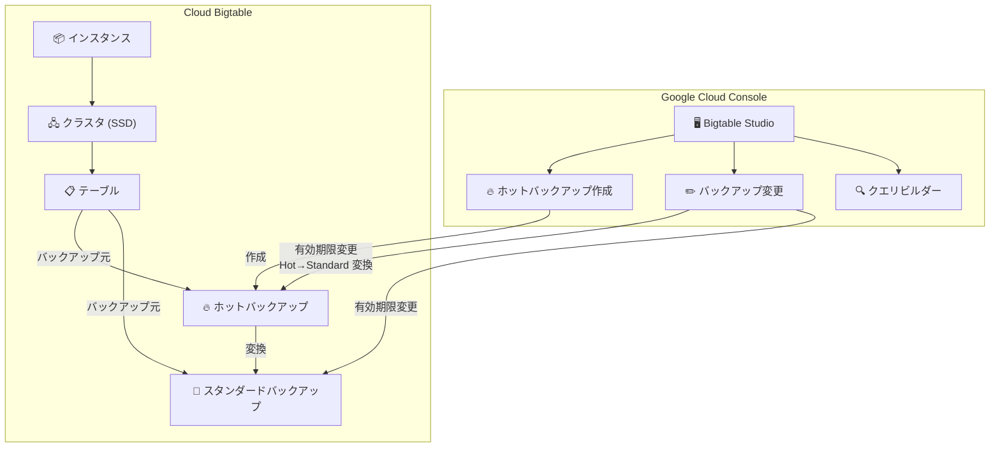

# Bigtable: Bigtable Studio でのホットバックアップ作成・バックアップ管理機能

**リリース日**: 2026-06-24

**サービス**: Cloud Bigtable

**機能**: Bigtable Studio でのホットバックアップ作成およびバックアップ編集

**ステータス**: GA (一般提供)

📊 [このアップデートのインフォグラフィックを見る](https://takech9203.github.io/google-cloud-news-summary/20260624-bigtable-hot-backups-studio.html)

## 概要

Bigtable Studio において、ホットバックアップの作成およびすべてのバックアップの変更が可能になりました。これにより、Google Cloud コンソール内の Bigtable Studio から直接、バックアップ管理のフルライフサイクル操作を GUI ベースで実行できるようになります。

ホットバックアップは、本番環境に最適化されたバックアップであり、リストア後の低レイテンシ読み取りを迅速に実現するために設計されています。従来、ホットバックアップの作成やバックアップの変更は gcloud CLI またはクライアントライブラリ経由で行う必要がありましたが、今回のアップデートにより Bigtable Studio の GUI から直感的に操作できるようになりました。

この機能は、Bigtable を使用するデータベース管理者、SRE、アプリケーション開発者にとって、災害復旧 (DR) 計画の運用をより簡便にする重要な改善です。

**アップデート前の課題**

- Bigtable Studio からはバックアップの閲覧や標準バックアップの作成のみが可能で、ホットバックアップの作成は gcloud CLI やクライアントライブラリを使用する必要があった
- バックアップの有効期限やホットからスタンダードへの変換日時の変更も CLI 操作が必要だった
- GUI でバックアップ管理を完結できず、コンソールと CLI を行き来する運用が求められていた

**アップデート後の改善**

- Bigtable Studio からホットバックアップを直接作成可能になった
- すべてのバックアップの有効期限変更、ホットからスタンダードへの変換日時設定が GUI から操作可能になった
- バックアップ管理のライフサイクル全体を Bigtable Studio 内で完結できるようになった

## アーキテクチャ図



Bigtable Studio からホットバックアップの作成とすべてのバックアップの変更が可能になったことを示すアーキテクチャ図です。ホットバックアップはスタンダードバックアップへの変換も GUI から設定できます。

## サービスアップデートの詳細

### 主要機能

1. **ホットバックアップの作成 (Bigtable Studio)**
   - Bigtable Studio の Explorer ペインからテーブルを選択し、ホットバックアップを作成可能
   - バックアップタイプとして「Hot」を選択
   - ホットからスタンダードへの変換日時を「Never」「3 days」「Custom」から指定可能
   - バックアップ作成後、Activity タブからステータスを確認可能

2. **バックアップの変更 (全タイプ対応)**
   - 有効期限の変更: 新しい有効期限の日付と時刻を設定
   - ホットバックアップの変換日時設定: ホットバックアップをスタンダードに変換する日時を指定
   - more_vert メニューから「Edit」を選択して変更操作を実行

3. **ホットバックアップの特性**
   - リストア後に本番レベルのパフォーマンスへ迅速に到達
   - スタンダードバックアップと比較して低レイテンシでの読み取りが可能
   - テーブルの完全な論理コピーとして保存 (インクリメンタルではない)

## 技術仕様

### ホットバックアップとスタンダードバックアップの比較

| 項目 | ホットバックアップ | スタンダードバックアップ |
|------|-------------------|------------------------|
| リストア速度 | 高速 (本番パフォーマンスへ即座に到達) | 通常 (最適化に時間が必要) |
| ストレージ料金 | $0.12/GB/月 | $0.026/GB/月 |
| ストレージ方式 | 完全な論理コピー | インクリメンタル (物理ストレージ共有) |
| 最大保持期間 | Enterprise: 90 日 / Enterprise Plus: 365 日 | Enterprise: 90 日 / Enterprise Plus: 365 日 |
| 自動バックアップ対応 | 非対応 | 対応 |
| クラスタ要件 | SSD クラスタのみ | SSD / HDD |
| コピー作成 | コピーは常にスタンダード | コピーは常にスタンダード |

### 制限事項

| 項目 | 詳細 |
|------|------|
| ホットからスタンダードへの変換 | 可能 (最低 24 時間後) |
| スタンダードからホットへの変換 | 不可 |
| Tiered Storage テーブル | ホットバックアップ作成不可 |
| HDD クラスタ | ホットバックアップ作成不可 |

### IAM 権限

バックアップ操作に必要な権限:

```
bigtable.backups.create       # バックアップ作成
bigtable.backups.update       # バックアップ変更
bigtable.backups.delete       # バックアップ削除
bigtable.backups.list         # バックアップ一覧
bigtable.tables.get           # テーブル情報取得
bigtable.instances.get        # インスタンス情報取得
```

## 設定方法

### 前提条件

1. Cloud Bigtable Enterprise または Enterprise Plus エディションのインスタンスが存在すること
2. インスタンスが SSD ストレージを使用するクラスタを持つこと
3. `roles/bigtable.admin` または適切なカスタムロール (bigtable.backups.create, bigtable.backups.update) が付与されていること

### 手順

#### ステップ 1: Bigtable Studio にアクセス

Google Cloud コンソールで Bigtable インスタンスページを開き、対象インスタンスを選択後、左側ナビゲーションから「Bigtable Studio」をクリックします。

#### ステップ 2: ホットバックアップの作成

1. Explorer ペインでバックアップ対象のテーブルを選択
2. 「Create backup」をクリック
3. 以下の項目を設定:
   - **Table ID**: バックアップ対象テーブルを選択
   - **Cluster ID**: レプリケーション使用時はクラスタを選択
   - **Backup ID**: 一意のバックアップ ID を入力
   - **Backup type**: 「Hot」を選択
   - **Set hot to standard**: 変換タイミングを選択 (Never / 3 days / Custom)
4. 「Create」をクリック

#### ステップ 3: バックアップの変更

1. 左側ナビゲーションから「Backups」をクリック
2. 変更対象のバックアップの more_vert メニューから「Edit」を選択
3. 以下の項目を変更可能:
   - **Backup expiration**: 有効期限の日付と時刻
   - **Update hot to standard**: ホットバックアップの変換日時

#### gcloud CLI での操作 (参考)

```bash
# ホットバックアップの作成
gcloud bigtable backups create my-hot-backup \
  --instance=my-instance \
  --cluster=my-cluster \
  --table=my-table \
  --backup-type=HOT \
  --retention-period=30d \
  --hot-to-standard-time=+P7D

# バックアップの変更 (有効期限と変換日時)
gcloud bigtable backups update my-hot-backup \
  --instance=my-instance \
  --cluster=my-cluster \
  --expiration-date=2026-07-24T00:00:00Z \
  --hot-to-standard-time=2026-07-01T00:00:00Z
```

## メリット

### ビジネス面

- **運用効率の向上**: GUI ベースの操作により、CLI の知識がないチームメンバーでもバックアップ管理が可能
- **DR 対応の迅速化**: ホットバックアップの作成が容易になり、災害復旧計画の実装コストが低下
- **コスト最適化**: ホットからスタンダードへの変換スケジュールを視覚的に管理でき、不要なホットバックアップコストを削減

### 技術面

- **統合管理**: バックアップのライフサイクル全体を単一のインターフェースから管理可能
- **高速リストア**: ホットバックアップにより、障害発生時の RTO (目標復旧時間) を大幅に短縮
- **柔軟な運用**: GUI と CLI の両方からバックアップを管理でき、チームの習熟度に応じた運用が可能

## デメリット・制約事項

### 制限事項

- ホットバックアップは SSD クラスタでのみ作成可能 (HDD クラスタでは不可)
- Tiered Storage が有効なテーブルではホットバックアップを作成できない
- 自動バックアップ (Automated Backup) ではホットバックアップを作成できない
- ホットバックアップのコピーは常にスタンダードバックアップとして作成される

### 考慮すべき点

- ホットバックアップのストレージ料金はスタンダードの約 4.6 倍 ($0.12 vs $0.026 per GB/月)
- ホットバックアップはインクリメンタルではなく完全コピーのため、ストレージ使用量がテーブルサイズと同等になる
- スタンダードからホットへの変換はできないため、バックアップ作成時にタイプを慎重に選択する必要がある

## ユースケース

### ユースケース 1: ミッションクリティカルなリアルタイムシステムの DR

**シナリオ**: 金融取引処理システムが Bigtable を使用しており、障害発生時に数分以内の復旧が必要な場合。

**実装例**:
```
# Bigtable Studio で毎日ホットバックアップを作成
# Hot to Standard 変換: 3 日後に設定 (直近 3 日分はホット状態を維持)
# 有効期限: 30 日
```

**効果**: 障害発生時にホットバックアップから迅速にリストアでき、本番パフォーマンスへの到達時間を最小化。RTO を従来のスタンダードバックアップと比較して大幅に短縮。

### ユースケース 2: コスト効率の高いバックアップ戦略

**シナリオ**: 大規模な IoT データを格納する Bigtable テーブルがあり、直近データは迅速な復旧が必要だが、古いバックアップは長期保存でよい場合。

**実装例**:
```
# Bigtable Studio から以下の戦略を実装:
# 1. ホットバックアップを作成 (Hot to Standard: 7 日後)
# 2. 7 日後に自動的にスタンダードに変換され、ストレージコストが削減
# 3. 有効期限を 90 日に設定して長期保存
```

**効果**: 直近 7 日間は高速リストア可能な状態を維持しつつ、それ以降はスタンダードバックアップに自動変換されることでストレージコストを約 80% 削減。

## 料金

バックアップ操作 (作成、コピー、リストア) 自体に課金はありません。ストレージ料金のみが発生します。

### 料金例

| バックアップタイプ | ストレージ 100 GB | ストレージ 1 TB | ストレージ 10 TB |
|-------------------|-------------------|-----------------|------------------|
| ホットバックアップ | $12.00/月 | $120.00/月 | $1,200.00/月 |
| スタンダードバックアップ | $2.60/月 | $26.00/月 | $260.00/月 |

※ 料金はリージョンにより異なります。上記は参考価格です。
※ ホットバックアップはテーブル全体の論理コピー、スタンダードはインクリメンタルのため、実際のストレージ使用量が異なる場合があります。

## 利用可能リージョン

Cloud Bigtable が利用可能なすべてのリージョンでホットバックアップおよび Bigtable Studio の機能を使用できます。ただし、ホットバックアップの作成には SSD クラスタが必要です。

## 関連サービス・機能

- **Bigtable Automated Backup**: 日次の自動バックアップ機能 (スタンダードバックアップのみ対応)。ホットバックアップは手動作成が必要
- **Cloud Monitoring**: バックアップの作成・リストア操作のモニタリングやアラート設定
- **Cloud Logging**: バックアップ操作の監査ログ記録
- **Bigtable レプリケーション**: マルチクラスタ構成での高可用性。バックアップと組み合わせた DR 戦略
- **Bigtable Data Boost**: バックアップからリストア後のテーブルに対して、本番ワークロードに影響を与えずにバッチ処理を実行

## 参考リンク

- 📊 [インフォグラフィック](https://takech9203.github.io/google-cloud-news-summary/20260624-bigtable-hot-backups-studio.html)
- [公式リリースノート](https://cloud.google.com/release-notes)
- [Bigtable バックアップ概要](https://cloud.google.com/bigtable/docs/backups)
- [バックアップの管理](https://cloud.google.com/bigtable/docs/managing-backups)
- [Bigtable Studio でのデータ管理](https://cloud.google.com/bigtable/docs/manage-data-using-console)
- [料金ページ](https://cloud.google.com/bigtable/pricing)

## まとめ

今回のアップデートにより、Bigtable Studio からホットバックアップの作成とすべてのバックアップの変更が可能になり、バックアップ管理の GUI 操作が完全に統合されました。特にホットバックアップは障害発生時の迅速な復旧に不可欠な機能であり、これを GUI から容易に管理できるようになったことで、DR 運用のハードルが大幅に下がりました。Bigtable を本番環境で使用している組織は、ホットバックアップ戦略の導入と、ホットからスタンダードへの変換スケジュールを活用したコスト最適化を検討することを推奨します。

---

**タグ**: #Bigtable #HotBackup #BigtableStudio #DisasterRecovery #BackupManagement #GoogleCloud
