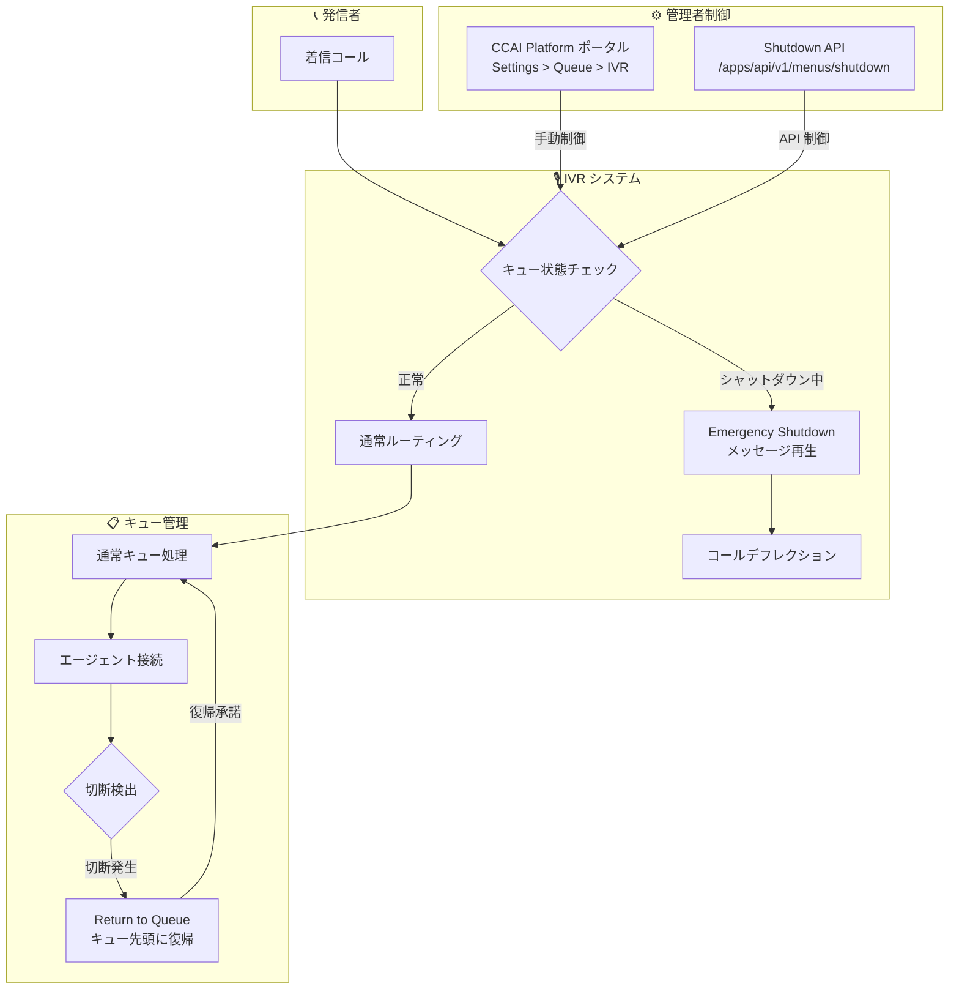

# Google Cloud CCaaS: Emergency Queue Shutdown ほか 3 つの新機能

**リリース日**: 2026-06-24

**サービス**: Google Cloud Contact Center as a Service (CCaaS) / CCAI Platform

**機能**: Emergency Queue Shutdown, Do Not Call (HubSpot), Return to Queue after Disconnection

**ステータス**: Prerelease

📊 [このアップデートのインフォグラフィックを見る](https://takech9203.github.io/google-cloud-news-summary/20260624-ccaas-emergency-queue-shutdown.html)

## 概要

Google Cloud CCaaS (Contact Center as a Service) の次期バージョンにおけるプレリリースノートが公開された。今回のアップデートでは、コンタクトセンター運用における緊急時対応、コンプライアンス強化、顧客体験向上に関する 3 つの新機能が追加されている。

最も注目すべき機能は **Emergency Queue Shutdown** で、システム障害やスタッフ不足、ビル内の緊急事態などの予期しないイベント発生時に、特定のキューを一時的にシャットダウンできる。これにより、影響を受けたキューに対して迅速かつ制御されたコールデフレクション (呼の迂回) を実行しながら、コンタクトセンター全体への影響を最小限に抑えることが可能になる。

また、HubSpot 連携における Do Not Call (DNC) 機能と、切断された発信者がキューに復帰できる Return to Queue 機能も追加され、コンタクトセンターの運用品質と顧客体験の両面が強化されている。

**アップデート前の課題**

- 緊急時にキューを即座にシャットダウンする標準的な手段がなく、コンタクトセンター全体に影響を与えるリスクがあった
- HubSpot 連携において DNC リストの情報がエージェントに即座に表示されず、コンプライアンス違反のリスクがあった
- 通話が予期せず切断された場合、発信者はキューの最初から並び直す必要があった
- 緊急事態への対応が手動設定に依存しており、API による自動化が困難だった

**アップデート後の改善**

- CCAI Platform ポータルまたは API (`/apps/api/v1/menus/shutdown`) から特定キューの緊急シャットダウンが可能になった
- HubSpot のコールアダプターに DNC 警告が表示され、エージェントが発信前にコンプライアンス情報を確認できるようになった
- 切断された発信者にキュー復帰オプションが提供され、キューの先頭に戻される仕組みが導入された
- プログラマティックなシャットダウン制御により、監視システムとの連携や自動化が可能になった

## アーキテクチャ図



Emergency Queue Shutdown の有効時、着信コールは IVR レベルでシャットダウンメッセージを再生後にデフレクションされる。正常時はキューに入り、切断発生時には Return to Queue 機能により先頭に復帰可能。

## サービスアップデートの詳細

### 主要機能

1. **Emergency Queue Shutdown (緊急キューシャットダウン)**
   - システム障害、予期しないスタッフ不足、ビル内緊急事態、予定外メンテナンス時に特定キューを一時シャットダウン可能
   - 影響を受けたキューに対してのみコールデフレクションを実行し、他のキューには影響しない
   - CCAI Platform ポータル (GUI) と API (`/apps/api/v1/menus/shutdown`) の 2 つの方法で制御可能
   - ポータル設定: Settings > Queue > IVR > Edit/View > MENU_NAME > Settings ペインに「Emergency Shutdown」セクションが追加
   - API 設定: Settings > Developer Settings > Audible Messages ページに「Enable Remote Shutdown via API」トグルが追加

2. **Do Not Call capability in HubSpot (HubSpot DNC 機能)**
   - HubSpot 連携において、DNC リストに登録された連絡先に発信しようとした際、コールアダプターに「This number is on the Do Not Call list」と表示
   - エージェントは警告を確認した上で発信を続行可能
   - 続行した場合、CRM に「The contact is in TPS, the agent chose to proceed with the call.」とコメントが記録される
   - 非キャンペーンのアウトバウンドコール専用 (アウトバウンドキャンペーンコールには影響なし)
   - 設定: Settings > Developer Settings > Agent Platform > HubSpot > Account Lookup に「Do-Not-Call CRM Field」セクションが追加

3. **Return to Queue after Disconnection (切断後のキュー復帰)**
   - 通話が予期せず切断された発信者に、キューへの復帰オプションを提供
   - 復帰を承諾した場合、キューの先頭に戻される
   - キュー内のバーチャルエージェント (Virtual Agent) はスキップされ、人間のエージェントに直接接続
   - IVR コール専用の機能
   - ポータル設定箇所:
     - Settings > Call > Call Details ペイン: 「Return to Queue After Disconnection」セクション
     - Settings > Queue > IVR > Edit/View > MENU_NAME > Settings ペイン: 「Return to Queue after disconnection」セクション
     - Settings > Languages & Messages > Audible Messages ペイン: 「Return to Queue After Disconnection Messages」セクション

### バグフィックス

今回のリリースには以下の領域に関する複数のバグフィックスも含まれている:

| 領域 | 修正内容 |
|------|----------|
| キャンペーン | キャンペーン関連の不具合修正 |
| ウォームトランスファー | ボイスメール転送時の問題修正 |
| ゴーストアサインメント | エージェントへの誤割り当て問題の修正 |
| コールドトランスファー | コールドトランスファー時の問題修正 |
| ストリーミング会話 | ストリーミング会話の不具合修正 |
| HubSpot 連携 | 重複レコード作成の修正 |
| ACW (After Call Work) | ACW 時間の計算に関する修正 |
| コールアダプター | 表示に関する不具合修正 |

## 技術仕様

### Emergency Shutdown API

| 項目 | 詳細 |
|------|------|
| エンドポイント | `/apps/api/v1/menus/shutdown` |
| 制御方式 | REST API (プログラマティック) |
| スコープ | 個別キュー単位 |
| 有効化方法 | Developer Settings で API トグルを有効化 |
| 影響範囲 | 対象キューのみ (他キューに影響なし) |

### Return to Queue 仕様

| 項目 | 詳細 |
|------|------|
| 対象チャネル | IVR コールのみ |
| 復帰位置 | キューの先頭 (Top of queue) |
| バーチャルエージェント | スキップ (人間エージェントに直接接続) |
| 設定箇所 | Call Details, Queue IVR, Audible Messages の 3 箇所 |

### Do Not Call (HubSpot) 仕様

| 項目 | 詳細 |
|------|------|
| 対象 CRM | HubSpot |
| 対象コール | 非キャンペーンアウトバウンドコール |
| エージェント操作 | 警告確認後に発信続行可能 |
| 監査ログ | CRM コメントとして自動記録 |

## 設定方法

### 前提条件

1. Google Cloud CCaaS のアクティブなインスタンス
2. CCAI Platform ポータルへの管理者アクセス権
3. HubSpot DNC 機能の場合: HubSpot 連携が設定済みであること

### 手順

#### ステップ 1: Emergency Queue Shutdown の設定 (ポータル)

1. CCAI Platform ポータルにログイン
2. Settings > Queue > IVR (Interactive Voice Response) に移動
3. Edit/View をクリックし、対象のメニュー名を選択
4. Settings ペインの「Emergency Shutdown」セクションで設定を行う

#### ステップ 2: Emergency Queue Shutdown の API 有効化

1. Settings > Developer Settings > Audible Messages に移動
2. 「Enable Remote Shutdown via API」トグルを有効化
3. API エンドポイント `/apps/api/v1/menus/shutdown` を使用してプログラマティックに制御

#### ステップ 3: Do Not Call (HubSpot) の設定

1. Settings > Developer Settings > Agent Platform > HubSpot に移動
2. Account Lookup セクション内の「Do-Not-Call CRM Field」を設定
3. DNC 対象のフィールドを HubSpot のコンタクトプロパティにマッピング

#### ステップ 4: Return to Queue after Disconnection の設定

1. Settings > Call > Call Details ペインで「Return to Queue After Disconnection」を有効化
2. Settings > Queue > IVR > Edit/View で対象キューの設定を行う
3. Settings > Languages & Messages > Audible Messages で復帰時のメッセージを設定

## メリット

### ビジネス面

- **BCP (事業継続計画) の強化**: 緊急事態発生時に即座にキューをシャットダウンし、顧客への影響を最小限に抑えつつ、他のキューは通常運用を継続可能
- **コンプライアンス遵守の強化**: DNC リストの即時表示により、規制違反リスクを低減。発信者が続行した場合も監査証跡が自動記録される
- **顧客満足度 (CSAT) の向上**: 切断後のキュー復帰機能により、発信者の待ち時間を大幅に削減し、離脱率を低減
- **運用コストの削減**: API による自動化で、緊急時対応の人的コストと応答時間を削減

### 技術面

- **プログラマティック制御**: REST API による自動化が可能で、監視システム (Cloud Monitoring 等) との連携やスクリプトによる自動シャットダウンを実現
- **きめ細かな制御**: キュー単位の制御により、影響範囲を最小限に限定可能
- **CRM 連携の強化**: HubSpot との深い統合により、コンプライアンスデータがリアルタイムでエージェントに提供される
- **IVR レベルの最適化**: Return to Queue 機能はバーチャルエージェントをスキップし、人間エージェントへの直接接続を実現

## デメリット・制約事項

### 制限事項

- Emergency Shutdown は IVR キュー単位の制御であり、複数キューの一括シャットダウンは個別に実行する必要がある
- Return to Queue 機能は IVR コール専用であり、Web、Mobile、SMS、Chat チャネルには適用されない
- Do Not Call 機能は HubSpot 連携のみ対応しており、Salesforce 等の他 CRM には現時点で非対応
- DNC 機能はアウトバウンドキャンペーンコールには影響しない (非キャンペーンコールのみ)
- プレリリースノートのため、正式リリース時に仕様が変更される可能性がある

### 考慮すべき点

- Emergency Shutdown API を監視システムと連携する場合、誤検知によるキューの意図しないシャットダウンに対する safeguard の設計が必要
- Return to Queue 機能の利用時、キュー先頭への復帰は他の待機中の発信者への影響を考慮する必要がある
- DNC フィールドの HubSpot 側での正確なメンテナンスが、機能の有効性に直結する

## ユースケース

### ユースケース 1: システム障害時の即時コールデフレクション

**シナリオ**: CRM システムに障害が発生し、特定部門のエージェントが通話を処理できなくなった。他の部門は正常に稼働している。

**実装例**:
```bash
# API を使用して特定キューを緊急シャットダウン
curl -X POST "https://{tenant}.{region}.ccaiplatform.com/apps/api/v1/menus/shutdown" \
  -H "Authorization: Bearer {token}" \
  -H "Content-Type: application/json" \
  -d '{"queue_menu_id": "technical-support-queue", "enabled": true}'
```

**効果**: 技術サポートキューへの着信は自動的にデフレクション (メッセージ再生後に転送/終話) され、営業キューやカスタマーサクセスキューは通常運用を継続。障害復旧後に API で shutdown を解除することで即座に通常運用に復帰。

### ユースケース 2: コンプライアンス対応を伴うアウトバウンドコール

**シナリオ**: エージェントが HubSpot 上で顧客にフォローアップコールを発信しようとしたが、該当顧客が DNC リストに登録されている。

**効果**: コールアダプターに DNC 警告が即座に表示され、エージェントはビジネス上の緊急性を判断した上で発信可否を決定可能。続行した場合は CRM に自動記録され、コンプライアンス監査時の証跡として活用可能。

### ユースケース 3: ネットワーク不安定時の顧客体験維持

**シナリオ**: IVR 経由で問い合わせ中の発信者が、20 分間キューで待機した後にネットワーク切断が発生。

**効果**: 発信者がコールバック時に Return to Queue オプションを選択すると、キューの先頭に復帰。バーチャルエージェントをスキップして人間エージェントに直接接続されるため、待ち時間のロスを最小限に抑えられる。

## 料金

Google Cloud CCaaS は個別見積もりベースの料金体系を採用しており、公開料金表は提供されていない。料金はエージェント数、利用チャネル、通話ボリューム等に基づいて決定される。

詳細は [Google Cloud 営業チームへのお問い合わせ](https://cloud.google.com/contact) を推奨。

## 利用可能リージョン

CCAI Platform は複数の国と Google Cloud リージョンで利用可能。詳細なリージョン一覧については [CCAI Platform Locations](https://docs.cloud.google.com/contact-center/ccai-platform/docs/localities) ページを参照。

## 関連サービス・機能

- **Dialogflow CX**: CCAI Platform のバーチャルエージェント基盤。Return to Queue 機能ではバーチャルエージェントがスキップされる
- **Agent Assist**: エージェントへのリアルタイム支援機能。DNC 情報と組み合わせてコンプライアンス対応を強化
- **Customer Experience Insights (CCAI Insights)**: 通話分析・感情分析機能。緊急シャットダウン後の影響分析に活用可能
- **Cloud Monitoring**: Emergency Shutdown API と連携し、システム異常検知時の自動シャットダウントリガーとして活用
- **HubSpot CRM 連携**: DNC 機能の基盤。Account Lookup とコンタクトプロパティの統合
- **Gemini Enterprise for CX (旧 Customer Engagement Suite)**: CCAI Platform を含む統合 CX ソリューション

## 参考リンク

- 📊 [インフォグラフィック](https://takech9203.github.io/google-cloud-news-summary/20260624-ccaas-emergency-queue-shutdown.html)
- [公式リリースノート](https://cloud.google.com/contact-center/ccai-platform/docs/release-notes)
- [CCAI Platform ドキュメント](https://docs.cloud.google.com/contact-center/ccai-platform/docs)
- [CCAI Platform コール設定](https://docs.cloud.google.com/contact-center/ccai-platform/docs/call-settings)
- [HubSpot Lookups 設定](https://docs.cloud.google.com/contact-center/ccai-platform/docs/hubspot-lookups)
- [IVR メッセージ設定](https://docs.cloud.google.com/contact-center/ccai-platform/docs/configure-ivr-messages)
- [Google Cloud CCaaS 製品ページ](https://cloud.google.com/solutions/contact-center-as-a-service)

## まとめ

今回の Google Cloud CCaaS アップデートは、コンタクトセンターの緊急時対応能力、コンプライアンス体制、顧客体験を包括的に強化するものである。特に Emergency Queue Shutdown の API 対応は、監視システムとの連携による自動化を可能にし、大規模コンタクトセンターにおける BCP 戦略の中核機能となる。CCaaS を利用中の組織は、正式リリース時に向けて緊急対応フローの見直しと API 連携の設計を進めることを推奨する。

---

**タグ**: #GoogleCloud #CCaaS #CCAI #ContactCenter #EmergencyShutdown #IVR #HubSpot #DoNotCall #QueueManagement #CustomerExperience
