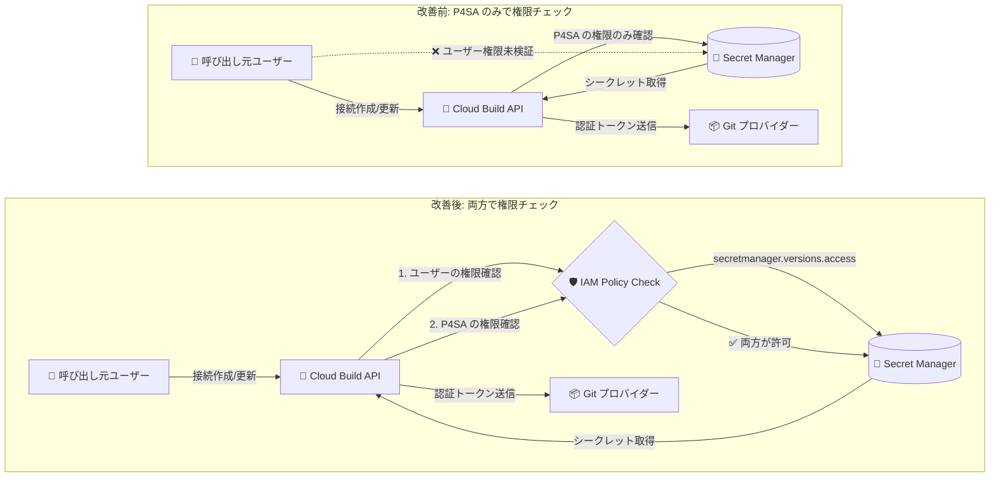

# Cloud Build: GitLab Enterprise / Bitbucket Data Center 接続における Secret Manager 権限チェックの強化

**リリース日**: 2026-06-24

**サービス**: Cloud Build

**機能**: リポジトリ接続時の呼び出し元プリンシパルに対する Secret Manager 権限チェック

**ステータス**: セキュリティアップデート (GCP-2026-042)

📊 [このアップデートのインフォグラフィックを見る](https://takech9203.github.io/google-cloud-news-summary/20260624-cloud-build-secret-manager-permission-check.html)

## 概要

Cloud Build は、GitLab Enterprise Edition (GLE) および Bitbucket Data Center (BBDC) へのリポジトリ接続を作成・更新する際に、Secret Manager シークレットを使用してサードパーティ Git プロバイダーへの認証を行います。今回のセキュリティアップデートにより、Cloud Build はこれらの接続の作成・更新時に、呼び出し元プリンシパル (エンドユーザー) の `secretmanager.versions.access` IAM 権限も検証するようになりました。

この変更は、最小権限の原則 (Principle of Least Privilege) に基づくセキュリティ強化であり、セキュリティ情報 GCP-2026-042 として公開されています。従来の実装では、権限のないユーザーがリポジトリ接続のホスト URI を攻撃者が制御するエンドポイントに向けることで、参照先の Secret Manager シークレットを読み取れる可能性がある脆弱性が存在していました。

**アップデート前の課題**

- リポジトリ接続で参照するシークレットの取得時、Cloud Build サービスエージェント (P4SA) の認証情報のみで権限チェックが行われていた
- 呼び出し元プリンシパル自身がシークレットへのアクセス権限を持っているかどうかは検証されなかった
- リポジトリ接続管理者権限を持つユーザーが、ホスト URI を攻撃者制御のエンドポイントに変更することで、参照先シークレットの内容を読み取れる可能性があった

**アップデート後の改善**

- 呼び出し元プリンシパル (エンドユーザー資格情報) と P4SA の両方に対して `secretmanager.versions.access` 権限チェックが実行されるようになった
- シークレットへのアクセス権限を持たないユーザーは、そのシークレットを参照するリポジトリ接続を作成・更新できなくなった
- 最小権限の原則に基づき、シークレットの不正読み取りリスクが排除された

## アーキテクチャ図



この図は、アップデート前後の権限チェックフローの変更を示しています。改善後は、Cloud Build API がシークレットを取得する前に、呼び出し元ユーザーと P4SA の両方が `secretmanager.versions.access` 権限を持っていることを IAM ポリシーで検証します。

## サービスアップデートの詳細

### 主要機能

1. **デュアル権限チェック (Dual Authorization Check)**
   - リポジトリ接続 API の呼び出し時に、呼び出し元プリンシパルの資格情報 (end-user credentials) を使用して権限を検証
   - P4SA (`service-PROJECT_NUMBER@gcp-sa-cloudbuild.iam.gserviceaccount.com`) の権限も従来通り検証
   - 両方が `secretmanager.versions.access` 権限を持つ場合のみ、シークレットへのアクセスを許可

2. **対象範囲の限定**
   - このチェックは GitLab Enterprise Edition (GLE) と Bitbucket Data Center (BBDC) の接続のみに適用
   - GitHub や GitLab.com などの他のプロバイダーへの接続には影響なし
   - 既存の接続は影響を受けず、作成・更新操作時にのみチェックが実行される

3. **脆弱性の修正 (GCP-2026-042)**
   - リポジトリ接続管理者が、ホスト URI を攻撃者制御エンドポイントに変更することによるシークレット読み取り攻撃を防止
   - 重要度: Low

## 技術仕様

### IAM 権限要件

| 項目 | 詳細 |
|------|------|
| 必要な権限 | `secretmanager.versions.access` |
| 付与に使用するロール | `roles/secretmanager.secretAccessor` (Secret Manager Secret Accessor) |
| 権限付与の粒度 | シークレット単位、プロジェクト単位、フォルダ単位、組織単位 |
| チェック対象プリンシパル | 呼び出し元ユーザー + Cloud Build サービスエージェント (P4SA) |
| 影響を受ける接続タイプ | GitLab Enterprise Edition (GLE)、Bitbucket Data Center (BBDC) |

### 対象 API 操作

| API 操作 | 説明 |
|----------|------|
| `cloudbuild.connections.create` | リポジトリ接続の新規作成 |
| `cloudbuild.connections.update` | 既存リポジトリ接続の更新 |

### 必要なロールの組み合わせ

```json
{
  "呼び出し元ユーザーに必要なロール": {
    "Cloud Build 接続管理": "roles/cloudbuild.connectionAdmin",
    "シークレットアクセス": "roles/secretmanager.secretAccessor (対象シークレットに対して)"
  },
  "Cloud Build サービスエージェント (P4SA) に必要なロール": {
    "シークレットアクセス": "roles/secretmanager.secretAccessor (対象シークレットに対して)"
  }
}
```

## 設定方法

### 前提条件

1. Cloud Build API と Secret Manager API が有効化されていること
2. 接続を作成・更新するユーザーに `roles/cloudbuild.connectionAdmin` が付与されていること
3. P4SA (`service-PROJECT_NUMBER@gcp-sa-cloudbuild.iam.gserviceaccount.com`) に対象シークレットへの `roles/secretmanager.secretAccessor` が付与されていること

### 手順

#### ステップ 1: 呼び出し元ユーザーにシークレットアクセス権限を付与

```bash
# 特定のシークレットに対してユーザーに Secret Accessor ロールを付与
gcloud secrets add-iam-policy-binding SECRET_NAME \
  --member="user:USER_EMAIL" \
  --role="roles/secretmanager.secretAccessor" \
  --project="PROJECT_ID"
```

サービスアカウントを使用して接続を作成・更新する場合は、そのサービスアカウントにも同様に権限を付与します。

```bash
# サービスアカウントに対して権限を付与
gcloud secrets add-iam-policy-binding SECRET_NAME \
  --member="serviceAccount:SA_EMAIL" \
  --role="roles/secretmanager.secretAccessor" \
  --project="PROJECT_ID"
```

#### ステップ 2: P4SA にシークレットアクセス権限を確認

```bash
# P4SA に Secret Accessor ロールが付与されていることを確認
gcloud secrets get-iam-policy SECRET_NAME \
  --project="PROJECT_ID" \
  --format="table(bindings.role,bindings.members)"

# 付与されていない場合は追加
gcloud secrets add-iam-policy-binding SECRET_NAME \
  --member="serviceAccount:service-PROJECT_NUMBER@gcp-sa-cloudbuild.iam.gserviceaccount.com" \
  --role="roles/secretmanager.secretAccessor" \
  --project="PROJECT_ID"
```

#### ステップ 3: Terraform を使用した設定例 (GitLab Enterprise Edition)

```hcl
# 呼び出し元ユーザーにもシークレットへのアクセス権限を付与
resource "google_secret_manager_secret_iam_member" "user-access-api-pat" {
  project   = google_secret_manager_secret.api-pat-secret.project
  secret_id = google_secret_manager_secret.api-pat-secret.secret_id
  role      = "roles/secretmanager.secretAccessor"
  member    = "user:admin@example.com"
}

resource "google_secret_manager_secret_iam_member" "user-access-read-pat" {
  project   = google_secret_manager_secret.read-pat-secret.project
  secret_id = google_secret_manager_secret.read-pat-secret.secret_id
  role      = "roles/secretmanager.secretAccessor"
  member    = "user:admin@example.com"
}

# P4SA にも従来通り権限を付与
data "google_iam_policy" "serviceagent-secretAccessor" {
  binding {
    role    = "roles/secretmanager.secretAccessor"
    members = [
      "serviceAccount:service-PROJECT_NUMBER@gcp-sa-cloudbuild.iam.gserviceaccount.com",
      "user:admin@example.com"
    ]
  }
}
```

## メリット

### ビジネス面

- **コンプライアンス強化**: 最小権限の原則を徹底することで、SOC 2、ISO 27001 などの監査要件への適合が容易になる
- **インシデントリスクの低減**: シークレットの不正アクセス経路が排除され、情報漏洩リスクが軽減される

### 技術面

- **デュアル認証によるセキュリティ多層化**: P4SA のみへの依存から、ユーザーと P4SA の両方による多層的な権限検証へ移行
- **監査証跡の明確化**: Cloud Audit Logs でユーザー単位のシークレットアクセス試行を追跡可能
- **既存接続への影響なし**: 既存の接続は引き続き動作し、新規作成・更新時のみ新しいチェックが適用される

## デメリット・制約事項

### 制限事項

- GitLab Enterprise Edition (GLE) と Bitbucket Data Center (BBDC) の接続のみが対象。GitHub、GitLab.com 等の接続は対象外
- 既存のリポジトリ接続を更新する際に、呼び出し元ユーザーがシークレットアクセス権限を持っていないと操作が失敗する

### 考慮すべき点

- 接続を管理するユーザーやサービスアカウントに `roles/secretmanager.secretAccessor` を追加で付与する必要がある場合がある
- CI/CD パイプラインで接続を自動更新している場合、実行サービスアカウントにもシークレットアクセス権限が必要
- 組織内の IAM ポリシーを確認し、接続管理者がシークレットへのアクセス権限を持つように設定を見直す必要がある

## ユースケース

### ユースケース 1: GitLab Enterprise Edition 接続の新規作成

**シナリオ**: DevOps チームが社内の GitLab Enterprise Edition インスタンスを Cloud Build に接続して CI/CD パイプラインを構築する。

**実装例**:
```bash
# 1. シークレットを作成
echo -n "glpat-xxxxxxxxxxxx" | gcloud secrets create gitlab-api-token \
  --data-file=- --project=my-project

# 2. P4SA に権限を付与
gcloud secrets add-iam-policy-binding gitlab-api-token \
  --member="serviceAccount:service-123456789@gcp-sa-cloudbuild.iam.gserviceaccount.com" \
  --role="roles/secretmanager.secretAccessor" \
  --project=my-project

# 3. 呼び出し元ユーザーにも権限を付与 (新規要件)
gcloud secrets add-iam-policy-binding gitlab-api-token \
  --member="user:devops-admin@example.com" \
  --role="roles/secretmanager.secretAccessor" \
  --project=my-project

# 4. 接続を作成
gcloud builds connections create gitlab my-gle-connection \
  --region=us-central1 \
  --host-uri="https://gitlab.internal.example.com" \
  --authorizer-token-secret-version="projects/my-project/secrets/gitlab-api-token/versions/latest" \
  --read-authorizer-token-secret-version="projects/my-project/secrets/gitlab-read-token/versions/latest" \
  --webhook-secret-secret-version="projects/my-project/secrets/webhook-secret/versions/latest"
```

**効果**: 呼び出し元ユーザーとP4SA の両方がシークレットアクセス権限を持つことが検証され、不正なシークレット読み取りを防止

### ユースケース 2: 既存接続の更新時のエラー対応

**シナリオ**: セキュリティアップデート後に、接続の更新時に権限エラーが発生した場合の対処

**実装例**:
```bash
# エラーメッセージの例:
# ERROR: Permission denied. The caller does not have secretmanager.versions.access
# on the referenced secret(s).

# 対処: 呼び出し元ユーザーにシークレットアクセス権限を付与
gcloud secrets add-iam-policy-binding SECRET_NAME \
  --member="user:USER_EMAIL" \
  --role="roles/secretmanager.secretAccessor" \
  --project=PROJECT_ID
```

**効果**: 最小限の権限付与で接続の更新操作を再実行可能

## 料金

このセキュリティアップデート自体には追加料金は発生しません。関連する料金は以下の通りです。

- **Secret Manager**: シークレットのバージョンあたり月額 $0.06、10,000 アクセス操作あたり $0.03
- **Cloud Build**: 接続自体は無料。ビルド実行時間に基づく課金

詳細は [Secret Manager 料金ページ](https://cloud.google.com/secret-manager/pricing) および [Cloud Build 料金ページ](https://cloud.google.com/build/pricing) を参照してください。

## 関連サービス・機能

- **[Secret Manager](https://cloud.google.com/secret-manager)**: シークレット (アクセストークン等) の安全な保存・管理・アクセス制御を提供
- **[Cloud IAM](https://cloud.google.com/iam)**: プリンシパルに対する権限の付与・検証を管理。今回の変更で呼び出し元プリンシパルへの権限チェックが追加
- **[Cloud Audit Logs](https://cloud.google.com/logging/docs/audit)**: シークレットアクセスや接続操作の監査ログを記録
- **[Cloud Build 2nd gen リポジトリ](https://cloud.google.com/build/docs/repositories)**: GitLab Enterprise Edition、Bitbucket Data Center を含むサードパーティ Git プロバイダーとの接続管理

## 参考リンク

- 📊 [インフォグラフィック](https://takech9203.github.io/google-cloud-news-summary/20260624-cloud-build-secret-manager-permission-check.html)
- [Cloud Build セキュリティ情報 GCP-2026-042](https://cloud.google.com/build/docs/security-bulletins#gcp-2026-042)
- [Cloud Build リリースノート](https://cloud.google.com/build/docs/release-notes)
- [Cloud Build - GitLab Enterprise Edition ホスト接続](https://cloud.google.com/build/docs/automating-builds/gitlab/connect-host-gitlab-enterprise-edition)
- [Cloud Build - Bitbucket Data Center ホスト接続](https://cloud.google.com/build/docs/automating-builds/bitbucket/connect-host-bitbucket-data-center)
- [Secret Manager アクセス制御](https://cloud.google.com/secret-manager/docs/access-control)
- [Cloud Build サービスアカウントのアクセス設定](https://cloud.google.com/build/docs/securing-builds/configure-access-for-cloud-build-service-account)

## まとめ

今回の Cloud Build セキュリティアップデートは、GitLab Enterprise Edition と Bitbucket Data Center への接続時における Secret Manager シークレットのアクセス権限チェックを強化するものです。既存の接続は影響を受けませんが、今後これらの接続を新規作成・更新する際には、呼び出し元のユーザーまたはサービスアカウントにも対象シークレットに対する `roles/secretmanager.secretAccessor` ロールを付与する必要があります。最小権限の原則に基づいたセキュリティ強化であり、権限エラーが発生した場合は該当シークレットへのアクセス権限を付与することで対応できます。

---

**タグ**: #CloudBuild #SecretManager #Security #IAM #GitLabEnterprise #BitbucketDataCenter #LeastPrivilege #GCP-2026-042
