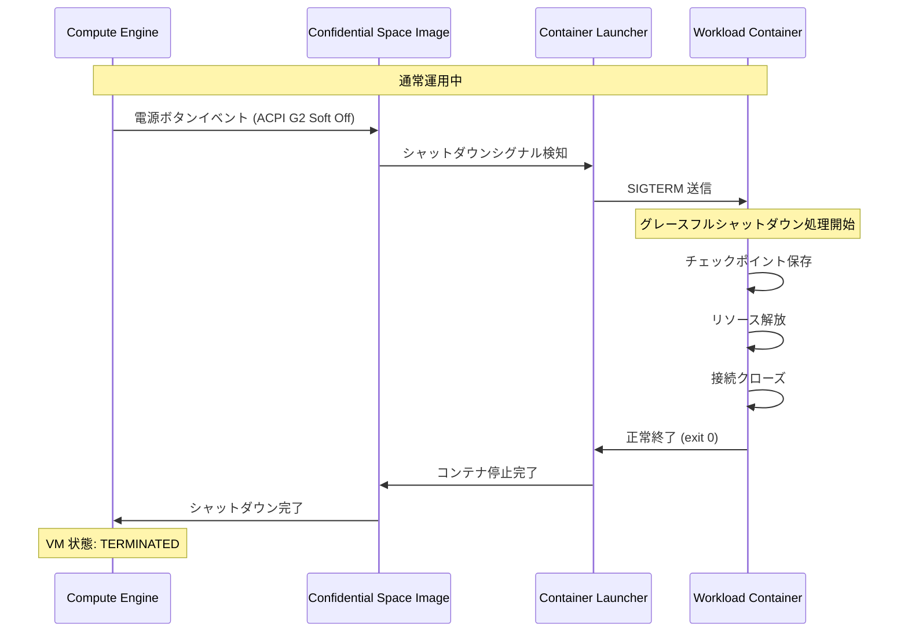

# Confidential Space: イメージ 260600 - コンテナワークロードのグレースフルシャットダウン対応

**リリース日**: 2026-06-24

**サービス**: Confidential Space

**機能**: イメージ 260600 - 電源ボタンイベントによるコンテナワークロードのグレースフルシャットダウンサポート

**ステータス**: Announcement

[このアップデートのインフォグラフィックを見る](https://takech9203.github.io/google-cloud-news-summary/20260624-confidential-space-image-260600.html)

## 概要

Confidential Space イメージ 260600 がリリースされました。本イメージでは、電源ボタンイベント (ACPI power button event) 発生時にコンテナワークロードをグレースフルにシャットダウンする機能が追加されています。これにより、VM の停止・削除・プリエンプション発生時に、ワークロードが処理中のデータを安全に保存し、リソースを適切に解放してから終了できるようになります。

Confidential Space は、複数の当事者が機密データを安全に処理するための信頼された実行環境 (TEE: Trusted Execution Environment) を提供するサービスです。Confidential VM 上で動作する強化された OS イメージの中で、単一のコンテナワークロードを実行します。今回のアップデートにより、長時間実行されるワークロードや状態を持つワークロードの運用信頼性が大幅に向上しました。

この機能は、特に GPU を使用した AI/ML ワークロードや、大規模なデータ処理パイプラインを Confidential Space 上で実行しているユーザーにとって重要な改善です。Spot VM やプリエンプティブル VM と組み合わせて使用する場合にも、データ損失のリスクを軽減できます。

**アップデート前の課題**

Confidential Space では従来、コンテナのライフサイクル管理において以下の課題がありました。

- VM の停止や削除時にコンテナワークロードが即座に強制終了され、処理中のデータが失われる可能性があった
- Spot VM のプリエンプション発生時に、チェックポイントの保存やリソースの解放を行う猶予時間がなかった
- コンテナ内のアプリケーションが ACPI シグナルを受信できず、シャットダウンスクリプトによるクリーンアップ処理を実行できなかった

**アップデート後の改善**

イメージ 260600 により以下の改善が実現されました。

- 電源ボタンイベント (ACPI G2 Soft Off シグナル) がコンテナワークロードに適切に伝搬され、グレースフルシャットダウンが可能になった
- コンテナ内のアプリケーションが SIGTERM シグナルを受信し、クリーンアップ処理を実行する時間が確保されるようになった
- 長時間実行ワークロードにおけるデータ整合性と運用信頼性が向上した

## アーキテクチャ図



この図は、電源ボタンイベント発生時のグレースフルシャットダウンのフローを示しています。Compute Engine からの ACPI シグナルが Confidential Space イメージを経由して Container Launcher に伝わり、最終的にワークロードコンテナが SIGTERM を受け取ってクリーンアップ処理を実行します。

## サービスアップデートの詳細

### 主要機能

1. **電源ボタンイベントの検知とシグナル伝搬**
   - Confidential Space イメージが ACPI G2 Soft Off シグナル (電源ボタンイベント) を検知
   - Container Launcher がシグナルをワークロードコンテナに SIGTERM として伝搬
   - VM の停止、削除、プリエンプションなど様々なシャットダウンシナリオに対応

2. **コンテナワークロードのグレースフル終了**
   - ワークロードが SIGTERM を受信し、アプリケーションレベルでクリーンアップ処理を実行可能
   - 処理中のトランザクションの完了、一時ファイルの削除、ネットワーク接続のクローズなどを実行
   - タイムアウト後は SIGKILL で強制終了され、VM のシャットダウンが完了

3. **既存のリスタートポリシーとの統合**
   - `tee-restart-policy` メタデータ変数 (Never / Always / OnFailure) と連携
   - グレースフルシャットダウン後のコンテナ再起動動作を制御可能
   - 本番環境とデバッグ環境の両方で利用可能

## 技術仕様

### シャットダウンシグナルの伝搬

| 項目 | 詳細 |
|------|------|
| トリガーイベント | ACPI G2 Soft Off (電源ボタンイベント) |
| コンテナへのシグナル | SIGTERM |
| 対応イメージ | Confidential Space image 260600 以降 |
| 対応イメージファミリー | confidential-space (本番) / confidential-space-debug (デバッグ) |
| シャットダウンタイムアウト | VM タイプに依存 (通常 VM: 最大120秒、Spot VM: 最大30秒) |

### シャットダウンシナリオ

| シナリオ | シグナル | グレースフル期間 |
|----------|----------|------------------|
| 手動停止 (gcloud compute instances stop) | ACPI G2 Soft Off | 最大 120 秒 |
| 手動削除 (gcloud compute instances delete) | ACPI G2 Soft Off | 最大 120 秒 |
| Spot VM プリエンプション | ACPI G2 Soft Off | 最大 30 秒 |
| ホストメンテナンス (TERMINATE ポリシー) | ACPI G2 Soft Off | 最大 120 秒 |

### コンテナ側の実装例

```python
import signal
import sys

def graceful_shutdown(signum, frame):
    """SIGTERM ハンドラ: クリーンアップ処理を実行"""
    print("Graceful shutdown initiated...")
    # チェックポイントの保存
    save_checkpoint()
    # リソースの解放
    release_resources()
    # 接続のクローズ
    close_connections()
    sys.exit(0)

# SIGTERM ハンドラの登録
signal.signal(signal.SIGTERM, graceful_shutdown)
```

## 設定方法

### 前提条件

1. Google Cloud プロジェクトで Confidential Computing API が有効であること
2. Confidential Space イメージ 260600 以降を使用すること
3. ワークロードコンテナが SIGTERM シグナルを適切に処理する実装を含むこと

### 手順

#### ステップ 1: Confidential Space VM の作成 (最新イメージ使用)

```bash
gcloud compute instances create my-confidential-workload \
  --confidential-compute-type=SEV \
  --machine-type=n2d-standard-4 \
  --maintenance-policy=MIGRATE \
  --shielded-secure-boot \
  --image-project=confidential-space-images \
  --image-family=confidential-space \
  --metadata="^~^tee-image-reference=us-docker.pkg.dev/PROJECT_ID/REPO/WORKLOAD:latest~tee-restart-policy=Never~tee-container-log-redirect=true" \
  --service-account=SA_NAME@PROJECT_ID.iam.gserviceaccount.com \
  --scopes=cloud-platform \
  --zone=us-central1-a
```

最新の `confidential-space` イメージファミリーを指定することで、イメージ 260600 が自動的に使用されます。

#### ステップ 2: ワークロードコンテナの SIGTERM ハンドリング実装

```dockerfile
FROM python:3.11-slim

COPY app.py /app/app.py

# SIGTERM を PID 1 に直接送信するため exec 形式を使用
ENTRYPOINT ["python", "/app/app.py"]
```

Dockerfile で `ENTRYPOINT` を exec 形式 (JSON 配列) で指定することで、アプリケーションプロセスが PID 1 として実行され、SIGTERM を直接受信できます。

#### ステップ 3: グレースフルシャットダウンのテスト (デバッグイメージ使用)

```bash
# デバッグイメージで VM を作成
gcloud compute instances create my-debug-workload \
  --confidential-compute-type=SEV \
  --machine-type=n2d-standard-4 \
  --maintenance-policy=MIGRATE \
  --shielded-secure-boot \
  --image-project=confidential-space-images \
  --image-family=confidential-space-debug \
  --metadata="^~^tee-image-reference=us-docker.pkg.dev/PROJECT_ID/REPO/WORKLOAD:latest~tee-container-log-redirect=true" \
  --service-account=SA_NAME@PROJECT_ID.iam.gserviceaccount.com \
  --scopes=cloud-platform \
  --zone=us-central1-a

# VM を停止してグレースフルシャットダウンをテスト
gcloud compute instances stop my-debug-workload --zone=us-central1-a
```

ログ出力を有効にすることで、シャットダウン時のコンテナの動作を Cloud Logging で確認できます。

## メリット

### ビジネス面

- **データ損失リスクの軽減**: VM の予期しない停止時にも処理中のデータを安全に保存でき、ビジネスクリティカルなワークロードの信頼性が向上
- **コスト最適化**: Spot VM との組み合わせがより安全になり、コスト効率の高い Confidential Computing の利用が促進される
- **運用効率の向上**: 手動での復旧作業が減少し、自動化されたワークフローの構築が容易に

### 技術面

- **データ整合性の確保**: トランザクション処理や暗号化操作の途中でのデータ破損を防止
- **リソースリーク防止**: ネットワーク接続やファイルハンドルの適切なクリーンアップにより、システムリソースの漏洩を防止
- **チェックポイント/リスタートパターンの実現**: 長時間実行ワークロードのチェックポイント保存と再開が可能に

## デメリット・制約事項

### 制限事項

- Spot VM のプリエンプション時のグレースフル期間は最大 30 秒に限定され、複雑なクリーンアップ処理には不十分な場合がある
- Confidential Space の設計上、VM の再起動時にはディスクが新しいエフェメラルキーで暗号化されるため、ローカルディスクへのチェックポイント保存は永続化されない
- グレースフルシャットダウン中も VM の課金は継続される

### 考慮すべき点

- ワークロードコンテナが PID 1 として実行されない場合 (シェルスクリプトラッパー使用時など)、SIGTERM が適切に伝搬されない可能性がある
- チェックポイントの保存先として Cloud Storage などの外部ストレージを使用する場合、ネットワーク遅延を考慮したタイムアウト設計が必要
- `tee-restart-policy=Always` を設定している場合、グレースフルシャットダウン後にコンテナが再起動される動作との相互作用を考慮する必要がある

## ユースケース

### ユースケース 1: マルチパーティ ML 推論パイプラインでの安全な停止

**シナリオ**: 複数の組織が機密データを持ち寄り、Confidential Space 上で共同 ML 推論を実行している。Spot VM を利用してコストを最適化しているが、プリエンプション発生時に中間結果を安全に保存する必要がある。

**実装例**:
```python
import signal
from google.cloud import storage

def save_intermediate_results(signum, frame):
    """プリエンプション時に中間結果を暗号化して保存"""
    client = storage.Client()
    bucket = client.bucket("secure-results-bucket")
    blob = bucket.blob(f"checkpoint/{job_id}/intermediate.enc")
    blob.upload_from_string(encrypt(intermediate_data))
    sys.exit(0)

signal.signal(signal.SIGTERM, save_intermediate_results)
```

**効果**: Spot VM のプリエンプション時にも中間結果が保存され、新しい VM での処理再開が可能になる。コストを 60-91% 削減しつつ、データの完全性を維持できる。

### ユースケース 2: 機密データのクリーンルーム分析での安全なセッション終了

**シナリオ**: 金融機関間でのデータクリーンルーム分析において、VM 停止時に暗号化キーのメモリからの消去と監査ログの書き込みを確実に行いたい。

**効果**: グレースフルシャットダウンにより、暗号化キーの安全な消去と完全な監査証跡の記録が保証され、コンプライアンス要件を満たすことができる。

## 料金

Confidential Space の料金は、基盤となる Confidential VM の料金体系に準じます。イメージ自体の追加料金はありません。

### 料金例

| 構成 | 月額料金 (概算、us-central1) |
|------|------|
| n2d-standard-4 (AMD SEV) | 約 $140/月 |
| n2d-standard-4 Spot VM (AMD SEV) | 約 $42/月 (最大 70% 割引) |
| c3-standard-4 (Intel TDX) | 約 $155/月 |
| a3-highgpu-1g (Intel TDX + H100 GPU) | 約 $3,800/月 |

※ 実際の料金は使用時間やリージョンにより異なります。最新の料金は公式料金ページを参照してください。

## 利用可能リージョン

Confidential Space は Confidential VM がサポートされるすべてのリージョンで利用可能です。使用する Confidential Computing テクノロジー (AMD SEV、Intel TDX、NVIDIA Confidential Computing) によって対応リージョンが異なります。詳細は [Confidential VM のサポート構成](https://cloud.google.com/confidential-computing/confidential-vm/docs/supported-configurations) を参照してください。

## 関連サービス・機能

- **[Confidential VM](https://cloud.google.com/confidential-computing/confidential-vm/docs/confidential-vm-overview)**: Confidential Space の基盤となる VM。ハードウェアベースのメモリ暗号化を提供
- **[Google Cloud Attestation](https://cloud.google.com/confidential-computing/docs/attestation)**: ワークロードの ID とハードウェア状態を検証するリモートアテステーションサービス
- **[Container-Optimized OS](https://cloud.google.com/container-optimized-os/docs)**: Confidential Space イメージのベースとなるセキュリティ強化 OS
- **[Compute Engine Graceful Shutdown](https://cloud.google.com/compute/docs/instances/graceful-shutdown-overview)**: Compute Engine のグレースフルシャットダウン機能。Confidential Space でも同様の概念が適用される
- **[Intel Trust Authority](https://docs.trustauthority.intel.com/)**: Intel TDX ベースの独立したアテステーション検証サービス (イメージ 260500 で追加)

## 参考リンク

- [インフォグラフィック](https://takech9203.github.io/google-cloud-news-summary/20260624-confidential-space-image-260600.html)
- [公式リリースノート](https://cloud.google.com/confidential-computing/confidential-space/docs/release-notes)
- [Confidential Space 概要ドキュメント](https://cloud.google.com/confidential-computing/confidential-space/docs/confidential-space-overview)
- [Confidential Space イメージ](https://cloud.google.com/confidential-computing/confidential-space/docs/confidential-space-images)
- [ワークロードのデプロイ](https://cloud.google.com/confidential-computing/confidential-space/docs/deploy-workloads)
- [Compute Engine グレースフルシャットダウン](https://cloud.google.com/compute/docs/instances/graceful-shutdown-overview)
- [料金ページ](https://cloud.google.com/confidential-computing/confidential-vm/pricing)

## まとめ

Confidential Space イメージ 260600 のグレースフルシャットダウン対応は、TEE 環境で長時間実行されるワークロードや状態を持つワークロードの運用信頼性を大幅に向上させる重要なアップデートです。特に Spot VM との組み合わせやマルチパーティデータ分析のシナリオにおいて、データの安全性とコスト効率を両立できるようになりました。ワークロードコンテナに SIGTERM ハンドラを実装し、最新のイメージファミリーを使用することで、すぐにこの機能を活用できます。

---

**タグ**: #ConfidentialSpace #ConfidentialComputing #TEE #GracefulShutdown #ContainerWorkload #Security #ConfidentialVM #ACPI
