# Cortex Framework: Release 7.0.0-preview.2 SAP ERP データプロダクト拡充と拡張性ガイド

**リリース日**: 2026-06-24

**サービス**: Google Cloud Cortex Framework

**機能**: SAP ERP 向けデータプロダクトアクセラレータ追加 / 拡張性ガイド公開

**ステータス**: Public Preview

📊 [このアップデートのインフォグラフィックを見る](https://takech9203.github.io/google-cloud-news-summary/20260624-cortex-framework-7-0-0-preview-2.html)

## 概要

Google Cloud Cortex Framework 7.0.0-preview.2 がリリースされ、SAP ERP (ECC および S/4HANA) 向けのデータプロダクトアクセラレータが大幅に拡充された。今回のアップデートでは、会計伝票、買掛金、売掛金、固定資産、総勘定元帳、ユニバーサルジャーナルなど 20 以上の業務領域をカバーするデータプロダクトが追加されている。

加えて、Cortex Framework のカスタマイズと拡張方法を体系的に解説する「拡張性ガイド」が新たに公開された。カスタムネームスペースの設定、データファンデーションモジュールの作成、データプロダクトモジュールの作成の 3 ステップで構成されており、企業固有の要件に合わせた拡張を標準フレームワークと分離して管理できる。

このリリースにより、Cortex Framework は SAP データの BigQuery への統合において、財務会計 (FI)、管理会計 (CO)、固定資産管理 (AM)、購買 (MM) など SAP の主要モジュールを包括的にカバーし、AI エージェントや高度なアナリティクスの基盤として活用できるようになった。

**アップデート前の課題**

- Cortex Framework v7 preview.1 では基本的なアーキテクチャと限定的なデータプロダクトのみが提供されており、SAP ERP の主要業務領域の多くがカバーされていなかった
- SAP の財務会計 (会計伝票、買掛金/売掛金、固定資産、総勘定元帳など) のデータを BigQuery で活用するには、カスタム ETL パイプラインの構築が必要だった
- Cortex Framework を企業固有の要件に合わせてカスタマイズする方法が体系化されておらず、拡張時に標準アップデートとの競合リスクがあった

**アップデート後の改善**

- SAP ERP の 20 以上の業務領域をカバーするデータプロダクトアクセラレータが追加され、デプロイコマンド 1 つで AI-ready なデータモデルを構築可能になった
- 各データプロダクトにはフィールドレベルのアノテーション (AI エージェント向けメタデータ) が付与されており、Gemini エージェントによるデータ活用が即座に可能
- 拡張性ガイドにより、カスタムネームスペースを使った拡張が標準化され、Cortex Framework のアップデートとカスタム拡張を独立して管理可能になった

## アーキテクチャ図

```mermaid
flowchart LR
    subgraph SAP["🏢 SAP ERP (ECC / S/4HANA)"]
        FI["財務会計 (FI)"]
        CO["管理会計 (CO)"]
        AM["固定資産 (AM)"]
        MM["購買 (MM)"]
        SD["販売 (SD)"]
    end

    subgraph Raw["📥 Raw Layer (BigQuery)"]
        CDC["CDC ログ / バッチ抽出"]
    end

    subgraph Foundation["⚙️ Data Foundation Layer"]
        DF["Dataform パイプライン\n(インクリメンタルロード)"]
    end

    subgraph Product["📊 Data Product Layer"]
        AP["Accounts Payable"]
        AR["Accounts Receivable"]
        UJ["Universal Journal"]
        FA["Fixed Assets"]
        GL["General Ledger"]
        MORE["... 15+ その他"]
    end

    subgraph Consume["🤖 消費レイヤー"]
        Agent["Gemini Agent"]
        BI["Looker / BI"]
        ML["ML モデル"]
    end

    SAP -->|"BigQuery Connector\nfor SAP"| Raw
    Raw --> Foundation
    Foundation --> Product
    Product --> Consume
```



Cortex Framework は SAP ERP のデータを 3 層アーキテクチャ (Raw / Data Foundation / Data Product) で処理し、BigQuery 上に AI-ready なデータモデルを構築する。今回のリリースでは Data Product Layer に 20 以上の新しいアクセラレータが追加された。

## サービスアップデートの詳細

### 主要機能

1. **SAP ERP 向けデータプロダクトアクセラレータ (20+ 業務領域)**
   - SAP ECC および S/4HANA の両方に対応するデータプロダクトが大幅に追加
   - 各データプロダクトは AI-ready メタデータ (フィールドレベルアノテーション) 付き
   - Dataform ベースのインクリメンタルロードに対応し、コスト効率の高い処理を実現

2. **拡張性ガイド (Extensibility Guide)**
   - Cortex Framework のカスタマイズと拡張方法を 3 ステップで体系化
   - カスタムネームスペースによる標準フレームワークとの分離管理
   - SAP フライトスケジューリングデータを用いた実践的なサンプル付き

3. **3 階層ビルダーアーキテクチャ**
   - グローバルフォールバックビルダー (Tier 1): 全ネームスペースで利用可能な標準ビルダー
   - ネームスペーススコープビルダー (Tier 2): カスタムネームスペース固有のビルダー
   - プロダクトレベルビルダー (Tier 3): 個別データプロダクト専用のビルダー

## 技術仕様

### 追加されたデータプロダクト一覧

| カテゴリ | データプロダクト | 対応システム | 主要ソーステーブル |
|---------|----------------|-------------|-------------------|
| 財務会計 | Accounting Documents (Header/Item) | ECC, S/4 | bkpf, bseg, tcurx |
| 財務会計 | Accounts Payable | S/4 | acdoca, bkpf, bseg |
| 財務会計 | Accounts Receivable | S/4 | acdoca, bkpf, bseg |
| 財務会計 | General Ledger Accounts | ECC, S/4 | ska1, skat |
| 財務会計 | Universal Journal | S/4 | acdoca, tcurx |
| 財務会計 | Financial Statement Structure & Versions | ECC, S/4 | fagl_011pc, fagl_011qt, fagl_011zc |
| 財務会計 | Fiscal Year Variants | ECC, S/4 | t009, t009b |
| 財務会計 | Currency Conversion | ECC, S/4 | tcurc, tcurt, tcurx, tcurf, tcurr |
| 固定資産 | Fixed Assets (Master/Depreciation/Allocations) | ECC, S/4 | anla, anlb, anlh, anlz |
| 管理会計 | Controlling Areas and Cost Elements | ECC, S/4 | - |
| 管理会計 | Cost and Profit Centers | ECC, S/4 | - |
| マスタデータ | Business Partners | ECC, S/4 | - |
| マスタデータ | Addresses | ECC, S/4 | adrc, adr6, adrct |
| 購買 | Vendor Invoices (Header/Item/Account) | ECC, S/4 | rbkp, rseg, rbco |
| 販売 | Billing Documents | ECC, S/4 | - |
| 販売 | Agency Business Settlement Documents | ECC, S/4 | - |
| 契約 | Condition Contracts | ECC, S/4 | - |
| 組織 | Plants and Storage | ECC, S/4 | - |
| プロジェクト | Project Structure | ECC, S/4 | - |
| 設定 | Global Settings | ECC, S/4 | - |
| 設定 | Units of Measurement | ECC, S/4 | t006, t006a, t006t |

### 拡張性ガイドの構成

| ステップ | 内容 | ドキュメント |
|---------|------|-------------|
| Step 1 | Custom Namespace Setup | ネームスペースの作成、config.yaml への登録、フォルダ構造の定義 |
| Step 2 | Data Foundation Module Creation | カスタムソースシステムの取り込み、テーブル設定、CDC 処理のカスタマイズ |
| Step 3 | Data Product Module Creation | ビジネスロジックの実装、manifest.yaml 定義、Dataform SQLX/JS ファイル作成 |

### カスタムネームスペースの設定例

```yaml
# config/config.yaml
data:
  namespaces:
    - name: cortex
      path: cortex/
    - name: custom_namespace
      path: custom_namespace_path/

  modules:
    foundation:
      - moduleId: custom_foundation
        type: custom_namespace.sap
        dataSourceId: sap_raw_s4
        dataTargetId: data_foundation_sap_custom
        moduleSettings:
          sapVersion: s4
          mandt: "100"
        tableSettings: "config/custom_namespace/table_settings.yaml"

    product:
      - moduleId: custom_data_product
        type: custom_namespace.my_product
        dependsOn:
          sapModule: custom_foundation
        dataTargetId: product_target
        tableSettings: "config/custom_namespace/product_settings.yaml"
```

## 設定方法

### 前提条件

1. Google Cloud プロジェクトで BigQuery、Dataform API が有効化されていること
2. Cortex Framework v7 の GitHub リポジトリへのアクセス権を取得済みであること ([Request access](https://docs.cloud.google.com/cortex/docs/request-access))
3. SAP ERP (ECC または S/4HANA) から BigQuery へのデータレプリケーションが構成済みであること
4. `uv` (Python パッケージマネージャ) がインストール済みであること

### 手順

#### ステップ 1: デモデプロイメントの実行

```bash
# デモデプロイ (サンプルデータ付き)
uv run cortex-demo --project_id=PROJECT_ID

# サービスアカウント指定の場合
uv run cortex-demo --project_id=PROJECT_ID \
  --service_account="SA_DF_RUN@PROJECT_ID.iam.gserviceaccount.com"
```

デモデプロイメントにより、Raw Layer のサンプルデータ、Data Foundation パイプライン、Dataform リポジトリが自動的に構成される。

#### ステップ 2: データプロダクトの選択とデプロイ

```yaml
# config/config.yaml でデプロイするデータプロダクトを指定
data:
  modules:
    product:
      - moduleId: accounts_payable
        type: cortex.accounts_payable
        dependsOn:
          sapModule: sap_foundation
        dataTargetId: cortex_data_product
```

スマート依存解決により、選択したデータプロダクトに必要なテーブルのみが自動的に特定・処理される。

#### ステップ 3: カスタム拡張 (オプション)

```bash
# カスタムネームスペースのフォルダ構造を作成
mkdir -p src/data_modules/my_namespace/data_foundation/sap
mkdir -p src/data_modules/my_namespace/data_product/my_product/definitions
mkdir -p src/data_modules/my_namespace/includes
```

拡張性ガイドに従い、カスタムネームスペースを設定してから独自のデータファンデーションやデータプロダクトを追加する。

## メリット

### ビジネス面

- **SAP データの即時活用**: 20 以上の業務領域のデータプロダクトにより、SAP データの分析・AI 活用までの時間を大幅短縮。従来数か月かかっていた ETL 開発が不要に
- **財務インサイトの高速化**: 買掛金・売掛金・総勘定元帳・ユニバーサルジャーナルなど財務データの一元管理により、リアルタイムな財務分析が可能に
- **AI エージェントとの統合**: フィールドレベルのメタデータにより、Gemini エージェントが SAP データを直接参照して業務判断を支援

### 技術面

- **Dataform ネイティブ実行**: サーバーレスアーキテクチャにより、Airflow VM やコンピュートクラスタが不要。インフラ管理コストを最小化
- **インクリメンタルロード**: 差分データのみを処理することで BigQuery の処理時間とコストを大幅削減
- **拡張性の標準化**: カスタムネームスペースにより、標準アップデートとカスタム拡張を独立管理。フレームワークのバージョンアップ時にもカスタムコードへの影響なし

## デメリット・制約事項

### 制限事項

- Public Preview 段階であり、本番環境での利用は推奨されていない
- GitHub リポジトリへのアクセスにはリクエスト申請が必要
- 一部のデータプロダクト (Accounts Payable、Accounts Receivable、Universal Journal) は S/4HANA のみ対応で ECC 非対応
- SAP データのレプリケーション (BigQuery Connector for SAP など) は別途構成が必要

### 考慮すべき点

- SAP テーブルの BigQuery レプリケーション時にカラム名の正規化 (小文字化、特殊文字の置換) が必要
- CDC 対応のためにレプリケーションデータに operation_flag と recordstamp フィールドが必要
- DD03L メタデータテーブルの正確なレプリケーションがスキーマ自動検出の前提条件

## ユースケース

### ユースケース 1: 財務レポーティングの自動化

**シナリオ**: SAP S/4HANA を利用する企業が、月次決算レポートの作成を自動化したい。従来は SAP から手動でデータを抽出し、スプレッドシートで加工していた。

**実装例**:
```yaml
# Universal Journal + Financial Statement Structure を組み合わせ
data:
  modules:
    product:
      - moduleId: universal_journal
        type: cortex.universal_journal
      - moduleId: financial_statement
        type: cortex.financial_statement_structure
      - moduleId: general_ledger
        type: cortex.general_ledger_accounts
```

**効果**: Dataform のスケジューリングにより日次でデータが更新され、Looker ダッシュボードから最新の財務状況をリアルタイムに確認可能。月次決算作業の工数を大幅削減。

### ユースケース 2: AI エージェントによる買掛金分析

**シナリオ**: 経理部門が Gemini エージェントを活用して、買掛金の支払い遅延リスクを自動検知し、対応を推奨したい。

**効果**: Accounts Payable データプロダクトの AI-ready メタデータにより、Gemini エージェントがベンダーごとの支払い状況を分析し、遅延リスクの高い取引を自動的にフラグ付け。担当者への通知と推奨アクションの提示が可能。

### ユースケース 3: カスタムデータプロダクトの構築

**シナリオ**: 製造業の企業が、標準データプロダクトに加えて SAP の生産計画 (PP) モジュールのデータを Cortex Framework で管理したい。

**実装例**:
```yaml
# カスタムネームスペースで PP モジュールを拡張
data:
  namespaces:
    - name: cortex
      path: cortex/
    - name: manufacturing
      path: manufacturing/
  modules:
    foundation:
      - moduleId: pp_foundation
        type: manufacturing.sap
        dataSourceId: sap_raw_s4
        dataTargetId: data_foundation_pp
```

**効果**: 拡張性ガイドに従ったカスタムネームスペースにより、Cortex Framework の標準アップデートを受け取りつつ、独自の生産計画データプロダクトを安全に運用可能。

## 料金

Cortex Framework 自体はオープンソースとして提供されており、フレームワークの利用に追加料金は発生しない。ただし、以下の Google Cloud サービスの利用料金が発生する。

### 料金構成要素

| サービス | 料金体系 |
|---------|---------|
| BigQuery | ストレージ料金 + クエリ処理料金 (オンデマンドまたはスロット) |
| Dataform | 無料 (BigQuery の処理料金のみ) |
| BigQuery Connector for SAP | BigQuery のストリーミング挿入料金 |

詳細は [BigQuery 料金ページ](https://cloud.google.com/bigquery/pricing) を参照。

## 利用可能リージョン

Cortex Framework は BigQuery と Dataform がサポートするすべてのリージョンで利用可能。詳細は [Supported BigQuery locations](https://docs.cloud.google.com/cortex/docs/supported-locations#supported-BigQuery-locations) および [Supported Dataform regions](https://docs.cloud.google.com/cortex/docs/supported-locations#supported-Dataform-regions) を参照。

## 関連サービス・機能

- **BigQuery**: Cortex Framework のデータ処理・ストレージ基盤。全てのデータプロダクトは BigQuery テーブル/ビューとして生成される
- **Dataform**: データパイプラインのオーケストレーション。SQL ベースの変換処理とスケジューリングを担当
- **BigQuery Connector for SAP**: SAP ERP から BigQuery への CDC レプリケーションを実現
- **Gemini Enterprise Agent Platform**: Cortex Framework のデータプロダクトを基盤として AI エージェントを構築
- **Knowledge Catalog**: データリネージの追跡とガバナンスを提供。AI 出力のトレーサビリティを確保
- **Looker**: Cortex Framework のデータプロダクトを可視化するための BI ダッシュボード (Looker Block for SAP)

## 参考リンク

- 📊 [インフォグラフィック](https://takech9203.github.io/google-cloud-news-summary/20260624-cortex-framework-7-0-0-preview-2.html)
- [公式リリースノート](https://docs.cloud.google.com/cortex/docs/release-notes)
- [Cortex Framework 概要](https://cloud.google.com/solutions/cortex)
- [Cortex Framework 技術ドキュメント](https://docs.cloud.google.com/cortex/docs)
- [拡張性ガイド](https://docs.cloud.google.com/cortex/docs/extensibility-guide)
- [カスタムネームスペース設定](https://docs.cloud.google.com/cortex/docs/extensibility-guide-namespaces)
- [データファンデーションモジュール作成](https://docs.cloud.google.com/cortex/docs/extensibility-guide-data-foundation)
- [データプロダクトモジュール作成](https://docs.cloud.google.com/cortex/docs/extensibility-guide-data-product)
- [SAP ERP データプロダクトカタログ](https://docs.cloud.google.com/cortex/docs/data-product)
- [BigQuery 料金](https://cloud.google.com/bigquery/pricing)

## まとめ

Cortex Framework 7.0.0-preview.2 は、SAP ERP データの BigQuery 統合において大きな前進となるリリースである。20 以上の業務領域をカバーするデータプロダクトアクセラレータにより、企業は SAP の財務会計・管理会計・固定資産管理などの主要データを最小限の開発工数で AI-ready な状態に変換できる。拡張性ガイドの公開により、企業固有の要件に対応するカスタム拡張も標準化された。SAP on Google Cloud を推進する企業は、Preview 段階のうちに評価環境でのデモデプロイメントを実施し、本番 GA に備えた検証を開始することを推奨する。

---

**タグ**: #CortexFramework #SAP #BigQuery #Dataform #DataProduct #ERP #PublicPreview #AI #GeminiAgent #Analytics
